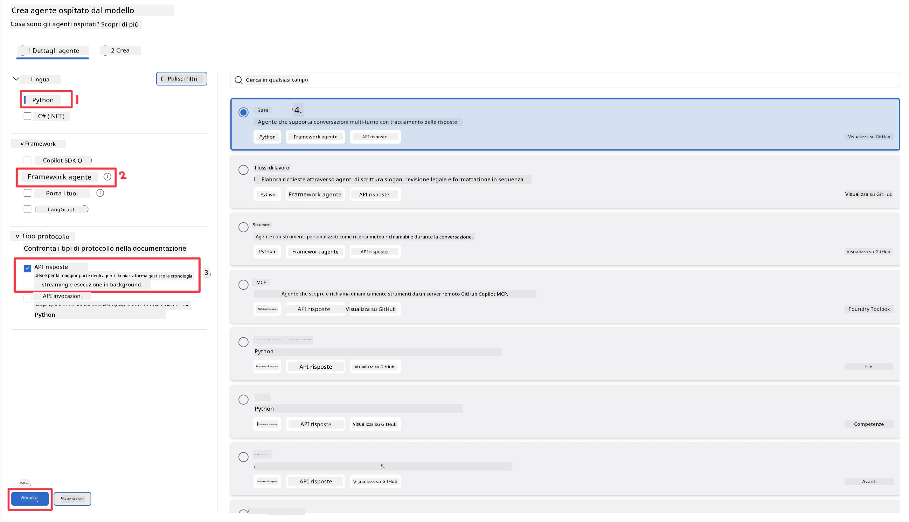
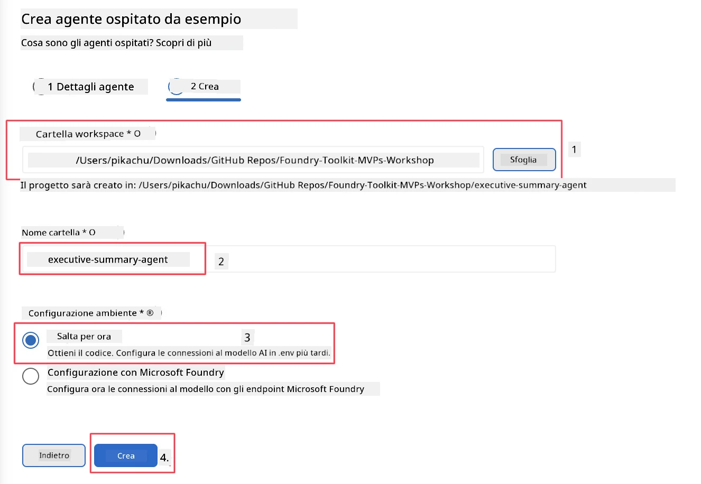

# Modulo 2 - Creare un Nuovo Agente Ospitato

⏱️ ~5 min

In questo modulo, utilizzi Foundry Toolkit per **impalcature un progetto agente ospitato**. L'impalcatura genera la struttura completa del progetto - `agent.yaml`, `main.py`, `Dockerfile`, `requirements.txt` e la configurazione di debug di VS Code - così puoi concentrarti sulla personalizzazione del comportamento dell'agente.

> **Concetto chiave:** La cartella `agent/` in questo laboratorio è un esempio di ciò che Foundry Toolkit genera. Non devi scrivere questi file da zero.

### Flusso della procedura guidata di scaffolding

```mermaid
flowchart LR
    A["Command Palette:
    Create new Hosted Agent"] --> B["Language:
    Python"]
    B --> C["API type:
    Response API"]
    C --> D["Template:
    Basic - Agent Framework"]
    D --> E["Seleziona modello"]
    E --> F["Workspace folder
    & agent name"]
    F --> G["Progetto generato"]

    style A fill:#4A90D9,color:#fff
    style B fill:#7B68EE,color:#fff
    style C fill:#7B68EE,color:#fff
    style D fill:#7B68EE,color:#fff
    style E fill:#7B68EE,color:#fff
    style F fill:#7B68EE,color:#fff
    style G fill:#27AE60,color:#fff
```



---

## Passo 1: Apri la procedura guidata Create Hosted Agent

1. Premi `Ctrl+Shift+P` per aprire la **Command Palette**.
2. Digita: **Foundry Toolkit: Create new Hosted Agent** e selezionalo.

> **Alternativa: Creazione tramite Foundry Portal**
> Se preferisci il browser, puoi creare il tuo progetto su [https://ai.azure.com](https://ai.azure.com). Una volta che il progetto è stato predisposto, torna in VS Code e usa la barra laterale di **Foundry Toolkit** per collegarti ad esso.

> **Alternativa:** Clicca sull'icona **+** accanto a **Hosted Agents (Preview)** nella barra laterale di Foundry Toolkit.

## Passo 2: Scegli le impostazioni



1. Nella sezione di navigazione/opzioni a sinistra seleziona quanto segue:

| Menu | Selezione | Note |
|--------|-----------|-------|
| **Language** | Python | Anche C# è supportato |
| **Framework** | Agent Framework | Punto di partenza semplice usando Agent Framework SDK |
| **API type** | Response API | `POST /responses` - conversazionale, con cronologia gestita dalla piattaforma |
| **Template** | Basic | Punto di partenza semplice usando Agent Framework SDK |

2. Una volta selezionato, clicca su **Next**



3. Nella finestra successiva, seleziona quanto segue:

| Menu | Selezione | Note |
|--------|-----------|-------|
| **Workspace folder** | Scegli una cartella di destinazione | es. `/workspace/Foundry_Toolkit_for_VSCode_Lab/` o una sottocartella di questo repository |
| **Agent name** | Inserisci un nome | es. `executive-summary-agent` |
| **Environment Setup** | salta la configurazione per ora |  |

Clicca su **create** per creare il nostro agente. Verrà creata una nuova cartella con il nome dell'agente ospitato.

## Passo 3: Esamina il progetto generato

Dopo il completamento dello scaffolding, verifica di vedere questi file in Explorer (`Ctrl+Shift+E`):

```
📂 my-agent/
├── .env                ← Environment variables (placeholders)
├── .vscode/
│   ├── launch.json     ← Debug config (F5 → run + Agent Inspector)
│   └── tasks.json      ← VS Code task definitions
├── agent.yaml          ← Agent definition (kind: hosted)
├── Dockerfile          ← Container config for deployment
├── main.py             ← Agent entry point (your main code)
└── requirements.txt    ← Python dependencies
```

### Spiegazione dei file chiave

| File | Scopo |
|------|---------|
| `agent.yaml` | Dichiara l'agente come `kind: hosted`, mappa le variabili d'ambiente, definisce il protocollo `/responses` |
| `main.py` | Crea un `FoundryChatClient` → lo incapsula in un `Agent` con istruzioni → fornisce tramite `ResponsesHostServer` sulla porta 8088 |
| `Dockerfile` | Usa `python:3.12-slim`, installa dipendenze, espone la porta 8088, esegue `main.py` |
| `requirements.txt` | `agent-framework-foundry`, `agent-framework-foundry-hosting`, `mcp`, `debugpy` |

> **Importante:** Apri la cartella dell'agente scaffoldata direttamente in VS Code (la cartella `agent/` stessa) così che `.vscode/launch.json` e `tasks.json` funzionino correttamente per il debug con F5.

---

### ✅ Checkpoint

- [ ] Progetto scaffoldato creato con tutti i file previsti
- [ ] `agent.yaml` mostra `kind: hosted` e `protocol: responses`
- [ ] `main.py` importa `Agent`, `FoundryChatClient`, `ResponsesHostServer`
- [ ] La cartella agente è aperta in VS Code come radice dello spazio di lavoro

---

**Precedente:** [01 - Setup](01-setup.md) · **Successivo:** [03 - Configure & Code →](03-configure-and-code.md)

---

<!-- CO-OP TRANSLATOR DISCLAIMER START -->
**Disclaimer**:
Questo documento è stato tradotto utilizzando il servizio di traduzione AI [Co-op Translator](https://github.com/Azure/co-op-translator). Sebbene ci impegniamo per garantire la precisione, si prega di notare che le traduzioni automatizzate possono contenere errori o imprecisioni. Il documento originale nella sua lingua nativa deve essere considerato la fonte autorevole. Per informazioni critiche, si raccomanda una traduzione professionale effettuata da un essere umano. Non siamo responsabili per eventuali malintesi o interpretazioni errate derivanti dall’uso di questa traduzione.
<!-- CO-OP TRANSLATOR DISCLAIMER END -->