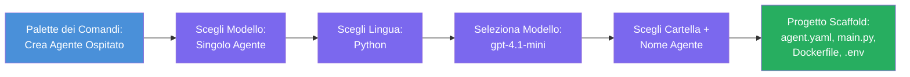

# Modulo 3 - Creare un Nuovo Agente Hosting (Auto-Scaffolded dall'Estensione Foundry)

In questo modulo, utilizzi l'estensione Microsoft Foundry per **scaffoldare un nuovo progetto [hosted agent](https://learn.microsoft.com/azure/foundry/agents/concepts/hosted-agents)**. L'estensione genera per te l'intera struttura del progetto - inclusi `agent.yaml`, `main.py`, `Dockerfile`, `requirements.txt`, un file `.env` e una configurazione di debug per VS Code. Dopo lo scaffolding, personalizzi questi file con le istruzioni, gli strumenti e la configurazione del tuo agente.

> **Concetto chiave:** La cartella `agent/` in questo laboratorio è un esempio di ciò che l'estensione Foundry genera quando esegui questo comando di scaffold. Non scrivi questi file da zero - l'estensione li crea, e tu li modifichi.

### Flusso della procedura guidata di scaffolding


---

## Passo 1: Apri la procedura guidata Create Hosted Agent

1. Premi `Ctrl+Shift+P` per aprire la **Command Palette**.
2. Digita: **Microsoft Foundry: Create a New Hosted Agent** e selezionalo.
3. Si apre la procedura guidata per la creazione dell'agente hosting.

> **Percorso alternativo:** Puoi anche raggiungere questa procedura guidata dalla barra laterale Microsoft Foundry → clicca l'icona **+** accanto a **Agents** oppure clicca con il tasto destro e seleziona **Create New Hosted Agent**.

---

## Passo 2: Scegli il template

La procedura guidata ti chiede di selezionare un template. Vedrai opzioni come:

| Template | Descrizione | Quando usarlo |
|----------|-------------|---------------|
| **Single Agent** | Un singolo agente con il proprio modello, istruzioni e strumenti opzionali | Questo workshop (Lab 01) |
| **Multi-Agent Workflow** | Più agenti che collaborano in sequenza | Lab 02 |

1. Seleziona **Single Agent**.
2. Clicca **Next** (o la selezione procede automaticamente).

---

## Passo 3: Scegli il linguaggio di programmazione

1. Seleziona **Python** (consigliato per questo workshop).
2. Clicca **Next**.

> **È supportato anche C#** se preferisci .NET. La struttura dello scaffold è simile (usa `Program.cs` invece di `main.py`).

---

## Passo 4: Seleziona il tuo modello

1. La procedura guidata mostra i modelli distribuiti nel tuo progetto Foundry (dal Modulo 2).
2. Seleziona il modello che hai distribuito - es. **gpt-4.1-mini**.
3. Clicca **Next**.

> Se non vedi modelli, torna a [Modulo 2](02-create-foundry-project.md) e distribuisci prima un modello.

---

## Passo 5: Scegli la posizione della cartella e il nome dell'agente

1. Si apre una finestra di dialogo per file - scegli una **cartella di destinazione** dove verrà creato il progetto. Per questo workshop:
   - Se parti da zero: scegli qualsiasi cartella (es. `C:\Projects\my-agent`)
   - Se lavori all'interno del repository del workshop: crea una nuova sottocartella sotto `workshop/lab01-single-agent/agent/`
2. Inserisci un **nome** per l'agente hosting (es. `executive-summary-agent` o `my-first-agent`).
3. Clicca **Create** (o premi Invio).

---

## Passo 6: Attendi il completamento dello scaffolding

1. VS Code apre una **nuova finestra** con il progetto scaffoldato.
2. Attendi qualche secondo che il progetto sia completamente caricato.
3. Dovresti vedere i seguenti file nel pannello Esplora (`Ctrl+Shift+E`):

```
📂 my-first-agent/
├── .env                ← Environment variables (auto-generated with placeholders)
├── .vscode/
│   └── launch.json     ← Debug configuration (F5 to run + Agent Inspector)
├── agent.yaml          ← Agent definition (kind: hosted)
├── Dockerfile          ← Container configuration for deployment
├── main.py             ← Agent entry point (your main code file)
└── requirements.txt    ← Python dependencies
```

> **Questa è la stessa struttura della cartella `agent/`** in questo laboratorio. L'estensione Foundry genera automaticamente questi file - non devi crearli manualmente.

> **Nota del workshop:** In questo repository del workshop, la cartella `.vscode/` è nella **radice dello spazio di lavoro** (non dentro ogni progetto). Contiene un `launch.json` e un `tasks.json` condivisi con due configurazioni di debug - **"Lab01 - Single Agent"** e **"Lab02 - Multi-Agent"** - ciascuna punta alla `cwd` corretta del laboratorio. Quando premi F5, seleziona la configurazione che corrisponde al laboratorio su cui stai lavorando dal menu a tendina.

---

## Passo 7: Comprendi ogni file generato

Prenditi un momento per ispezionare ogni file creato dalla procedura guidata. Comprenderli è importante per il Modulo 4 (personalizzazione).

### 7.1 `agent.yaml` - Definizione dell'agente

Apri `agent.yaml`. Assomiglia a questo:

```yaml
# yaml-language-server: $schema=https://raw.githubusercontent.com/microsoft/AgentSchema/refs/heads/main/schemas/v1.0/ContainerAgent.yaml

kind: hosted
name: my-first-agent
description: >
  A hosted agent deployed to Microsoft Foundry Agent Service.
metadata:
  authors:
    - Microsoft
  tags:
    - Azure AI AgentServer
    - Microsoft Agent Framework
    - Hosted Agent
protocols:
  - protocol: responses
    version: v1
environment_variables:
  - name: AZURE_AI_PROJECT_ENDPOINT
    value: ${PROJECT_ENDPOINT}
  - name: AZURE_AI_MODEL_DEPLOYMENT_NAME
    value: ${MODEL_DEPLOYMENT_NAME}
dockerfile_path: Dockerfile
resources:
  cpu: '0.25'
  memory: 0.5Gi
```

**Campi chiave:**

| Campo | Scopo |
|-------|-------|
| `kind: hosted` | Dichiara che questo è un agente hosting (basato su container, distribuito al [Foundry Agent Service](https://learn.microsoft.com/azure/foundry/agents/overview)) |
| `protocols: responses v1` | L'agente espone l'endpoint HTTP `/responses` compatibile con OpenAI |
| `environment_variables` | Mappa i valori del file `.env` come variabili di ambiente nel container al momento della distribuzione |
| `dockerfile_path` | Punta al Dockerfile utilizzato per costruire l'immagine del container |
| `resources` | Assegnazione di CPU e memoria per il container (0.25 CPU, 0.5Gi memoria) |

### 7.2 `main.py` - Punto di ingresso dell'agente

Apri `main.py`. Questo è il file Python principale dove vive la logica del tuo agente. Lo scaffold include:

```python
from agent_framework.azure import AzureAIAgentClient
from azure.ai.agentserver.agentframework import from_agent_framework
from azure.identity.aio import DefaultAzureCredential
```

**Importazioni chiave:**

| Importazione | Scopo |
|--------------|-------|
| `AzureAIAgentClient` | Connette il tuo progetto Foundry e crea agenti tramite `.as_agent()` |
| [`DefaultAzureCredential`](https://learn.microsoft.com/azure/developer/python/sdk/authentication/credential-chains#defaultazurecredential-overview) | Gestisce l'autenticazione (Azure CLI, accesso VS Code, managed identity o service principal) |
| `from_agent_framework` | Avvolge l'agente come server HTTP esponendo l'endpoint `/responses` |

Il flusso principale è:
1. Crea una credenziale → crea un client → chiama `.as_agent()` per ottenere un agente (context manager asincrono) → avvolgilo come server → esegui

### 7.3 `Dockerfile` - Immagine container

```dockerfile
FROM python:3.14-slim

WORKDIR /app

COPY ./ .

RUN pip install --upgrade pip && \
    if [ -f requirements.txt ]; then \
        pip install -r requirements.txt; \
    else \
        echo "No requirements.txt found" >&2; exit 1; \
    fi

EXPOSE 8088

CMD ["python", "main.py"]
```

**Dettagli chiave:**
- Usa `python:3.14-slim` come immagine base.
- Copia tutti i file di progetto in `/app`.
- Aggiorna `pip`, installa le dipendenze da `requirements.txt` e fallisce rapidamente se il file manca.
- **Espone la porta 8088** - questa è la porta richiesta per gli agenti hosting. Non modificarla.
- Avvia l'agente con `python main.py`.

### 7.4 `requirements.txt` - Dipendenze

```
agent-framework-azure-ai==1.0.0rc3
agent-framework-core==1.0.0rc3
azure-ai-agentserver-agentframework==1.0.0b16
azure-ai-agentserver-core==1.0.0b16
debugpy
agent-dev-cli
```

| Pacchetto | Scopo |
|-----------|-------|
| `agent-framework-azure-ai` | Integrazione Azure AI per il Microsoft Agent Framework |
| `agent-framework-core` | Runtime core per costruire agenti (include `python-dotenv`) |
| `azure-ai-agentserver-agentframework` | Runtime server agent hosting per Foundry Agent Service |
| `azure-ai-agentserver-core` | Astrazioni core del server agente |
| `debugpy` | Supporto debugging Python (permette il debugging con F5 in VS Code) |
| `agent-dev-cli` | CLI per sviluppo locale per testare agenti (usato dalla configurazione debug/run) |

---

## Comprendere il protocollo agente

Gli agenti hosting comunicano tramite il protocollo **OpenAI Responses API**. Quando eseguiti (localmente o in cloud), l'agente espone un singolo endpoint HTTP:

```
POST http://localhost:8088/responses
Content-Type: application/json

{
  "input": "Your prompt here",
  "stream": false
}
```

Il Foundry Agent Service chiama questo endpoint per inviare prompt utente e ricevere risposte dall'agente. Questo è lo stesso protocollo usato dall'API OpenAI, quindi il tuo agente è compatibile con qualsiasi client che supporta il formato OpenAI Responses.

---

### Checkpoint

- [ ] La procedura guidata di scaffolding è stata completata con successo e si è aperta una **nuova finestra VS Code**
- [ ] Vedete tutti i 5 file: `agent.yaml`, `main.py`, `Dockerfile`, `requirements.txt`, `.env`
- [ ] Esiste il file `.vscode/launch.json` (abilita il debugging con F5 - in questo workshop è nella root dello spazio di lavoro con configurazioni specifiche per i лаборatori)
- [ ] Hai letto e capito lo scopo di ogni file
- [ ] Comprendi che la porta `8088` è richiesta e che l'endpoint `/responses` è il protocollo

---

**Precedente:** [02 - Create Foundry Project](02-create-foundry-project.md) · **Successivo:** [04 - Configure & Code →](04-configure-and-code.md)

---

<!-- CO-OP TRANSLATOR DISCLAIMER START -->
**Disclaimer**:  
Questo documento è stato tradotto utilizzando il servizio di traduzione AI [Co-op Translator](https://github.com/Azure/co-op-translator). Pur impegnandoci per l’accuratezza, si prega di notare che le traduzioni automatiche possono contenere errori o imprecisioni. Il documento originale nella sua lingua nativa deve essere considerato la fonte autorevole. Per informazioni critiche, si raccomanda una traduzione professionale umana. Non siamo responsabili per eventuali malintesi o interpretazioni errate derivanti dall’uso di questa traduzione.
<!-- CO-OP TRANSLATOR DISCLAIMER END -->