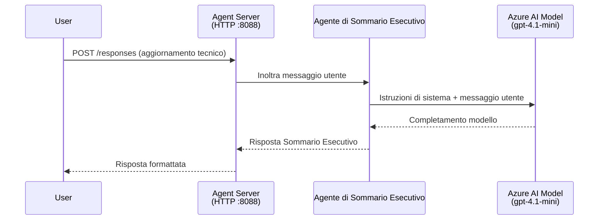
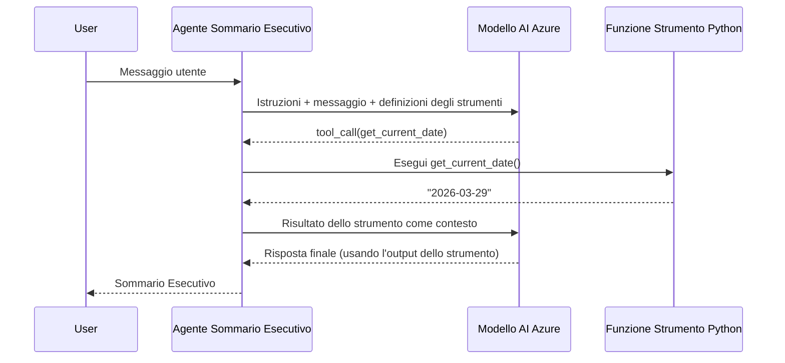

# Modulo 4 - Configurare Istruzioni, Ambiente e Installare Dipendenze

In questo modulo, personalizzi i file dell'agente auto-generati dal Modulo 3. Qui trasformi lo scaffold generico nel **tuo** agente - scrivendo istruzioni, impostando variabili d'ambiente, aggiungendo opzionalmente strumenti e installando dipendenze.

> **Promemoria:** L'estensione Foundry ha generato automaticamente i file del tuo progetto. Ora li modifichi. Consulta la cartella [`agent/`](../../../../../workshop/lab01-single-agent/agent) per un esempio completo e funzionante di un agente personalizzato.

---

## Come i componenti si collegano

### Ciclo di vita della richiesta (agente singolo)


> **Con strumenti:** Se l'agente ha strumenti registrati, il modello potrebbe restituire una chiamata a uno strumento anziché un completamento diretto. Il framework esegue lo strumento localmente, invia il risultato al modello, e il modello genera la risposta finale.


---

## Passo 1: Configurare le variabili d'ambiente

Lo scaffold ha creato un file `.env` con valori segnaposto. Devi inserire i valori reali dal Modulo 2.

1. Nel tuo progetto scaffoldato, apri il file **`.env`** (è nella radice del progetto).
2. Sostituisci i valori segnaposto con i dettagli reali del tuo progetto Foundry:

   ```env
   PROJECT_ENDPOINT=https://<your-account>.services.ai.azure.com/api/projects/<your-project>
   MODEL_DEPLOYMENT_NAME=gpt-4.1-mini
   ```

3. Salva il file.

### Dove trovare questi valori

| Valore | Come trovarlo |
|-------|---------------|
| **Endpoint del progetto** | Apri la barra laterale **Microsoft Foundry** in VS Code → clicca sul tuo progetto → l'URL dell'endpoint è mostrato nella vista dettagli. Sembra `https://<account-name>.services.ai.azure.com/api/projects/<project-name>` |
| **Nome del deployment del modello** | Nella barra laterale Foundry, espandi il progetto → guarda sotto **Models + endpoints** → il nome è elencato accanto al modello distribuito (es. `gpt-4.1-mini`) |

> **Sicurezza:** Non fare mai il commit del file `.env` nel controllo versione. È già incluso in `.gitignore` di default. Se non lo è, aggiungilo:
> ```
> .env
> ```

### Come fluiscono le variabili d'ambiente

La catena di mappatura è: `.env` → `main.py` (legge via `os.getenv`) → `agent.yaml` (mappa alle variabili d'ambiente del container al momento del deploy).

In `main.py`, lo scaffold legge questi valori in questo modo:

```python
PROJECT_ENDPOINT = os.getenv("AZURE_AI_PROJECT_ENDPOINT") or os.getenv("PROJECT_ENDPOINT")
MODEL_DEPLOYMENT_NAME = os.getenv("AZURE_AI_MODEL_DEPLOYMENT_NAME", os.getenv("MODEL_DEPLOYMENT_NAME", "gpt-4.1-mini"))
```

Sia `AZURE_AI_PROJECT_ENDPOINT` sia `PROJECT_ENDPOINT` sono accettati (il `agent.yaml` usa il prefisso `AZURE_AI_*`).

---

## Passo 2: Scrivere le istruzioni dell'agente

Questo è il passo di personalizzazione più importante. Le istruzioni definiscono la personalità, il comportamento, il formato di output e i vincoli di sicurezza del tuo agente.

1. Apri `main.py` nel tuo progetto.
2. Trova la stringa delle istruzioni (lo scaffold include una di default/generica).
3. Sostituiscila con istruzioni dettagliate e strutturate.

### Cosa includono le buone istruzioni

| Componente | Scopo | Esempio |
|-----------|---------|---------|
| **Ruolo** | Chi è e cosa fa l'agente | "Sei un agente di sintesi esecutiva" |
| **Pubblico** | A chi sono rivolte le risposte | "Dirigenti senior con conoscenze tecniche limitate" |
| **Definizione dell'input** | Che tipo di prompt gestisce | "Report tecnici di incidenti, aggiornamenti operativi" |
| **Formato di output** | Struttura esatta delle risposte | "Sintesi esecutiva: - Cosa è successo: ... - Impatto business: ... - Prossimo passo: ..." |
| **Regole** | Vincoli e condizioni di rifiuto | "NON aggiungere informazioni oltre a quelle fornite" |
| **Sicurezza** | Prevenire abusi e allucinazioni | "Se l'input non è chiaro, chiedi chiarimenti" |
| **Esempi** | Coppie input/output per guidare il comportamento | Includi 2-3 esempi con input diversi |

### Esempio: Istruzioni per agente di sintesi esecutiva

Qui le istruzioni usate nel workshop [`agent/main.py`](../../../../../workshop/lab01-single-agent/agent/main.py):

```python
AGENT_INSTRUCTIONS = """You are an "Explain Like I'm an Executive" agent.

Purpose:
Your job is to translate complex technical or operational information into
clear, concise, and outcome-focused summaries that can be easily understood
by non-technical executives.

Audience:
Senior leaders with limited technical background who care about impact,
risk, and what happens next.

What you must do:
- Rephrase the input so it is understandable to a non-technical audience
- Prioritize clarity, brevity, and outcomes over technical accuracy
- Remove technical jargon, logs, metrics, stack traces, and deep root-cause details
- Translate technical causes into simple cause-and-effect statements
- Explicitly call out business impact
- Always include a clear next step or action
- Maintain a neutral, factual, and calm executive tone
- Do NOT add new facts or speculate beyond the input

Standard Output Structure (always use this wording):

Executive Summary:
- What happened: <plain-language description>
- Business impact: <clear, non-technical impact>
- Next step: <clear action or mitigation>

Rules:
- Keep responses under 100 words
- Do NOT add facts beyond the input
- If input is unclear, ask for clarification
"""
```

4. Sostituisci la stringa delle istruzioni esistente in `main.py` con le tue istruzioni personalizzate.
5. Salva il file.

---

## Passo 3: (Opzionale) Aggiungere strumenti personalizzati

Gli agenti ospitati possono eseguire **funzioni Python locali** come [strumenti](https://learn.microsoft.com/azure/foundry/agents/concepts/tool-catalog). Questo è un vantaggio chiave degli agenti ospitati via codice rispetto agli agenti solo prompt: il tuo agente può eseguire logica arbitraria lato server.

### 3.1 Definire una funzione strumento

Aggiungi una funzione strumento in `main.py`:

```python
from agent_framework import tool

@tool
def get_current_date() -> str:
    """Returns the current date in YYYY-MM-DD format."""
    from datetime import date
    return str(date.today())
```

Il decoratore `@tool` trasforma una funzione Python standard in uno strumento dell'agente. La docstring diventa la descrizione dello strumento che il modello vede.

### 3.2 Registrare lo strumento con l'agente

Quando crei l'agente tramite il context manager `.as_agent()`, passa lo strumento tramite il parametro `tools`:

```python
async with AzureAIAgentClient(
    project_endpoint=PROJECT_ENDPOINT,
    model_deployment_name=MODEL_DEPLOYMENT_NAME,
    credential=credential,
).as_agent(
    name="my-agent",
    instructions=AGENT_INSTRUCTIONS,
    tools=[get_current_date],
) as agent:
    server = from_agent_framework(agent)
    await server.run_async()
```

### 3.3 Come funzionano le chiamate agli strumenti

1. L'utente invia un prompt.
2. Il modello decide se è necessario uno strumento (basato sul prompt, istruzioni e descrizioni degli strumenti).
3. Se serve lo strumento, il framework chiama la tua funzione Python localmente (dentro il container).
4. Il valore di ritorno dello strumento viene inviato al modello come contesto.
5. Il modello genera la risposta finale.

> **Gli strumenti vengono eseguiti lato server** - girano dentro il tuo container, non nel browser dell'utente o nel modello. Questo significa che puoi accedere a database, API, file system o qualsiasi libreria Python.

---

## Passo 4: Creare e attivare un ambiente virtuale

Prima di installare le dipendenze, crea un ambiente Python isolato.

### 4.1 Creare l'ambiente virtuale

Apri un terminale in VS Code (`` Ctrl+` ``) ed esegui:

```powershell
python -m venv .venv
```

Questo crea una cartella `.venv` nella directory del progetto.

### 4.2 Attivare l'ambiente virtuale

**PowerShell (Windows):**

```powershell
.\.venv\Scripts\Activate.ps1
```

**Prompt dei comandi (Windows):**

```cmd
.venv\Scripts\activate.bat
```

**macOS/Linux (Bash):**

```bash
source .venv/bin/activate
```

Dovresti vedere `(.venv)` apparire all'inizio del prompt del terminale, indicando che l'ambiente virtuale è attivo.

### 4.3 Installare le dipendenze

Con l'ambiente virtuale attivo, installa i pacchetti richiesti:

```powershell
pip install -r requirements.txt
```

Questo installa:

| Pacchetto | Scopo |
|---------|---------|
| `agent-framework-azure-ai==1.0.0rc3` | Integrazione Azure AI per il [Microsoft Agent Framework](https://learn.microsoft.com/agent-framework/overview/) |
| `agent-framework-core==1.0.0rc3` | Runtime core per costruire agenti (include `python-dotenv`) |
| `azure-ai-agentserver-agentframework==1.0.0b16` | Runtime server agente ospitato per [Foundry Agent Service](https://learn.microsoft.com/azure/foundry/agents/overview) |
| `azure-ai-agentserver-core==1.0.0b16` | Astrazioni core server agente |
| `debugpy` | Debugging Python (abilita debug F5 in VS Code) |
| `agent-dev-cli` | CLI per sviluppo locale e test agenti |

### 4.4 Verificare l'installazione

```powershell
pip list | Select-String "agent-framework|agentserver"
```

Output atteso:
```
agent-framework-azure-ai   1.0.0rc3
agent-framework-core       1.0.0rc3
azure-ai-agentserver-agentframework 1.0.0b16
azure-ai-agentserver-core  1.0.0b16
```

---

## Passo 5: Verificare l'autenticazione

L'agente usa [`DefaultAzureCredential`](https://learn.microsoft.com/azure/developer/python/sdk/authentication/credential-chains#defaultazurecredential-overview) che prova diversi metodi di autenticazione in quest'ordine:

1. **Variabili d'ambiente** - `AZURE_CLIENT_ID`, `AZURE_TENANT_ID`, `AZURE_CLIENT_SECRET` (service principal)
2. **Azure CLI** - usa la sessione di `az login`
3. **VS Code** - usa l'account con cui hai effettuato l'accesso a VS Code
4. **Identità gestita** - usata quando si esegue in Azure (al momento del deploy)

### 5.1 Verifica per sviluppo locale

Almeno uno di questi dovrebbe funzionare:

**Opzione A: Azure CLI (consigliato)**

```powershell
az account show --query "{name:name, id:id}" --output table
```

Atteso: mostra il nome e l’ID della tua sottoscrizione.

**Opzione B: Accesso VS Code**

1. Guarda in basso a sinistra in VS Code per l'icona **Account**.
2. Se vedi il nome del tuo account, sei autenticato.
3. Altrimenti clicca l'icona → **Accedi per usare Microsoft Foundry**.

**Opzione C: Service principal (per CI/CD)**

```powershell
$env:AZURE_TENANT_ID = "<your-tenant-id>"
$env:AZURE_CLIENT_ID = "<your-client-id>"
$env:AZURE_CLIENT_SECRET = "<your-client-secret>"
```

### 5.2 Problema comune di autenticazione

Se sei connesso con più account Azure, assicurati che la sottoscrizione corretta sia selezionata:

```powershell
az account set --subscription "<your-subscription-id>"
```

---

### Punto di controllo

- [ ] Il file `.env` contiene validi `PROJECT_ENDPOINT` e `MODEL_DEPLOYMENT_NAME` (non segnaposto)
- [ ] Le istruzioni dell'agente sono personalizzate in `main.py` - definiscono ruolo, pubblico, formato output, regole e vincoli di sicurezza
- [ ] (Opzionale) Strumenti personalizzati sono definiti e registrati
- [ ] L'ambiente virtuale è creato e attivo (`(.venv)` visibile nel prompt terminale)
- [ ] `pip install -r requirements.txt` si completa correttamente senza errori
- [ ] `pip list | Select-String "azure-ai-agentserver"` mostra che il pacchetto è installato
- [ ] L'autenticazione è valida - `az account show` restituisce la tua sottoscrizione OPPURE sei connesso a VS Code

---

**Precedente:** [03 - Creare Agente Ospitato](03-create-hosted-agent.md) · **Successivo:** [05 - Testare Localmente →](05-test-locally.md)

---

<!-- CO-OP TRANSLATOR DISCLAIMER START -->
**Disclaimer**:
Questo documento è stato tradotto utilizzando il servizio di traduzione AI [Co-op Translator](https://github.com/Azure/co-op-translator). Pur impegnandoci per l’accuratezza, si prega di notare che le traduzioni automatiche possono contenere errori o inesattezze. Il documento originale nella sua lingua nativa deve essere considerato la fonte autorevole. Per informazioni critiche, si raccomanda una traduzione professionale effettuata da un umano. Non siamo responsabili per eventuali malintesi o interpretazioni errate derivanti dall’uso di questa traduzione.
<!-- CO-OP TRANSLATOR DISCLAIMER END -->