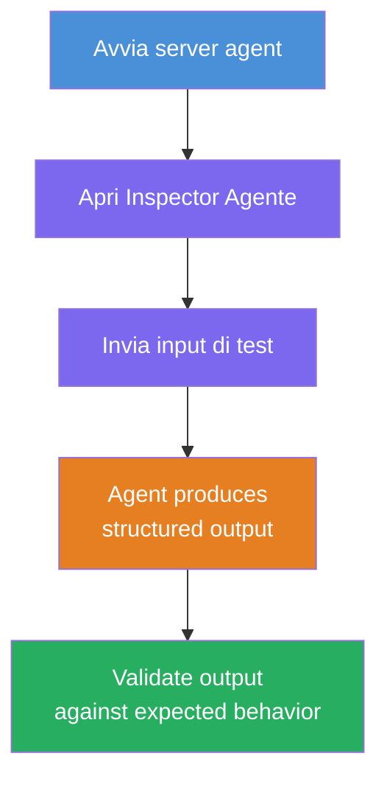
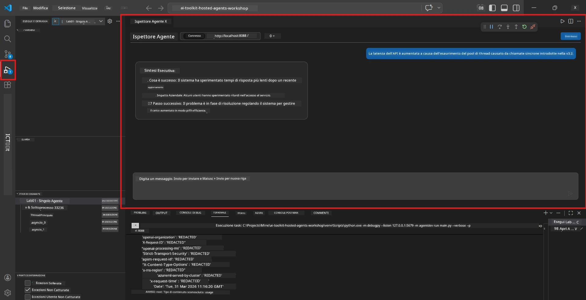
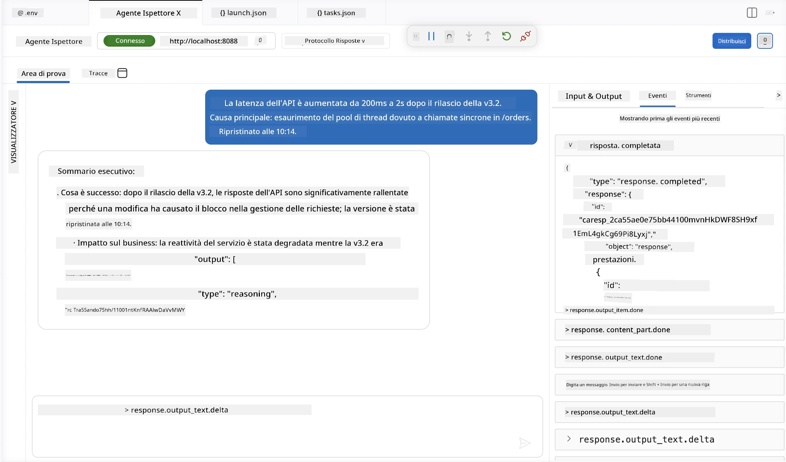

# Modulo 4 - Testare localmente

⏱️ ~10 min

In questo modulo, avvii il tuo agente localmente e ne convalidi il corretto funzionamento utilizzando **test funzionali happy-path**. Userai l'Agent Inspector (interfaccia grafica) o chiamate HTTP dirette per confermare che l'agente produca risposte strutturate e accurate.

### Flusso di test locale



---

## Opzione 1: Premi F5 - Debug con Agent Inspector (consigliato)

### Avvia il debugger

1. Apri direttamente la cartella **executive-summary-agent/** in VS Code (`File → Open Folder`).
2. Apri il pannello **Run and Debug** (`Ctrl+Shift+D`).
3. Seleziona **Debug Local Agent Server** dal menu a tendina.
4. Premi **F5** (o clicca ▶ Avvia Debugging).

> ⚠️ **Critico: Seleziona il tuo interprete Python**
> Se ottieni "ModuleNotFoundError" o il debugger non si avvia, devi indicare a VS Code di usare il tuo ambiente virtuale:
  > 1. Premi `Ctrl+Shift+P` $\rightarrow$ digita **Python: Select Interpreter**.
  > 2. Seleziona l'interprete situato nella cartella `.venv` del progetto (es. `.\.venv\Scripts\python.exe` su Windows).
  > 3. Riavvia la sessione di debug.
> Se ricevi ancora errori, aggiorna manualmente il file `tasks.json` come segue:
  > 1. Naviga al file `.vscode/tasks.json`
  > 2. Trova il comando etichettato: `Run Agent/Workflow HTTP Server`
  > 3. Aggiorna il valore del comando come segue: `"value": "${workspaceFolder}/.venv/bin/python",`

### Cosa succede

1. Il server HTTP si avvia su `http://localhost:8088/responses`.
2. Si apre automaticamente il pannello **Agent Inspector** - un'interfaccia chat visiva per i test.
3. I breakpoint sono attivi in `main.py`.

Osserva il Terminale per:
```
Starting executive summary hosted agent
Executive agent server running on http://localhost:8088
```

> **Se l'Agent Inspector non si apre:** Premi `Ctrl+Shift+P` → **Foundry Toolkit: Open Agent Inspector**.



> *Lo screenshot potrebbe mostrare un branding 'AI TOOLKIT' precedente a una versione vecchia dell'estensione.*

---

## Opzione 2: Test tramite Terminale (alternativa)

Avvia l'agente in un terminale e invia richieste da un altro:

```bash
# Terminale 1: Avvia agente
cd executive-summary-agent/
source .venv/bin/activate
python main.py
```

```bash
# Terminale 2: Invia test (curl)
curl -sS -X POST http://localhost:8088/responses \
  -H "Content-Type: application/json" \
  -d '{"input": "The API latency increased due to thread pool exhaustion caused by sync calls in v3.2.", "stream": false}'
```

---

## Test scenario: validazione funzionale happy-path

Esegui **tutti e tre** gli scenari sotto. Questi convalidano che il tuo agente produca output corretti e strutturati per input realistici.



### Scenario 1: Incidente IT - picco di latenza API

**Input:**
```
The API latency increased from 200ms to 2s after deploying v3.2.
Root cause: thread pool starvation from synchronous calls in /orders.
Rolled back at 10:14.
```

**Comportamento atteso:**
- ✅ Segue la struttura "Executive Summary" (Cosa è successo / Impatto sul business / Passo successivo)
- ✅ Nessun gergo tecnico (niente "thread pool", né "/orders", né "v3.2")
- ✅ Indica chiaramente l'impatto sul business (es. utenti hanno subito ritardi)
- ✅ Include un passo successivo (es. correzione implementata, monitoraggio attivo)

---

### Scenario 2: Data Pipeline - fallimento ETL

**Input:**
```
The nightly ETL job failed because the upstream schema changed. APAC dashboards show missing data.
```

**Comportamento atteso:**
- ✅ Riassume il fallimento del refresh dati in linguaggio semplice
- ✅ Menziona l'impatto sulla dashboard APAC
- ✅ Include un passo successivo di rimedio
- ✅ NON menziona "ETL", "schema" o altri termini tecnici

---

### Scenario 3: Sicurezza - credenziale esposta

**Input:**
```
Static analysis flagged a hardcoded secret in the repository.
The secret may have been exposed in commit history.
```

**Comportamento atteso:**
- ✅ Descrive un problema di credenziale/sicurezza in linguaggio comprensibile a un dirigente
- ✅ Indica il potenziale rischio (accesso non autorizzato)
- ✅ Indica l'azione di rimedio (rotazione credenziali, audit)
- ✅ NON include termini come "analisi statica", "cronologia commit" o "hardcoded"

---

## Criteri di validazione

Per ogni scenario, verifica:

| # | Criterio | Condizione di superamento |
|---|----------|-------------------------|
| 1 | **Struttura** | La risposta usa il formato "Executive Summary" con tutti e tre i punti |
| 2 | **Linguaggio chiaro** | Nessun gergo tecnico che un dirigente non capirebbe |
| 3 | **Accuratezza** | Il sommario rispecchia l'input - nessun dettaglio inventato |
| 4 | **Sintesi** | La risposta è sotto le 100 parole |
| 5 | **Passo successivo** | È dichiarata un'azione o mitigazione chiara |

---

## Consigli per il debug

| Problema | Soluzione |
|---------|----------|
| L'agente non si avvia | Controlla i valori del `.env`, verifica che il virtual environment sia attivo, esegui `pip install -r requirements.txt` |
| Risposta vuota o generica | Controlla le istruzioni in `main.py` - assicurati che il formato d'output sia specificato |
| La risposta include gergo | Rafforza le regole "rimuovi termini tecnici" nelle istruzioni |
| Agent Inspector non si apre | `Ctrl+Shift+P` → **Foundry Toolkit: Open Agent Inspector** |
| Errori modello nel Terminale | Verifica che `AZURE_AI_MODEL_DEPLOYMENT_NAME` corrisponda esattamente (case-sensitive) |

---

### ✅ Punto di controllo

- [ ] L'agente si avvia localmente senza errori
- [ ] Agent Inspector si apre e mostra un'interfaccia chat (se usi F5)
- [ ] **Scenario 1** (incidente IT) - Executive Summary strutturato, nessun gergo
- [ ] **Scenario 2** (data pipeline) - sommario rilevante con impatto sul business
- [ ] **Scenario 3** (allerta sicurezza) - comunicazione del rischio appropriata
- [ ] Tutte le risposte seguono la struttura d'output definita

> **Salva le tue risposte** (copia o screenshot) - le confronterai con i risultati cloud nel Modulo 06.

---

**Precedente:** [03 - Configura & Codifica](03-configure-and-code.md) · **Successivo:** [05 - Deploy su Foundry →](05-deploy-to-foundry.md)

---

<!-- CO-OP TRANSLATOR DISCLAIMER START -->
**Disclaimer**:
Questo documento è stato tradotto utilizzando il servizio di traduzione AI [Co-op Translator](https://github.com/Azure/co-op-translator). Sebbene ci impegniamo per garantire la precisione, si prega di notare che le traduzioni automatizzate possono contenere errori o imprecisioni. Il documento originale nella sua lingua nativa deve essere considerato la fonte autorevole. Per informazioni critiche, si raccomanda una traduzione professionale effettuata da un essere umano. Non siamo responsabili per eventuali malintesi o interpretazioni errate derivanti dall’uso di questa traduzione.
<!-- CO-OP TRANSLATOR DISCLAIMER END -->