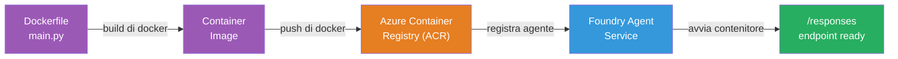
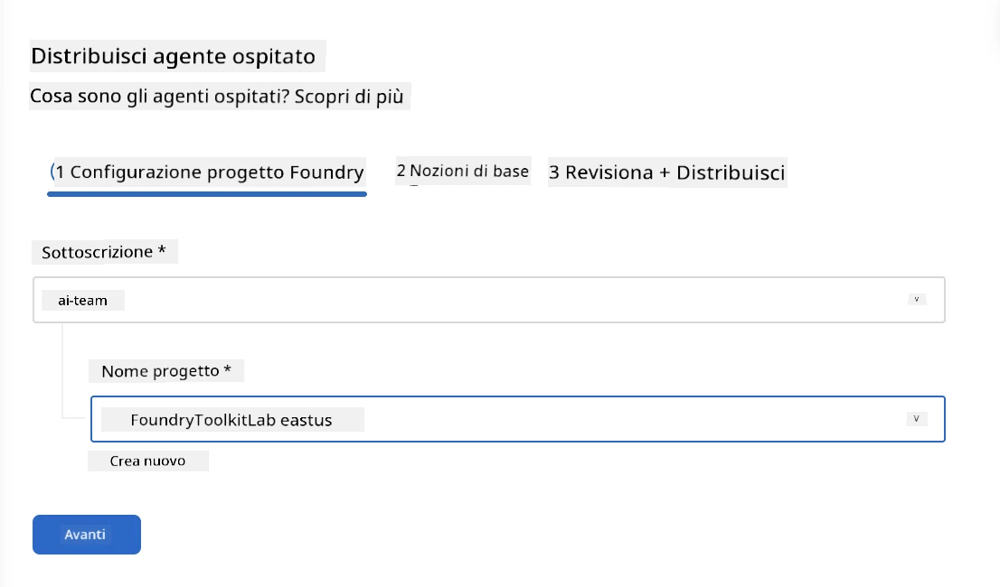
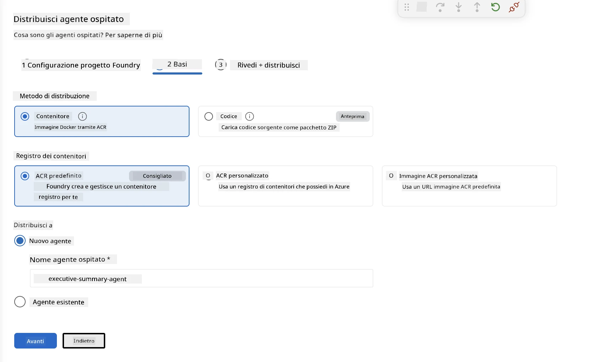
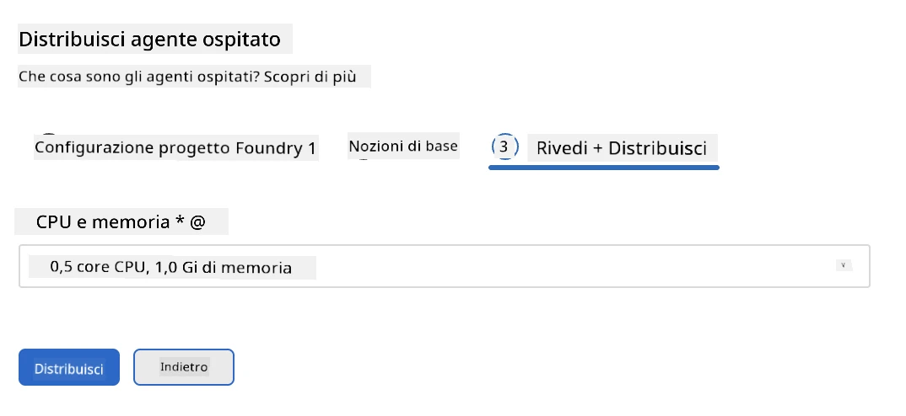
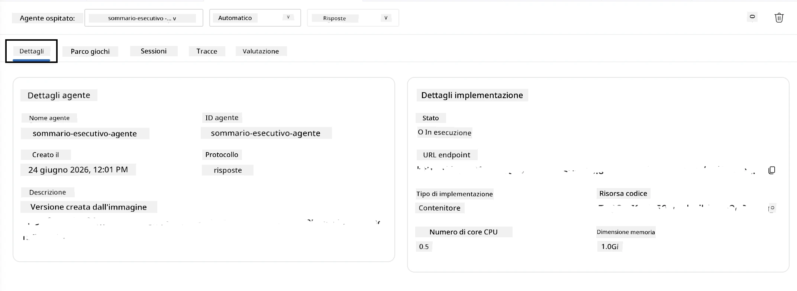

# Modulo 5 - Distribuire al servizio Foundry Agent

⏱️ ~10 min

> ⚠️ **Utenti percorso B:** Questo modulo richiede un abbonamento Foundry. Se stai utilizzando Foundry Local, salta a [Modulo 07 - Riepilogo](07-summary.md). Hai completato con successo il flusso di lavoro di sviluppo locale!

In questo modulo, distribuisci il tuo agente testato localmente su Microsoft Foundry come **Agente ospitato**. La distribuzione costruisce un'immagine container, la invia a Azure Container Registry e avvia l'agente nell'infrastruttura gestita di Foundry.

### Pipeline di distribuzione

---

## Verifica prerequisiti

Prima di distribuire, verifica:

- [ ] L'agente supera tutti e 3 gli scenari locali da [Modulo 04](04-test-locally.md)
- [ ] Hai il ruolo **Azure AI User** a livello di progetto ([Modulo 01, Assegna RBAC](01-setup.md#deploy-a-model--assign-rbac))
- [ ] Sei connesso ad Azure in VS Code (l'icona Account mostra il tuo nome)

---

## Passo 1: Avvia la distribuzione

### Opzione A: Distribuisci da Agent Inspector (consigliato)

Se Agent Inspector è aperto (dal test):
1. Clicca sul pulsante **Deploy** nell'angolo in alto a destra (icona nuvola ↑).

### Opzione B: Distribuisci dalla Command Palette

1. Premi `Ctrl+Shift+P` → **Foundry Toolkit: Deploy Hosted Agent**.

---

## Passo 2: Configura la distribuzione

Il wizard ti chiede:

| Prompt | Selezione |
|--------|-----------|
| **Sottoscrizione** | La tua Sottoscrizione Azure |
| **Progetto di destinazione** | Il tuo progetto Foundry (es., `workshop-agents`) |

Clicca **next** per configurare il tuo agente.

| Prompt | Selezione |
|--------|-----------|
| **Metodo di distribuzione** | Container |
| **Registro container** | **ACR predefinito** (Microsoft Foundry ne crea e gestisce uno per te) |
| **Distribuisci a** | Nuovo agente (nome, `executive-summary-agent`) |

Clicca **next** per rivedere e distribuire il tuo agente.

| Prompt | Selezione |
|--------|-----------|
| **CPU e memoria** | **0.25 core CPU, 0.5 Gi memoria** (sufficiente per il workshop) |

---

## Passo 3: Distribuisci e monitora

1. Clicca **Deploy**.
2. Guarda il pannello **Output** (seleziona **Microsoft Foundry** dal menu a tendina).
3. La distribuzione passa attraverso queste fasi:
   - **Docker build** - costruisce il container dal tuo Dockerfile
   - **Docker push** - invia l'immagine all'ACR (1–3 min alla prima distribuzione)
   - **Registrazione agente** - crea l'agente ospitato in Foundry
   - **Avvio container** - avvia con identità gestita di sistema

4. Al completamento, appare una notifica:
   > **my-agent è distribuito con successo.** `Visualizza log` `Avvia agente`

5. Clicca **Avvia agente** per aprire l'Agent Playground.

### Valori dello stato di distribuzione

| Stato | Significato |
|--------|---------|
| **Running** | Container pronto, agente risponde |
| **Pending** | Container in avvio - attendi 30–60 secondi |
| **Failed** | Controlla i log (vedi risoluzione problemi sotto) |

---

## Errori comuni di distribuzione

| Errore | Causa radice | Soluzione |
|-------|-------------|----------|
| Permesso `agents/write` negato | Mancanza ruolo **Azure AI User** a livello di progetto | [Modulo 01, Assegna RBAC](01-setup.md#deploy-a-model--assign-rbac) |
| Docker non in esecuzione | Docker Desktop non avviato | Avvia Docker Desktop → verifica con `docker info` |
| Autorizzazione ACR | L'identità gestita non può scaricare l'immagine | Vedi [Modulo 08 - Risoluzione problemi](08-troubleshooting.md) |

---

### ✅ Checkpoint

- [ ] Distribuzione completata senza errori
- [ ] L'agente appare sotto **Hosted Agents (Preview)** nella sidebar di Foundry
- [ ] Lo stato del container mostra **Running**
- [ ] Scheda Agent Playground aperta con dettagli dell'agente e URL endpoint

---

**Precedente:** [04 - Test locale](04-test-locally.md) · **Successivo:** [06 - Verifica in Playground →](06-verify-in-playground.md)

---

<!-- CO-OP TRANSLATOR DISCLAIMER START -->
**Disclaimer**:
Questo documento è stato tradotto utilizzando il servizio di traduzione AI [Co-op Translator](https://github.com/Azure/co-op-translator). Sebbene ci impegniamo per garantire la precisione, si prega di notare che le traduzioni automatizzate possono contenere errori o imprecisioni. Il documento originale nella sua lingua nativa deve essere considerato la fonte autorevole. Per informazioni critiche, si raccomanda una traduzione professionale effettuata da un essere umano. Non siamo responsabili per eventuali malintesi o interpretazioni errate derivanti dall’uso di questa traduzione.
<!-- CO-OP TRANSLATOR DISCLAIMER END -->