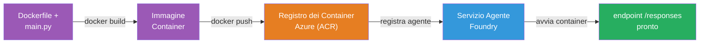
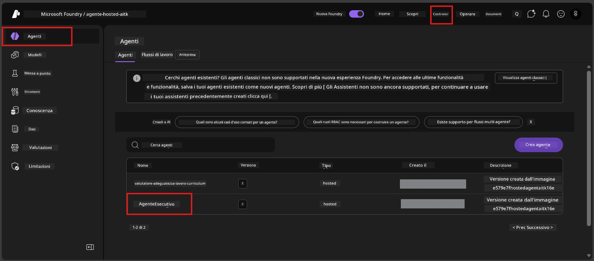

# Module 6 - Distribuire al servizio Foundry Agent

In questo modulo, distribuisci il tuo agente testato localmente su Microsoft Foundry come [**Hosted Agent**](https://learn.microsoft.com/azure/foundry/agents/concepts/hosted-agents). Il processo di distribuzione crea un'immagine del contenitore Docker dal tuo progetto, la carica su [Azure Container Registry (ACR)](https://learn.microsoft.com/azure/container-registry/container-registry-intro) e crea una versione di agente ospitato in [Foundry Agent Service](https://learn.microsoft.com/azure/foundry/agents/overview).

### Pipeline di distribuzione


---

## Verifica dei prerequisiti

Prima di distribuire, verifica ogni elemento qui sotto. Saltare questi passaggi è la causa più comune di fallimenti nella distribuzione.

1. **L'agente supera i test locali di base:**
   - Hai completato tutti e 4 i test nel [Modulo 5](05-test-locally.md) e l'agente ha risposto correttamente.

2. **Hai il ruolo [Azure AI User](https://learn.microsoft.com/azure/foundry/concepts/rbac-foundry#built-in-roles):**
   - È stato assegnato nel [Modulo 2, Passo 3](02-create-foundry-project.md). Se non sei sicuro, verifica ora:
   - Portale Azure → risorsa **project** Foundry → **Controllo accessi (IAM)** → scheda **Assegnazioni ruolo** → cerca il tuo nome → conferma che **Azure AI User** sia elencato.

3. **Sei autenticato in Azure in VS Code:**
   - Controlla l’icona Account in basso a sinistra in VS Code. Il tuo nome account dovrebbe essere visibile.

4. **(Facoltativo) Docker Desktop è in esecuzione:**
   - Docker serve solo se l’estensione Foundry ti richiede una build locale. Nella maggior parte dei casi, l’estensione gestisce automaticamente le build dei contenitori durante la distribuzione.
   - Se hai Docker installato, verifica che sia in esecuzione: `docker info`

---

## Passo 1: Avvia la distribuzione

Puoi distribuire in due modi - entrambi portano allo stesso risultato.

### Opzione A: Distribuire dall’Agent Inspector (consigliato)

Se stai eseguendo l’agente con il debugger (F5) e l’Agent Inspector è aperto:

1. Guarda nell’**angolo in alto a destra** del pannello Agent Inspector.
2. Clicca il pulsante **Deploy** (icona nuvola con una freccia verso l’alto ↑).
3. Si apre la procedura guidata di distribuzione.

### Opzione B: Distribuire dalla Command Palette

1. Premi `Ctrl+Shift+P` per aprire la **Command Palette**.
2. Digita: **Microsoft Foundry: Deploy Hosted Agent** e selezionalo.
3. Si apre la procedura guidata di distribuzione.

---

## Passo 2: Configura la distribuzione

La procedura guidata ti accompagna nella configurazione. Compila ogni richiesta:

### 2.1 Seleziona il progetto di destinazione

1. Un menu a tendina mostra i tuoi progetti Foundry.
2. Seleziona il progetto che hai creato nel Modulo 2 (es. `workshop-agents`).

### 2.2 Seleziona il file di agente del contenitore

1. Ti verrà chiesto di selezionare il punto di ingresso dell’agente.
2. Scegli **`main.py`** (Python) - questo è il file che la procedura guidata usa per identificare il progetto agente.

### 2.3 Configura le risorse

| Impostazione | Valore consigliato | Note |
|--------------|-------------------|------|
| **CPU** | `0.25` | Predefinito, sufficiente per il workshop. Aumenta per carichi di produzione |
| **Memoria** | `0.5Gi` | Predefinito, sufficiente per il workshop |

Questi corrispondono ai valori in `agent.yaml`. Puoi accettare i valori predefiniti.

---

## Passo 3: Conferma e distribuisci

1. La procedura guidata mostra un riepilogo della distribuzione con:
   - Nome progetto di destinazione
   - Nome agente (da `agent.yaml`)
   - File contenitore e risorse
2. Rivedi il riepilogo e clicca **Conferma e distribuisci** (o **Deploy**).
3. Segui i progressi in VS Code.

### Cosa succede durante la distribuzione (passo dopo passo)

La distribuzione è un processo multi-step. Osserva il pannello **Output** di VS Code (seleziona "Microsoft Foundry" dal menu a tendina) per seguire:

1. **Build Docker** - VS Code crea un’immagine del contenitore Docker dal tuo `Dockerfile`. Vedrai messaggi degli strati Docker:
   ```
   Step 1/6 : FROM python:<version>-slim
   Step 2/6 : WORKDIR /app
   ...
   Successfully built abc123def456
   ```

2. **Push Docker** - L’immagine viene caricata su **Azure Container Registry (ACR)** associato al tuo progetto Foundry. Questo può richiedere 1-3 minuti al primo deploy (l’immagine base è >100MB).

3. **Registrazione agente** - Foundry Agent Service crea un nuovo agente ospitato (o una nuova versione se l’agente esiste già). Si usano i metadati dell’agente da `agent.yaml`.

4. **Avvio contenitore** - Il contenitore parte nell’infrastruttura gestita Foundry. La piattaforma assegna un’[identità gestita di sistema](https://learn.microsoft.com/azure/foundry/agents/concepts/agent-identity) ed espone l’endpoint `/responses`.

> **La prima distribuzione è più lenta** (Docker deve caricare tutti gli strati). Le distribuzioni successive sono più veloci perché Docker usa la cache degli strati invariati.

---

## Passo 4: Verifica lo stato della distribuzione

Dopo che il comando di distribuzione termina:

1. Apri la sidebar **Microsoft Foundry** cliccando l’icona Foundry nella barra attività.
2. Espandi la sezione **Hosted Agents (Preview)** sotto il tuo progetto.
3. Dovresti vedere il nome del tuo agente (es. `ExecutiveAgent` o il nome da `agent.yaml`).
4. **Clicca sul nome agente** per espanderlo.
5. Vedrai una o più **versioni** (es. `v1`).
6. Clicca sulla versione per vedere i **Dettagli contenitore**.
7. Controlla il campo **Stato**:

   | Stato | Significato |
   |-------|-------------|
   | **Started** o **Running** | Il contenitore è in esecuzione e l’agente è pronto |
   | **Pending** | Il contenitore si sta avviando (aspetta 30-60 secondi) |
   | **Failed** | Il contenitore non è partito (controlla i log - vedi risoluzione problemi sotto) |



> **Se vedi "Pending" per più di 2 minuti:** Il contenitore potrebbe stare scaricando l’immagine base. Attendi un po’ di più. Se rimane in pending, controlla i log del contenitore.

---

## Errori comuni di distribuzione e soluzioni

### Errore 1: Permesso negato - `agents/write`

```
Error: lacks the required data action 
Microsoft.CognitiveServices/accounts/AIServices/agents/write 
to perform POST /api/projects/{projectName}/assistants operation.
```

**Causa principale:** Non hai il ruolo `Azure AI User` a livello **project**.

**Soluzione passo passo:**

1. Apri [https://portal.azure.com](https://portal.azure.com).
2. Nella barra di ricerca, digita il nome del tuo **progetto** Foundry e cliccaci sopra.
   - **Importante:** Assicurati di navigare alla risorsa **project** (tipo: "Microsoft Foundry project"), NON alla risorsa account/hub genitore.
3. Nel menu a sinistra, clicca **Controllo accessi (IAM)**.
4. Clicca **+ Aggiungi** → **Assegna ruolo**.
5. Nel tab **Ruolo**, cerca [**Azure AI User**](https://learn.microsoft.com/azure/foundry/concepts/rbac-foundry#built-in-roles) e selezionalo. Clicca **Avanti**.
6. Nel tab **Membri**, seleziona **Utente, gruppo o servizio principale**.
7. Clicca **+ Seleziona membri**, cerca il tuo nome/email, selezionati, clicca **Seleziona**.
8. Clicca **Rivedi + assegna** → di nuovo **Rivedi + assegna**.
9. Attendi 1-2 minuti che l’assegnazione del ruolo si propaghi.
10. **Riprova la distribuzione** dal Passo 1.

> Il ruolo deve essere sullo **scope del progetto**, non solo a livello di account. Questa è la causa più comune di fallimenti di distribuzione.

### Errore 2: Docker non in esecuzione

```
Error: Docker build failed / Cannot connect to Docker daemon
```

**Soluzione:**
1. Avvia Docker Desktop (cercalo nel menu Start o nella tray di sistema).
2. Attendi che mostri "Docker Desktop is running" (30-60 secondi).
3. Verifica: `docker info` in un terminale.
4. **Solo Windows:** Assicurati che il backend WSL 2 sia abilitato nelle impostazioni di Docker Desktop → **Generale** → **Usa il motore basato su WSL 2**.
5. Riprova la distribuzione.

### Errore 3: Autorizzazione ACR - `AcrPullUnauthorized`

```
Error: AcrPullUnauthorized
```

**Causa principale:** L’identità gestita del progetto Foundry non ha accesso pull al registro contenitori.

**Soluzione:**
1. Nel portale Azure, naviga al tuo **[Container Registry](https://learn.microsoft.com/azure/container-registry/container-registry-intro)** (è nel gruppo risorse del tuo progetto Foundry).
2. Vai su **Controllo accessi (IAM)** → **Aggiungi** → **Assegna ruolo**.
3. Seleziona il ruolo **[AcrPull](https://learn.microsoft.com/azure/container-registry/container-registry-roles)**.
4. Sotto Membri, scegli **Identità gestita** → individua l’identità gestita del progetto Foundry.
5. **Rivedi + assegna**.

> Questo solitamente è configurato automaticamente dall’estensione Foundry. Se vedi questo errore, probabilmente la configurazione automatica è fallita.

### Errore 4: Incompatibilità piattaforma contenitore (Apple Silicon)

Se distribuisci da Mac Apple Silicon (M1/M2/M3), il contenitore deve essere costruito per `linux/amd64`:

```bash
docker build --platform linux/amd64 -t myagent:v1 .
```

> L’estensione Foundry gestisce questo automaticamente per la maggior parte degli utenti.

---

### Checkpoint

- [ ] Comando di distribuzione completato senza errori in VS Code
- [ ] L’agente appare sotto **Hosted Agents (Preview)** nella sidebar Foundry
- [ ] Hai cliccato sull’agente → selezionato una versione → visto i **Dettagli contenitore**
- [ ] Lo stato del contenitore mostra **Started** o **Running**
- [ ] (Se si sono verificati errori) Hai identificato l’errore, applicato la correzione e ridistribuito con successo

---

**Precedente:** [05 - Test Locally](05-test-locally.md) · **Successivo:** [07 - Verify in Playground →](07-verify-in-playground.md)

---

<!-- CO-OP TRANSLATOR DISCLAIMER START -->
**Disclaimer**:  
Questo documento è stato tradotto utilizzando il servizio di traduzione AI [Co-op Translator](https://github.com/Azure/co-op-translator). Pur impegnandoci per l’accuratezza, si prega di notare che le traduzioni automatiche possono contenere errori o imprecisioni. Il documento originale nella sua lingua nativa deve essere considerato la fonte autorevole. Per informazioni critiche, si raccomanda una traduzione professionale effettuata da un umano. Non siamo responsabili per eventuali malintesi o interpretazioni errate derivanti dall’uso di questa traduzione.
<!-- CO-OP TRANSLATOR DISCLAIMER END -->