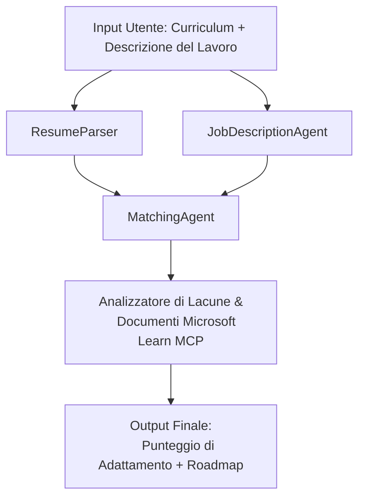

# PersonalCareerCopilot - Valutatore di Compatibilità Curriculum → Lavoro

Un flusso di lavoro multi-agente che valuta quanto un curriculum corrisponde a una descrizione del lavoro, poi genera una roadmap di apprendimento personalizzata per colmare le lacune.

---

## Agenti

| Agente | Ruolo | Strumenti |
|--------|-------|-----------|
| **ResumeParser** | Estrae competenze strutturate, esperienza, certificazioni dal testo del curriculum | - |
| **JobDescriptionAgent** | Estrae competenze richieste/preferite, esperienza, certificazioni da una descrizione del lavoro | - |
| **MatchingAgent** | Confronta profilo vs requisiti → punteggio di compatibilità (0-100) + competenze abbinate/mancanti | - |
| **GapAnalyzer** | Costruisce una roadmap di apprendimento personalizzata con risorse Microsoft Learn | `search_microsoft_learn_for_plan` (MCP) |

## Flusso di lavoro


---

## Avvio rapido

### 1. Configura l'ambiente

```powershell
cd workshop\lab02-multi-agent\PersonalCareerCopilot
python -m venv .venv
.\.venv\Scripts\Activate.ps1          # Windows PowerShell
# source .venv/bin/activate            # macOS / Linux
pip install -r requirements.txt
```

### 2. Configura le credenziali

Copia il file di esempio env e inserisci i dettagli del progetto Foundry:

```powershell
cp .env.example .env
```

Modifica `.env`:

```env
PROJECT_ENDPOINT=https://<your-account>.services.ai.azure.com/api/projects/<your-project>
MODEL_DEPLOYMENT_NAME=gpt-4.1-mini
```

| Valore | Dove trovarlo |
|--------|--------------|
| `PROJECT_ENDPOINT` | Barra laterale Microsoft Foundry in VS Code → clic destro sul progetto → **Copia Endpoint Progetto** |
| `MODEL_DEPLOYMENT_NAME` | Barra laterale Foundry → espandi progetto → **Modelli + endpoint** → nome deployment |

### 3. Esegui localmente

```powershell
python -m debugpy --listen 127.0.0.1:5679 -m agentdev run main.py --verbose --port 8088
```

Oppure usa il task di VS Code: `Ctrl+Shift+P` → **Tasks: Run Task** → **Run Lab02 HTTP Server**.

### 4. Testa con Agent Inspector

Apri Agent Inspector: `Ctrl+Shift+P` → **Foundry Toolkit: Apri Agent Inspector**.

Incolla questo prompt di test:

```
Resume:
Jane Doe
Senior Software Engineer with 5 years of experience in Python, Django, and AWS.
Built microservices handling 10K+ requests/second. Led a team of 4 developers.
Certifications: AWS Solutions Architect Associate.
Education: B.S. Computer Science, State University.

Job Description:
Senior Cloud Engineer at Contoso Ltd.
Required: Python, Azure, Kubernetes, Terraform, CI/CD pipelines.
Preferred: Go, monitoring (Prometheus/Grafana), cost optimization.
Experience: 5+ years in cloud infrastructure.
Certifications: Azure Solutions Architect Expert preferred.
```

**Previsto:** un punteggio di compatibilità (0-100), competenze abbinate/mancanti, e una roadmap di apprendimento personalizzata con URL Microsoft Learn.

### 5. Deploy su Foundry

`Ctrl+Shift+P` → **Microsoft Foundry: Deploy Hosted Agent** → scegli il progetto → conferma.

---

## Struttura progetto

```
PersonalCareerCopilot/
├── .env.example        ← Template for environment variables
├── .env                ← Your credentials (git-ignored)
├── agent.yaml          ← Hosted agent definition (name, resources, env vars)
├── Dockerfile          ← Container image for Foundry deployment
├── main.py             ← 4-agent workflow (instructions, MCP tool, WorkflowBuilder)
└── requirements.txt    ← Python dependencies
```

## File chiave

### `agent.yaml`

Definisce l'agente hosted per Foundry Agent Service:
- `kind: hosted` - eseguito come container gestito
- `protocols: [responses v1]` - espone l'endpoint HTTP `/responses`
- `environment_variables` - `PROJECT_ENDPOINT` e `MODEL_DEPLOYMENT_NAME` sono iniettati al momento del deploy

### `main.py`

Contiene:
- **Istruzioni agente** - quattro costanti `*_INSTRUCTIONS`, una per ogni agente
- **Strumento MCP** - `search_microsoft_learn_for_plan()` chiama `https://learn.microsoft.com/api/mcp` via Streamable HTTP
- **Creazione agenti** - `create_agents()` context manager usa `AzureAIAgentClient.as_agent()`
- **Grafico workflow** - `create_workflow()` usa `WorkflowBuilder` per collegare gli agenti con schemi fan-out/fan-in/sequenziali
- **Avvio server** - `from_agent_framework(agent).run_async()` sulla porta 8088

### `requirements.txt`

| Pacchetto | Versione | Scopo |
|-----------|----------|-------|
| `agent-framework-azure-ai` | `1.0.0rc3` | Integrazione Azure AI per Microsoft Agent Framework |
| `agent-framework-core` | `1.0.0rc3` | Runtime core (include WorkflowBuilder) |
| `azure-ai-agentserver-agentframework` | `1.0.0b16` | Runtime hosted agent server |
| `azure-ai-agentserver-core` | `1.0.0b16` | Astrazioni core agent server |
| `debugpy` | latest | Debug Python (F5 in VS Code) |
| `agent-dev-cli` | `--pre` | CLI dev locale + backend Agent Inspector |

---

## Risoluzione problemi

| Problema | Soluzione |
|---------|------------|
| `RuntimeError: Missing required environment variable(s)` | Crea `.env` con `PROJECT_ENDPOINT` e `MODEL_DEPLOYMENT_NAME` |
| `ModuleNotFoundError: No module named 'agent_framework'` | Attiva venv ed esegui `pip install -r requirements.txt` |
| Nessun URL Microsoft Learn nell'output | Verifica la connettività a internet verso `https://learn.microsoft.com/api/mcp` |
| Solo 1 scheda gap (troncata) | Verifica che `GAP_ANALYZER_INSTRUCTIONS` includa il blocco `CRITICAL:` |
| Porta 8088 occupata | Arresta altri server: `netstat -ano \| findstr :8088` |

Per una risoluzione dettagliata, vedi [Modulo 8 - Risoluzione problemi](../docs/08-troubleshooting.md).

---

**Guida completa:** [Lab 02 Docs](../docs/README.md) · **Torna a:** [Lab 02 README](../README.md) · [Home Workshop](../../../README.md)

---

<!-- CO-OP TRANSLATOR DISCLAIMER START -->
**Disclaimer**:
Questo documento è stato tradotto utilizzando il servizio di traduzione AI [Co-op Translator](https://github.com/Azure/co-op-translator). Sebbene ci impegniamo per l'accuratezza, si prega di essere consapevoli che le traduzioni automatiche possono contenere errori o imprecisioni. Il documento originale nella sua lingua nativa deve essere considerato la fonte autorevole. Per informazioni critiche, si raccomanda una traduzione professionale umana. Non ci assumiamo responsabilità per eventuali incomprensioni o interpretazioni errate derivanti dall'uso di questa traduzione.
<!-- CO-OP TRANSLATOR DISCLAIMER END -->