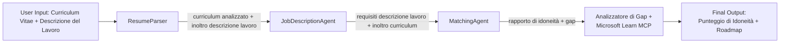

# PersonalCareerCopilot - Valutatore di Adattamento Curriculum → Lavoro

Un'app multi-agente basata sul flusso di lavoro che valuta quanto un curriculum corrisponde a una descrizione del lavoro, quindi genera una roadmap di apprendimento personalizzata per colmare le lacune.

---

## Agenti

| Agente | Ruolo | Strumenti |
|-------|------|-------|
| **ResumeParser** | Estrae competenze strutturate, esperienze, certificazioni dal testo del curriculum | - |
| **JobDescriptionAgent** | Estrae competenze richieste/preferite, esperienze, certificazioni da una descrizione del lavoro | - |
| **MatchingAgent** | Confronta profilo vs requisiti → punteggio di adattamento (0-100) + competenze corrispondenti/mancanti | - |
| **GapAnalyzer** | Costruisce una roadmap di apprendimento personalizzata con risorse Microsoft Learn | `search_microsoft_learn_for_plan` (MCP) |

## Flusso di lavoro


```mermaid
flowchart LR
    UserInput["User Input: Curriculum Vitae + Descrizione del Lavoro"] --> ResumeParser
    ResumeParser -- "curriculum analizzato + inoltro descrizione lavoro" --> JobDescriptionAgent
    JobDescriptionAgent -- "requisiti descrizione lavoro + inoltro curriculum" --> MatchingAgent
    MatchingAgent -- "rapporto di idoneità + gap" --> GapAnalyzerMCP["Analizzatore di Gap +\nMicrosoft Learn MCP"]
    GapAnalyzerMCP --> FinalOutput["Final Output:\nPunteggio di Idoneità + Roadmap"]
```

---

## Avvio rapido

### 1. Configura l'ambiente

Questa cartella è l'implementazione di riferimento per la struttura del Lab 02 basata sul flusso di lavoro. Il suo `main.py` utilizza i blocchi prompt esistenti più `WorkflowBuilder` per collegare i quattro agenti insieme.

```powershell
cd workshop\lab02-multi-agent\PersonalCareerCopilot
python -m venv .venv
.\.venv\Scripts\Activate.ps1          # Windows PowerShell
# source .venv/bin/activate            # macOS / Linux
pip install -r requirements.txt
```

### 2. Configura le credenziali

Crea un file `.env` in questa cartella:

```powershell
copy .env .env.bak 2>$null; echo $null > .env
```

Modifica `.env`:

```env
FOUNDRY_PROJECT_ENDPOINT=https://<your-account>.services.ai.azure.com/api/projects/<your-project>
AZURE_AI_MODEL_DEPLOYMENT_NAME=gpt-4.1-mini
```

| Valore | Dove trovarlo |
|-------|------------------|
| `FOUNDRY_PROJECT_ENDPOINT` | Barra laterale Foundry Toolkit → clic destro sul tuo progetto → **Copia endpoint progetto** |
| `AZURE_AI_MODEL_DEPLOYMENT_NAME` | Barra laterale Foundry → espandi progetto → **Modelli + endpoint** → nome distribuzione |

### 3. Esegui localmente

```powershell
python -m debugpy --listen 127.0.0.1:5679 main.py --port 8088
```

Oppure usa il task di VS Code: `Ctrl+Shift+P` → **Tasks: Esegui Task** → **Esegui server HTTP agente**.

Per il debug con F5, usa **Debug server HTTP agente locale**.

### 4. Testa con Agent Inspector

Apri Agent Inspector: `Ctrl+Shift+P` → **Foundry Toolkit: Apri Agent Inspector**.

Incolla questo prompt di test:

```
Resume:
Jane Doe
Senior Software Engineer with 5 years of experience in Python, Django, and AWS.
Built microservices handling 10K+ requests/second. Led a team of 4 developers.
Certifications: AWS Solutions Architect Associate.
Education: B.S. Computer Science, State University.

Job Description:
Senior Cloud Engineer at Contoso Ltd.
Required: Python, Azure, Kubernetes, Terraform, CI/CD pipelines.
Preferred: Go, monitoring (Prometheus/Grafana), cost optimization.
Experience: 5+ years in cloud infrastructure.
Certifications: Azure Solutions Architect Expert preferred.
```

**Atteso:** Un punteggio di adattamento (0-100), competenze corrispondenti/mancanti, e una roadmap di apprendimento personalizzata con URL Microsoft Learn.

### 5. Distribuisci su Foundry

`Ctrl+Shift+P` → **Foundry Toolkit: Distribuisci agente ospitato** → seleziona il tuo progetto → conferma.

---

## Struttura del progetto

```
PersonalCareerCopilot/
├── .env                ← Your credentials (git-ignored)
├── agent.yaml          ← Hosted agent definition (name, resources, env vars)
├── Dockerfile          ← Container image for Foundry deployment
├── main.py             ← 4-agent workflow (instructions, MCP tool, WorkflowBuilder)
└── requirements.txt    ← Python dependencies
```

## File chiave

### `agent.yaml`

Definisce l'agente ospitato per Foundry Agent Service:
- `kind: hosted` - esegue come container gestito
- `protocols` - protocollo `responses` con `version: 1.0.0`, che espone l'endpoint HTTP `/responses`
- `environment_variables` - `AZURE_AI_MODEL_DEPLOYMENT_NAME` è dichiarato qui; `FOUNDRY_PROJECT_ENDPOINT` è iniettato automaticamente al momento del deploy

### `main.py`

Contiene:
- **Istruzioni agenti** - quattro costanti `*_INSTRUCTIONS`, una per ogni agente
- **Strumento MCP** - `search_microsoft_learn_for_plan()` chiama `https://learn.microsoft.com/api/mcp` tramite HTTP Streamable
- **Creazione agenti** - quattro istanze `Agent()` + `AgentExecutor()` che condividono un `FoundryChatClient`
- **Grafo flusso di lavoro** - `WorkflowBuilder` collega gli agenti come pipeline sequenziale: ResumeParser → JD Agent → MatchingAgent → GapAnalyzer
- **Avvio server** - `ResponsesHostServer` gira sulla porta 8088

### `requirements.txt`

| Pacchetto | Scopo |
|---------|----------|
| `agent-framework-foundry` | Runtime core: `Agent`, `AgentExecutor`, `WorkflowBuilder`, `@tool`, `FoundryChatClient` |
| `agent-framework-foundry-hosting` | `ResponsesHostServer` + integrazione hosting Foundry |
| `mcp<2,>=1.24.0` | Client MCP per GapAnalyzer (`streamable_http_client`) |
| `debugpy` | Debugging Python (F5 in VS Code) |

---

## Risoluzione problemi

| Problema | Soluzione |
|-------|-----|
| `KeyError: 'FOUNDRY_PROJECT_ENDPOINT'` o `KeyError: 'AZURE_AI_MODEL_DEPLOYMENT_NAME'` | Crea `.env` con entrambi `FOUNDRY_PROJECT_ENDPOINT` e `AZURE_AI_MODEL_DEPLOYMENT_NAME` impostati |
| `ModuleNotFoundError: No module named 'agent_framework'` | Attiva venv e esegui `pip install -r requirements.txt` |
| Nessun URL Microsoft Learn nell'output | Controlla la connettività internet verso `https://learn.microsoft.com/api/mcp` |
| Solo 1 scheda gap (troncata) | Verifica che `GAP_ANALYZER_INSTRUCTIONS` includa il blocco `CRITICAL:` |
| Porta 8088 in uso | Ferma altri server: `netstat -ano \| findstr :8088` |

Per la risoluzione dettagliata dei problemi, vedi [Modulo 8 - Risoluzione Problemi](../docs/08-troubleshooting.md).

---

**Guida completa:** [Documentazione Lab 02](../docs/README.md) · **Torna a:** [README Lab 02](../README.md) · [Home del Workshop](../../../README.md)

---

<!-- CO-OP TRANSLATOR DISCLAIMER START -->
**Disclaimer**:
Questo documento è stato tradotto utilizzando il servizio di traduzione AI [Co-op Translator](https://github.com/Azure/co-op-translator). Sebbene ci impegniamo per garantire la precisione, si prega di notare che le traduzioni automatizzate possono contenere errori o imprecisioni. Il documento originale nella sua lingua nativa deve essere considerato la fonte autorevole. Per informazioni critiche, si raccomanda una traduzione professionale effettuata da un essere umano. Non siamo responsabili per eventuali malintesi o interpretazioni errate derivanti dall’uso di questa traduzione.
<!-- CO-OP TRANSLATOR DISCLAIMER END -->