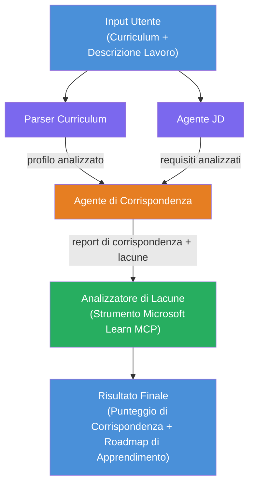

# Lab 02 - Flusso di Lavoro Multi-Agente: Valutatore di Adattamento Curriculum → Lavoro

---

## Cosa costruirai

Un **Valutatore di Adattamento Curriculum → Lavoro** - un flusso di lavoro multi-agente dove quattro agenti specializzati collaborano per valutare quanto bene il curriculum di un candidato corrisponde a una descrizione del lavoro, quindi generano una roadmap di apprendimento personalizzata per colmare le lacune.

### Gli agenti

| Agente | Ruolo |
|-------|------|
| **Parser del Curriculum** | Estrae competenze strutturate, esperienza, certificazioni dal testo del curriculum |
| **Agente Descrizione Lavoro** | Estrae competenze richieste/preferite, esperienza, certificazioni da una descrizione del lavoro |
| **Agente di Matching** | Confronta profilo vs requisiti → punteggio di adattamento (0-100) + competenze corrispondenti/mancanti |
| **Analizzatore delle Lacune** | Costruisce una roadmap di apprendimento personalizzata con risorse, tempistiche e progetti a risultati rapidi |

### Flusso demo

Carica un **curriculum + descrizione del lavoro** → ottieni un **punteggio di adattamento + competenze mancanti** → ricevi una **roadmap di apprendimento personalizzata**.

### Architettura del flusso di lavoro

> Viola = agenti in parallelo | Arancione = punto di aggregazione | Verde = agente finale con strumenti. Vedi [Modulo 1 - Comprendere l'Architettura](docs/01-understand-multi-agent.md) e [Modulo 4 - Modelli di Orchestrazione](docs/04-orchestration-patterns.md) per diagrammi dettagliati e flusso dati.

### Argomenti trattati

- Creazione di un flusso di lavoro multi-agente usando **WorkflowBuilder**
- Definizione dei ruoli degli agenti e flusso di orchestrazione (parallelo + sequenziale)
- Schemi di comunicazione inter-agenti
- Test locale con l’Agent Inspector
- Distribuzione di flussi di lavoro multi-agente su Foundry Agent Service

---

## Prerequisiti

Completa prima il Lab 01:

- [Lab 01 - Agente Singolo](../lab01-single-agent/README.md)

---

## Per iniziare

Vedi le istruzioni complete per la configurazione, walkthrough del codice e comandi di test in:

- [Doc Lab 2 - Prerequisiti](docs/00-prerequisites.md)
- [Doc Lab 2 - Percorso di Apprendimento Completo](docs/README.md)
- [Guida all’esecuzione di PersonalCareerCopilot](PersonalCareerCopilot/README.md)

## Modelli di orchestrazione (alternative agentiche)

Il Lab 2 include il flusso predefinito **parallelo → aggregatore → pianificatore**, e le doc
descrivono anche modelli alternativi per dimostrare un comportamento agentico più forte:

- **Fan-out/Fan-in con consenso ponderato**
- **Passaggio revisore/critico prima della roadmap finale**
- **Router condizionale** (selezione del percorso basata su punteggio di adattamento e competenze mancanti)

Vedi [docs/04-orchestration-patterns.md](docs/04-orchestration-patterns.md).

---

**Precedente:** [Lab 01 - Agente Singolo](../lab01-single-agent/README.md) · **Torna a:** [Pagina Principale Workshop](../../README.md)

---

<!-- CO-OP TRANSLATOR DISCLAIMER START -->
**Disclaimer**:  
Questo documento è stato tradotto utilizzando il servizio di traduzione automatica [Co-op Translator](https://github.com/Azure/co-op-translator). Sebbene ci impegniamo per l'accuratezza, si prega di notare che le traduzioni automatizzate possono contenere errori o imprecisioni. Il documento originale nella sua lingua nativa deve essere considerato la fonte autorevole. Per informazioni critiche, si raccomanda una traduzione professionale effettuata da un essere umano. Non siamo responsabili per eventuali incomprensioni o interpretazioni errate derivanti dall'uso di questa traduzione.
<!-- CO-OP TRANSLATOR DISCLAIMER END -->