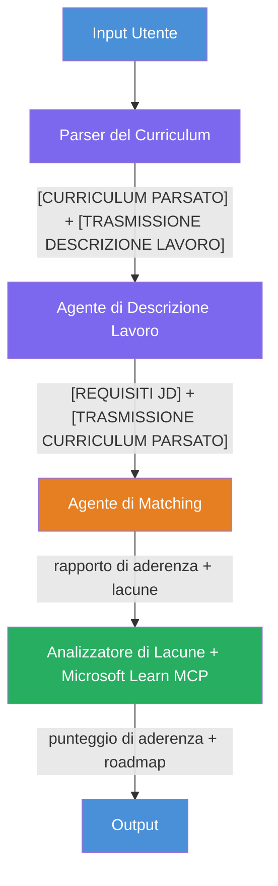

# Laboratorio 02 - Flusso di Lavoro Multi-Agente: Valutatore di Corrispondenza Curriculum → Lavoro

## Panoramica

In questo laboratorio pratico, costruirai un **app multi-agente basata su workflow** usando Foundry Toolkit in VS Code e la distribuirai su Microsoft Foundry Agent Service.

**Cosa costruirai:** un Valutatore di Corrispondenza Curriculum → Lavoro che analizza un curriculum e la descrizione del lavoro, valuta la corrispondenza e produce una roadmap personalizzata di apprendimento utilizzando le risorse Microsoft Learn.

---

## Architettura

```mermaid
flowchart TD
    A["Input Utente"] --> B["Parser del Curriculum"]
    B -->|"[CURRICULUM PARSATO] + [TRASMISSIONE DESCRIZIONE LAVORO]"| C["Agente di Descrizione Lavoro"]
    C -->|"[REQUISITI JD] + [TRASMISSIONE CURRICULUM PARSATO]"| D["Agente di Matching"]
    D -->|rapporto di aderenza + lacune| E["Analizzatore di Lacune + Microsoft Learn MCP"]
    E -->|punteggio di aderenza + roadmap| F["Output"]

    style A fill:#4A90D9,color:#fff
    style B fill:#7B68EE,color:#fff
    style C fill:#7B68EE,color:#fff
    style D fill:#E67E22,color:#fff
    style E fill:#27AE60,color:#fff
    style F fill:#4A90D9,color:#fff
```

**Come funziona:**
1. L'utente incolla un curriculum e una descrizione del lavoro.
2. **ResumeParser** analizza il curriculum e copia la JD letteralmente in una sezione `[JOB DESCRIPTION PASS-THROUGH]`.
3. **JD Agent** estrae i requisiti strutturati dal pass-through, quindi inoltra il `[PARSED RESUME]` come `[PARSED RESUME PASS-THROUGH]`.
4. **MatchingAgent** confronta `[PARSED RESUME PASS-THROUGH]` con `[JD REQUIREMENTS]` e produce un punteggio di corrispondenza.
5. **GapAnalyzer** trasforma le lacune in una roadmap pratica e recupera link reali di Microsoft Learn tramite MCP.

---

## Prerequisiti

Completa prima il Laboratorio 01:

- [Laboratorio 01 - Agente Singolo](../lab01-single-agent/README.md)

---

## Parte 1: Leggi i moduli in ordine

Consulta l'intero percorso di apprendimento in:

- [Documentazione Lab 2 - Prerequisiti](docs/00-prerequisites.md)
- [Documentazione Lab 2 - Percorso completo di apprendimento](docs/README.md)
- [Guida all'esecuzione di PersonalCareerCopilot](PersonalCareerCopilot/README.md)

---

## Parte 2: Costruisci e testa il workflow

1. Usa il wizard Foundry Toolkit per creare la struttura del progetto basato sul workflow.
2. Copia i blocchi prompt e il grafo del workflow da `PersonalCareerCopilot/main.py` nel tuo workspace.
3. Esegui localmente con Agent Inspector e verifica tutti e quattro gli agenti più lo strumento MCP.
4. Distribuisci l'agente ospitato su Foundry quando i test locali hanno successo.

---

## Pattern di Orchestrazione

Il Laboratorio 02 include il flusso predefinito **fan-out → fan-in → sequenziale**, e la documentazione descrive anche pattern di orchestrazione alternativi per sperimentazione.

- **Fan-out/Fan-in con consenso ponderato**
- **Passaggio revisore/critico prima della roadmap finale**
- **Router condizionale** basato su punteggio di corrispondenza e competenze mancanti

Consulta [docs/04-orchestration-patterns.md](docs/04-orchestration-patterns.md).

---

**Precedente:** [Laboratorio 01 - Agente Singolo](../lab01-single-agent/README.md) · **Torna a:** [Home Workshop](../../README.md)

---

<!-- CO-OP TRANSLATOR DISCLAIMER START -->
**Disclaimer**:
Questo documento è stato tradotto utilizzando il servizio di traduzione AI [Co-op Translator](https://github.com/Azure/co-op-translator). Sebbene ci impegniamo per garantire la precisione, si prega di notare che le traduzioni automatizzate possono contenere errori o imprecisioni. Il documento originale nella sua lingua nativa deve essere considerato la fonte autorevole. Per informazioni critiche, si raccomanda una traduzione professionale effettuata da un essere umano. Non siamo responsabili per eventuali malintesi o interpretazioni errate derivanti dall’uso di questa traduzione.
<!-- CO-OP TRANSLATOR DISCLAIMER END -->