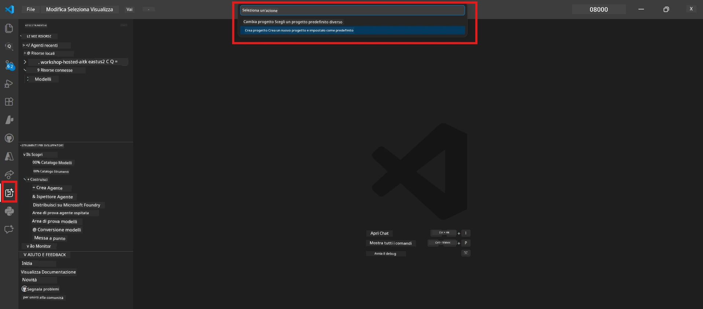

# Modulo 0 - Prerequisiti

Prima di iniziare il Lab 02, conferma di aver completato quanto segue. Questo laboratorio si basa direttamente sul Lab 01 - non saltarlo.

---

## 1. Completa il Lab 01

Il Lab 02 presuppone che tu abbia già:

- [x] Completato tutti gli 8 moduli di [Lab 01 - Single Agent](../../lab01-single-agent/README.md)
- [x] Distribuito con successo un singolo agente al Foundry Agent Service
- [x] Verificato che l'agente funzioni sia nel Agent Inspector locale che nel Foundry Playground

Se non hai completato il Lab 01, torna indietro e concludilo ora: [Lab 01 Docs](../../lab01-single-agent/docs/00-prerequisites.md)

---

## 2. Verifica configurazione esistente

Tutti gli strumenti del Lab 01 dovrebbero essere ancora installati e funzionanti. Esegui questi controlli rapidi:

### 2.1 Azure CLI

```powershell
az account show --query "{name:name, id:id}" --output table
```

Atteso: Mostra il nome e l'ID della tua sottoscrizione. Se questo fallisce, esegui [`az login`](https://learn.microsoft.com/cli/azure/authenticate-azure-cli-interactively).

### 2.2 Estensioni VS Code

1. Premi `Ctrl+Shift+P` → digita **"Microsoft Foundry"** → conferma di vedere i comandi (ad esempio, `Microsoft Foundry: Create a New Hosted Agent`).
2. Premi `Ctrl+Shift+P` → digita **"Foundry Toolkit"** → conferma di vedere i comandi (ad esempio, `Foundry Toolkit: Open Agent Inspector`).

### 2.3 Progetto & modello Foundry

1. Clicca sull'icona **Microsoft Foundry** nella barra attività di VS Code.
2. Conferma che il tuo progetto sia elencato (ad esempio, `workshop-agents`).
3. Espandi il progetto → verifica che esista un modello distribuito (ad esempio, `gpt-4.1-mini`) con stato **Succeeded**.

> **Se la distribuzione del tuo modello è scaduta:** Alcune distribuzioni free-tier scadono automaticamente. Ridistribuisci dal [Catalogo Modelli](https://learn.microsoft.com/azure/foundry/foundry-models/concepts/models-sold-directly-by-azure) (`Ctrl+Shift+P` → **Microsoft Foundry: Open Model Catalog**).



### 2.4 Ruoli RBAC

Verifica di avere il ruolo **Azure AI User** sul tuo progetto Foundry:

1. [Azure Portal](https://portal.azure.com) → risorsa **progetto** Foundry → **Controllo accessi (IAM)** → scheda **[Assegnazioni di ruolo](https://learn.microsoft.com/azure/foundry/concepts/rbac-foundry)**.
2. Cerca il tuo nome → conferma che sia elencato **[Azure AI User](https://aka.ms/foundry-ext-project-role)**.

---

## 3. Comprendere i concetti multi-agente (nuovi per il Lab 02)

Il Lab 02 introduce concetti non trattati nel Lab 01. Leggili prima di procedere:

### 3.1 Cos’è un workflow multi-agente?

Invece di un singolo agente che gestisce tutto, un **workflow multi-agente** suddivide il lavoro tra più agenti specializzati. Ogni agente ha:

- Le proprie **istruzioni** (prompt di sistema)
- Il proprio **ruolo** (di cosa è responsabile)
- Strumenti **opzionali** (funzioni che può chiamare)

Gli agenti comunicano tramite un **grafo di orchestrazione** che definisce come i dati fluiscono tra di loro.

### 3.2 WorkflowBuilder

La classe [`WorkflowBuilder`](https://learn.microsoft.com/agent-framework/workflows/agents-in-workflows) di `agent_framework` è il componente SDK che connette gli agenti insieme:

```python
from agent_framework import WorkflowBuilder

workflow = (
    WorkflowBuilder(
        name="MyWorkflow",
        start_executor=agent_a,
        output_executors=[agent_d],
    )
    .add_edge(agent_a, agent_b)
    .add_edge(agent_a, agent_c)
    .add_edge(agent_b, agent_d)
    .add_edge(agent_c, agent_d)
    .build()
)
```

- **`start_executor`** - Il primo agente che riceve l'input utente
- **`output_executors`** - L’agente (o gli agenti) il cui output diventa la risposta finale
- **`add_edge(source, target)`** - Definisce che `target` riceve l’output di `source`

### 3.3 Strumenti MCP (Model Context Protocol)

Il Lab 02 usa uno **strumento MCP** che chiama l'API Microsoft Learn per recuperare risorse didattiche. [MCP (Model Context Protocol)](https://modelcontextprotocol.io/introduction) è un protocollo standardizzato per collegare modelli AI a fonti dati esterne e strumenti.

| Termine | Definizione |
|------|-----------|
| **Server MCP** | Un servizio che espone strumenti/risorse tramite il [protocollo MCP](https://learn.microsoft.com/azure/foundry/agents/how-to/tools/model-context-protocol) |
| **Client MCP** | Il codice del tuo agente che si collega a un server MCP e chiama i suoi strumenti |
| **[Streamable HTTP](https://learn.microsoft.com/agent-framework/agents/tools/hosted-mcp-tools)** | Il metodo di trasporto usato per comunicare con il server MCP |

### 3.4 Come il Lab 02 differisce dal Lab 01

| Aspetto | Lab 01 (Singolo Agente) | Lab 02 (Multi-Agente) |
|--------|-------------------------|-----------------------|
| Agenti | 1 | 4 (ruoli specializzati) |
| Orchestrazione | Nessuna | WorkflowBuilder (parallelo + sequenziale) |
| Strumenti | Funzione `@tool` opzionale | Strumento MCP (chiamata API esterna) |
| Complessità | Prompt semplice → risposta | CV + JD → punteggio di compatibilità → roadmap |
| Flusso di contesto | Diretto | Passaggio da agente ad agente |

---

## 4. Struttura del repository del laboratorio per il Lab 02

Assicurati di sapere dove sono i file del Lab 02:

```
workshop/
└── lab02-multi-agent/
    ├── README.md                       ← Lab overview
    ├── docs/                           ← You are here
    │   ├── README.md                   ← Learning path index
    │   ├── 00-prerequisites.md         ← This file
    │   ├── 01-understand-multi-agent.md
    │   ├── ...
    │   └── 08-troubleshooting.md
    └── PersonalCareerCopilot/          ← The agent project
        ├── agent.yaml                  ← Agent definition
        ├── main.py                     ← 4-agent workflow code
        ├── Dockerfile                  ← Container configuration
        └── requirements.txt            ← Python dependencies
```

---

### Checkpoint

- [ ] Lab 01 è completamente completato (tutti gli 8 moduli, agente distribuito e verificato)
- [ ] `az account show` restituisce la tua sottoscrizione
- [ ] Le estensioni Microsoft Foundry e Foundry Toolkit sono installate e rispondono
- [ ] Il progetto Foundry ha un modello distribuito (ad esempio, `gpt-4.1-mini`)
- [ ] Hai il ruolo **Azure AI User** sul progetto
- [ ] Hai letto la sezione concetti multi-agente sopra e capisci WorkflowBuilder, MCP e l’orchestrazione agenti

---

**Prossimo:** [01 - Comprendere l’architettura multi-agente →](01-understand-multi-agent.md)

---

<!-- CO-OP TRANSLATOR DISCLAIMER START -->
**Disclaimer**:
Questo documento è stato tradotto utilizzando il servizio di traduzione AI [Co-op Translator](https://github.com/Azure/co-op-translator). Sebbene ci impegniamo per l'accuratezza, si prega di considerare che le traduzioni automatiche possono contenere errori o inesattezze. Il documento originale nella sua lingua nativa deve essere considerato la fonte autorevole. Per informazioni critiche, si raccomanda una traduzione professionale umana. Non siamo responsabili per eventuali incomprensioni o errate interpretazioni derivanti dall'uso di questa traduzione.
<!-- CO-OP TRANSLATOR DISCLAIMER END -->