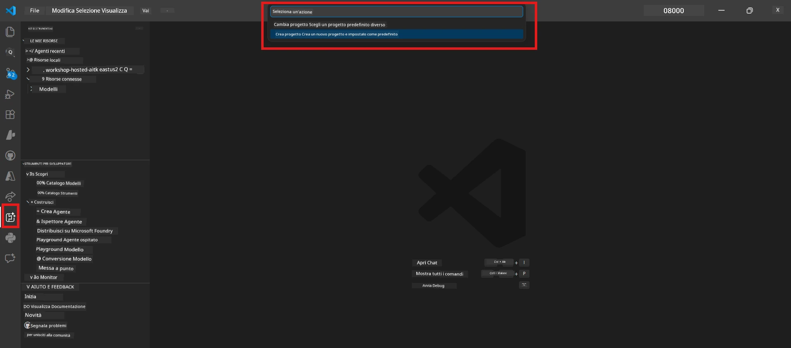

# Modulo 0 - Introduzione

⏱️ ~10 min

> [!WARNING]
> **Anteprima e Limitazioni:** Gli [Hosted Agents](https://learn.microsoft.com/azure/foundry/agents/concepts/hosted-agents) sono attualmente in **anteprima pubblica** - non consigliati per carichi di lavoro in produzione. Alcune funzionalità mostrate in questo workshop potrebbero cambiare man mano che il servizio si avvicina alla GA.

## Cosa costruirai

In questo laboratorio, estendi le capacità del singolo agente del Lab 01 per costruire un **flusso di lavoro multi-agente** - il Valutatore di Corrispondenza Curriculum → Lavoro.

Incolli un **curriculum** e una **descrizione del lavoro**. Quattro agenti specializzati processano l'input in sequenza, poi restituiscono:
- Un punteggio di corrispondenza (0–100 con scomposizione del punteggio)
- Una lista di lacune di competenze e certificazioni
- Una roadmap di apprendimento personalizzata con link reali di Microsoft Learn per ogni lacuna

**Il flusso di lavoro utilizza:**
- **Microsoft Agent Framework** - `WorkflowBuilder` per l'orchestrazione pipeline sequenziale
- **Foundry Toolkit per VS Code** - scaffolding, test locale, deployment
- **Un modello IA** (ad esempio, `gpt-4.1-mini`) - usato da tutti e quattro gli agenti
- **Server Microsoft Learn MCP** - fornisce link reali alle risorse di apprendimento per ogni lacuna di competenze

---

## Scegli il tuo percorso

> ⚠️ **Continua con lo stesso percorso usato nel Lab 01.**

<details open>
<summary><strong>🅰️ Percorso A - Cloud Azure (richiede abbonamento Azure)</strong></summary>

| | Dettagli |
|---|---|
| **Per chi è?** | Hai completato il Lab 01 usando un abbonamento Azure |
| **Modello** | Azure OpenAI via Foundry (ad es., `gpt-4.1-mini`) |
| **Moduli trattati** | Tutti i moduli (00–09) |
| **Deploy sul cloud?** | ✅ Sì - deploy end-to-end completo |

</details>

<details open>
<summary><strong>🅱️ Percorso B - Foundry Locale (non serve abbonamento Azure)</strong></summary>

| | Dettagli |
|---|---|
| **Per chi è?** | Hai completato il Lab 01 usando Foundry Locale |
| **Modello** | Foundry Locale (gratuito, gira sulla tua macchina) |
| **Moduli trattati** | Moduli 00–05 (salta 06–07 - deploy e verifica cloud) |
| **Deploy sul cloud?** | ❌ No - solo test locale tramite Agent Inspector |

</details>

---

## Controllo Lab 01

Il Lab 02 costruisce direttamente sul Lab 01. Completa prima il Lab 01 prima di iniziare qui.

Non hai ancora fatto il Lab 01? Inizia qui: [Lab 01 - Introduzione](../../lab01-single-agent/docs/00-prerequisites.md)

<details open>
<summary><strong>🅰️ Percorso A - Cloud Azure</strong></summary>

```powershell
az account show --query "{name:name, id:id}" --output table
```

Se questo fallisce, esegui `az login`. Poi verifica in VS Code:

1. `Ctrl+Shift+P` → digita **Foundry Toolkit** → conferma la comparsa dei comandi.
2. Clicca sull'icona **Foundry Toolkit** → il tuo progetto e modello deployato mostrano **Succeeded**.



> **RBAC:** Hai assegnato **Foundry User** nel Lab 01. Se serve riassegnarlo, guarda [Lab 01, Modulo 1](../../lab01-single-agent/docs/01-setup.md#deploy-a-model--assign-rbac). Il ruolo era precedentemente chiamato **Azure AI User** - stesse autorizzazioni.

</details>

<details open>
<summary><strong>🅱️ Percorso B - Foundry Locale</strong></summary>

```powershell
Invoke-WebRequest -Uri "http://localhost:5273/v1/health" -UseBasicParsing | Select-Object StatusCode
```

Atteso: `StatusCode: 200`. Se no, riavvia Foundry Locale dalla sidebar di Foundry Toolkit.

> Tutte le inferenze girano sulla tua macchina. L'unica chiamata in uscita è lo strumento MCP a `https://learn.microsoft.com/api/mcp`.

</details>

---

## Novità nel Lab 02

| | Lab 01 | Lab 02 |
|--|--------|--------|
| Agenti | 1 | 4 (collegati con WorkflowBuilder) |
| Template scaffold | Base - Agent Framework | Workflow - Agent Framework |
| Nuovo pacchetto | - | `mcp` |
| Orchestrazione | Agente conversazionale singolo | Pipeline sequenziale (WorkflowBuilder) |
| Nuovo strumento | - | `search_microsoft_learn_for_plan` (MCP) |

---

**Successivo:** [01 - Comprendere l'architettura →](01-understand-multi-agent.md)

---

<!-- CO-OP TRANSLATOR DISCLAIMER START -->
**Disclaimer**:
Questo documento è stato tradotto utilizzando il servizio di traduzione AI [Co-op Translator](https://github.com/Azure/co-op-translator). Sebbene ci impegniamo per garantire la precisione, si prega di notare che le traduzioni automatizzate possono contenere errori o imprecisioni. Il documento originale nella sua lingua nativa deve essere considerato la fonte autorevole. Per informazioni critiche, si raccomanda una traduzione professionale effettuata da un essere umano. Non siamo responsabili per eventuali malintesi o interpretazioni errate derivanti dall’uso di questa traduzione.
<!-- CO-OP TRANSLATOR DISCLAIMER END -->