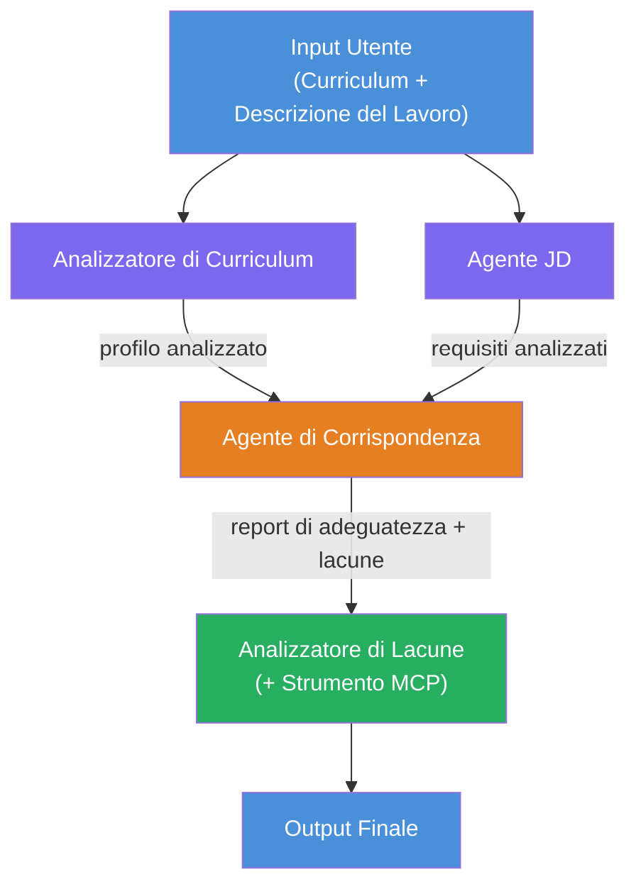
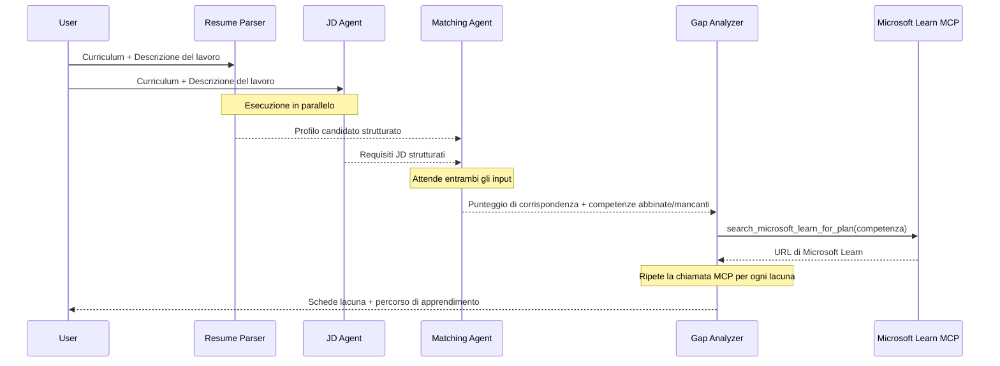
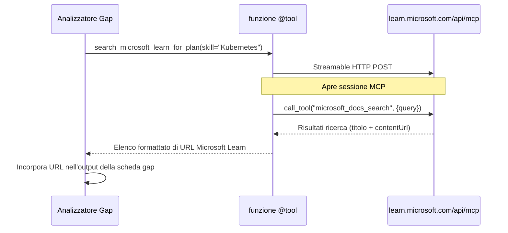

# Modulo 1 - Comprendere l'Architettura Multi-Agente

In questo modulo, imparerai l'architettura del Resume → Job Fit Evaluator prima di scrivere qualsiasi codice. Comprendere il grafo di orchestrazione, i ruoli degli agenti e il flusso dei dati è fondamentale per il debug e l'estensione dei [flussi di lavoro multi-agente](https://learn.microsoft.com/azure/architecture/ai-ml/idea/multiple-agent-workflow-automation).

---

## Il problema che risolve

Abbinare un curriculum a una descrizione del lavoro coinvolge diverse competenze distinte:

1. **Parsing** - Estrarre dati strutturati da testo non strutturato (curriculum)
2. **Analisi** - Estrarre requisiti da una descrizione del lavoro
3. **Confronto** - Valutare l'allineamento tra i due
4. **Pianificazione** - Costruire una roadmap di apprendimento per colmare le lacune

Un singolo agente che svolge tutti e quattro i compiti in un solo prompt spesso produce:
- Estrazione incompleta (si affretta nel parsing per arrivare al punteggio)
- Valutazione superficiale (senza suddivisione basata su evidenze)
- Roadmap generiche (non personalizzate per le lacune specifiche)

Dividendo in **quattro agenti specializzati**, ognuno si concentra sul proprio compito con istruzioni dedicate, producendo output di qualità superiore in ogni fase.

---

## I quattro agenti

Ogni agente è un agente completo di [Microsoft Foundry](https://learn.microsoft.com/azure/foundry/agents/concepts/hosted-agents) creato tramite `AzureAIAgentClient.as_agent()`. Condividono la stessa distribuzione del modello ma hanno istruzioni diverse e (opzionalmente) strumenti differenti.

| # | Nome Agente | Ruolo | Input | Output |
|---|-------------|-------|-------|--------|
| 1 | **ResumeParser** | Estrae un profilo strutturato dal testo del curriculum | Testo grezzo del curriculum (da utente) | Profilo candidato, Competenze tecniche, Competenze trasversali, Certificazioni, Esperienza nel dominio, Realizzazioni |
| 2 | **JobDescriptionAgent** | Estrae requisiti strutturati da una descrizione lavoro | Testo grezzo JD (da utente, inoltrato via ResumeParser) | Panoramica ruolo, Competenze richieste, Competenze preferite, Esperienza, Certificazioni, Istruzione, Responsabilità |
| 3 | **MatchingAgent** | Calcola punteggio di aderenza basato su evidenze | Output di ResumeParser + JobDescriptionAgent | Punteggio di aderenza (0-100 con dettaglio), Competenze abbinate, Competenze mancanti, Lacune |
| 4 | **GapAnalyzer** | Costruisce roadmap di apprendimento personalizzata | Output di MatchingAgent | Schede lacune (per competenza), Ordine di apprendimento, Tempistica, Risorse da Microsoft Learn |

---

## Il grafo di orchestrazione

Il flusso di lavoro utilizza **fan-out parallelo** seguito da **aggregazione sequenziale**:


> **Legenda:** Viola = agenti paralleli, Arancione = punto di aggregazione, Verde = agente finale con strumenti

### Come fluiscono i dati


1. **L'utente invia** un messaggio contenente un curriculum e una descrizione del lavoro.
2. **ResumeParser** riceve l'intero input utente ed estrae un profilo candidato strutturato.
3. **JobDescriptionAgent** riceve l'input utente in parallelo ed estrae requisiti strutturati.
4. **MatchingAgent** riceve output sia da ResumeParser che da JobDescriptionAgent (il framework aspetta che entrambi terminino prima di eseguire MatchingAgent).
5. **GapAnalyzer** riceve l'output di MatchingAgent e chiama lo **strumento Microsoft Learn MCP** per recuperare risorse di apprendimento reali per ogni lacuna.
6. L'**output finale** è la risposta di GapAnalyzer, che include il punteggio di aderenza, le schede lacune e una roadmap di apprendimento completa.

### Perché il fan-out parallelo è importante

ResumeParser e JobDescriptionAgent eseguono **in parallelo** perché nessuno dipende dall'altro. Questo:
- Riduce la latenza totale (entrambi eseguono contemporaneamente invece che in sequenza)
- È una divisione naturale (analisi del curriculum vs. analisi JD sono compiti indipendenti)
- Dimostra un modello comune multi-agente: **fan-out → aggregazione → azione**

---

## WorkflowBuilder nel codice

Ecco come il grafo sopra si mappa alle chiamate API di [`WorkflowBuilder`](https://learn.microsoft.com/agent-framework/workflows/agents-in-workflows) in `main.py`:

```python
from agent_framework import WorkflowBuilder

workflow = (
    WorkflowBuilder(
        name="ResumeJobFitEvaluator",
        start_executor=resume_parser,       # Primo agente a ricevere l'input dell'utente
        output_executors=[gap_analyzer],     # Agente finale il cui output viene restituito
    )
    .add_edge(resume_parser, jd_agent)      # ResumeParser → JobDescriptionAgent
    .add_edge(resume_parser, matching_agent) # ResumeParser → MatchingAgent
    .add_edge(jd_agent, matching_agent)      # JobDescriptionAgent → MatchingAgent
    .add_edge(matching_agent, gap_analyzer)  # MatchingAgent → GapAnalyzer
    .build()
)
```

**Comprendere i bordi:**

| Bordo | Cosa significa |
|-------|----------------|
| `resume_parser → jd_agent` | JD Agent riceve l'output di ResumeParser |
| `resume_parser → matching_agent` | MatchingAgent riceve l'output di ResumeParser |
| `jd_agent → matching_agent` | MatchingAgent riceve anche l'output di JD Agent (aspetta entrambi) |
| `matching_agent → gap_analyzer` | GapAnalyzer riceve l'output di MatchingAgent |

Poiché `matching_agent` ha **due bordi in ingresso** (`resume_parser` e `jd_agent`), il framework aspetta automaticamente che entrambi terminino prima di eseguire Matching Agent.

---

## Lo strumento MCP

L'agente GapAnalyzer ha uno strumento: `search_microsoft_learn_for_plan`. Questo è uno **[strumento MCP](https://learn.microsoft.com/agent-framework/agents/tools/hosted-mcp-tools)** che chiama l'API di Microsoft Learn per recuperare risorse di apprendimento curate.

### Come funziona

```python
@tool
async def search_microsoft_learn_for_plan(
    skill: str, role: str = "", max_results: int = 5
) -> str:
    """Search Microsoft Learn MCP and return curated official links."""
    # Si connette a https://learn.microsoft.com/api/mcp tramite HTTP streamabile
    # Chiama lo strumento 'microsoft_docs_search' sul server MCP
    # Restituisce un elenco formattato di URL di Microsoft Learn
```

### Flusso di chiamata MCP


1. GapAnalyzer decide che servono risorse di apprendimento per una competenza (es. "Kubernetes")
2. Il framework chiama `search_microsoft_learn_for_plan(skill="Kubernetes")`
3. La funzione apre una connessione [Streamable HTTP](https://learn.microsoft.com/agent-framework/agents/tools/hosted-mcp-tools) a `https://learn.microsoft.com/api/mcp`
4. Chiama lo strumento `microsoft_docs_search` sul [server MCP](https://learn.microsoft.com/azure/foundry/agents/how-to/tools/model-context-protocol)
5. Il server MCP restituisce risultati di ricerca (titolo + URL)
6. La funzione formatta i risultati e li restituisce come stringa
7. GapAnalyzer usa gli URL restituiti nell'output delle schede lacune

### Log MCP attesi

Quando lo strumento viene eseguito, vedrai voci di log come:

```
GET https://learn.microsoft.com/api/mcp → 405 (Method Not Allowed)
POST https://learn.microsoft.com/api/mcp → 200
DELETE https://learn.microsoft.com/api/mcp → 405 (Method Not Allowed)
```

**Questi sono normali.** Il client MCP invia probe con GET e DELETE durante l'inizializzazione - è previsto che restituiscano 405. La chiamata effettiva dello strumento usa POST e restituisce 200. Preoccupati solo se le chiamate POST falliscono.

---

## Pattern di creazione dell'agente

Ogni agente viene creato usando il **gestore di contesto asincrono [`AzureAIAgentClient.as_agent()`](https://learn.microsoft.com/python/api/overview/azure/ai-agents-readme)**. Questo è il pattern Foundry SDK per creare agenti che vengono automaticamente puliti:

```python
async with (
    get_credential() as credential,
    AzureAIAgentClient(
        project_endpoint=PROJECT_ENDPOINT,
        model_deployment_name=MODEL_DEPLOYMENT_NAME,
        credential=credential,
    ).as_agent(
        name="ResumeParser",
        instructions=RESUME_PARSER_INSTRUCTIONS,
    ) as resume_parser,
    # ... ripeti per ogni agente ...
):
    # Qui esistono tutti e 4 gli agenti
    workflow = create_workflow(resume_parser, jd_agent, matching_agent, gap_analyzer)
```

**Punti chiave:**
- Ogni agente ha la propria istanza di `AzureAIAgentClient` (l’SDK richiede che il nome agente sia con ambito al client)
- Tutti gli agenti condividono le stesse `credential`, `PROJECT_ENDPOINT` e `MODEL_DEPLOYMENT_NAME`
- Il blocco `async with` assicura che tutti gli agenti vengano puliti alla chiusura del server
- GapAnalyzer riceve in aggiunta `tools=[search_microsoft_learn_for_plan]`

---

## Avvio del server

Dopo aver creato gli agenti e costruito il workflow, il server si avvia:

```python
from azure.ai.agentserver.agentframework import from_agent_framework

agent = create_workflow(resume_parser, jd_agent, matching_agent, gap_analyzer)
await from_agent_framework(agent).run_async()
```

`from_agent_framework()` incapsula il flusso di lavoro come server HTTP esponendo l’endpoint `/responses` sulla porta 8088. È lo stesso pattern del Lab 01, ma l'"agente" è ora l'intero [grafo di workflow](https://learn.microsoft.com/agent-framework/workflows/as-agents).

---

### Checkpoint

- [ ] Hai compreso l’architettura a 4 agenti e il ruolo di ciascun agente
- [ ] Riesci a tracciare il flusso dati: Utente → ResumeParser → (paralleli) JD Agent + MatchingAgent → GapAnalyzer → Output
- [ ] Capisci perché MatchingAgent aspetta sia ResumeParser che JD Agent (due bordi in ingresso)
- [ ] Hai compreso lo strumento MCP: cosa fa, come viene chiamato e che i log GET 405 sono normali
- [ ] Hai compreso il pattern `AzureAIAgentClient.as_agent()` e perché ogni agente ha una propria istanza client
- [ ] Sai leggere il codice `WorkflowBuilder` e mappare il grafo visuale

---

**Precedente:** [00 - Prerequisiti](00-prerequisites.md) · **Successivo:** [02 - Scaffold del Progetto Multi-Agente →](02-scaffold-multi-agent.md)

---

<!-- CO-OP TRANSLATOR DISCLAIMER START -->
**Disclaimer**:  
Questo documento è stato tradotto utilizzando il servizio di traduzione automatica [Co-op Translator](https://github.com/Azure/co-op-translator). Pur impegnandoci per garantire accuratezza, si prega di notare che le traduzioni automatiche possono contenere errori o imprecisioni. Il documento originale nella sua lingua nativa deve essere considerato la fonte autorevole. Per informazioni critiche, si raccomanda una traduzione professionale effettuata da un traduttore umano. Non siamo responsabilità per eventuali malintesi o interpretazioni errate derivanti dall'uso di questa traduzione.
<!-- CO-OP TRANSLATOR DISCLAIMER END -->