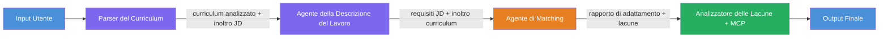

# Modulo 1 - Comprendere l'Architettura

⏱️ ~5 min

Prima di scrivere qualsiasi codice, ecco una breve panoramica di ciò che stai costruendo e di come funziona.

---

## Cosa stai costruendo

Incolli un **curriculum vitae** e una **descrizione del lavoro**. Il flusso di lavoro restituisce:

- Un punteggio di aderenza (0–100 con una suddivisione)
- Una lista di lacune di competenze e certificazioni
- Una roadmap di apprendimento personalizzata con link a Microsoft Learn per ogni lacuna

---

## I quattro agenti

Un singolo agente che cerca di analizzare, valutare e pianificare tutto in una volta tende a procedere troppo velocemente e a produrre risultati superficiali. Suddividere il lavoro in quattro agenti specializzati dà risultati migliori:

| Agente | Cosa fa |
|-------|-------------|
| **ResumeParser** | Analizza il curriculum; copia la descrizione del lavoro integralmente in `[JOB DESCRIPTION PASS-THROUGH]` per gli agenti downstream |
| **JobDescriptionAgent** | Estrae i requisiti della descrizione del lavoro dal pass-through; inoltra `[PARSED RESUME]` come `[PARSED RESUME PASS-THROUGH]` |
| **MatchingAgent** | Confronta entrambe le sezioni etichettate; produce un punteggio di aderenza da 0 a 100 e una lista di lacune |
| **GapAnalyzer** | Costruisce una roadmap di apprendimento; cerca su Microsoft Learn per ogni lacuna |

---

## Il grafo di orchestrazione

Il flusso di lavoro è una **pipeline sequenziale** - ogni agente passa il suo output al successivo:


```mermaid
flowchart LR
    A["Input Utente"] --> B["Parser del Curriculum"]
    B -- "curriculum analizzato + inoltro JD" --> C["Agente della Descrizione del Lavoro"]
    C -- "requisiti JD + inoltro curriculum" --> D["Agente di Matching"]
    D -- "rapporto di adattamento + lacune" --> E["Analizzatore delle Lacune + MCP"]
    E --> F["Output Finale"]

    style A fill:#4A90D9,color:#fff
    style B fill:#7B68EE,color:#fff
    style C fill:#7B68EE,color:#fff
    style D fill:#E67E22,color:#fff
    style E fill:#27AE60,color:#fff
    style F fill:#4A90D9,color:#fff
```

1. **ResumeParser** riceve l'input dell'utente, analizza il curriculum e copia la descrizione del lavoro in `[JOB DESCRIPTION PASS-THROUGH]`.
2. **JD Agent** estrae i requisiti strutturati e inoltra `[PARSED RESUME PASS-THROUGH]` in avanti.
3. **MatchingAgent** confronta entrambe le sezioni e produce un punteggio di aderenza e una lista di lacune.
4. **GapAnalyzer** costruisce la roadmap e chiama lo strumento Microsoft Learn MCP per ogni lacuna.

---

## Come questo si traduce in codice

In `main.py`, descrivi questo grafo con `WorkflowBuilder`:

```python
workflow_agent = (
    WorkflowBuilder(
        start_executor=resume_executor,       # primo agente a ricevere l'input dell'utente
        output_executors=[gap_executor],      # ultimo agente - la sua uscita è la risposta
    )
    .add_edge(resume_executor, jd_executor)       # ResumeParser → Agente JD
    .add_edge(jd_executor, matching_executor)     # Agente JD → MatchingAgent
    .add_edge(matching_executor, gap_executor)    # MatchingAgent → GapAnalyzer
    .build()
    .as_agent()
)
```

Ogni `Agent` è incapsulato in un `AgentExecutor`. Le chiamate `add_edge()` definiscono una pipeline strettamente sequenziale - ogni agente riceve solo l'output diretto del suo predecessore.

> `context_mode="last_agent"` significa che ogni esecutore vede solo l'output diretto del suo predecessore. ResumeParser e JD Agent inoltrano i dati in sezioni etichettate così che ogni agente a valle abbia esattamente ciò di cui ha bisogno.

---

## Lo strumento MCP

GapAnalyzer ha uno strumento: `search_microsoft_learn_for_plan`. Si collega a `https://learn.microsoft.com/api/mcp` e restituisce link reali di Microsoft Learn per ogni lacuna di competenze.

Quando lo strumento è in esecuzione vedrai questi log - tutti previsti:

```
GET  https://learn.microsoft.com/api/mcp → 405   ← connection probe, normal
POST https://learn.microsoft.com/api/mcp → 200   ← actual tool call
DELETE https://learn.microsoft.com/api/mcp → 405 ← cleanup probe, normal
```

Devi preoccuparti solo se il `POST` restituisce un errore.

---

**Precedente:** [00 - Prerequisites](00-prerequisites.md) · **Successivo:** [02 - Scaffold the Project →](02-scaffold-multi-agent.md)

---

<!-- CO-OP TRANSLATOR DISCLAIMER START -->
**Disclaimer**:
Questo documento è stato tradotto utilizzando il servizio di traduzione AI [Co-op Translator](https://github.com/Azure/co-op-translator). Sebbene ci impegniamo per garantire la precisione, si prega di notare che le traduzioni automatizzate possono contenere errori o imprecisioni. Il documento originale nella sua lingua nativa deve essere considerato la fonte autorevole. Per informazioni critiche, si raccomanda una traduzione professionale effettuata da un essere umano. Non siamo responsabili per eventuali malintesi o interpretazioni errate derivanti dall’uso di questa traduzione.
<!-- CO-OP TRANSLATOR DISCLAIMER END -->