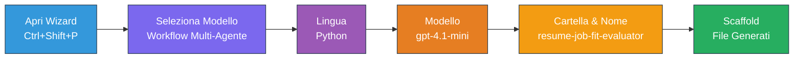
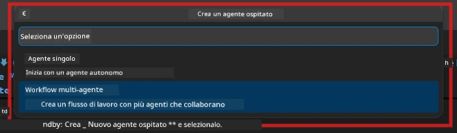

# Modulo 2 - Scaffolding del Progetto Multi-Agente

In questo modulo, utilizzi l'[estensione Microsoft Foundry](https://marketplace.visualstudio.com/items?itemName=TeamsDevApp.vscode-ai-foundry) per **scaffoldare un progetto workflow multi-agente**. L'estensione genera l'intera struttura del progetto - `agent.yaml`, `main.py`, `Dockerfile`, `requirements.txt`, `.env` e la configurazione di debug. Poi personalizzi questi file nei Moduli 3 e 4.

> **Nota:** La cartella `PersonalCareerCopilot/` in questo laboratorio è un esempio completo e funzionante di un progetto multi-agente personalizzato. Puoi scaffoldare un progetto nuovo (consigliato per l'apprendimento) o studiare direttamente il codice esistente.

---

## Passo 1: Apri la procedura guidata per creare un agente ospitato


1. Premi `Ctrl+Shift+P` per aprire la **Command Palette**.
2. Digita: **Microsoft Foundry: Create a New Hosted Agent** e selezionalo.
3. Si apre la procedura guidata per la creazione dell'agente ospitato.

> **Alternativa:** Clicca l'icona **Microsoft Foundry** nella Barra Attività → clicca l'icona **+** accanto a **Agents** → **Create New Hosted Agent**.

---

## Passo 2: Scegli il modello Multi-Agent Workflow

La procedura guidata ti chiede di selezionare un modello:

| Modello | Descrizione | Quando usarlo |
|----------|-------------|-------------|
| Single Agent | Un agente con istruzioni e strumenti opzionali | Laboratorio 01 |
| **Multi-Agent Workflow** | Molti agenti che collaborano tramite WorkflowBuilder | **Questo laboratorio (Lab 02)** |

1. Seleziona **Multi-Agent Workflow**.
2. Clicca **Avanti**.



---

## Passo 3: Scegli il linguaggio di programmazione

1. Seleziona **Python**.
2. Clicca **Avanti**.

---

## Passo 4: Seleziona il modello

1. La procedura guidata mostra i modelli distribuiti nel tuo progetto Foundry.
2. Seleziona lo stesso modello usato nel Lab 01 (es. **gpt-4.1-mini**).
3. Clicca **Avanti**.

> **Suggerimento:** [`gpt-4.1-mini`](https://learn.microsoft.com/azure/foundry/foundry-models/concepts/models-sold-directly-by-azure#gpt-41-series) è consigliato per lo sviluppo - è veloce, economico e gestisce bene i workflow multi-agente. Passa a `gpt-4.1` per il deployment finale in produzione se vuoi output di qualità superiore.

---

## Passo 5: Scegli la cartella di destinazione e il nome dell'agente

1. Si apre una finestra di dialogo file. Scegli una cartella di destinazione:
   - Se segui il repository del laboratorio: vai in `workshop/lab02-multi-agent/` e crea una nuova sottocartella
   - Se inizi da zero: scegli qualsiasi cartella
2. Inserisci un **nome** per l'agente ospitato (es. `resume-job-fit-evaluator`).
3. Clicca **Crea**.

---

## Passo 6: Attendi che lo scaffolding sia completato

1. VS Code apre una nuova finestra (o aggiorna quella corrente) con il progetto scaffoldato.
2. Dovresti vedere questa struttura di file:

```
resume-job-fit-evaluator/
├── .env                ← Environment variables (placeholders)
├── .vscode/
│   └── launch.json     ← Debug configuration
├── agent.yaml          ← Agent definition (kind: hosted)
├── Dockerfile          ← Container configuration
├── main.py             ← Multi-agent workflow code (scaffold)
└── requirements.txt    ← Python dependencies
```

> **Nota del laboratorio:** Nel repository del laboratorio, la cartella `.vscode/` è alla **radice dello spazio di lavoro** con `launch.json` e `tasks.json` condivisi. Le configurazioni di debug per Lab 01 e Lab 02 sono entrambe incluse. Quando premi F5, seleziona **"Lab02 - Multi-Agent"** dal menu a tendina.

---

## Passo 7: Comprendi i file scaffoldati (specifiche multi-agente)

Lo scaffold multi-agente differisce dallo scaffold singolo agente in diversi modi chiave:

### 7.1 `agent.yaml` - Definizione dell'agente

```yaml
kind: hosted
name: resume-job-fit-evaluator
description: >
  A multi-agent workflow that evaluates resume-to-job fit.
metadata:
  authors:
    - Microsoft
  tags:
    - Multi-Agent Workflow
    - Resume Evaluator
protocols:
  - protocol: responses
    version: v1
environment_variables:
  - name: PROJECT_ENDPOINT
    value: ${PROJECT_ENDPOINT}
  - name: MODEL_DEPLOYMENT_NAME
    value: ${MODEL_DEPLOYMENT_NAME}
```

**Differenza chiave rispetto al Lab 01:** La sezione `environment_variables` può includere variabili aggiuntive per endpoint MCP o configurazioni di altri strumenti. Il `name` e la `description` riflettono il caso d'uso multi-agente.

### 7.2 `main.py` - Codice del workflow multi-agente

Lo scaffold include:
- **Molteplici stringhe di istruzioni per agenti** (una const per ogni agente)
- **Molti context manager [`AzureAIAgentClient.as_agent()`](https://learn.microsoft.com/python/api/overview/azure/ai-agents-readme)** (uno per agente)
- **[`WorkflowBuilder`](https://learn.microsoft.com/agent-framework/workflows/agents-in-workflows)** per collegare gli agenti insieme
- **`from_agent_framework()`** per servire il workflow come endpoint HTTP

```python
from agent_framework import WorkflowBuilder, tool
from agent_framework.azure import AzureAIAgentClient
from azure.ai.agentserver.agentframework import from_agent_framework
```

L'import extra [`WorkflowBuilder`](https://learn.microsoft.com/agent-framework/workflows/agents-in-workflows) è nuovo rispetto al Lab 01.

### 7.3 `requirements.txt` - Dipendenze aggiuntive

Il progetto multi-agente usa gli stessi pacchetti base del Lab 01, più eventuali pacchetti relativi a MCP:

```
agent-framework-azure-ai==1.0.0rc3
agent-framework-core==1.0.0rc3
azure-ai-agentserver-agentframework==1.0.0b16
azure-ai-agentserver-core==1.0.0b16
debugpy
agent-dev-cli --pre
```

> **Nota importante sulla versione:** Il pacchetto `agent-dev-cli` richiede il flag `--pre` in `requirements.txt` per installare l'ultima versione preview. Ciò è necessario per la compatibilità di Agent Inspector con `agent-framework-core==1.0.0rc3`. Vedi [Modulo 8 - Risoluzione dei problemi](08-troubleshooting.md) per i dettagli di versione.

| Pacchetto | Versione | Scopo |
|---------|---------|---------|
| [`agent-framework-azure-ai`](https://learn.microsoft.com/agent-framework/overview/) | `1.0.0rc3` | Integrazione Azure AI per [Microsoft Agent Framework](https://github.com/microsoft/agent-framework) |
| [`agent-framework-core`](https://learn.microsoft.com/agent-framework/overview/) | `1.0.0rc3` | Runtime core (include WorkflowBuilder) |
| `azure-ai-agentserver-agentframework` | `1.0.0b16` | Runtime del server agente ospitato |
| `azure-ai-agentserver-core` | `1.0.0b16` | Astrazioni core del server agente |
| `debugpy` | ultima | Debug Python (F5 in VS Code) |
| `agent-dev-cli` | `--pre` | CLI per sviluppo locale + backend Agent Inspector |

### 7.4 `Dockerfile` - Uguale al Lab 01

Il Dockerfile è identico a quello del Lab 01 - copia i file, installa le dipendenze da `requirements.txt`, espone la porta 8088 ed esegue `python main.py`.

```dockerfile
FROM python:3.14-slim
WORKDIR /app
COPY ./ .
RUN pip install --upgrade pip && \
    if [ -f requirements.txt ]; then \
        pip install -r requirements.txt; \
    else \
      echo "No requirements.txt found" >&2; exit 1; \
    fi
EXPOSE 8088
CMD ["python", "main.py"]
```

---

### Checkpoint

- [ ] Procedura guidata di scaffolding completata → la nuova struttura del progetto è visibile
- [ ] Puoi vedere tutti i file: `agent.yaml`, `main.py`, `Dockerfile`, `requirements.txt`, `.env`
- [ ] `main.py` include l’import di `WorkflowBuilder` (conferma che è stato selezionato il template multi-agente)
- [ ] `requirements.txt` include sia `agent-framework-core` che `agent-framework-azure-ai`
- [ ] Hai compreso come lo scaffold multi-agente differisce dallo scaffold singolo agente (molti agenti, WorkflowBuilder, strumenti MCP)

---

**Precedente:** [01 - Comprendere l'Architettura Multi-Agente](01-understand-multi-agent.md) · **Successivo:** [03 - Configura Agenti & Ambiente →](03-configure-agents.md)

---

<!-- CO-OP TRANSLATOR DISCLAIMER START -->
**Disclaimer**:  
Questo documento è stato tradotto utilizzando il servizio di traduzione AI [Co-op Translator](https://github.com/Azure/co-op-translator). Pur impegnandoci per garantire l'accuratezza, si prega di notare che le traduzioni automatizzate possono contenere errori o inesattezze. Il documento originale nella sua lingua nativa deve essere considerato la fonte autorevole. Per informazioni critiche, si raccomanda una traduzione professionale umana. Non siamo responsabili per eventuali malintesi o interpretazioni errate derivanti dall'uso di questa traduzione.
<!-- CO-OP TRANSLATOR DISCLAIMER END -->