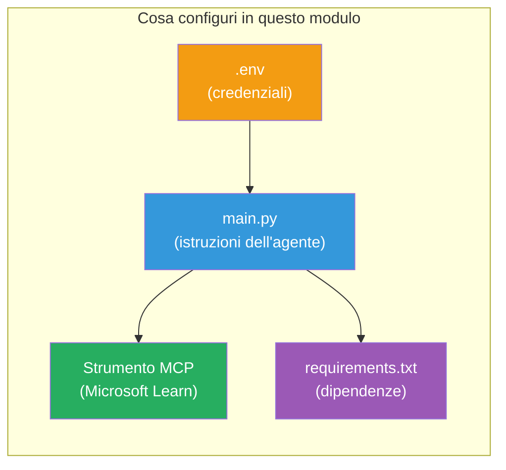

# Modulo 3 - Configurare Agenti, Strumento MCP e Ambiente

In questo modulo, personalizzi il progetto multi-agente scaffoldato. Scriverai le istruzioni per tutti e quattro gli agenti, imposterai lo strumento MCP per Microsoft Learn, configurerai le variabili d'ambiente e installerai le dipendenze.


> **Riferimento:** Il codice completo e funzionante si trova in [`PersonalCareerCopilot/main.py`](../../../../../workshop/lab02-multi-agent/PersonalCareerCopilot/main.py). Usalo come riferimento mentre costruisci il tuo.

---

## Passo 1: Configurare le variabili d'ambiente

1. Apri il file **`.env`** nella radice del tuo progetto.
2. Compila i dettagli del tuo progetto Foundry:

   ```env
   PROJECT_ENDPOINT=https://<your-account>.services.ai.azure.com/api/projects/<your-project>
   MODEL_DEPLOYMENT_NAME=gpt-4.1-mini
   ```

3. Salva il file.

### Dove trovare questi valori

| Valore | Come trovarlo |
|-------|---------------|
| **Endpoint del progetto** | Barra laterale Microsoft Foundry → clicca sul tuo progetto → URL endpoint nella vista dettaglio |
| **Nome della distribuzione del modello** | Barra laterale Foundry → espandi progetto → **Modelli + endpoint** → nome accanto al modello distribuito |

> **Sicurezza:** Non commettere mai `.env` nel controllo di versione. Aggiungilo a `.gitignore` se non è già presente.

### Mappatura delle variabili d'ambiente

Il `main.py` multi-agente legge sia nomi standard che specifici del workshop per le variabili d'ambiente:

```python
PROJECT_ENDPOINT = os.getenv("AZURE_AI_PROJECT_ENDPOINT") or os.getenv("PROJECT_ENDPOINT")
MODEL_DEPLOYMENT_NAME = os.getenv(
    "AZURE_AI_MODEL_DEPLOYMENT_NAME",
    os.getenv("MODEL_DEPLOYMENT_NAME", "gpt-4.1-mini"),
)
MICROSOFT_LEARN_MCP_ENDPOINT = os.getenv(
    "MICROSOFT_LEARN_MCP_ENDPOINT", "https://learn.microsoft.com/api/mcp"
)
```

L'endpoint MCP ha un valore predefinito sensato - non è necessario impostarlo in `.env` a meno che tu non voglia sovrascriverlo.

---

## Passo 2: Scrivere le istruzioni per gli agenti

Questo è il passo più critico. Ogni agente necessita di istruzioni accuratamente elaborate che definiscano il suo ruolo, formato di output e regole. Apri `main.py` e crea (o modifica) le costanti delle istruzioni.

### 2.1 Agente Resume Parser

```python
RESUME_PARSER_INSTRUCTIONS = """\
You are the Resume Parser.
Extract resume text into a compact, structured profile for downstream matching.

Output exactly these sections:
1) Candidate Profile
2) Technical Skills (grouped categories)
3) Soft Skills
4) Certifications & Awards
5) Domain Experience
6) Notable Achievements

Rules:
- Use only explicit or strongly implied evidence.
- Do not invent skills, titles, or experience.
- Keep concise bullets; no long paragraphs.
- If input is not a resume, return a short warning and request resume text.
"""
```

**Perché queste sezioni?** Il MatchingAgent ha bisogno di dati strutturati per effettuare il punteggio. Sezioni coerenti rendono affidabile il passaggio tra agenti.

### 2.2 Agente Job Description

```python
JOB_DESCRIPTION_INSTRUCTIONS = """\
You are the Job Description Analyst.
Extract a structured requirement profile from a JD.

Output exactly these sections:
1) Role Overview
2) Required Skills
3) Preferred Skills
4) Experience Required
5) Certifications Required
6) Education
7) Domain / Industry
8) Key Responsibilities

Rules:
- Keep required vs preferred clearly separated.
- Only use what the JD states; do not invent hidden requirements.
- Flag vague requirements briefly.
- If input is not a JD, return a short warning and request JD text.
"""
```

**Perché distinguere le richieste obbligatorie da quelle preferite?** Il MatchingAgent usa pesi diversi per ciascuna (Competenze Obbligatorie = 40 punti, Competenze Preferite = 10 punti).

### 2.3 Agente Matching

```python
MATCHING_AGENT_INSTRUCTIONS = """\
You are the Matching Agent.
Compare parsed resume output vs JD output and produce an evidence-based fit report.

Scoring (100 total):
- Required Skills 40
- Experience 25
- Certifications 15
- Preferred Skills 10
- Domain Alignment 10

Output exactly these sections:
1) Fit Score (with breakdown math)
2) Matched Skills
3) Missing Skills
4) Partially Matched
5) Experience Alignment
6) Certification Gaps
7) Overall Assessment

Rules:
- Be objective and evidence-only.
- Keep partial vs missing separate.
- Keep Missing Skills precise; it feeds roadmap planning.
"""
```

**Perché punteggio esplicito?** Un punteggio riproducibile rende possibile confrontare esecuzioni e debug. La scala su 100 punti è facile da interpretare per gli utenti finali.

### 2.4 Agente Gap Analyzer

```python
GAP_ANALYZER_INSTRUCTIONS = """\
You are the Gap Analyzer and Roadmap Planner.
Create a practical upskilling plan from the matching report.

Microsoft Learn MCP usage (required):
- For EVERY High and Medium priority gap, call tool `search_microsoft_learn_for_plan`.
- Use returned Learn links in Suggested Resources.
- Prefer Microsoft Learn for free resources.

CRITICAL: You MUST produce a SEPARATE detailed gap card for EVERY skill listed in
the Missing Skills and Certification Gaps sections of the matching report. Do NOT
skip or combine gaps. Do NOT summarize multiple gaps into one card.

Output format:
1) Personalized Learning Roadmap for [Role Title]
2) One DETAILED card per gap (produce ALL cards, not just the first):
   - Skill
   - Priority (High/Medium/Low)
   - Current Level
   - Target Level
   - Suggested Resources (include Learn URL from tool results)
   - Estimated Time
   - Quick Win Project
3) Recommended Learning Order (numbered list)
4) Timeline Summary (week-by-week)
5) Motivational Note

Rules:
- Produce every gap card before writing the summary sections.
- Keep it specific, realistic, and actionable.
- Tailor to candidate's existing stack.
- If fit >= 80, focus on polish/interview readiness.
- If fit < 40, be honest and provide a staged path.
"""
```

**Perché l’enfasi su "CRITICAL"?** Senza istruzioni esplicite per produrre TUTTE le schede gap, il modello tende a generarne solo 1-2 e a riassumere il resto. Il blocco "CRITICAL" previene questa troncatura.

---

## Passo 3: Definire lo strumento MCP

Il GapAnalyzer usa uno strumento che chiama il [server MCP Microsoft Learn](https://learn.microsoft.com/azure/foundry/agents/how-to/tools/model-context-protocol). Aggiungi questo a `main.py`:

```python
import json
from agent_framework import tool
from mcp.client.session import ClientSession
from mcp.client.streamable_http import streamable_http_client

@tool
async def search_microsoft_learn_for_plan(
    skill: str, role: str = "", max_results: int = 5
) -> str:
    """Search Microsoft Learn MCP and return curated official links for roadmap planning."""
    query = " ".join(part for part in [skill, role, "learning path module"] if part).strip()
    query = query or "job skills learning path"

    try:
        async with streamable_http_client(MICROSOFT_LEARN_MCP_ENDPOINT) as (
            read_stream, write_stream, _,
        ):
            async with ClientSession(read_stream, write_stream) as session:
                await session.initialize()
                result = await session.call_tool(
                    "microsoft_docs_search", {"query": query}
                )

        if not result.content:
            return (
                "No results returned from Microsoft Learn MCP. "
                "Fallback: https://learn.microsoft.com/training/support/catalog-api"
            )

        payload_text = getattr(result.content[0], "text", "")
        data = json.loads(payload_text) if payload_text else {}
        items = data.get("results", [])[:max(1, min(max_results, 10))]

        if not items:
            return f"No direct Microsoft Learn results found for '{skill}'."

        lines = [f"Microsoft Learn resources for '{skill}':"]
        for i, item in enumerate(items, start=1):
            title = item.get("title") or item.get("url") or "Microsoft Learn Resource"
            url = item.get("url") or item.get("link") or ""
            lines.append(f"{i}. {title} - {url}".rstrip(" -"))
        return "\n".join(lines)
    except Exception as ex:
        return (
            f"Microsoft Learn MCP lookup unavailable. Reason: {ex}. "
            "Fallbacks: https://learn.microsoft.com/api/mcp"
        )
```

### Come funziona lo strumento

| Passo | Cosa succede |
|------|-------------|
| 1 | GapAnalyzer decide di aver bisogno di risorse per una competenza (es. "Kubernetes") |
| 2 | Il framework chiama `search_microsoft_learn_for_plan(skill="Kubernetes")` |
| 3 | La funzione apre una connessione [Streamable HTTP](https://learn.microsoft.com/agent-framework/agents/tools/hosted-mcp-tools) a `https://learn.microsoft.com/api/mcp` |
| 4 | Chiama `microsoft_docs_search` sul [server MCP](https://learn.microsoft.com/azure/foundry/agents/how-to/tools/model-context-protocol) |
| 5 | Il server MCP restituisce i risultati della ricerca (titolo + URL) |
| 6 | La funzione formatta i risultati come elenco numerato |
| 7 | GapAnalyzer incorpora gli URL nella scheda gap |

### Dipendenze MCP

Le librerie client MCP sono incluse transitivamente tramite [`agent-framework-core`](https://learn.microsoft.com/agent-framework/overview/). Non devi aggiungerle separatamente a `requirements.txt`. Se ottieni errori di importazione, verifica:

```powershell
pip list | Select-String "mcp"
```

Previsto: il pacchetto `mcp` è installato (versione 1.x o superiore).

---

## Passo 4: Collegare agenti e workflow

### 4.1 Creare agenti con context manager

```python
from contextlib import asynccontextmanager

@asynccontextmanager
async def create_agents():
    async with (
        get_credential() as credential,
        AzureAIAgentClient(
            project_endpoint=PROJECT_ENDPOINT,
            model_deployment_name=MODEL_DEPLOYMENT_NAME,
            credential=credential,
        ).as_agent(
            name="ResumeParser",
            instructions=RESUME_PARSER_INSTRUCTIONS,
        ) as resume_parser,
        AzureAIAgentClient(
            project_endpoint=PROJECT_ENDPOINT,
            model_deployment_name=MODEL_DEPLOYMENT_NAME,
            credential=credential,
        ).as_agent(
            name="JobDescriptionAgent",
            instructions=JOB_DESCRIPTION_INSTRUCTIONS,
        ) as jd_agent,
        AzureAIAgentClient(
            project_endpoint=PROJECT_ENDPOINT,
            model_deployment_name=MODEL_DEPLOYMENT_NAME,
            credential=credential,
        ).as_agent(
            name="MatchingAgent",
            instructions=MATCHING_AGENT_INSTRUCTIONS,
        ) as matching_agent,
        AzureAIAgentClient(
            project_endpoint=PROJECT_ENDPOINT,
            model_deployment_name=MODEL_DEPLOYMENT_NAME,
            credential=credential,
        ).as_agent(
            name="GapAnalyzer",
            instructions=GAP_ANALYZER_INSTRUCTIONS,
            tools=[search_microsoft_learn_for_plan],
        ) as gap_analyzer,
    ):
        yield resume_parser, jd_agent, matching_agent, gap_analyzer
```

**Punti chiave:**
- Ogni agente ha una propria istanza `AzureAIAgentClient`
- Solo GapAnalyzer riceve `tools=[search_microsoft_learn_for_plan]`
- `get_credential()` restituisce [`ManagedIdentityCredential`](https://learn.microsoft.com/python/api/overview/azure/identity-readme#managed-identity-support) in Azure, [`DefaultAzureCredential`](https://learn.microsoft.com/azure/developer/python/sdk/authentication/credential-chains#defaultazurecredential-overview) localmente

### 4.2 Costruire il grafo del workflow

```python
def create_workflow(resume_parser, jd_agent, matching_agent, gap_analyzer):
    workflow = (
        WorkflowBuilder(
            name="ResumeJobFitEvaluator",
            start_executor=resume_parser,
            output_executors=[gap_analyzer],
        )
        .add_edge(resume_parser, jd_agent)
        .add_edge(resume_parser, matching_agent)
        .add_edge(jd_agent, matching_agent)
        .add_edge(matching_agent, gap_analyzer)
        .build()
    )
    return workflow.as_agent()
```

> Consulta [Workflows come Agenti](https://learn.microsoft.com/agent-framework/workflows/as-agents) per comprendere il pattern `.as_agent()`.

### 4.3 Avviare il server

```python
async def main() -> None:
    validate_configuration()
    async with create_agents() as (resume_parser, jd_agent, matching_agent, gap_analyzer):
        agent = create_workflow(resume_parser, jd_agent, matching_agent, gap_analyzer)
        from azure.ai.agentserver.agentframework import from_agent_framework
        await from_agent_framework(agent).run_async()

if __name__ == "__main__":
    asyncio.run(main())
```

---

## Passo 5: Creare e attivare l'ambiente virtuale

### 5.1 Creare l'ambiente

```powershell
cd workshop\lab02-multi-agent\PersonalCareerCopilot
python -m venv .venv
```

### 5.2 Attivarlo

**PowerShell (Windows):**
```powershell
.\.venv\Scripts\Activate.ps1
```

**macOS/Linux:**
```bash
source .venv/bin/activate
```

### 5.3 Installare le dipendenze

```powershell
pip install -r requirements.txt
```

> **Nota:** La riga `agent-dev-cli --pre` in `requirements.txt` garantisce che venga installata l'ultima versione preview. Questo è necessario per la compatibilità con `agent-framework-core==1.0.0rc3`.

### 5.4 Verificare l'installazione

```powershell
pip list | Select-String "agent-framework|agentserver|agent-dev"
```

Output previsto:
```
agent-dev-cli                  0.0.1b260316
agent-framework-azure-ai       1.0.0rc3
agent-framework-core            1.0.0rc3
azure-ai-agentserver-agentframework 1.0.0b16
azure-ai-agentserver-core      1.0.0b16
```

> **Se `agent-dev-cli` mostra una versione più vecchia** (es. `0.0.1b260119`), l’Agent Inspector fallirà con errori 403/404. Aggiorna: `pip install agent-dev-cli --pre --upgrade`

---

## Passo 6: Verificare l'autenticazione

Esegui lo stesso controllo di autenticazione del Laboratorio 01:

```powershell
az account show --query "{name:name, id:id}" --output table
```

Se questo fallisce, esegui [`az login`](https://learn.microsoft.com/cli/azure/authenticate-azure-cli-interactively).

Per i workflow multi-agente, tutti e quattro gli agenti condividono la stessa credenziale. Se l'autenticazione funziona per uno, funziona per tutti.

---

### Checkpoint

- [ ] `.env` contiene valori validi per `PROJECT_ENDPOINT` e `MODEL_DEPLOYMENT_NAME`
- [ ] Tutte e 4 le costanti di istruzione degli agenti sono definite in `main.py` (ResumeParser, Agente JD, MatchingAgent, GapAnalyzer)
- [ ] Lo strumento MCP `search_microsoft_learn_for_plan` è definito e registrato con GapAnalyzer
- [ ] `create_agents()` crea tutti e 4 gli agenti con istanze individuali di `AzureAIAgentClient`
- [ ] `create_workflow()` costruisce il grafo corretto con `WorkflowBuilder`
- [ ] L'ambiente virtuale è creato e attivato (si vede `(.venv)`)
- [ ] `pip install -r requirements.txt` si completa senza errori
- [ ] `pip list` mostra tutti i pacchetti previsti alle versioni corrette (rc3 / b16)
- [ ] `az account show` restituisce il tuo abbonamento

---

**Precedente:** [02 - Scaffold Multi-Agent Project](02-scaffold-multi-agent.md) · **Successivo:** [04 - Orchestration Patterns →](04-orchestration-patterns.md)

---

<!-- CO-OP TRANSLATOR DISCLAIMER START -->
**Disclaimer**:
Questo documento è stato tradotto utilizzando il servizio di traduzione AI [Co-op Translator](https://github.com/Azure/co-op-translator). Sebbene ci impegniamo per garantire l'accuratezza, si prega di notare che le traduzioni automatiche possono contenere errori o imprecisioni. Il documento originale nella sua lingua madre deve essere considerato la fonte autorevole. Per informazioni critiche, si consiglia una traduzione professionale umana. Non siamo responsabili per eventuali malintesi o interpretazioni errate derivanti dall'uso di questa traduzione.
<!-- CO-OP TRANSLATOR DISCLAIMER END -->