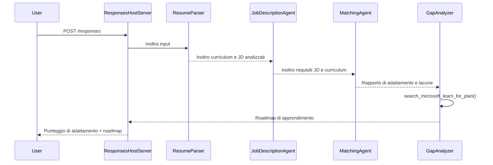

# Modulo 3 - Configurare Istruzioni, Ambiente e Installare Dipendenze

⏱️ ~15 min

In questo modulo, trasformerai il modello scheletro in **tuo** flusso di lavoro multi-agente - impostando variabili d'ambiente, scrivendo le istruzioni per gli agenti, aggiungendo lo strumento MCP, collegando il grafo del flusso di lavoro e installando le dipendenze.

> **Riferimento:** Il codice completo funzionante è in [`PersonalCareerCopilot/main.py`](../../../../../workshop/lab02-multi-agent/PersonalCareerCopilot/main.py). Usalo come riferimento mentre costruisci il tuo grafo di flusso di lavoro e i blocchi di prompt.

---

## Come si integrano i quattro agenti


```mermaid
sequenceDiagram
    participant User
    participant Server as ResponsesHostServer
    participant RP as ResumeParser
    participant JD as JobDescriptionAgent
    participant MA as MatchingAgent
    participant GA as GapAnalyzer

    User->>Server: POST /responses
    Server->>RP: Inoltra input
    RP-->>JD: Inoltro curriculum e JD analizzati
    JD-->>MA: Inoltro requisiti JD e curriculum
    MA-->>GA: Rapporto di adattamento e lacune
    GA->>GA: search_microsoft_learn_for_plan()
    GA-->>Server: Roadmap di apprendimento
    Server-->>User: Punteggio di adattamento + roadmap
```

---

## Passo 1: Configurare variabili d'ambiente

1. Apri il file **`.env`** nella radice del progetto (creato dal wizard di scaffold).
2. Sostituisci i segnaposto con i tuoi valori reali dal Lab 01.

<details open>
<summary><strong>🅰️ Percorso A - Abbonamento Foundry</strong></summary>

```env
FOUNDRY_PROJECT_ENDPOINT=https://<your-account>.services.ai.azure.com/api/projects/<your-project>
AZURE_AI_MODEL_DEPLOYMENT_NAME=gpt-4.1-mini
```

> **Dove trovare i valori:** Vedi [Lab 01, Modulo 1](../../lab01-single-agent/docs/01-setup.md#deploy-a-model--assign-rbac).

</details>

<details open>
<summary><strong>🅱️ Percorso B - Foundry Locale</strong></summary>

```env
FOUNDRY_PROJECT_ENDPOINT=http://localhost:5273/v1
AZURE_AI_MODEL_DEPLOYMENT_NAME=phi-4-mini
```

> Tutta l'inferenza avviene sulla tua macchina - nessun dato lascia il tuo dispositivo. Esegui `foundry model list` per confermare l'alias esatto del modello. L'unica richiesta in uscita è la chiamata dello strumento MCP a `https://learn.microsoft.com/api/mcp`.

> **Dove trovare i valori:** Vedi [Lab 01, Modulo 1 - percorso locale](../../lab01-single-agent/docs/01-setup.md#step-2-set-up-based-on-your-access).

</details>

> **Sicurezza:** Non caricare mai il file `.env` nel controllo versione. Dovrebbe già essere incluso in `.gitignore`.

---

## Passo 2: Scrivere le istruzioni per gli agenti

Le istruzioni definiscono il ruolo di ciascun agente, il formato dell'output e le regole. Apri `main.py` e definisci (o sostituisci) le quattro costanti di istruzioni - le stringhe complete sono in [`PersonalCareerCopilot/main.py`](../../../../../workshop/lab02-multi-agent/PersonalCareerCopilot/main.py).

### 2.1 `RESUME_PARSER_INSTRUCTIONS`
Analizza il curriculum in un profilo candidato strutturato **e** copia la descrizione del lavoro parola per parola in `[JOB DESCRIPTION PASS-THROUGH]`. Entrambe le sezioni etichettate devono comparire nell'output.

> **Perché il pass-through?** Con `context_mode="last_agent"`, ResumeParser è l'**unico** agente che vede il messaggio originale dell'utente. Se non copia la JD in avanti, gli agenti a valle non la vedono mai.

### 2.2 `JOB_DESCRIPTION_INSTRUCTIONS`
Legge `[PARSED RESUME]` e `[JOB DESCRIPTION PASS-THROUGH]` dall'output di ResumeParser. Produce `[JD REQUIREMENTS]` (requisiti strutturati) e `[PARSED RESUME PASS-THROUGH]` (copia verbatim del curriculum per MatchingAgent).

### 2.3 `MATCHING_AGENT_INSTRUCTIONS`
Legge `[JD REQUIREMENTS]` e `[PARSED RESUME PASS-THROUGH]`. Produce un rapporto di adattamento con punteggio (0–100) con dettagli matematici, competenze abbinate, competenze mancanti e allineamento dell'esperienza.

### 2.4 `GAP_ANALYZER_INSTRUCTIONS`
Legge il rapporto di adattamento. Per **ogni** competenza mancante, chiama `search_microsoft_learn_for_plan` per recuperare risorse di Microsoft Learn. Produce una scheda dettagliata del gap per competenza più un piano di apprendimento settimanale.

---

## Passo 3: Aggiungere lo strumento MCP

Il GapAnalyzer chiama il [server MCP di Microsoft Learn](https://learn.microsoft.com/azure/foundry/agents/how-to/tools/model-context-protocol) per recuperare risorse di apprendimento reali per ogni gap di competenza. La funzione completa `search_microsoft_learn_for_plan` si trova in [`PersonalCareerCopilot/main.py`](../../../../../workshop/lab02-multi-agent/PersonalCareerCopilot/main.py).

Registra lo strumento sul GapAnalyzer quando crei l'agente:

```python
gap_analyzer = Agent(
    client=client,
    instructions=GAP_ANALYZER_INSTRUCTIONS,
    name="GapAnalyzer",
    tools=[search_microsoft_learn_for_plan],
)
```

> Vedi [`PersonalCareerCopilot/main.py`](../../../../../workshop/lab02-multi-agent/PersonalCareerCopilot/main.py) per il grafo completo `WorkflowBuilder` con `FoundryChatClient`, `AgentExecutor` e tutte le chiamate `add_edge()`.

---

## Passo 4: Creare ambiente virtuale e installare dipendenze

> ⚠️ **Non saltare questo passaggio.** Senza le dipendenze installate, il debug con F5 fallirà.

### 4.1 Creare l'ambiente virtuale

```powershell
python -m venv .venv
```

### 4.2 Attivarlo

| OS | Comando |
|----|---------|
| **Windows (PowerShell)** | `.\.venv\Scripts\Activate.ps1` |
| **Windows (CMD)** | `.venv\Scripts\activate.bat` |
| **macOS / Linux** | `source .venv/bin/activate` |

Dovresti vedere `(.venv)` nel prompt del terminale.

### 4.3 Installare le dipendenze

```powershell
pip install -r requirements.txt
```

### 4.4 Verificare

```powershell
pip list | Select-String "agent-framework|mcp|debugpy"
```

Previsto: `agent-framework-foundry`, `agent-framework-foundry-hosting`, `mcp` e `debugpy` sono elencati.

---

## Passo 5: Verificare l'autenticazione

<details open>
<summary><strong>🅰️ Percorso A - Credenziali Azure</strong></summary>

```powershell
az account show --query "{name:name, id:id}" --output table
```

Se fallisce, esegui [`az login`](https://learn.microsoft.com/cli/azure/authenticate-azure-cli-interactively).

Tutti e quattro gli agenti condividono un `FoundryChatClient` e un `DefaultAzureCredential`. Se l'autenticazione funziona per uno, funziona per tutti.

</details>

<details open>
<summary><strong>🅱️ Percorso B - Foundry Locale</strong></summary>

Nessuna autenticazione richiesta per i test locali.

</details>

---

### ✅ Punto di controllo

> Non procedere al Modulo 04 fino a quando: **(1)** `(.venv)` è visibile nel tuo prompt E **(2)** `pip install -r requirements.txt` è completato con successo.

- [ ] `.env` ha endpoint valido e nome di deployment modello (non segnaposto)
- [ ] Tutte e 4 le costanti di istruzioni degli agenti definite in `main.py` (ResumeParser, JD Agent, MatchingAgent, GapAnalyzer)
- [ ] `search_microsoft_learn_for_plan` strumento MCP definito e registrato su GapAnalyzer
- [ ] `FoundryChatClient` + 4 `Agent` + 4 `AgentExecutor` creati in `main()`
- [ ] `WorkflowBuilder` costruisce il corretto grafo sequenziale con tutte e 3 le chiamate `add_edge()`
- [ ] Ambiente virtuale creato e attivato (`(.venv)` visibile nel prompt)
- [ ] `pip install -r requirements.txt` completato senza errori
- [ ] **Percorso A:** `az account show` eseguito con successo OPPURE l'icona Account di VS Code mostra account connesso

---

**Precedente:** [02 - Scaffold Multi-Agent Project](02-scaffold-multi-agent.md) · **Successivo:** [04 - Orchestration Patterns →](04-orchestration-patterns.md)

---

<!-- CO-OP TRANSLATOR DISCLAIMER START -->
**Disclaimer**:
Questo documento è stato tradotto utilizzando il servizio di traduzione AI [Co-op Translator](https://github.com/Azure/co-op-translator). Sebbene ci impegniamo per garantire la precisione, si prega di notare che le traduzioni automatizzate possono contenere errori o imprecisioni. Il documento originale nella sua lingua nativa deve essere considerato la fonte autorevole. Per informazioni critiche, si raccomanda una traduzione professionale effettuata da un essere umano. Non siamo responsabili per eventuali malintesi o interpretazioni errate derivanti dall’uso di questa traduzione.
<!-- CO-OP TRANSLATOR DISCLAIMER END -->