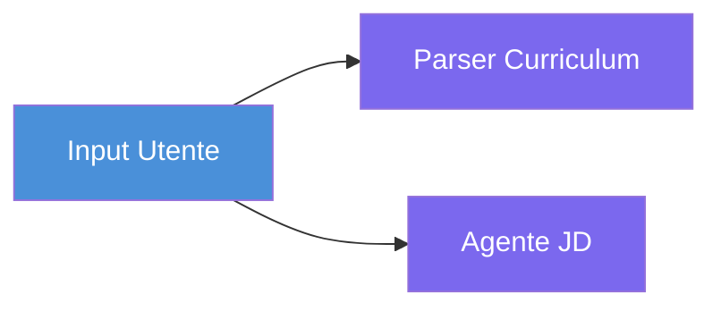
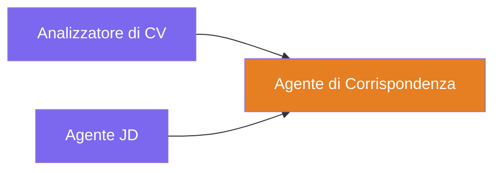
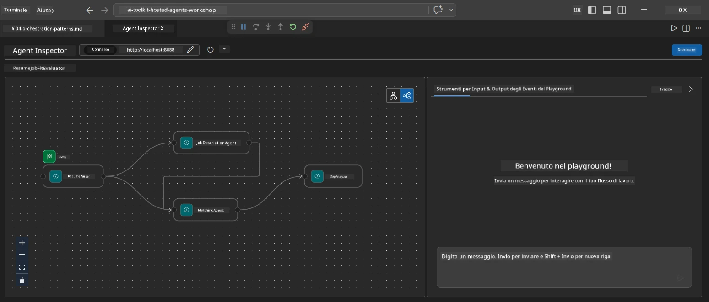
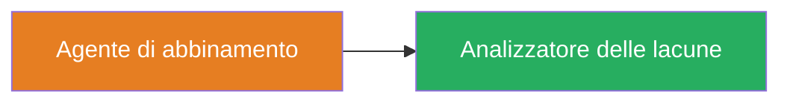
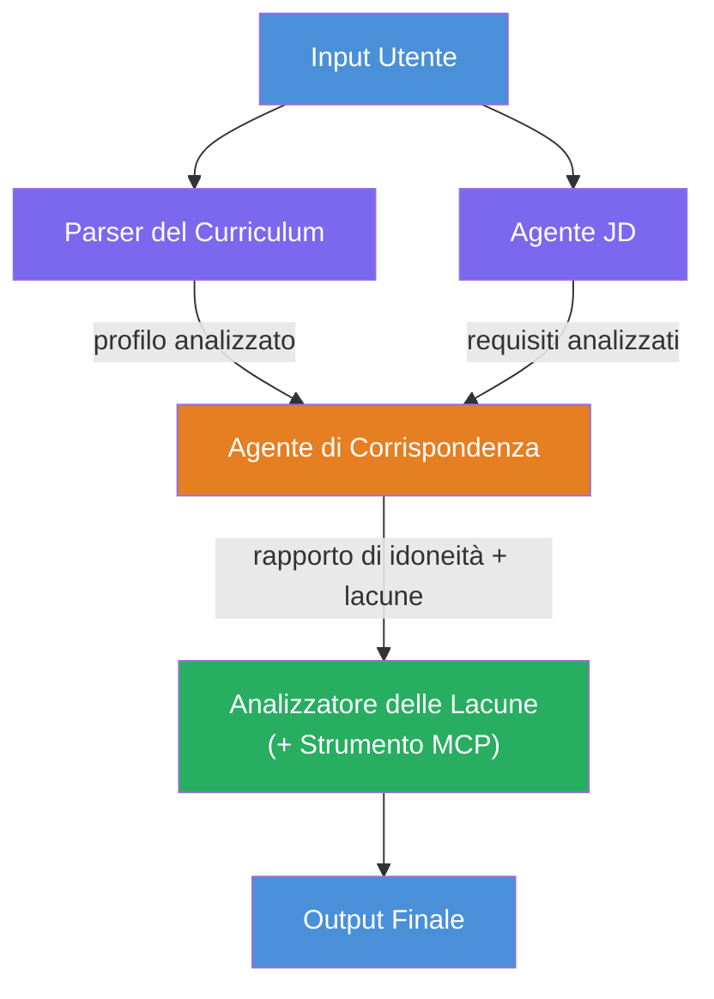
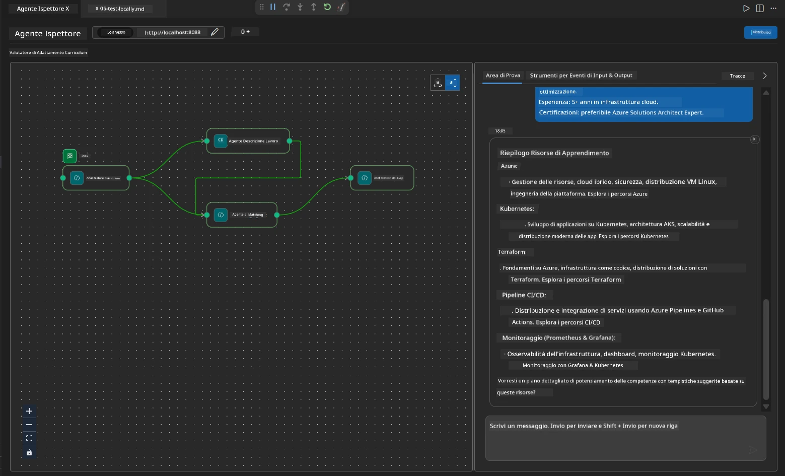

# Modulo 4 - Schemi di Orchestrazione

In questo modulo, esplori gli schemi di orchestrazione utilizzati nel Resume Job Fit Evaluator e impari a leggere, modificare ed estendere il grafo del workflow. Comprendere questi schemi è essenziale per il debug dei problemi di flusso dati e per costruire i tuoi [workflow multi-agente](https://learn.microsoft.com/agent-framework/workflows/).

---

## Schema 1: Fan-out (divisione parallela)

Il primo schema nel workflow è il **fan-out** - un singolo input viene inviato a più agenti contemporaneamente.


Nel codice, questo avviene perché `resume_parser` è il `start_executor` - riceve per primo il messaggio dell'utente. Poi, poiché sia `jd_agent` che `matching_agent` hanno archi da `resume_parser`, il framework instrada l'output di `resume_parser` a entrambi gli agenti:

```python
.add_edge(resume_parser, jd_agent)         # Output di ResumeParser → Agente JD
.add_edge(resume_parser, matching_agent)   # Output di ResumeParser → Agente di Corrispondenza
```

**Perché funziona:** ResumeParser e JD Agent elaborano aspetti diversi dello stesso input. Eseguirli in parallelo riduce la latenza totale rispetto all'eseguirli in sequenza.

### Quando usare il fan-out

| Caso d'uso | Esempio |
|----------|---------|
| Sottocompiti indipendenti | Parsing del curriculum vs. parsing della JD |
| Ridondanza / voto | Due agenti analizzano gli stessi dati, un terzo sceglie la miglior risposta |
| Output multi-formato | Un agente genera testo, un altro genera JSON strutturato |

---

## Schema 2: Fan-in (aggregazione)

Il secondo schema è il **fan-in** - molteplici output di agenti vengono raccolti e inviati a un singolo agente a valle.


Nel codice:

```python
.add_edge(resume_parser, matching_agent)   # Output ResumeParser → MatchingAgent
.add_edge(jd_agent, matching_agent)        # Output JD Agent → MatchingAgent
```

**Comportamento chiave:** Quando un agente ha **due o più archi in ingresso**, il framework aspetta automaticamente che **tutti** gli agenti a monte terminino prima di eseguire l'agente a valle. MatchingAgent non parte finché sia ResumeParser che JD Agent non hanno completato.

### Cosa riceve MatchingAgent

Il framework concatena gli output di tutti gli agenti a monte. L'input di MatchingAgent appare così:

```
[ResumeParser output]
---
Candidate Profile:
  Name: Jane Doe
  Technical Skills: Python, Azure, Kubernetes, ...
  ...

[JobDescriptionAgent output]
---
Role Overview: Senior Cloud Engineer
Required Skills: Python, Azure, Terraform, ...
...
```

> **Nota:** Il formato esatto della concatenazione dipende dalla versione del framework. Le istruzioni dell'agente devono essere scritte per gestire sia output strutturati sia non strutturati a monte.



---

## Schema 3: Catena sequenziale

Il terzo schema è la **catena sequenziale** - l'output di un agente alimenta direttamente il successivo.


Nel codice:

```python
.add_edge(matching_agent, gap_analyzer)    # Output MatchingAgent → GapAnalyzer
```

Questo è lo schema più semplice. GapAnalyzer riceve il punteggio di fit, le competenze abbinate/mancanti e i gap da MatchingAgent. Chiama poi lo [strumento MCP](https://learn.microsoft.com/azure/foundry/agents/how-to/tools/model-context-protocol) per ogni gap per recuperare risorse Microsoft Learn.

---

## Il grafo completo

Combinando tutti e tre gli schemi si produce il workflow completo:


### Cronologia di esecuzione

```mermaid
gantt
    title Cronologia Esecuzione Agente
    dateFormat X
    axisFormat %s

    section Parallelo
    Resume Parser       :rp, 0, 3
    JD Agent            :jd, 0, 2

    section Sequenziale
    Matching Agent      :ma, 3, 5
    Gap Analyzer        :ga, 5, 9
```


> Il tempo totale di esecuzione è approssimativamente `max(ResumeParser, JD Agent) + MatchingAgent + GapAnalyzer`. GapAnalyzer è tipicamente il più lento perché esegue molteplici chiamate allo strumento MCP (una per ogni gap).

---

## Lettura del codice WorkflowBuilder

Ecco la funzione completa `create_workflow()` da `main.py`, annotata:

```python
def create_workflow(resume_parser, jd_agent, matching_agent, gap_analyzer):
    workflow = (
        WorkflowBuilder(
            name="ResumeJobFitEvaluator",

            # Il primo agente a ricevere l'input dell'utente
            start_executor=resume_parser,

            # L'agente/i la cui uscita diventa la risposta finale
            output_executors=[gap_analyzer],
        )
        # Distribuzione: l'output di ResumeParser va sia a JD Agent che a MatchingAgent
        .add_edge(resume_parser, jd_agent)
        .add_edge(resume_parser, matching_agent)

        # Raccolta: MatchingAgent attende sia ResumeParser che JD Agent
        .add_edge(jd_agent, matching_agent)

        # Sequenziale: l'output di MatchingAgent alimenta GapAnalyzer
        .add_edge(matching_agent, gap_analyzer)

        .build()
    )
    return workflow.as_agent()
```

### Tabella di riepilogo degli archi

| # | Arco | Schema | Effetto |
|---|------|---------|--------|
| 1 | `resume_parser → jd_agent` | Fan-out | JD Agent riceve l'output di ResumeParser (più l'input utente originale) |
| 2 | `resume_parser → matching_agent` | Fan-out | MatchingAgent riceve l'output di ResumeParser |
| 3 | `jd_agent → matching_agent` | Fan-in | MatchingAgent riceve anche l'output di JD Agent (attende entrambi) |
| 4 | `matching_agent → gap_analyzer` | Sequenziale | GapAnalyzer riceve il report di fit + lista dei gap |

---

## Modifica del grafo

### Aggiunta di un nuovo agente

Per aggiungere un quinto agente (ad esempio un **InterviewPrepAgent** che genera domande di colloquio basate sull'analisi dei gap):

```python
# 1. Definire le istruzioni
INTERVIEW_PREP_INSTRUCTIONS = """\
You are the Interview Prep Agent.
Given a gap analysis and fit report, generate 10 targeted interview questions
the candidate should prepare for.
"""

# 2. Creare l'agente (all'interno del blocco async with)
AzureAIAgentClient(
    project_endpoint=PROJECT_ENDPOINT,
    model_deployment_name=MODEL_DEPLOYMENT_NAME,
    credential=credential,
).as_agent(
    name="InterviewPrepAgent",
    instructions=INTERVIEW_PREP_INSTRUCTIONS,
) as interview_prep,

# 3. Aggiungere archi in create_workflow()
.add_edge(matching_agent, interview_prep)   # riceve il rapporto di adattamento
.add_edge(gap_analyzer, interview_prep)     # riceve anche le carte gap

# 4. Aggiornare output_executors
output_executors=[interview_prep],  # ora l'agente finale
```

### Cambiare l'ordine di esecuzione

Per far eseguire JD Agent **dopo** ResumeParser (sequenziale invece che parallelo):

```python
# Rimuovere: .add_edge(resume_parser, jd_agent) ← esiste già, mantenerlo
# Rimuovere il parallelismo implicito NON facendo ricevere direttamente l'input utente a jd_agent
# Lo start_executor invia prima a resume_parser, e jd_agent riceve solo
# l'output di resume_parser tramite il collegamento. Questo li rende sequenziali.
```

> **Importante:** il `start_executor` è l'unico agente che riceve l'input utente grezzo. Tutti gli altri agenti ricevono l'output dai loro archi a monte. Se vuoi che un agente riceva anche l'input utente grezzo, deve avere un arco dal `start_executor`.

---

## Errori comuni nel grafo

| Errore | Sintomo | Correzione |
|---------|---------|-----|
| Arco mancante verso `output_executors` | L'agente gira ma l'output è vuoto | Assicurarsi che ci sia un percorso dal `start_executor` a ogni agente in `output_executors` |
| Dipendenza circolare | Loop infinito o timeout | Verificare che nessun agente alimenti un agente a monte |
| Agente in `output_executors` senza arco in ingresso | Output vuoto | Aggiungere almeno un `add_edge(source, that_agent)` |
| Molti `output_executors` senza fan-in | L'output contiene solo la risposta di un agente | Usare un singolo agente di output che aggrega, o accettare output multipli |
| Mancanza di `start_executor` | `ValueError` in fase di build | Specificare sempre `start_executor` in `WorkflowBuilder()` |

---

## Debug del grafo

### Usare Agent Inspector

1. Avvia l'agente localmente (F5 o terminale - vedi [Modulo 5](05-test-locally.md)).
2. Apri Agent Inspector (`Ctrl+Shift+P` → **Foundry Toolkit: Open Agent Inspector**).
3. Invia un messaggio di prova.
4. Nel pannello di risposta dell'Inspector, cerca il **streaming output** - mostra il contributo di ogni agente in sequenza.



### Usare il logging

Aggiungi logging a `main.py` per tracciare il flusso dati:

```python
import logging
logger = logging.getLogger("resume-job-fit")

# In create_workflow(), dopo la creazione:
logger.info("Workflow graph built with edges: RP→JD, RP→MA, JD→MA, MA→GA")
```

I log del server mostrano l’ordine di esecuzione degli agenti e le chiamate allo strumento MCP:

```
INFO:resume-job-fit:Starting Resume -> Job Fit Evaluator HTTP server...
INFO:resume-job-fit:Server running on http://localhost:8088
INFO:agent_framework:Executing agent: ResumeParser
INFO:agent_framework:Executing agent: JobDescriptionAgent
INFO:agent_framework:Waiting for upstream agents: ResumeParser, JobDescriptionAgent
INFO:agent_framework:Executing agent: MatchingAgent
INFO:agent_framework:Executing agent: GapAnalyzer
INFO:agent_framework:Tool call: search_microsoft_learn_for_plan(skill="Kubernetes")
POST https://learn.microsoft.com/api/mcp → 200
INFO:agent_framework:Tool call: search_microsoft_learn_for_plan(skill="Terraform")
POST https://learn.microsoft.com/api/mcp → 200
```

---

### Checkpoint

- [ ] Riesci a identificare i tre schemi di orchestrazione nel workflow: fan-out, fan-in e catena sequenziale
- [ ] Comprendi che gli agenti con più archi in ingresso aspettano che tutti gli agenti a monte abbiano terminato
- [ ] Puoi leggere il codice `WorkflowBuilder` e mappare ogni chiamata `add_edge()` sul grafo visivo
- [ ] Comprendi la cronologia di esecuzione: prima gli agenti paralleli, poi l’aggregazione, quindi la sequenza
- [ ] Sai come aggiungere un nuovo agente al grafo (definire istruzioni, creare agente, aggiungere archi, aggiornare output)
- [ ] Puoi identificare errori comuni nel grafo e i loro sintomi

---

**Precedente:** [03 - Configurare Agenti & Ambiente](03-configure-agents.md) · **Successivo:** [05 - Test Locale →](05-test-locally.md)

---

<!-- CO-OP TRANSLATOR DISCLAIMER START -->
**Disclaimer**:  
Questo documento è stato tradotto utilizzando il servizio di traduzione AI [Co-op Translator](https://github.com/Azure/co-op-translator). Pur impegnandoci per l’accuratezza, si prega di considerare che le traduzioni automatiche possono contenere errori o imprecisioni. Il documento originale nella lingua nativa deve essere considerato la fonte autorevole. Per informazioni critiche, si raccomanda una traduzione professionale umana. Non siamo responsabili per eventuali malintesi o interpretazioni errate derivanti dall’uso di questa traduzione.
<!-- CO-OP TRANSLATOR DISCLAIMER END -->