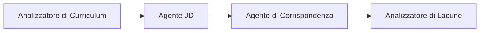
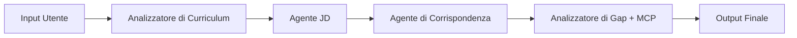

# Modulo 4 - Pattern di Orchestrazione

⏱️ ~10 min

In questo modulo, esplorerai i pattern di orchestrazione utilizzati nel Resume Job Fit Evaluator e imparerai come leggere, modificare ed estendere il grafo del workflow. Comprendere questi pattern è essenziale per il debugging dei problemi di flusso dati e per costruire i tuoi [workflow multi-agente](https://learn.microsoft.com/agent-framework/workflows/).

---

## Pattern 1: Catena sequenziale

Il pattern fondamentale nel workflow è una **catena sequenziale** - l'output di ogni agente alimenta direttamente il successivo.


```mermaid
flowchart LR
    RP[Analizzatore di Curriculum] --> JD[Agente JD]
    JD --> MA[Agente di Corrispondenza]
    MA --> GA[Analizzatore di Lacune]
```

Nel codice, ogni chiamata `add_edge()` crea un passaggio nella catena:

```python
.add_edge(resume_executor, jd_executor)       # Output di ResumeParser → Agente JD
.add_edge(jd_executor, matching_executor)     # Output di Agente JD → MatchingAgent
.add_edge(matching_executor, gap_executor)    # Output di MatchingAgent → GapAnalyzer
```

> **Perché sequenziale, non fan-out/fan-in?** `WorkflowBuilder` usa **semantica OR** per gli edge in ingresso: un esecutore a valle si attiva non appena **qualsiasi** predecessore termina. Se `matching_executor` avesse due edge in ingresso (sia da `resume_executor` che da `jd_executor`), si attiverebbe due volte - una volta al termine di ResumeParser e un'altra al termine di JD Agent - causando l'esecuzione doppia di GapAnalyzer e la comparsa doppia dell'output. La pipeline sequenziale evita del tutto questo.

## Pattern 2: Trasmissione del contenuto

Poiché `context_mode="last_agent"` significa che ogni esecutore vede solo l'**output del predecessore diretto**, gli agenti in una catena sequenziale devono esplicitamente trasmettere in avanti i dati necessari agli agenti downstream.

In questo workflow:
- **ResumeParser** copia il JD parola per parola in `[JOB DESCRIPTION PASS-THROUGH]` (così JD Agent può trovarlo).
- **JD Agent** copia il `[PARSED RESUME]` parola per parola in `[PARSED RESUME PASS-THROUGH]` (così MatchingAgent può confrontare entrambi i profili).

```
ResumeParser output
└─ [PARSED RESUME]               ← extracted by JD Agent
└─ [JOB DESCRIPTION PASS-THROUGH] ← extracted by JD Agent

JD Agent output
└─ [JD REQUIREMENTS]             ← extracted by MatchingAgent
└─ [PARSED RESUME PASS-THROUGH]  ← extracted by MatchingAgent
```

Ogni sezione di trasmissione deve essere copiata **testualmente** - riassumerla o parafrasarla danneggia l'agente a valle che ne dipende.

---

## Il grafo completo

Combinando i pattern di catena sequenziale e trasmissione di contenuto si ottiene il workflow completo:


```mermaid
flowchart LR
    U[Input Utente] --> RP[Analizzatore di Curriculum]
    RP --> JD[Agente JD]
    JD --> MA[Agente di Corrispondenza]
    MA --> GA[Analizzatore di Gap + MCP]
    GA --> O[Output Finale]
```

L'Agent Inspector mostra questa stessa struttura del grafo quando l'agente è in esecuzione locale. Consulta [Modulo 5 - Test Locale](05-test-locally.md) per schermate.

---

## Lettura del codice WorkflowBuilder

La funzione completa `create_workflow()` è in [`PersonalCareerCopilot/main.py`](../../../../../workshop/lab02-multi-agent/PersonalCareerCopilot/main.py). Le tre chiamate `add_edge()` costruiscono la pipeline sequenziale:

| # | Edge | Effetto |
|---|------|--------|
| 1 | `resume_executor → jd_executor` | JD Agent riceve `[PARSED RESUME]` + `[JOB DESCRIPTION PASS-THROUGH]` |
| 2 | `jd_executor → matching_executor` | MatchingAgent riceve `[JD REQUIREMENTS]` + `[PARSED RESUME PASS-THROUGH]` |
| 3 | `matching_executor → gap_executor` | GapAnalyzer riceve report di fit + lista gap |

---

## Modifica del grafo

### Aggiunta di un nuovo agente

Per aggiungere un quinto agente (es. un **InterviewPrepAgent** dopo GapAnalyzer):

1. Definisci una costante `INTERVIEW_PREP_INSTRUCTIONS`.
2. Crea gli oggetti `Agent` + `AgentExecutor` (stesso schema dei quattro esistenti).
3. Aggiungi `.add_edge(gap_executor, interview_exec)` in `WorkflowBuilder`.
4. Aggiorna `output_executors=[interview_exec]`.

> **Importante:** `start_executor` è l'unico agente che riceve l'input utente grezzo. Tutti gli altri agenti ricevono l'output dal loro edge a monte.

---

## Errori comuni nel grafo

| Errore | Sintomo | Correzione |
|---------|---------|-----|
| Edge mancante verso `output_executors` | L'agente gira ma l'output è vuoto | Assicurarsi che esista un percorso da `start_executor` a ogni agente in `output_executors` |
| Dipendenza circolare | Loop infinito o timeout | Controllare che nessun agente alimenti un agente a monte |
| Agente in `output_executors` senza edge in ingresso | Output vuoto | Aggiungere almeno un `add_edge(source, that_agent)` |
| Molti `output_executors` senza fan-in | L'output contiene solo la risposta di un agente | Usare un singolo agente di output che aggrega, oppure accettare molteplici output |
| `start_executor` mancante | `ValueError` in fase di build | Specificare sempre `start_executor` in `WorkflowBuilder()` |

---

## Debug del grafo

### Uso di Agent Inspector

1. Avvia l'agente localmente con F5.
2. Apri Agent Inspector (`Ctrl+Shift+P` → **Foundry Toolkit: Open Agent Inspector**).
3. Invia un messaggio di test.
4. Nel pannello di risposta dell’Inspector cerca l'**output in streaming** - mostra il contributo di ogni agente in sequenza.


### Uso del logging

Aggiungi logging in `main.py` per tracciare il flusso dei dati:

```python
import logging
logger = logging.getLogger("resume-job-fit")

# In main(), dopo aver creato il flusso di lavoro:
logger.info("Workflow graph built with edges: RP→JD, JD→MA, MA→GA")
```

I log del server mostrano l'ordine di esecuzione degli agenti e le chiamate agli strumenti MCP:

```
INFO:agent_framework:Executing agent: ResumeParser
INFO:agent_framework:Executing agent: JobDescriptionAgent
INFO:agent_framework:Executing agent: MatchingAgent
INFO:agent_framework:Executing agent: GapAnalyzer
INFO:agent_framework:Tool call: search_microsoft_learn_for_plan(skill="Kubernetes")
POST https://learn.microsoft.com/api/mcp → 200
INFO:agent_framework:Tool call: search_microsoft_learn_for_plan(skill="Terraform")
POST https://learn.microsoft.com/api/mcp → 200
```

---

### Checkpoint

- [ ] Riesci a identificare i due pattern di orchestrazione nel workflow: catena sequenziale e trasmissione del contenuto
- [ ] Comprendi perché `context_mode="last_agent"` richiede la trasmissione esplicita dei dati tra agenti
- [ ] Sai leggere il codice `WorkflowBuilder` e associare ogni chiamata `add_edge()` al grafo visivo
- [ ] Sai come aggiungere un nuovo agente alla fine della pipeline
- [ ] Riesci a identificare errori comuni nel grafo e i loro sintomi

---

**Precedente:** [03 - Configura Agenti & Ambiente](03-configure-agents.md) · **Successivo:** [05 - Test Locale →](05-test-locally.md)

---

<!-- CO-OP TRANSLATOR DISCLAIMER START -->
**Disclaimer**:
Questo documento è stato tradotto utilizzando il servizio di traduzione AI [Co-op Translator](https://github.com/Azure/co-op-translator). Sebbene ci impegniamo per garantire la precisione, si prega di notare che le traduzioni automatizzate possono contenere errori o imprecisioni. Il documento originale nella sua lingua nativa deve essere considerato la fonte autorevole. Per informazioni critiche, si raccomanda una traduzione professionale effettuata da un essere umano. Non siamo responsabili per eventuali malintesi o interpretazioni errate derivanti dall’uso di questa traduzione.
<!-- CO-OP TRANSLATOR DISCLAIMER END -->