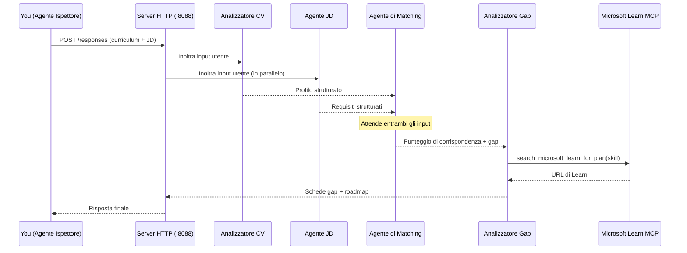
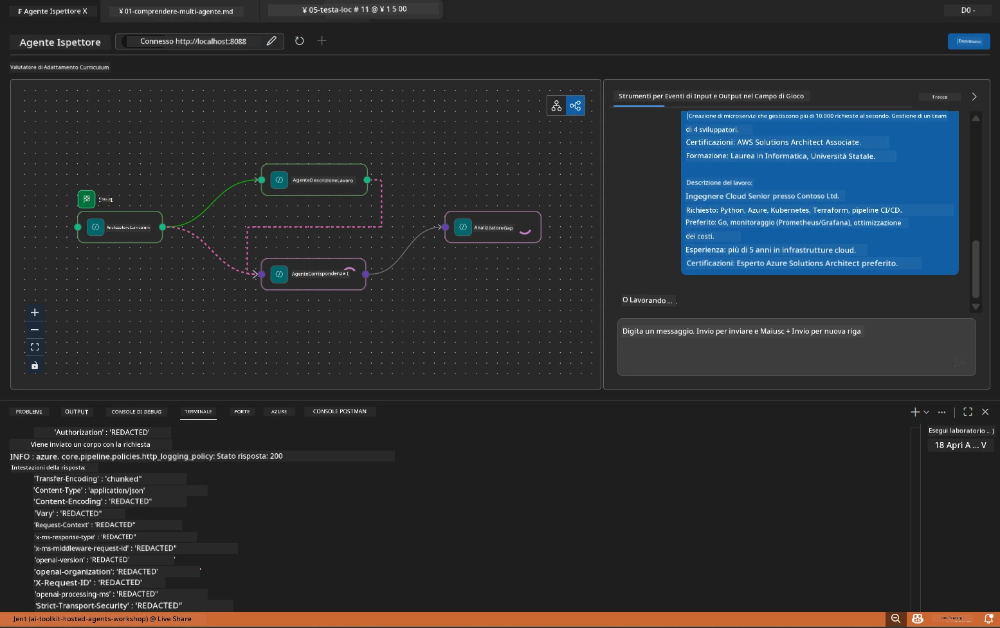

# Modulo 5 - Test in locale (Multi-Agent)

In questo modulo, esegui il flusso di lavoro multi-agente in locale, lo testi con Agent Inspector e verifichi che tutti e quattro gli agenti e lo strumento MCP funzionino correttamente prima di distribuire su Foundry.

### Cosa succede durante una esecuzione di test locale


---

## Passo 1: Avviare il server agente

### Opzione A: Usare il task di VS Code (consigliato)

1. Premi `Ctrl+Shift+P` → digita **Tasks: Run Task** → seleziona **Run Lab02 HTTP Server**.
2. Il task avvia il server con debugpy agganciato sulla porta `5679` e l'agente sulla porta `8088`.
3. Attendi che l'output mostri:

```
INFO:resume-job-fit:Starting Resume -> Job Fit Evaluator HTTP server...
INFO:resume-job-fit:Server running on http://localhost:8088
```

### Opzione B: Usare manualmente il terminale

```powershell
cd workshop\lab02-multi-agent\PersonalCareerCopilot
```

Attiva l'ambiente virtuale:

**PowerShell (Windows):**
```powershell
.\.venv\Scripts\Activate.ps1
```

**macOS/Linux:**
```bash
source .venv/bin/activate
```

Avvia il server:

```powershell
python -m debugpy --listen 127.0.0.1:5679 -m agentdev run main.py --verbose --port 8088
```

### Opzione C: Usare F5 (modalità debug)

1. Premi `F5` o vai su **Run and Debug** (`Ctrl+Shift+D`).
2. Seleziona la configurazione di avvio **Lab02 - Multi-Agent** dal menu a tendina.
3. Il server parte con pieno supporto ai breakpoint.

> **Suggerimento:** La modalità debug ti permette di impostare breakpoint dentro `search_microsoft_learn_for_plan()` per ispezionare le risposte MCP, oppure dentro le stringhe di istruzioni dell'agente per vedere cosa riceve ciascun agente.

---

## Passo 2: Aprire Agent Inspector

1. Premi `Ctrl+Shift+P` → digita **Foundry Toolkit: Open Agent Inspector**.
2. Agent Inspector si apre in una scheda del browser a `http://localhost:5679`.
3. Dovresti vedere l'interfaccia agente pronta a ricevere messaggi.

> **Se Agent Inspector non si apre:** Assicurati che il server sia completamente avviato (vedi il log "Server running"). Se la porta 5679 è occupata, consulta [Modulo 8 - Risoluzione dei problemi](08-troubleshooting.md).

---

## Passo 3: Eseguire i test smoke

Esegui questi tre test in ordine. Ognuno testa progressivamente più del flusso di lavoro.

### Test 1: Curriculum base + descrizione del lavoro

Incolla quanto segue in Agent Inspector:

```
Resume:
Jane Doe
Senior Software Engineer with 5 years of experience in Python, Django, and AWS.
Built microservices handling 10K+ requests/second. Led a team of 4 developers.
Certifications: AWS Solutions Architect Associate.
Education: B.S. Computer Science, State University.

Job Description:
Senior Cloud Engineer at Contoso Ltd.
Required: Python, Azure, Kubernetes, Terraform, CI/CD pipelines.
Preferred: Go, monitoring (Prometheus/Grafana), cost optimization.
Experience: 5+ years in cloud infrastructure.
Certifications: Azure Solutions Architect Expert preferred.
```

**Struttura di output attesa:**

La risposta dovrebbe contenere l'output di tutti e quattro gli agenti in sequenza:

1. **Output Resume Parser** - Profilo candidato strutturato con competenze raggruppate per categoria
2. **Output JD Agent** - Requisiti strutturati con competenze richieste e preferite separate
3. **Output Matching Agent** - Punteggio di aderenza (0-100) con ripartizione, competenze corrispondenti, mancanti, lacune
4. **Output Gap Analyzer** - Schede individuali per ogni competenza mancante, ciascuna con URL Microsoft Learn



### Cosa verificare nel Test 1

| Verifica | Atteso | Passa? |
|----------|---------|--------|
| La risposta contiene un punteggio di aderenza | Numero tra 0 e 100 con ripartizione | |
| Le competenze corrispondenti sono elencate | Python, CI/CD parziale, ecc. | |
| Le competenze mancanti sono elencate | Azure, Kubernetes, Terraform, ecc. | |
| Esistono schede per ogni competenza mancante | Una scheda per competenza | |
| Sono presenti URL Microsoft Learn | Link reali `learn.microsoft.com` | |
| Nessun messaggio di errore nella risposta | Output strutturato pulito | |

### Test 2: Verificare l'esecuzione dello strumento MCP

Durante l'esecuzione del Test 1, controlla il **terminal server** per le voci di log MCP:

```
GET https://learn.microsoft.com/api/mcp → 405 (Method Not Allowed)
POST https://learn.microsoft.com/api/mcp → 200
DELETE https://learn.microsoft.com/api/mcp → 405 (Method Not Allowed)
```

| Voce log | Significato | Atteso? |
|----------|-------------|---------|
| `GET ... → 405` | Il client MCP prova con GET durante l’inizializzazione | Sì - normale |
| `POST ... → 200` | Chiamata reale dello strumento al server MCP Microsoft Learn | Sì - questa è la chiamata reale |
| `DELETE ... → 405` | Il client MCP prova con DELETE durante la pulizia | Sì - normale |
| `POST ... → 4xx/5xx` | Chiamata dello strumento fallita | No - vedi [Risoluzione problemi](08-troubleshooting.md) |

> **Punto chiave:** Le linee `GET 405` e `DELETE 405` sono un **comportamento previsto**. Preoccupati solo se le chiamate `POST` restituiscono codici di stato diversi da 200.

### Test 3: Caso limite - candidato con alta aderenza

Incolla un curriculum che corrisponde strettamente alla descrizione del lavoro per verificare che GapAnalyzer gestisca correttamente scenari di alta aderenza:

```
Resume:
Alex Chen
Senior Cloud Engineer with 7 years of experience.
Skills: Python, Azure (AKS, Functions, DevOps), Kubernetes, Terraform, CI/CD (GitHub Actions, Azure Pipelines), Go, Prometheus, Grafana, cost optimization.
Certifications: Azure Solutions Architect Expert, Azure DevOps Engineer Expert.
Led infrastructure migration to Azure for 3 enterprise clients.
Education: M.S. Computer Science, Tech University.

Job Description:
Senior Cloud Engineer at Contoso Ltd.
Required: Python, Azure, Kubernetes, Terraform, CI/CD pipelines.
Preferred: Go, monitoring (Prometheus/Grafana), cost optimization.
Experience: 5+ years in cloud infrastructure.
Certifications: Azure Solutions Architect Expert preferred.
```

**Comportamento atteso:**
- Il punteggio di aderenza dovrebbe essere **80+** (la maggior parte delle competenze corrispondono)
- Le schede lacune dovrebbero concentrarsi su polish/prontezza al colloquio piuttosto che su apprendimento di base
- Le istruzioni di GapAnalyzer dicono: "Se fit >= 80, concentrati su polish/prontezza al colloquio"

---

## Passo 4: Verificare la completezza dell'output

Dopo aver eseguito i test, verifica che l'output soddisfi questi criteri:

### Checklist struttura output

| Sezione | Agente | Presente? |
|---------|--------|-----------|
| Profilo candidato | Resume Parser | |
| Competenze tecniche (raggruppate) | Resume Parser | |
| Panoramica del ruolo | JD Agent | |
| Competenze richieste vs preferite | JD Agent | |
| Punteggio fit con ripartizione | Matching Agent | |
| Competenze corrispondenti / mancanti / parziali | Matching Agent | |
| Scheda lacuna per ogni competenza mancante | Gap Analyzer | |
| URL Microsoft Learn nelle schede lacune | Gap Analyzer (MCP) | |
| Ordine di apprendimento (numerato) | Gap Analyzer | |
| Riepilogo timeline | Gap Analyzer | |

### Problemi comuni a questo stadio

| Problema | Causa | Soluzione |
|----------|--------|-----------|
| Solo 1 scheda lacuna (le altre troncate) | Mancata presenza del blocco CRITICO nelle istruzioni di GapAnalyzer | Aggiungi il paragrafo `CRITICAL:` in `GAP_ANALYZER_INSTRUCTIONS` - vedi [Modulo 3](03-configure-agents.md) |
| Nessun URL Microsoft Learn | Endpoint MCP non raggiungibile | Verifica la connessione internet. Controlla che `MICROSOFT_LEARN_MCP_ENDPOINT` in `.env` sia `https://learn.microsoft.com/api/mcp` |
| Risposta vuota | `PROJECT_ENDPOINT` o `MODEL_DEPLOYMENT_NAME` non impostati | Controlla i valori nel file `.env`. Esegui `echo $env:PROJECT_ENDPOINT` nel terminale |
| Il punteggio di aderenza è 0 o mancante | MatchingAgent non ha ricevuto dati upstream | Controlla che `add_edge(resume_parser, matching_agent)` e `add_edge(jd_agent, matching_agent)` esistano in `create_workflow()` |
| L'agente parte ma si chiude subito | Errore di importazione o dipendenza mancante | Esegui nuovamente `pip install -r requirements.txt`. Controlla il terminale per stack trace |
| Errore `validate_configuration` | Variabili env mancanti | Crea `.env` con `PROJECT_ENDPOINT=<tuo-endpoint>` e `MODEL_DEPLOYMENT_NAME=<tuo-modello>` |

---

## Passo 5: Testare con i propri dati (opzionale)

Prova ad incollare il tuo curriculum e una descrizione lavoro reale. Questo aiuta a verificare:

- Gli agenti gestiscono differenti formati di curriculum (cronologico, funzionale, ibrido)
- L’Agente JD gestisce diversi stili di descrizione lavoro (punti elenco, paragrafi, strutturato)
- Lo strumento MCP restituisce risorse rilevanti per competenze reali
- Le schede lacuna sono personalizzate sul tuo background specifico

> **Nota sulla privacy:** Durante il test locale, i tuoi dati rimangono sul tuo computer e sono inviati solo alla tua distribuzione Azure OpenAI. Non vengono registrati né memorizzati dall’infrastruttura del workshop. Usa nomi fittizi se preferisci (es. "Mario Rossi" invece del tuo nome reale).

---

### Checkpoint

- [ ] Server avviato correttamente sulla porta `8088` (log mostra "Server running")
- [ ] Agent Inspector aperto e connesso all’agente
- [ ] Test 1: Risposta completa con punteggio fit, competenze corrispondenti/mancanti, schede lacuna e URL Microsoft Learn
- [ ] Test 2: Log MCP mostra `POST ... → 200` (chiamate strumento riuscite)
- [ ] Test 3: Candidato alta aderenza ottiene punteggio 80+ con raccomandazioni focus polish
- [ ] Tutte le schede lacuna presenti (una per competenza mancante, senza troncamento)
- [ ] Nessun errore o stack trace nel terminal server

---

**Precedente:** [04 - Orchestration Patterns](04-orchestration-patterns.md) · **Successivo:** [06 - Deploy to Foundry →](06-deploy-to-foundry.md)

---

<!-- CO-OP TRANSLATOR DISCLAIMER START -->
**Disclaimer**:  
Questo documento è stato tradotto utilizzando il servizio di traduzione automatica [Co-op Translator](https://github.com/Azure/co-op-translator). Pur impegnandoci per garantire accuratezza, si prega di notare che le traduzioni automatiche possono contenere errori o inesattezze. Il documento originale nella sua lingua madre deve essere considerato la fonte autorevole. Per informazioni critiche, si raccomanda una traduzione professionale effettuata da un umano. Non siamo responsabili per eventuali incomprensioni o interpretazioni errate derivanti dall'uso di questa traduzione.
<!-- CO-OP TRANSLATOR DISCLAIMER END -->