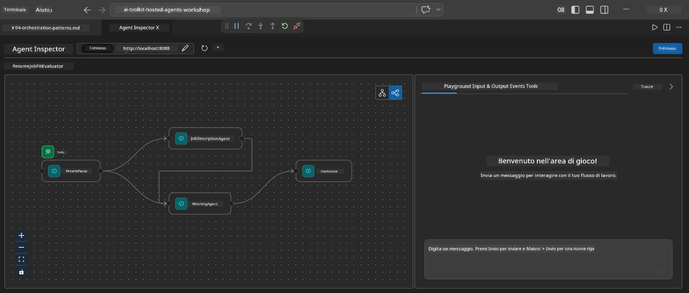
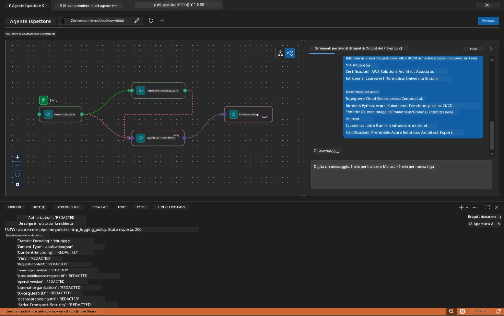
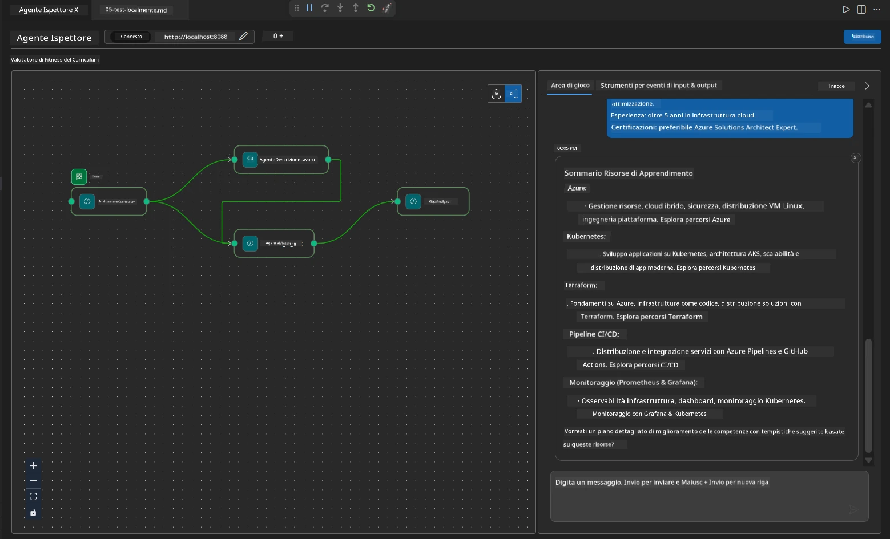

# Modulo 5 - Testare in Locale

⏱️ ~15 min

In questo modulo, esegui il flusso multi-agente localmente, lo testi con Agent Inspector e verifichi che tutti e quattro gli agenti e lo strumento MCP funzionino correttamente prima di distribuire.

---

## Passo 1: Avvia il server agente

### Opzione A: Usare il task di VS Code (consigliato)

1. Apri `workshop/lab02-multi-agent/PersonalCareerCopilot/` come cartella in VS Code.
2. Premi `Ctrl+Shift+P` → digita **Tasks: Run Task** → seleziona **Run Agent HTTP Server**.
3. Il task avvia il server con debugpy collegato sulla porta `5679` e l'agente sulla porta `8088`.
4. Attendi che l'output mostri:

```
INFO:resume-job-fit:Starting Resume -> Job Fit Evaluator HTTP server...
INFO:resume-job-fit:Server running on http://localhost:8088
```

### Opzione B: Usare F5 (modalità debug)

1. Premi `F5` → seleziona **Debug Local Agent HTTP Server**.
2. Il server si avvia con pieno supporto ai breakpoint - utile per ispezionare le risposte MCP o gli output degli agenti.

---

## Passo 2: Apri Agent Inspector

1. Premi `Ctrl+Shift+P` → digita **Foundry Toolkit: Open Agent Inspector**.
2. Agent Inspector si apre come pannello di VS Code collegato a `http://localhost:8088`.
3. Dovresti vedere l'interfaccia agente pronta per ricevere messaggi.



> **Se Agent Inspector non si apre:** Assicurati che il server sia completamente avviato (vedi il log "Server running"). Se la porta 5679 è occupata, consulta [Modulo 8 - Risoluzione problemi](08-troubleshooting.md).

---

## Passo 2b: (Opzionale) Apri il Visualizzatore del Flusso di Lavoro

Il Foundry Toolkit include un **Visualizzatore del Flusso di Lavoro** in tempo reale che mostra come gli agenti interagiscono durante l'esecuzione del grafico. È particolarmente utile per il debug multi-agente.

1. Premi `Ctrl+Shift+P` → digita **Foundry Toolkit: Open Visualizer for Hosted Agents**.
2. Si apre una nuova scheda di VS Code che mostra il grafico di esecuzione live.
3. Invia messaggi in Agent Inspector: il visualizzatore si aggiorna automaticamente - i nodi verdi indicano agenti completati, e i bordi animati mostrano il flusso dei dati tra essi.

> **Conflitto di porta:** Se la porta del visualizzatore è già in uso, cambiala in Impostazioni VS Code → **Estensioni** → **Microsoft Foundry Configuration** → **Hosted Agents: Visualizer Port**.

---

## Passo 3: Esegui test rapidi

Esegui questi tre test in ordine. Ognuno testa progressivamente più del flusso di lavoro.

### Test 1: Curriculum base + descrizione lavoro

Incolla quanto segue in Agent Inspector:

```
Resume:
Jane Doe
Senior Software Engineer with 5 years of experience in Python, Django, and AWS.
Built microservices handling 10K+ requests/second. Led a team of 4 developers.
Certifications: AWS Solutions Architect Associate.
Education: B.S. Computer Science, State University.

Job Description:
Senior Cloud Engineer at Contoso Ltd.
Required: Python, Azure, Kubernetes, Terraform, CI/CD pipelines.
Preferred: Go, monitoring (Prometheus/Grafana), cost optimization.
Experience: 5+ years in cloud infrastructure.
Certifications: Azure Solutions Architect Expert preferred.
```

**Struttura output attesa:**

La risposta dovrebbe contenere output di tutti e quattro gli agenti in sequenza:

1. **Output Resume Parser** - Due sezioni etichettate: `[PARSED RESUME]` (profilo candidato con competenze raggruppate) e `[JOB DESCRIPTION PASS-THROUGH]` (testo JD letterale che alimenta l'agente JD)
2. **Output agente JD** - Requisiti strutturati con competenze richieste e preferite separate
3. **Output agente Matching** - Punteggio di compatibilità (0-100) con dettagli, competenze abbinate, mancanti, gap
4. **Output Gap Analyzer** - Schede gap individuali per ogni competenza mancante, ciascuna con URL Microsoft Learn





### Cosa verificare nel Test 1

| Verifica | Atteso | Passa? |
|-------|----------|-------|
| La risposta contiene un punteggio di compatibilità | Numero tra 0-100 con dettagli | |
| Sono elencate le competenze abbinate | Python, CI/CD (parziale), ecc. | |
| Sono elencate le competenze mancanti | Azure, Kubernetes, Terraform, ecc. | |
| Esistono schede gap per ogni competenza mancante | Una scheda per competenza | |
| Sono presenti URL Microsoft Learn | Veri link a `learn.microsoft.com` | |
| Nessun messaggio di errore nella risposta | Output strutturato pulito | |

### Test 2: Caso limite - candidato con alta compatibilità

Incolla un curriculum che corrisponde molto strettamente al JD per verificare che GapAnalyzer gestisca scenari ad alta compatibilità:

```
Resume:
Alex Chen
Senior Cloud Engineer with 7 years of experience.
Skills: Python, Azure (AKS, Functions, DevOps), Kubernetes, Terraform, CI/CD (GitHub Actions, Azure Pipelines), Go, Prometheus, Grafana, cost optimization.
Certifications: Azure Solutions Architect Expert, Azure DevOps Engineer Expert.
Led infrastructure migration to Azure for 3 enterprise clients.
Education: M.S. Computer Science, Tech University.

Job Description:
Senior Cloud Engineer at Contoso Ltd.
Required: Python, Azure, Kubernetes, Terraform, CI/CD pipelines.
Preferred: Go, monitoring (Prometheus/Grafana), cost optimization.
Experience: 5+ years in cloud infrastructure.
Certifications: Azure Solutions Architect Expert preferred.
```

**Comportamento atteso:**
- Il punteggio di compatibilità dovrebbe essere **80+** (la maggior parte delle competenze corrispondono)
- Le schede gap dovrebbero concentrarsi su rifiniture/prontezza al colloquio piuttosto che sull'apprendimento di base
- Le istruzioni del GapAnalyzer dicono: "Se compatibilità >= 80, concentrarsi su rifinitura/prontezza al colloquio"

---

## Passo 4: Testa con i tuoi dati (opzionale)

Prova a incollare il tuo curriculum e una vera descrizione di lavoro. Questo aiuta a verificare:

- Gli agenti gestiscono diversi formati di CV (cronologico, funzionale, ibrido)
- L'agente JD gestisce diversi stili JD (punti elenco, paragrafi, strutturati)
- Lo strumento MCP restituisce risorse rilevanti per competenze reali
- Le schede gap sono personalizzate per il tuo background specifico

> **Privacy - Percorso A (Foundry cloud):** Il testo di CV e JD viene inviato al tuo deployment Azure OpenAI per inferenza. Non viene registrato o memorizzato dall'infrastruttura del workshop. Usa nomi fittizi (es. "Jane Doe") se preferisci.
>
> **Privacy - Percorso B (Foundry Local):** Tutte e quattro le inferenze degli agenti vengono eseguite interamente sul tuo dispositivo. Il testo del tuo CV e della descrizione di lavoro **non lascia mai la tua macchina**. L'unica chiamata esterna è lo strumento MCP che recupera risorse da `https://learn.microsoft.com/api/mcp`; quella query contiene solo il nome della competenza, non i tuoi dati personali.

---

### Punto di controllo

- [ ] Server avviato con successo sulla porta `8088` (log mostra "Server running")
- [ ] Agent Inspector aperto e connesso all'agente
- [ ] Test 1: Risposta completa con punteggio di compatibilità, competenze abbinate/mancanti, schede gap e URL Microsoft Learn
- [ ] Test 2: Candidato ad alta compatibilità ottiene punteggio 80+ con raccomandazioni focalizzate su rifinitura
- [ ] Tutte le schede gap presenti (una per competenza mancante, nessuna troncatura)
- [ ] Nessun errore o traceback nel terminale del server

---

**Precedente:** [04 - Orchestration Patterns](04-orchestration-patterns.md) · **Successivo:** [06 - Deploy to Foundry →](06-deploy-to-foundry.md)

---

<!-- CO-OP TRANSLATOR DISCLAIMER START -->
**Disclaimer**:
Questo documento è stato tradotto utilizzando il servizio di traduzione AI [Co-op Translator](https://github.com/Azure/co-op-translator). Sebbene ci impegniamo per garantire la precisione, si prega di notare che le traduzioni automatizzate possono contenere errori o imprecisioni. Il documento originale nella sua lingua nativa deve essere considerato la fonte autorevole. Per informazioni critiche, si raccomanda una traduzione professionale effettuata da un essere umano. Non siamo responsabili per eventuali malintesi o interpretazioni errate derivanti dall’uso di questa traduzione.
<!-- CO-OP TRANSLATOR DISCLAIMER END -->