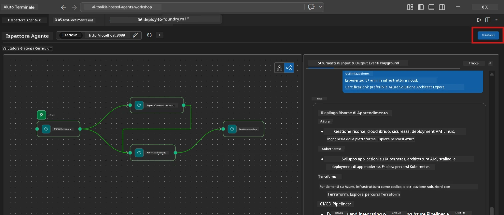
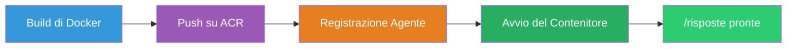
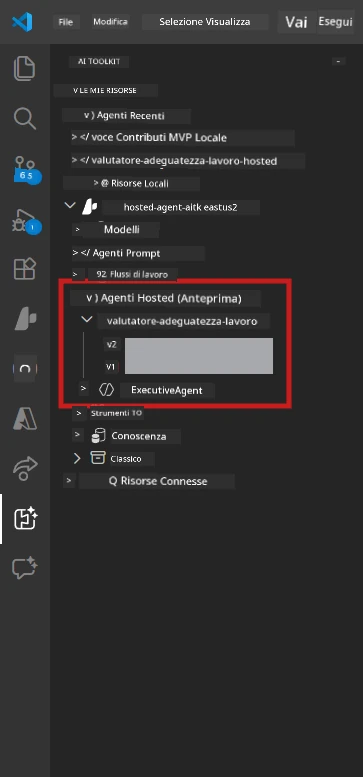

# Modulo 6 - Distribuire al servizio Foundry Agent

In questo modulo, distribuisci il tuo workflow multi-agente testato localmente su [Microsoft Foundry](https://learn.microsoft.com/azure/foundry/agents/concepts/hosted-agents) come **Hosted Agent**. Il processo di distribuzione crea un'immagine del contenitore Docker, la invia a [Azure Container Registry (ACR)](https://learn.microsoft.com/azure/container-registry/container-registry-intro) e crea una versione dell'agente ospitato in [Foundry Agent Service](https://learn.microsoft.com/azure/foundry/agents/how-to/publish-agent).

> **Differenza chiave rispetto al Lab 01:** Il processo di distribuzione è identico. Foundry tratta il tuo workflow multi-agente come un singolo agente ospitato - la complessità è all'interno del contenitore, ma la superficie di distribuzione è la stessa endpoint `/responses`.

---

## Verifica prerequisiti

Prima di distribuire, verifica ogni elemento elencato:

1. **L'agente supera i test locali rapidi:**
   - Hai completato tutti e 3 i test in [Modulo 5](05-test-locally.md) e il workflow ha prodotto output completo con le schede gap e gli URL di Microsoft Learn.

2. **Hai il ruolo [Azure AI User](https://learn.microsoft.com/azure/foundry/concepts/rbac-foundry):**
   - Assegnato in [Lab 01, Modulo 2](../../lab01-single-agent/docs/02-create-foundry-project.md). Verifica:
   - [Azure Portal](https://portal.azure.com) → la tua risorsa progetto Foundry → **Controllo accessi (IAM)** → **Assegnazioni di ruolo** → conferma che **[Azure AI User](https://aka.ms/foundry-ext-project-role)** sia elencato per il tuo account.

3. **Sei connesso ad Azure in VS Code:**
   - Controlla l'icona Account in basso a sinistra in VS Code. Il nome del tuo account dovrebbe essere visibile.

4. **`agent.yaml` ha i valori corretti:**
   - Apri `PersonalCareerCopilot/agent.yaml` e verifica:
     ```yaml
     environment_variables:
       - name: PROJECT_ENDPOINT
         value: ${PROJECT_ENDPOINT}
       - name: MODEL_DEPLOYMENT_NAME
         value: ${MODEL_DEPLOYMENT_NAME}
     ```
   - Devono corrispondere alle variabili d'ambiente lette da `main.py`.

5. **`requirements.txt` ha le versioni corrette:**
   ```
   agent-framework-azure-ai==1.0.0rc3
   agent-framework-core==1.0.0rc3
   azure-ai-agentserver-agentframework==1.0.0b16
   azure-ai-agentserver-core==1.0.0b16
   debugpy
   agent-dev-cli --pre
   ```

---

## Passo 1: Avvia la distribuzione

### Opzione A: Distribuisci dall'Agent Inspector (consigliato)

Se l'agente è in esecuzione tramite F5 con l'Agent Inspector aperto:

1. Guarda l'**angolo in alto a destra** del pannello Agent Inspector.
2. Clicca sul pulsante **Deploy** (icona cloud con freccia verso l'alto ↑).
3. Si apre la procedura guidata per la distribuzione.



### Opzione B: Distribuisci dalla Command Palette

1. Premi `Ctrl+Shift+P` per aprire la **Command Palette**.
2. Digita: **Microsoft Foundry: Deploy Hosted Agent** e selezionalo.
3. Si apre la procedura guidata per la distribuzione.

---

## Passo 2: Configura la distribuzione

### 2.1 Seleziona il progetto di destinazione

1. Un menu a discesa mostra i tuoi progetti Foundry.
2. Seleziona il progetto che hai usato durante il workshop (ad esempio, `workshop-agents`).

### 2.2 Seleziona il file agente del contenitore

1. Ti verrà chiesto di selezionare il punto di ingresso dell'agente.
2. Naviga a `workshop/lab02-multi-agent/PersonalCareerCopilot/` e scegli **`main.py`**.

### 2.3 Configura le risorse

| Impostazione | Valore consigliato | Note |
|--------------|-------------------|------|
| **CPU** | `0.25` | Predefinito. I workflow multi-agente non necessitano di più CPU perché le chiamate al modello sono legate all'I/O |
| **Memoria** | `0.5Gi` | Predefinito. Aumenta a `1Gi` se aggiungi grandi strumenti di elaborazione dati |

---

## Passo 3: Conferma e distribuisci

1. La procedura guidata mostrala riepilogo della distribuzione.
2. Rivedi e clicca su **Conferma e Distribuisci**.
3. Segui l’avanzamento in VS Code.

### Cosa succede durante la distribuzione

Guarda il pannello **Output** di VS Code (seleziona il menu a tendina "Microsoft Foundry"):


1. **Docker build** - Costruisce il contenitore dal tuo `Dockerfile`:
   ```
   Step 1/6 : FROM python:3.14-slim
   Step 2/6 : WORKDIR /app
   ...
   Successfully built abc123def456
   ```

2. **Docker push** - Invia l'immagine ad ACR (1-3 minuti alla prima distribuzione).

3. **Registrazione agente** - Foundry crea un agente ospitato usando i metadati di `agent.yaml`. Il nome dell'agente è `resume-job-fit-evaluator`.

4. **Avvio contenitore** - Il contenitore parte nell'infrastruttura gestita di Foundry con un'identità gestita dal sistema.

> **La prima distribuzione è più lenta** (Docker invia tutti gli strati). Le distribuzioni successive riutilizzano gli strati memorizzati nella cache e sono più veloci.

### Note specifiche per multi-agente

- **Tutti e quattro gli agenti sono dentro un solo contenitore.** Foundry vede un unico agente ospitato. Il grafo WorkflowBuilder gira internamente.
- **Le chiamate MCP escono verso l’esterno.** Il contenitore necessita accesso a internet per raggiungere `https://learn.microsoft.com/api/mcp`. L'infrastruttura gestita di Foundry lo fornisce di default.
- **[Managed Identity](https://learn.microsoft.com/python/api/overview/azure/identity-readme#managed-identity-support).** Nell'ambiente ospitato, `get_credential()` in `main.py` restituisce `ManagedIdentityCredential()` (perché `MSI_ENDPOINT` è impostato). Questo avviene automaticamente.

---

## Passo 4: Verifica lo stato della distribuzione

1. Apri la barra laterale **Microsoft Foundry** (clicca l'icona Foundry nella barra attività).
2. Espandi **Hosted Agents (Preview)** sotto il tuo progetto.
3. Trova **resume-job-fit-evaluator** (o il nome del tuo agente).
4. Clicca sul nome dell'agente → espandi le versioni (es. `v1`).
5. Clicca sulla versione → controlla **Dettagli contenitore** → **Stato**:



| Stato | Significato |
|-------|-------------|
| **Started** / **Running** | Il contenitore è in esecuzione, agente pronto |
| **Pending** | Il contenitore sta avviando (attendi 30-60 secondi) |
| **Failed** | Il contenitore non è partito (controlla i log - vedi sotto) |

> **L'avvio multi-agente richiede più tempo** rispetto a un agente singolo perché il contenitore crea 4 istanze agente all'avvio. "Pending" fino a 2 minuti è normale.

---

## Errori comuni di distribuzione e soluzioni

### Errore 1: Permesso negato - `agents/write`

```
Error: lacks the required data action 
Microsoft.CognitiveServices/accounts/AIServices/agents/write
```

**Soluzione:** Assegna il ruolo **[Azure AI User](https://learn.microsoft.com/azure/foundry/concepts/rbac-foundry)** a livello di **progetto**. Vedi [Modulo 8 - Risoluzione problemi](08-troubleshooting.md) per la guida passo-passo.

### Errore 2: Docker non in esecuzione

```
Error: Docker build failed / Cannot connect to Docker daemon
```

**Soluzione:**
1. Avvia Docker Desktop.
2. Attendi che appaia "Docker Desktop is running".
3. Verifica: `docker info`
4. **Windows:** Assicurati che sia abilitato il backend WSL 2 nelle impostazioni Docker Desktop.
5. Riprova.

### Errore 3: pip install fallisce durante la build Docker

```
Error: Could not find a version that satisfies the requirement agent-dev-cli
```

**Soluzione:** Il flag `--pre` in `requirements.txt` viene gestito diversamente in Docker. Assicurati che il tuo `requirements.txt` contenga:
```
agent-dev-cli --pre
```

Se Docker continua a fallire, crea un `pip.conf` o passa `--pre` tramite un argomento di build. Vedi [Modulo 8](08-troubleshooting.md).

### Errore 4: Lo strumento MCP fallisce nell'agente ospitato

Se Gap Analyzer smette di produrre URL Microsoft Learn dopo la distribuzione:

**Causa principale:** La policy di rete potrebbe bloccare l'HTTPS in uscita dal contenitore.

**Soluzione:**
1. Questo normalmente non accade nella configurazione predefinita di Foundry.
2. Se accade, verifica se la rete virtuale del progetto Foundry ha un NSG che blocca l'HTTPS in uscita.
3. Lo strumento MCP ha URL di fallback integrati, quindi l'agente produrrà comunque output (senza URL live).

---

### Checkpoint

- [ ] Il comando di distribuzione è stato completato senza errori in VS Code
- [ ] L'agente appare sotto **Hosted Agents (Preview)** nella barra laterale Foundry
- [ ] Il nome agente è `resume-job-fit-evaluator` (o quello scelto)
- [ ] Lo stato del contenitore mostra **Started** o **Running**
- [ ] (Se errori) Hai identificato l'errore, applicato la soluzione, e ridistribuito con successo

---

**Precedente:** [05 - Test Localmente](05-test-locally.md) · **Successivo:** [07 - Verifica nel Playground →](07-verify-in-playground.md)

---

<!-- CO-OP TRANSLATOR DISCLAIMER START -->
**Disclaimer**:
Questo documento è stato tradotto utilizzando il servizio di traduzione AI [Co-op Translator](https://github.com/Azure/co-op-translator). Pur impegnandoci per l'accuratezza, ti preghiamo di notare che le traduzioni automatiche possono contenere errori o inesattezze. Il documento originale nella sua lingua originaria deve essere considerato la fonte autorevole. Per informazioni critiche, si raccomanda una traduzione professionale umana. Non siamo responsabili per eventuali malintesi o interpretazioni errate derivanti dall'uso di questa traduzione.
<!-- CO-OP TRANSLATOR DISCLAIMER END -->