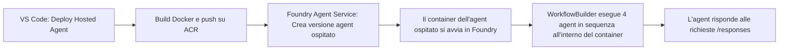
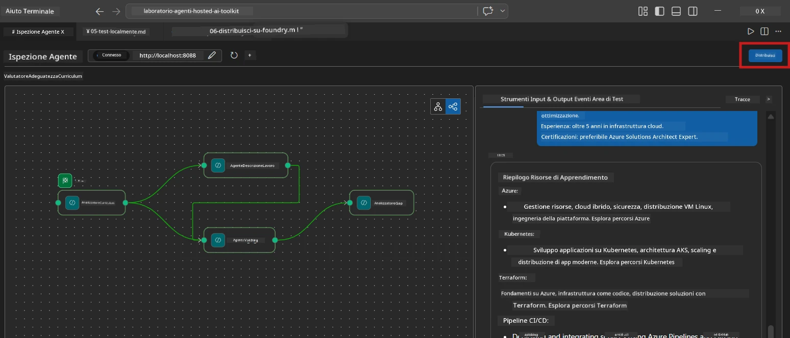
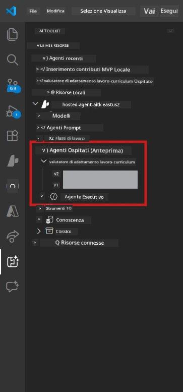

# Modulo 6 - Distribuire al servizio Foundry Agent

⏱️ ~10 min

In questo modulo, distribuisci il tuo workflow multi-agente testato localmente su [Microsoft Foundry](https://learn.microsoft.com/azure/foundry/agents/concepts/hosted-agents) come **Hosted Agent**. Il processo di distribuzione crea un'immagine container Docker, la invia a [Azure Container Registry (ACR)](https://learn.microsoft.com/azure/container-registry/container-registry-intro) e crea una versione hosted dell'agente nel [Foundry Agent Service](https://learn.microsoft.com/azure/foundry/agents/how-to/publish-agent).

> **Differenza principale rispetto al Lab 01:** Il processo di distribuzione è identico. Foundry considera il tuo workflow multi-agente come un singolo hosted agent - la complessità è all'interno del container, ma la superficie di distribuzione è la stessa endpoint `/responses`.

### Pipeline di distribuzione


```mermaid
flowchart LR
    A[VS Code: Deploy Hosted Agent] --> B[Build Docker e push su ACR]
    B --> C[Foundry Agent Service: Crea versione agent ospitato]
    C --> D[Il container dell'agent ospitato si avvia in Foundry]
    D --> E[WorkflowBuilder esegue 4 agent in sequenza all'interno del container]
    E --> F[L'agent risponde alle richieste /responses]
```

---

## Verifica prerequisiti

Prima di distribuire, verifica ogni elemento qui sotto:

1. **L'agente supera i test locali:**
   - Hai completato tutti e 3 i test nel [Modulo 5](05-test-locally.md) e il workflow ha prodotto output completo con gap cards e URL Microsoft Learn.

2. **Hai il ruolo [Foundry User](https://learn.microsoft.com/azure/foundry/concepts/rbac-foundry)** (per distribuire, necessiti almeno del ruolo **Foundry Project Manager** a livello di progetto):

   > **Nota:** I ruoli RBAC di Foundry sono stati rinominati di recente - **Foundry User**, **Foundry Owner** e **Foundry Project Manager** erano precedentemente Azure AI User, Azure AI Owner e Azure AI Project Manager. Gli ID ruolo e i permessi non sono cambiati.

   - Verifica in [Azure Portal](https://portal.azure.com) → la risorsa **progetto** Foundry → **Controllo accessi (IAM)** → **Assegnazioni ruolo** → conferma che **Foundry User** (o superiore) sia elencato per il tuo account.

3. **Sei connesso ad Azure in VS Code:**
   - Controlla l'icona Account in basso a sinistra di VS Code. Il tuo nome account dovrebbe essere visibile.

4. **`agent.yaml` ha valori corretti:**
   - Apri `PersonalCareerCopilot/agent.yaml` e verifica:
     ```yaml
     environment_variables:
       - name: AZURE_AI_MODEL_DEPLOYMENT_NAME
         value: ${AZURE_AI_MODEL_DEPLOYMENT_NAME}
     ```
   - `FOUNDRY_PROJECT_ENDPOINT` **non** è elencato qui - Foundry lo inietta a runtime. Solo `AZURE_AI_MODEL_DEPLOYMENT_NAME` deve essere dichiarato.

5. **`requirements.txt` ha versioni corrette:**
   ```
   agent-framework-foundry
   agent-framework-foundry-hosting
   mcp<2,>=1.24.0
   debugpy
   ```

---

## Passo 1: Avvia la distribuzione

### Opzione A: Distribuisci dall'Agent Inspector (consigliato)

Se l'agente è in esecuzione tramite F5 con l'Agent Inspector aperto:

1. Guarda nell'**angolo in alto a destra** del pannello Agent Inspector.
2. Clicca il pulsante **Deploy** (icona cloud con una freccia verso l'alto ↑).
3. Si apre la procedura guidata di distribuzione.



### Opzione B: Distribuisci dalla Command Palette

1. Premi `Ctrl+Shift+P` per aprire la **Command Palette**.
2. Digita: **Foundry Toolkit: Deploy Hosted Agent** e selezionalo.
3. Si apre la procedura guidata di distribuzione.

---

## Passo 2: Configura la distribuzione

### 2.1 Seleziona il progetto target

1. Un menu a tendina mostra i tuoi progetti Foundry.
2. Seleziona il progetto usato durante tutto il workshop (ad es., `workshop-agents`).

### 2.2 Seleziona il file agent container

1. Ti verrà chiesto di selezionare il punto di ingresso dell'agente.
2. Naviga in `workshop/lab02-multi-agent/PersonalCareerCopilot/` e scegli **`main.py`**.

### 2.3 Configura le risorse

| Impostazione | Valore consigliato | Note |
|------------|-------------------|-------|
| **Metodo di distribuzione** | **Container** (consigliato) o **Code** | Container costruisce un'immagine Docker; Code carica sorgenti come ZIP (preview) |
| **Container Registry** | **Default ACR** | Foundry crea e gestisce uno per te |
| **CPU** | `0.25` | Default. I workflow multi-agente non necessitano più CPU perché le chiamate modello sono I/O-bound |
| **Memoria** | `0.5Gi` | Default. Aumenta a `1Gi` se aggiungi grandi strumenti di elaborazione dati |

---

## Passo 3: Conferma e distribuisci

1. La procedura guidata mostra un riepilogo della distribuzione.
2. Rivedi e clicca **Conferma e Distribuisci**.
3. Osserva il progresso in VS Code.

### Cosa succede durante la distribuzione

Guarda il pannello **Output** di VS Code (seleziona il menu a tendina "Microsoft Foundry"):

1. **Build Docker** - Costruisce il container dal tuo `Dockerfile`
   ```
   Step 1/6 : FROM python:3.12-slim
   Step 2/6 : WORKDIR /app
   ...
   Successfully built abc123def456
   ```

2. **Push Docker** - Invia l'immagine ad ACR (1-3 minuti al primo deploy).

3. **Registrazione agente** - Foundry crea un hosted agent usando i metadati di `agent.yaml`. Il nome agente è `resume-job-fit-evaluator`.

4. **Avvio container** - Il container parte nell'infrastruttura gestita di Foundry con un'identità gestita dal sistema.

> **Il primo deploy è più lento** (Docker invia tutti gli strati). I deploy successivi riutilizzano gli strati in cache e sono più veloci.

### Note specifiche per multi-agente

- **Tutti e quattro gli agenti sono dentro un solo container.** Foundry vede un unico hosted agent. Il grafo WorkflowBuilder gira internamente.
- **Le chiamate MCP vanno verso l'esterno.** Il container necessita di accesso internet per raggiungere `https://learn.microsoft.com/api/mcp`. L'infrastruttura gestita di Foundry lo fornisce di default.
- **[Identità Gestita](https://learn.microsoft.com/azure/foundry/agents/concepts/agent-identity).** Foundry crea automaticamente una **identità Entra dedicata per ogni agente** al momento del deploy. Nell'ambiente hosted, `DefaultAzureCredential` risolve automaticamente in questa identità agente - non è necessaria alcuna configurazione manuale.

---

## Passo 4: Verifica stato distribuzione

1. Apri la barra laterale **Microsoft Foundry** (clicca l'icona Foundry nella Activity Bar).
2. Espandi **Hosted Agents (Preview)** sotto il tuo progetto.
3. Trova **resume-job-fit-evaluator** (o il nome del tuo agente).
4. Clicca sul nome agente → espandi le versioni (esempio, `v1`).
5. Clicca sulla versione → controlla **Dettagli Container** → **Stato**:



| Stato | Significato |
|-------|------------|
| **active** | L'agente è in esecuzione e pronto ad accettare richieste |
| **creating** | Il container sta partendo (attendi 30–60 secondi) |
| **failed** | Il container non è partito (controlla i log - vedi sotto) |

> **Nota:** La barra laterale VS Code potrebbe mostrare etichette come "Running" o "Started" mentre lo stato API sottostante usa `active`/`creating`. Entrambe indicano la stessa condizione.

> **L'avvio multi-agente richiede più tempo** rispetto al singolo agente perché il container crea 4 istanze agente all'avvio. `creating` per fino a 2 minuti è normale.

---

## Errori comuni di distribuzione e soluzioni

### Errore 1: Permesso negato - `agents/write`

```
Error: lacks the required data action 
Microsoft.CognitiveServices/accounts/AIServices/agents/write
```

**Soluzione:** Assegna il ruolo **[Foundry User](https://learn.microsoft.com/azure/foundry/concepts/rbac-foundry)** (precedentemente **Azure AI User**) a livello **progetto**. Consulta il [Modulo 8 - Risoluzione problemi](08-troubleshooting.md) per istruzioni passo-passo.

### Errore 2: Docker non è in esecuzione

```
Error: Docker build failed / Cannot connect to Docker daemon
```

**Soluzione:**
1. Avvia Docker Desktop.
2. Attendi che appaia "Docker Desktop is running".
3. Verifica con: `docker info`
4. **Windows:** Assicurati che il backend WSL 2 sia abilitato nelle impostazioni di Docker Desktop.
5. Ritenta.

### Errore 3: pip install fallisce durante build Docker

```
Error: Could not find a version that satisfies the requirement agent-framework-foundry
```

**Soluzione:** Verifica che `requirements.txt` corrisponda a:
```
agent-framework-foundry
agent-framework-foundry-hosting
mcp<2,>=1.24.0
debugpy
```

Se il build fallisce ancora, la rete Docker potrebbe bloccare PyPI. Controlla `docker info` per impostazioni proxy.

### Errore 4: Lo strumento MCP fallisce nell'agente hosted

Se il Gap Analyzer smette di produrre URL Microsoft Learn dopo la distribuzione:

**Causa:** La policy di rete potrebbe bloccare l'HTTPS in uscita dal container.

**Soluzione:**
1. Generalmente non è un problema con la configurazione predefinita di Foundry.
2. Se persiste, verifica se la rete virtuale del progetto Foundry ha un NSG che blocca l'HTTPS in uscita.
3. Lo strumento MCP ha fallback integrati per gli URL, quindi l'agente produrrà ancora output (senza URL live).

---

### Checkpoint

- [ ] Il comando di distribuzione è stato completato senza errori in VS Code
- [ ] L'agente appare sotto **Hosted Agents (Preview)** nella barra laterale Foundry
- [ ] Il nome agente è `resume-job-fit-evaluator` (o il nome scelto)
- [ ] Lo stato del container mostra **Started** o **Running**
- [ ] (Se ci sono errori) Hai identificato l'errore, applicato la soluzione e ridistribuito con successo

---

**Precedente:** [05 - Testa localmente](05-test-locally.md) · **Successivo:** [07 - Verifica nel Playground →](07-verify-in-playground.md)

---

<!-- CO-OP TRANSLATOR DISCLAIMER START -->
**Disclaimer**:
Questo documento è stato tradotto utilizzando il servizio di traduzione AI [Co-op Translator](https://github.com/Azure/co-op-translator). Sebbene ci impegniamo per garantire la precisione, si prega di notare che le traduzioni automatizzate possono contenere errori o imprecisioni. Il documento originale nella sua lingua nativa deve essere considerato la fonte autorevole. Per informazioni critiche, si raccomanda una traduzione professionale effettuata da un essere umano. Non siamo responsabili per eventuali malintesi o interpretazioni errate derivanti dall’uso di questa traduzione.
<!-- CO-OP TRANSLATOR DISCLAIMER END -->