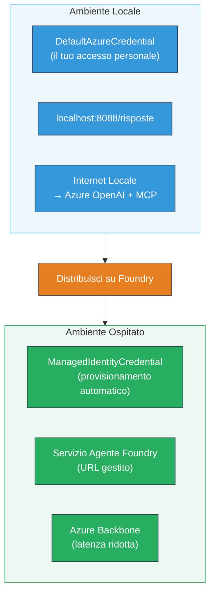

# Modulo 7 - Verifica nel Playground

In questo modulo, testi il tuo workflow multi-agente distribuito sia in **VS Code** che nel **[Foundry Portal](https://ai.azure.com)**, confermando che l’agente si comporta in modo identico al test locale.

---

## Perché verificare dopo la distribuzione?

Il tuo workflow multi-agente ha funzionato perfettamente in locale, allora perché testare di nuovo? L’ambiente ospitato differisce in diversi modi:


| Differenza | Locale | Ospitato |
|-----------|-------|--------|
| **Identità** | [`DefaultAzureCredential`](https://learn.microsoft.com/azure/developer/python/sdk/authentication/credential-chains#defaultazurecredential-overview) (il tuo accesso personale) | [`ManagedIdentityCredential`](https://learn.microsoft.com/python/api/overview/azure/identity-readme#managed-identity-support) (auto-provisionato) |
| **Endpoint** | `http://localhost:8088/responses` | Endpoint [Foundry Agent Service](https://learn.microsoft.com/azure/foundry/agents/concepts/hosted-agents) (URL gestito) |
| **Rete** | Macchina locale → Azure OpenAI + MCP in uscita | Backbone Azure (latenza inferiore tra i servizi) |
| **Connettività MCP** | Internet locale → `learn.microsoft.com/api/mcp` | Container in uscita → `learn.microsoft.com/api/mcp` |

Se una variabile d’ambiente è configurata in modo errato, RBAC è diverso oppure l'uscita MCP è bloccata, lo rileverai qui.

---

## Opzione A: Test nel VS Code Playground (consigliato come primo)

[Foundry extension](https://marketplace.visualstudio.com/items?itemName=TeamsDevApp.vscode-ai-foundedry) include un Playground integrato che ti permette di chattare con il tuo agente distribuito senza lasciare VS Code.

### Passo 1: Naviga al tuo agente ospitato

1. Clicca sull’icona **Microsoft Foundry** nella **Activity Bar** di VS Code (barra laterale sinistra) per aprire il pannello Foundry.
2. Espandi il progetto collegato (es. `workshop-agents`).
3. Espandi **Hosted Agents (Preview)**.
4. Dovresti vedere il nome del tuo agente (es. `resume-job-fit-evaluator`).

### Passo 2: Seleziona una versione

1. Clicca sul nome dell’agente per espanderne le versioni.
2. Clicca sulla versione che hai distribuito (es. `v1`).
3. Si apre un **pannello dettagli** che mostra i Dettagli del Container.
4. Verifica che lo stato sia **Started** o **Running**.

### Passo 3: Apri il Playground

1. Nel pannello dettagli, clicca il pulsante **Playground** (o clicca col tasto destro sulla versione → **Open in Playground**).
2. Si apre un’interfaccia di chat in una scheda di VS Code.

### Passo 4: Esegui i test smoke

Usa gli stessi 3 test di [Modulo 5](05-test-locally.md). Digita ogni messaggio nella casella di input del Playground e premi **Invia** (o **Enter**).

#### Test 1 - Curriculum completo + JD (flusso standard)

Incolla il prompt completo di CV + JD dal Modulo 5, Test 1 (Jane Doe + Senior Cloud Engineer presso Contoso Ltd).

**Atteso:**
- Punteggio di adeguatezza con calcolo dettagliato (scala a 100 punti)
- Sezione Abilità corrispondenti
- Sezione Abilità mancanti
- **Una scheda gap per ogni abilità mancante** con URL Microsoft Learn
- Roadmap di apprendimento con linea temporale

#### Test 2 - Test rapido breve (input minimo)

```
RESUME: 3 years Python developer, knows Django and PostgreSQL, no cloud experience.

JOB: Cloud DevOps Engineer requiring AWS, Kubernetes, Terraform, CI/CD. 5 years needed.
```

**Atteso:**
- Punteggio di adeguatezza più basso (< 40)
- Valutazione onesta con percorso di apprendimento graduale
- Diverse schede gap (AWS, Kubernetes, Terraform, CI/CD, gap di esperienza)

#### Test 3 - Candidato ad alta corrispondenza

```
RESUME:
10 years Azure Cloud Architect. AZ-305 certified. Expert in AKS, Terraform, Azure DevOps, 
Azure Functions, Helm, Prometheus, Grafana, Python, Go. Led platform team of 8.

JOB:
Senior Cloud Engineer. Required: AKS, Terraform, Azure DevOps, Python. Preferred: Helm, Go.
5+ years experience. AZ-305 preferred.
```

**Atteso:**
- Punteggio di adeguatezza elevato (≥ 80)
- Focus sulla preparazione all’intervista e miglioramento
- Poche o nessuna scheda gap
- Linea temporale breve incentrata sulla preparazione

### Passo 5: Confronta con i risultati locali

Apri le tue note o la scheda del browser dal Modulo 5 dove hai salvato le risposte locali. Per ogni test:

- La risposta ha la **stessa struttura** (punteggio di adeguatezza, schede gap, roadmap)?
- Segue lo **stesso schema di punteggio** (suddivisione su 100 punti)?
- Sono ancora presenti **URL Microsoft Learn** nelle schede gap?
- C’è **una scheda gap per ogni abilità mancante** (non troncata)?

> **Differenze minori di formulazione sono normali** - il modello non è deterministico. Concentrati su struttura, coerenza del punteggio e uso degli strumenti MCP.

---

## Opzione B: Test nel Foundry Portal

Il [Foundry Portal](https://ai.azure.com) offre un playground web utile per condividerlo con colleghi o stakeholder.

### Passo 1: Apri il Foundry Portal

1. Apri il browser e vai su [https://ai.azure.com](https://ai.azure.com).
2. Effettua l’accesso con lo stesso account Azure usato durante il workshop.

### Passo 2: Naviga al tuo progetto

1. Nella homepage, cerca **Progetti recenti** nella barra laterale sinistra.
2. Clicca sul nome del tuo progetto (es. `workshop-agents`).
3. Se non lo vedi, clicca su **Tutti i progetti** e cercalo.

### Passo 3: Trova il tuo agente distribuito

1. Nel menu di navigazione a sinistra del progetto, clicca **Build** → **Agents** (o cerca la sezione **Agents**).
2. Dovresti vedere un elenco di agenti. Trova il tuo agente distribuito (es. `resume-job-fit-evaluator`).
3. Clicca sul nome dell’agente per aprire la pagina dei dettagli.

### Passo 4: Apri il Playground

1. Nella pagina dei dettagli dell’agente, guarda la barra degli strumenti in alto.
2. Clicca **Open in playground** (o **Try in playground**).
3. Si apre un’interfaccia di chat.

### Passo 5: Esegui gli stessi test smoke

Ripeti tutti e 3 i test della sezione VS Code Playground sopra. Confronta ogni risposta sia con i risultati locali (Modulo 5) sia con quelli del Playground VS Code (Opzione A sopra).

---

## Verifica specifica multi-agente

Oltre alla correttezza di base, verifica questi comportamenti specifici multi-agente:

### Esecuzione strumenti MCP

| Verifica | Come controllare | Condizione di superamento |
|-------|---------------|----------------|
| Chiamate MCP eseguite con successo | Le schede gap contengono URL `learn.microsoft.com` | URL reali, non messaggi di fallback |
| Molteplici chiamate MCP | Ogni gap ad alta/media priorità ha risorse | Non solo la prima scheda gap |
| Funziona fallback MCP | Se mancano URL, verifica testo fallback | L’agente genera comunque schede gap (con o senza URL) |

### Coordinamento agenti

| Verifica | Come controllare | Condizione di superamento |
|-------|---------------|----------------|
| Tutti e 4 gli agenti eseguiti | L’output contiene punteggio di adeguatezza E schede gap | Il punteggio viene da MatchingAgent, le schede da GapAnalyzer |
| Esecuzione parallela | Tempo di risposta ragionevole (< 2 min) | Se > 3 min, esecuzione parallela potrebbe non funzionare |
| Integrità del flusso dati | Schede gap riferiscono abilità dal report matching | Nessuna abilità allucinata non presente nel JD |

---

## Rubrica di validazione

Usa questa rubrica per valutare il comportamento ospitato del tuo workflow multi-agente:

| # | Criterio | Condizione di superamento | Superato? |
|---|----------|---------------------------|-----------|
| 1 | **Correttezza funzionale** | L’agente risponde a CV + JD con punteggio di adeguatezza e analisi gap | |
| 2 | **Coerenza punteggio** | Il punteggio usa scala a 100 punti con calcolo dettagliato | |
| 3 | **Completezza schede gap** | Una scheda per ogni abilità mancante (non troncata o combinata) | |
| 4 | **Integrazione strumenti MCP** | Le schede gap includono URL Microsoft Learn reali | |
| 5 | **Coerenza strutturale** | La struttura dell’output combacia tra esecuzioni locali e ospitate | |
| 6 | **Tempo di risposta** | L’agente ospitato risponde entro 2 minuti per la valutazione completa | |
| 7 | **Nessun errore** | Nessun errore HTTP 500, timeout o risposte vuote | |

> Un “superamento” significa che tutti e 7 i criteri sono soddisfatti per tutti e 3 i test smoke in almeno un playground (VS Code o Portal).

---

## Risoluzione problemi del playground

| Sintomo | Causa probabile | Soluzione |
|---------|-----------------|-----------|
| Il playground non si carica | Stato container non “Started” | Torna a [Modulo 6](06-deploy-to-foundry.md), verifica lo stato della distribuzione. Aspetta se “Pending” |
| L’agente restituisce risposta vuota | Nome del modello distribuito non corrispondente | Controlla in `agent.yaml` → `environment_variables` → `MODEL_DEPLOYMENT_NAME` che corrisponda al modello distribuito |
| L’agente restituisce messaggio di errore | Mancanza permesso [RBAC](https://learn.microsoft.com/azure/foundry/concepts/rbac-foundry) | Assegna **[Azure AI User](https://aka.ms/foundry-ext-project-role)** a livello di progetto |
| Nessun URL Microsoft Learn nelle schede gap | MCP in uscita bloccato o server MCP non disponibile | Verifica se il container può raggiungere `learn.microsoft.com`. Consulta [Modulo 8](08-troubleshooting.md) |
| Solo 1 scheda gap (troncata) | Istruzioni GapAnalyzer mancano del blocco “CRITICAL” | Rivedi [Modulo 3, Passo 2.4](03-configure-agents.md) |
| Punteggio di adeguatezza molto diverso dal locale | Modello o istruzioni differenti distribuite | Confronta le variabili env in `agent.yaml` con il `.env` locale. Ridistribuisci se necessario |
| “Agent not found” nel Portal | Distribuzione ancora in propagazione o fallita | Aspetta 2 minuti, aggiorna pagina. Se ancora mancante, ridistribuisci da [Modulo 6](06-deploy-to-foundry.md) |

---

### Checkpoint

- [ ] Agente testato nel VS Code Playground - tutti e 3 i test smoke superati
- [ ] Agente testato nel Playground del [Foundry Portal](https://ai.azure.com) - tutti e 3 i test smoke superati
- [ ] Le risposte sono strutturalmente coerenti con il test locale (punteggio, schede gap, roadmap)
- [ ] URL Microsoft Learn presenti nelle schede gap (strumento MCP funzionante in ambiente ospitato)
- [ ] Una scheda gap per ogni abilità mancante (nessuna troncatura)
- [ ] Nessun errore o timeout durante i test
- [ ] Rubrica di validazione completata (tutti e 7 i criteri superati)

---

**Precedente:** [06 - Deploy to Foundry](06-deploy-to-foundry.md) · **Successivo:** [08 - Troubleshooting →](08-troubleshooting.md)

---

<!-- CO-OP TRANSLATOR DISCLAIMER START -->
**Disclaimer**:  
Questo documento è stato tradotto utilizzando il servizio di traduzione AI [Co-op Translator](https://github.com/Azure/co-op-translator). Pur impegnandoci per garantire accuratezza, si prega di notare che le traduzioni automatiche possono contenere errori o inesattezze. Il documento originale nella sua lingua madre deve essere considerato la fonte autorevole. Per informazioni critiche, si consiglia la traduzione professionale umana. Non ci assumiamo responsabilità per eventuali malintesi o interpretazioni errate derivanti dall’uso di questa traduzione.
<!-- CO-OP TRANSLATOR DISCLAIMER END -->