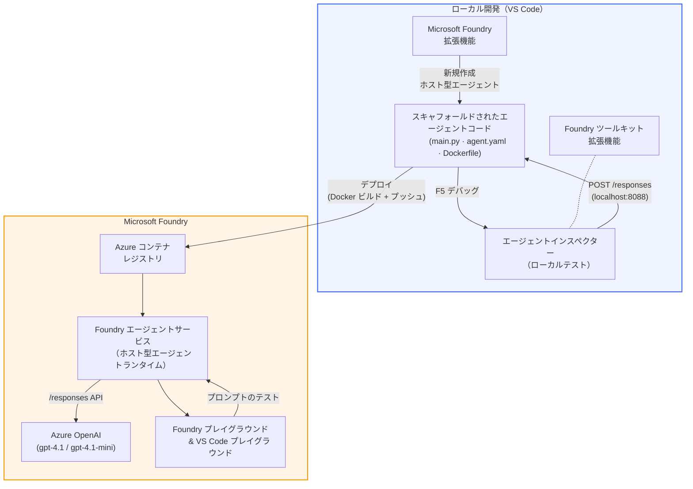

# Foundry Toolkit + Foundry Hosted Agents ワークショップ

[](https://www.python.org/)
[](https://github.com/microsoft/agents)
[](https://learn.microsoft.com/azure/ai-foundry/agents/concepts/hosted-agents/)
[](https://ai.azure.com/)
[](https://learn.microsoft.com/azure/ai-services/openai/)
[](https://learn.microsoft.com/cli/azure/install-azure-cli)
[](https://learn.microsoft.com/azure/developer/azure-developer-cli/install-azd)
[](https://www.docker.com/)
[](https://marketplace.visualstudio.com/items?itemName=ms-windows-ai-studio.windows-ai-studio)
[](LICENSE)

**Microsoft Foundry Agent Service** に AI エージェントを **Hosted Agents** としてビルド、テスト、デプロイします - すべて VS Code 上で **Microsoft Foundry 拡張機能** と **Foundry Toolkit** を使って完結。

> **Hosted Agents は現在プレビュー版です。** 対応リージョンは限定されています - 詳しくは [リージョンの利用可能性](https://learn.microsoft.com/azure/foundry/agents/concepts/hosted-agents#region-availability) をご覧ください。

> 各ラボ内の `agent/` フォルダーは **Foundry 拡張機能により自動生成** され、その後コードをカスタマイズ、ローカルテスト、デプロイを行います。

### 🌐 多言語対応

#### GitHub Action 経由でサポート（自動かつ常に最新）

<!-- CO-OP TRANSLATOR LANGUAGES TABLE START -->
[Arabic](../ar/README.md) | [Bengali](../bn/README.md) | [Bulgarian](../bg/README.md) | [Burmese (Myanmar)](../my/README.md) | [Chinese (Simplified)](../zh-CN/README.md) | [Chinese (Traditional, Hong Kong)](../zh-HK/README.md) | [Chinese (Traditional, Macau)](../zh-MO/README.md) | [Chinese (Traditional, Taiwan)](../zh-TW/README.md) | [Croatian](../hr/README.md) | [Czech](../cs/README.md) | [Danish](../da/README.md) | [Dutch](../nl/README.md) | [Estonian](../et/README.md) | [Finnish](../fi/README.md) | [French](../fr/README.md) | [German](../de/README.md) | [Greek](../el/README.md) | [Hebrew](../he/README.md) | [Hindi](../hi/README.md) | [Hungarian](../hu/README.md) | [Indonesian](../id/README.md) | [Italian](../it/README.md) | [Japanese](./README.md) | [Kannada](../kn/README.md) | [Khmer](../km/README.md) | [Korean](../ko/README.md) | [Lithuanian](../lt/README.md) | [Malay](../ms/README.md) | [Malayalam](../ml/README.md) | [Marathi](../mr/README.md) | [Nepali](../ne/README.md) | [Nigerian Pidgin](../pcm/README.md) | [Norwegian](../no/README.md) | [Persian (Farsi)](../fa/README.md) | [Polish](../pl/README.md) | [Portuguese (Brazil)](../pt-BR/README.md) | [Portuguese (Portugal)](../pt-PT/README.md) | [Punjabi (Gurmukhi)](../pa/README.md) | [Romanian](../ro/README.md) | [Russian](../ru/README.md) | [Serbian (Cyrillic)](../sr/README.md) | [Slovak](../sk/README.md) | [Slovenian](../sl/README.md) | [Spanish](../es/README.md) | [Swahili](../sw/README.md) | [Swedish](../sv/README.md) | [Tagalog (Filipino)](../tl/README.md) | [Tamil](../ta/README.md) | [Telugu](../te/README.md) | [Thai](../th/README.md) | [Turkish](../tr/README.md) | [Ukrainian](../uk/README.md) | [Urdu](../ur/README.md) | [Vietnamese](../vi/README.md)

> **ローカルクローンがお好みですか？**
>
> このリポジトリには50以上の言語翻訳が含まれており、ダウンロードサイズが大きくなります。翻訳なしでクローンする場合はスパースチェックアウトをご利用ください：
>
> **Bash / macOS / Linux:**
> ```bash
> git clone --filter=blob:none --sparse https://github.com/microsoft-foundry/Foundry_Toolkit_for_VSCode_Lab.git
> cd Foundry_Toolkit_for_VSCode_Lab
> git sparse-checkout set --no-cone '/*' '!translations' '!translated_images'
> ```
>
> **CMD (Windows):**
> ```cmd
> git clone --filter=blob:none --sparse https://github.com/microsoft-foundry/Foundry_Toolkit_for_VSCode_Lab.git
> cd Foundry_Toolkit_for_VSCode_Lab
> git sparse-checkout set --no-cone "/*" "!translations" "!translated_images"
> ```
>
> 本コースに必要なファイルだけをより高速にダウンロードできます。
<!-- CO-OP TRANSLATOR LANGUAGES TABLE END -->

---

## アーキテクチャ


**フロー:** Foundry 拡張機能がエージェントをスキャフォールド → コードと指示をカスタマイズ → Agent Inspector でローカルテスト → Foundry にデプロイ（Docker イメージを ACR にプッシュ）→ Playground で検証。

---

## 作成するもの

| ラボ | 説明 | ステータス |
|-----|-------------|--------|
| **Lab 01 - シングルエージェント** | **"Explain Like I'm an Executive" エージェント** を作成、ローカルテスト、Foundryへデプロイ | ✅ 利用可能 |
| **Lab 02 - マルチエージェントワークフロー** | **"Resume → Job Fit Evaluator"** を作成 - 4つのエージェントが協力して履歴書の適合度を評価し学習ロードマップを生成 | ✅ 利用可能 |

---

## Executive Agent の紹介

このワークショップでは **"Explain Like I'm an Executive" エージェント** を作成します。これは複雑な技術用語を受け取り、落ち着いた役員会向けの要約に翻訳する AI エージェントです。正直なところ、C-suite の誰も “v3.2 で導入された同期呼び出しによるスレッドプール枯渇” の話を聞きたくはありません。

私はこのエージェントを、完璧に作ったポストモーテムが「つまり…ウェブサイトはダウンしてるの？」と聞き返された幾度かの出来事の後に作りました。

### 仕組み

技術的な更新を入力すると、ジャーゴンなし・スタックトレースなし・不安な感じもなしで役員向けの要約を3点セットで返してくれます。内容は「何が起こったか」、「ビジネスへの影響」と「次のステップ」。

### 実例

**あなたの発言:**
> "The API latency increased due to thread pool exhaustion caused by synchronous calls introduced in v3.2."

**エージェントの応答:**

> **役員向け要約:**
> - **何が起こったか:** 最新のリリース後にシステムが遅くなりました。
> - **ビジネスへの影響:** 一部のユーザーでサービス利用中に遅延が発生しました。
> - **次のステップ:** 変更は元に戻され、再デプロイ前に修正を準備中です。

### なぜこのエージェント？

技術チェーンに没頭せずホスト型エージェントワークフローを端から端まで学習するのに最適な、非常にシンプルで単機能なエージェントです。そして正直な話、どのエンジニアリングチームもこういうのを一つ持っておいたほうがよいでしょう。

---

## ワークショップ構成

```
📂 Foundry_Toolkit_for_VSCode_Lab/
├── 📄 README.md                      ← You are here
├── 📂 ExecutiveAgent/                ← Standalone hosted agent project
│   ├── agent.yaml
│   ├── Dockerfile
│   ├── main.py
│   └── requirements.txt
└── 📂 workshop/
    ├── 📂 lab01-single-agent/        ← Full lab: docs + agent code
    │   ├── README.md                 ← Hands-on lab instructions
    │   ├── 📂 docs/                  ← Step-by-step tutorial modules
    │   │   ├── 00-prerequisites.md
    │   │   ├── 01-install-foundry-toolkit.md
    │   │   ├── 02-create-foundry-project.md
    │   │   ├── 03-create-hosted-agent.md
    │   │   ├── 04-configure-and-code.md
    │   │   ├── 05-test-locally.md
    │   │   ├── 06-deploy-to-foundry.md
    │   │   ├── 07-verify-in-playground.md
    │   │   └── 08-troubleshooting.md
    │   └── 📂 agent/                 ← Reference solution (auto-scaffolded by Foundry extension)
    │       ├── agent.yaml
    │       ├── Dockerfile
    │       ├── main.py
    │       └── requirements.txt
    └── 📂 lab02-multi-agent/         ← Resume → Job Fit Evaluator
        ├── README.md                 ← Hands-on lab instructions (end-to-end)
        ├── 📂 docs/                  ← Step-by-step tutorial modules
        │   ├── 00-prerequisites.md
        │   ├── 01-understand-multi-agent.md
        │   ├── 02-scaffold-multi-agent.md
        │   ├── 03-configure-agents.md
        │   ├── 04-orchestration-patterns.md
        │   ├── 05-test-locally.md
        │   ├── 06-deploy-to-foundry.md
        │   ├── 07-verify-in-playground.md
        │   └── 08-troubleshooting.md
        └── 📂 PersonalCareerCopilot/ ← Reference solution (multi-agent workflow)
            ├── agent.yaml
            ├── Dockerfile
            ├── main.py
            └── requirements.txt
```

> **注意:** 各ラボ内の `agent/` フォルダは、コマンドパレットから `Microsoft Foundry: Create a New Hosted Agent` を実行した時に **Microsoft Foundry 拡張機能** が生成します。その後にエージェントの指示やツール、設定でカスタマイズします。Lab 01 ではこれをスクラッチで再現します。

---

## はじめに

### 1. リポジトリをクローンする

```bash
git clone https://github.com/microsoft-foundry/Foundry_Toolkit_for_VSCode_Lab.git
cd Foundry_Toolkit_for_VSCode_Lab
```

### 2. Python仮想環境をセットアップする

```bash
python -m venv venv
```

有効化：

- **Windows (PowerShell):**
  ```powershell
  .\venv\Scripts\Activate.ps1
  ```
- **macOS / Linux:**
  ```bash
  source venv/bin/activate
  ```

### 3. 依存関係をインストールする

```bash
pip install -r workshop/lab01-single-agent/agent/requirements.txt
```

### 4. 環境変数を設定する

agent フォルダ内のサンプル `.env` ファイルをコピーし、値を記入：

```bash
cp workshop/lab01-single-agent/agent/.env.example workshop/lab01-single-agent/agent/.env
```

`workshop/lab01-single-agent/agent/.env` を編集：

```env
AZURE_AI_PROJECT_ENDPOINT=https://<your-account>.services.ai.azure.com/api/projects/<your-project>
MODEL_DEPLOYMENT_NAME=<your-model-deployment-name>
```

### 5. ワークショップラボに従う

各ラボは自己完結型のモジュール群です。まず **Lab 01** で基本を学び、その後 **Lab 02** でマルチエージェントワークフローに進みます。

#### Lab 01 - シングルエージェント ([完全な手順](workshop/lab01-single-agent/README.md))

| # | モジュール | リンク |
|---|--------|------|
| 1 | 事前準備を読む | [00-prerequisites.md](workshop/lab01-single-agent/docs/00-prerequisites.md) |
| 2 | Foundry Toolkit & Foundry 拡張機能をインストール | [01-install-foundry-toolkit.md](workshop/lab01-single-agent/docs/01-install-foundry-toolkit.md) |
| 3 | Foundry プロジェクトを作成 | [02-create-foundry-project.md](workshop/lab01-single-agent/docs/02-create-foundry-project.md) |
| 4 | Hosted Agent を作成 | [03-create-hosted-agent.md](workshop/lab01-single-agent/docs/03-create-hosted-agent.md) |
| 5 | 指示と環境を設定 | [04-configure-and-code.md](workshop/lab01-single-agent/docs/04-configure-and-code.md) |
| 6 | ローカルテスト | [05-test-locally.md](workshop/lab01-single-agent/docs/05-test-locally.md) |
| 7 | Foundry にデプロイ | [06-deploy-to-foundry.md](workshop/lab01-single-agent/docs/06-deploy-to-foundry.md) |
| 8 | Playground で検証 | [07-verify-in-playground.md](workshop/lab01-single-agent/docs/07-verify-in-playground.md) |
| 9 | トラブルシューティング | [08-troubleshooting.md](workshop/lab01-single-agent/docs/08-troubleshooting.md) |

#### Lab 02 - マルチエージェントワークフロー ([完全な手順](workshop/lab02-multi-agent/README.md))

| # | モジュール | リンク |
|---|--------|------|
| 1 | 事前準備 (Lab 02) | [00-prerequisites.md](workshop/lab02-multi-agent/docs/00-prerequisites.md) |
| 2 | マルチエージェントアーキテクチャの理解 | [01-understand-multi-agent.md](workshop/lab02-multi-agent/docs/01-understand-multi-agent.md) |
| 3 | マルチエージェントプロジェクトのスキャフォールド | [02-scaffold-multi-agent.md](workshop/lab02-multi-agent/docs/02-scaffold-multi-agent.md) |
| 4 | エージェントと環境構成 | [03-configure-agents.md](workshop/lab02-multi-agent/docs/03-configure-agents.md) |
| 5 | オーケストレーションパターン | [04-orchestration-patterns.md](workshop/lab02-multi-agent/docs/04-orchestration-patterns.md) |
| 6 | ローカルテスト（マルチエージェント） | [05-test-locally.md](workshop/lab02-multi-agent/docs/05-test-locally.md) |
| 7 | Foundryへのデプロイ | [06-deploy-to-foundry.md](workshop/lab02-multi-agent/docs/06-deploy-to-foundry.md) |
| 8 | playgroundでの検証 | [07-verify-in-playground.md](workshop/lab02-multi-agent/docs/07-verify-in-playground.md) |
| 9 | トラブルシューティング（マルチエージェント） | [08-troubleshooting.md](workshop/lab02-multi-agent/docs/08-troubleshooting.md) |

---

## メンテナー

<table>
<tr>
    <td align="center"><a href="https://github.com/ShivamGoyal03">
        <br />
        <sub><b>Shivam Goyal</b></sub>
    </a><br />
    </td>
</tr>
</table>

---

## 必要な権限（クイックリファレンス）

| シナリオ | 必要なロール |
|----------|---------------|
| 新しいFoundryプロジェクトの作成 | Foundryリソースの **Azure AI Owner** |
| 既存プロジェクトへのデプロイ（新リソース） | サブスクリプションの **Azure AI Owner** + **Contributor** |
| 完全に構成済みのプロジェクトへのデプロイ | アカウントの **Reader** + プロジェクトの **Azure AI User** |

> **重要:** Azureの`Owner` と `Contributor` ロールは、<em>管理</em>権限のみを含み、<em>開発</em>（データ操作）権限は含まれていません。エージェントのビルドとデプロイには、**Azure AI User** または **Azure AI Owner** が必要です。

---

## 参考資料

- [クイックスタート: 最初のホスト済みエージェントのデプロイ (VS Code)](https://learn.microsoft.com/azure/foundry/agents/quickstarts/quickstart-hosted-agent)
- [ホスト済みエージェントとは？](https://learn.microsoft.com/azure/foundry/agents/concepts/hosted-agents)
- [VS Codeでホスト済みエージェントのワークフローを作成する](https://learn.microsoft.com/azure/foundry/agents/how-to/vs-code-agents-workflow-pro-code)
- [ホスト済みエージェントのデプロイ](https://learn.microsoft.com/azure/foundry/agents/how-to/deploy-hosted-agent)
- [Microsoft FoundryのRBAC](https://learn.microsoft.com/azure/foundry/concepts/rbac-foundry)
- [Architecture Review Agent Sample](https://github.com/Azure-Samples/agent-architecture-review-sample) - MCPツール、Excalidrawダイアグラム、デュアルデプロイメントを備えた実世界のホスト済みエージェント

---

## ライセンス

[MIT](../../LICENSE)

---

<!-- CO-OP TRANSLATOR DISCLAIMER START -->
**免責事項**:  
本書類は AI 翻訳サービス [Co-op Translator](https://github.com/Azure/co-op-translator) を使用して翻訳されました。正確性を期していますが、自動翻訳には誤りや不正確な箇所が含まれる可能性があることをご了承ください。原文の言語による文書が公式の情報源とみなされます。重要な情報については、専門の人間翻訳を推奨します。本翻訳の使用に起因する誤解や誤訳について、当方は一切の責任を負いません。
<!-- CO-OP TRANSLATOR DISCLAIMER END -->