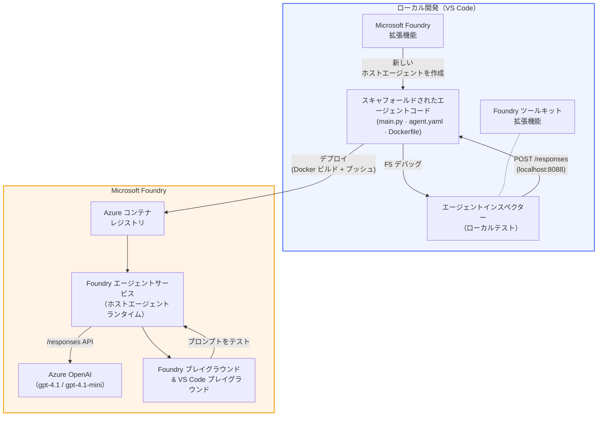

# Foundry Toolkit + Foundry Hosted Agents ワークショップ

[](https://www.python.org/)
[](https://github.com/microsoft/agents)
[](https://learn.microsoft.com/azure/ai-foundry/agents/concepts/hosted-agents/)
[](https://ai.azure.com/)
[](https://learn.microsoft.com/azure/ai-services/openai/)
[](https://learn.microsoft.com/cli/azure/install-azure-cli)
[](https://learn.microsoft.com/azure/developer/azure-developer-cli/install-azd)
[](https://www.docker.com/)
[](https://marketplace.visualstudio.com/items?itemName=ms-windows-ai-studio.windows-ai-studio)
[](LICENSE)

**Microsoft Foundry Agent Service** に AI エージェントをビルド、テスト、デプロイし、**Hosted Agents** として展開します。すべて VS Code 上で、**Microsoft Foundry 拡張機能** と **Foundry Toolkit** を使用して行います。

> **Hosted Agents は現在プレビュー版です。** 対応リージョンは限定的です - 詳しくは [リージョンの可用性](https://learn.microsoft.com/azure/foundry/agents/concepts/hosted-agents#region-availability) を参照してください。

> 各ラボ内の `agent/` フォルダーは **Foundry 拡張機能によって自動生成** されます。コードをカスタマイズし、ローカルでテストし、デプロイしてください。

<!-- CO-OP TRANSLATOR LANGUAGES TABLE START -->
[Arabic](../ar/README.md) | [Bengali](../bn/README.md) | [Bulgarian](../bg/README.md) | [Burmese (Myanmar)](../my/README.md) | [Chinese (Simplified)](../zh-CN/README.md) | [Chinese (Traditional, Hong Kong)](../zh-HK/README.md) | [Chinese (Traditional, Macau)](../zh-MO/README.md) | [Chinese (Traditional, Taiwan)](../zh-TW/README.md) | [Croatian](../hr/README.md) | [Czech](../cs/README.md) | [Danish](../da/README.md) | [Dutch](../nl/README.md) | [Estonian](../et/README.md) | [Finnish](../fi/README.md) | [French](../fr/README.md) | [German](../de/README.md) | [Greek](../el/README.md) | [Hebrew](../he/README.md) | [Hindi](../hi/README.md) | [Hungarian](../hu/README.md) | [Indonesian](../id/README.md) | [Italian](../it/README.md) | [Japanese](./README.md) | [Kannada](../kn/README.md) | [Khmer](../km/README.md) | [Korean](../ko/README.md) | [Lithuanian](../lt/README.md) | [Malay](../ms/README.md) | [Malayalam](../ml/README.md) | [Marathi](../mr/README.md) | [Nepali](../ne/README.md) | [Nigerian Pidgin](../pcm/README.md) | [Norwegian](../no/README.md) | [Persian (Farsi)](../fa/README.md) | [Polish](../pl/README.md) | [Portuguese (Brazil)](../pt-BR/README.md) | [Portuguese (Portugal)](../pt-PT/README.md) | [Punjabi (Gurmukhi)](../pa/README.md) | [Romanian](../ro/README.md) | [Russian](../ru/README.md) | [Serbian (Cyrillic)](../sr/README.md) | [Slovak](../sk/README.md) | [Slovenian](../sl/README.md) | [Spanish](../es/README.md) | [Swahili](../sw/README.md) | [Swedish](../sv/README.md) | [Tagalog (Filipino)](../tl/README.md) | [Tamil](../ta/README.md) | [Telugu](../te/README.md) | [Thai](../th/README.md) | [Turkish](../tr/README.md) | [Ukrainian](../uk/README.md) | [Urdu](../ur/README.md) | [Vietnamese](../vi/README.md)

> **ローカルにクローンする場合は？**
>
> このリポジトリには50以上の言語翻訳が含まれており、ダウンロードサイズが大きくなります。翻訳なしでクローンするにはスパースチェックアウトを使ってください：
>
> **Bash / macOS / Linux:**
> ```bash
> git clone --filter=blob:none --sparse https://github.com/microsoft-foundry/Foundry_Toolkit_for_VSCode_Lab.git
> cd Foundry_Toolkit_for_VSCode_Lab
> git sparse-checkout set --no-cone '/*' '!translations' '!translated_images'
> ```
>
> **CMD (Windows):**
> ```cmd
> git clone --filter=blob:none --sparse https://github.com/microsoft-foundry/Foundry_Toolkit_for_VSCode_Lab.git
> cd Foundry_Toolkit_for_VSCode_Lab
> git sparse-checkout set --no-cone "/*" "!translations" "!translated_images"
> ```
>
> これにより、コースを完了するのに必要なものだけが高速にダウンロードされます。
<!-- CO-OP TRANSLATOR LANGUAGES TABLE END -->

---

## アーキテクチャ


**フロー:** Foundry 拡張機能がエージェントをスキャフォールド → コードと指示をカスタマイズ → Agent Inspector でローカルテスト → Foundry にデプロイ（Docker イメージが ACR にプッシュされる）→ Playground で検証。

---

## 何を作るか

| ラボ | 説明 | 状態 |
|-----|-------------|--------|
| **Lab 01 - シングルエージェント** | <strong>「経営者向けに説明する」エージェント</strong>を作成し、ローカルでテストして Foundry にデプロイ | ✅ 利用可能 |
| **Lab 02 - マルチエージェントワークフロー** | **「履歴書→職務適合評価者」** - 4つのエージェントが連携して履歴書の適合度を評価し、学習ロードマップを生成 | ✅ 利用可能 |

---

## 経営者向けエージェントのご紹介

このワークショップでは、**「経営者向けに説明する」エージェント** を作成します。これは難解な技術用語を取り込み、落ち着いた取締役会用の要約に翻訳する AI エージェントです。実際に、Cクラスの経営層は「v3.2で導入された同期呼び出しによるスレッドプールの枯渇」などという話は聞きたくありませんよね。

このエージェントは、完璧に作成した事後報告書に対して「で、つまり...ウェブサイトはダウンしているの？」と返された回数が多すぎて作りました。

### 仕組み

技術的なアップデートを渡すと、役員向け要約を返します。3つの箇条書き、専門用語なし、スタックトレースなし、過剰な心配なし。<strong>何が起こったか</strong>、<strong>ビジネスへの影響</strong>、<strong>次のステップ</strong> だけを示します。

### 実際の例

**あなたが言う:**
> 「APIのレイテンシが、v3.2で導入された同期呼び出しによりスレッドプールが枯渇したために増加しました。」

**エージェントの返答:**

> **役員向け要約:**
> - **何が起こったか:** 最新リリース後、システムが遅くなりました。
> - **ビジネスへの影響:** 一部のユーザーはサービス利用時に遅延を経験しました。
> - **次のステップ:** 変更はロールバックされ、修正を準備中でデプロイを待っています。

### なぜこのエージェント？

これは非常にシンプルで単一用途のエージェントです。ホステッドエージェントのワークフローを複雑なツールチェーンに迷わされることなくエンドツーエンドで学ぶのに最適です。そして正直に言うと、すべてのエンジニアリングチームに1つあってもいいものです。

---

## ワークショップ構成

```
📂 Foundry_Toolkit_for_VSCode_Lab/
├── 📄 README.md                      ← You are here
├── 📂 ExecutiveAgent/                ← Standalone hosted agent project
│   ├── agent.yaml
│   ├── Dockerfile
│   ├── main.py
│   └── requirements.txt
└── 📂 workshop/
    ├── 📂 lab01-single-agent/        ← Full lab: docs + agent code
    │   ├── README.md                 ← Hands-on lab instructions
    │   ├── 📂 docs/                  ← Step-by-step tutorial modules
    │   │   ├── 00-prerequisites.md
    │   │   ├── 01-install-foundry-toolkit.md
    │   │   ├── 02-create-foundry-project.md
    │   │   ├── 03-create-hosted-agent.md
    │   │   ├── 04-configure-and-code.md
    │   │   ├── 05-test-locally.md
    │   │   ├── 06-deploy-to-foundry.md
    │   │   ├── 07-verify-in-playground.md
    │   │   └── 08-troubleshooting.md
    │   └── 📂 agent/                 ← Reference solution (auto-scaffolded by Foundry extension)
    │       ├── agent.yaml
    │       ├── Dockerfile
    │       ├── main.py
    │       └── requirements.txt
    └── 📂 lab02-multi-agent/         ← Resume → Job Fit Evaluator
        ├── README.md                 ← Hands-on lab instructions (end-to-end)
        ├── 📂 docs/                  ← Step-by-step tutorial modules
        │   ├── 00-prerequisites.md
        │   ├── 01-understand-multi-agent.md
        │   ├── 02-scaffold-multi-agent.md
        │   ├── 03-configure-agents.md
        │   ├── 04-orchestration-patterns.md
        │   ├── 05-test-locally.md
        │   ├── 06-deploy-to-foundry.md
        │   ├── 07-verify-in-playground.md
        │   └── 08-troubleshooting.md
        └── 📂 PersonalCareerCopilot/ ← Reference solution (multi-agent workflow)
            ├── agent.yaml
            ├── Dockerfile
            ├── main.py
            └── requirements.txt
```

> **注意:** 各ラボ内の `agent/` フォルダーは、コマンドパレットから `Microsoft Foundry: Create a New Hosted Agent` を実行すると **Microsoft Foundry 拡張機能** が生成します。その後、エージェントの指示やツール、設定でカスタマイズします。Lab 01 ではこれを一から再作成する手順を案内します。

---

## 始めに

### 1. リポジトリをクローン

```bash
git clone https://github.com/microsoft-foundry/Foundry_Toolkit_for_VSCode_Lab.git
cd Foundry_Toolkit_for_VSCode_Lab
```

### 2. Python 仮想環境をセットアップ

```bash
python -m venv venv
```

有効化：

- **Windows (PowerShell):**
  ```powershell
  .\venv\Scripts\Activate.ps1
  ```
- **macOS / Linux:**
  ```bash
  source venv/bin/activate
  ```

### 3. 依存関係のインストール

```bash
pip install -r workshop/lab01-single-agent/agent/requirements.txt
```

### 4. 環境変数の設定

エージェントフォルダ内のサンプル `.env` ファイルをコピーし、自分の値を入力してください：

```bash
cp workshop/lab01-single-agent/agent/.env.example workshop/lab01-single-agent/agent/.env
```

`workshop/lab01-single-agent/agent/.env` を編集：

```env
AZURE_AI_PROJECT_ENDPOINT=https://<your-account>.services.ai.azure.com/api/projects/<your-project>
MODEL_DEPLOYMENT_NAME=<your-model-deployment-name>
```

### 5. ワークショップラボを進める

各ラボはモジュールごとに完結しています。基本を学ぶために **Lab 01** から始め、次に **Lab 02** のマルチエージェントワークフローへ進んでください。

#### Lab 01 - シングルエージェント ([完全な指示](workshop/lab01-single-agent/README.md))

| # | モジュール | リンク |
|---|--------|------|
| 1 | 前提条件の確認 | [00-prerequisites.md](workshop/lab01-single-agent/docs/00-prerequisites.md) |
| 2 | Foundry Toolkit と Foundry 拡張機能のインストール | [01-install-foundry-toolkit.md](workshop/lab01-single-agent/docs/01-install-foundry-toolkit.md) |
| 3 | Foundry プロジェクトの作成 | [02-create-foundry-project.md](workshop/lab01-single-agent/docs/02-create-foundry-project.md) |
| 4 | ホステッドエージェントの作成 | [03-create-hosted-agent.md](workshop/lab01-single-agent/docs/03-create-hosted-agent.md) |
| 5 | 指示と環境の設定およびコードのカスタマイズ | [04-configure-and-code.md](workshop/lab01-single-agent/docs/04-configure-and-code.md) |
| 6 | ローカルでのテスト | [05-test-locally.md](workshop/lab01-single-agent/docs/05-test-locally.md) |
| 7 | Foundry へのデプロイ | [06-deploy-to-foundry.md](workshop/lab01-single-agent/docs/06-deploy-to-foundry.md) |
| 8 | Playground での検証 | [07-verify-in-playground.md](workshop/lab01-single-agent/docs/07-verify-in-playground.md) |
| 9 | トラブルシューティング | [08-troubleshooting.md](workshop/lab01-single-agent/docs/08-troubleshooting.md) |

#### Lab 02 - マルチエージェントワークフロー ([完全な指示](workshop/lab02-multi-agent/README.md))

| # | モジュール | リンク |
|---|--------|------|
| 1 | 前提条件の確認（Lab 02） | [00-prerequisites.md](workshop/lab02-multi-agent/docs/00-prerequisites.md) |
| 2 | マルチエージェントアーキテクチャの理解 | [01-understand-multi-agent.md](workshop/lab02-multi-agent/docs/01-understand-multi-agent.md) |
| 3 | マルチエージェントプロジェクトのスキャフォールド | [02-scaffold-multi-agent.md](workshop/lab02-multi-agent/docs/02-scaffold-multi-agent.md) |
| 4 | エージェントと環境の設定 | [03-configure-agents.md](workshop/lab02-multi-agent/docs/03-configure-agents.md) |
| 5 | オーケストレーションパターン | [04-orchestration-patterns.md](workshop/lab02-multi-agent/docs/04-orchestration-patterns.md) |
| 6 | ローカルでのテスト（マルチエージェント） | [05-test-locally.md](workshop/lab02-multi-agent/docs/05-test-locally.md) |
| 7 | Foundryへのデプロイ | [06-deploy-to-foundry.md](workshop/lab02-multi-agent/docs/06-deploy-to-foundry.md) |
| 8 | playgroundでの確認 | [07-verify-in-playground.md](workshop/lab02-multi-agent/docs/07-verify-in-playground.md) |
| 9 | トラブルシューティング（マルチエージェント） | [08-troubleshooting.md](workshop/lab02-multi-agent/docs/08-troubleshooting.md) |

---

## メンテナ

<table>
<tr>
    <td align="center"><a href="https://github.com/ShivamGoyal03">
        <br />
        <sub><b>Shivam Goyal</b></sub>
    </a><br />
    </td>
</tr>
</table>

---

## 必要な権限（クイックリファレンス）

| シナリオ | 必要なロール |
|----------|---------------|
| 新しいFoundryプロジェクトの作成 | Foundryリソースでの **Azure AI Owner** |
| 既存プロジェクトへのデプロイ（新規リソース） | サブスクリプションに対する **Azure AI Owner** + **Contributor** |
| 完全に構成済みのプロジェクトへのデプロイ | アカウントでの **Reader** + プロジェクトでの **Azure AI User** |

> **重要:** Azureの `Owner` と `Contributor` ロールは管理権限のみを含み、開発（データアクション）権限は含みません。エージェントの作成とデプロイには、**Azure AI User** または **Azure AI Owner** が必要です。

---

## 参考資料

- [クイックスタート: 最初のホスト型エージェントをデプロイする（VS Code）](https://learn.microsoft.com/azure/foundry/agents/quickstarts/quickstart-hosted-agent)
- [ホスト型エージェントとは？](https://learn.microsoft.com/azure/foundry/agents/concepts/hosted-agents)
- [VS Codeでホスト型エージェントのワークフローを作成する](https://learn.microsoft.com/azure/foundry/agents/how-to/vs-code-agents-workflow-pro-code)
- [ホスト型エージェントをデプロイする](https://learn.microsoft.com/azure/foundry/agents/how-to/deploy-hosted-agent)
- [Microsoft FoundryのRBAC](https://learn.microsoft.com/azure/foundry/concepts/rbac-foundry)
- [Architecture Review Agent Sample](https://github.com/Azure-Samples/agent-architecture-review-sample) - MCPツール、Excalidraw図、デュアルデプロイを備えた実務的なホスト型エージェント

---

## ライセンス

[MIT](../../LICENSE)

---

<!-- CO-OP TRANSLATOR DISCLAIMER START -->
**免責事項**:  
本書類は AI 翻訳サービス [Co-op Translator](https://github.com/Azure/co-op-translator) を使用して翻訳されています。正確性を期していますが、自動翻訳には誤りや不正確な部分が含まれる可能性があります。原文が権威ある情報源とみなされるべきです。重要な情報については、専門の人間による翻訳を推奨します。本翻訳の使用によって生じた誤解や誤訳について、当方は一切責任を負いません。
<!-- CO-OP TRANSLATOR DISCLAIMER END -->