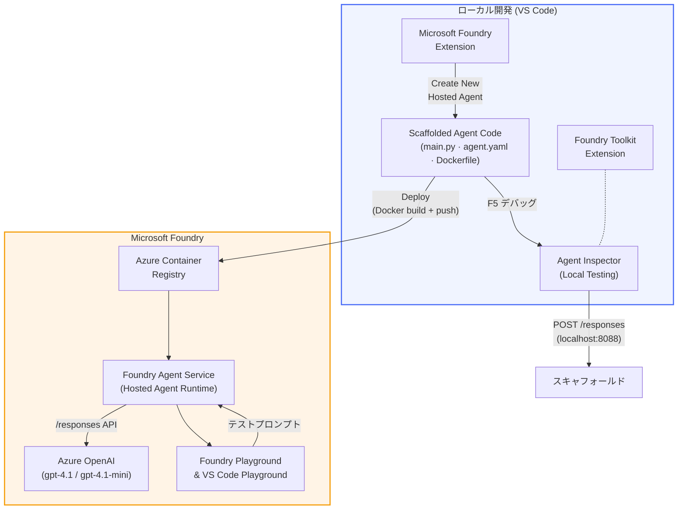

# Foundry Toolkit + Foundry Hosted Agents ワークショップ

[](https://www.python.org/)
[](https://github.com/microsoft/agents)
[](https://learn.microsoft.com/azure/foundry/agents/concepts/hosted-agents)
[](https://ai.azure.com/)
[](https://learn.microsoft.com/azure/ai-services/openai/)
[](https://learn.microsoft.com/cli/azure/install-azure-cli)
[](https://learn.microsoft.com/azure/developer/azure-developer-cli/install-azd)
[](https://www.docker.com/)
[](https://marketplace.visualstudio.com/items?itemName=ms-windows-ai-studio.windows-ai-studio)
[](LICENSE)

**Microsoft Foundry Agent Service** の **Hosted Agents** として AI エージェントを構築、テスト、デプロイします - すべて VS Code 上で **Microsoft Foundry 拡張機能** と **Foundry Toolkit** を使用して行えます。

> **Hosted Agents は現在プレビュー段階です。** 対応リージョンは限定されているため、[リージョンの可用性](https://learn.microsoft.com/azure/foundry/agents/concepts/hosted-agents#region-availability)をご確認ください。

> 各ラボ内の `agent/` フォルダーは **Foundry 拡張機能** によって <strong>自動でスキャフォールド</strong> され、その後コードをカスタマイズし、ローカルでテストしてデプロイできます。

### 🌐 多言語サポート

#### GitHub Action によるサポート（自動化＆常に最新）

<!-- CO-OP TRANSLATOR LANGUAGES TABLE START -->
[Arabic](../ar/README.md) | [Bengali](../bn/README.md) | [Bulgarian](../bg/README.md) | [Burmese (Myanmar)](../my/README.md) | [Chinese (Simplified)](../zh-CN/README.md) | [Chinese (Traditional, Hong Kong)](../zh-HK/README.md) | [Chinese (Traditional, Macau)](../zh-MO/README.md) | [Chinese (Traditional, Taiwan)](../zh-TW/README.md) | [Croatian](../hr/README.md) | [Czech](../cs/README.md) | [Danish](../da/README.md) | [Dutch](../nl/README.md) | [Estonian](../et/README.md) | [Finnish](../fi/README.md) | [French](../fr/README.md) | [German](../de/README.md) | [Greek](../el/README.md) | [Hebrew](../he/README.md) | [Hindi](../hi/README.md) | [Hungarian](../hu/README.md) | [Indonesian](../id/README.md) | [Italian](../it/README.md) | [Japanese](./README.md) | [Kannada](../kn/README.md) | [Khmer](../km/README.md) | [Korean](../ko/README.md) | [Lithuanian](../lt/README.md) | [Malay](../ms/README.md) | [Malayalam](../ml/README.md) | [Marathi](../mr/README.md) | [Nepali](../ne/README.md) | [Nigerian Pidgin](../pcm/README.md) | [Norwegian](../no/README.md) | [Persian (Farsi)](../fa/README.md) | [Polish](../pl/README.md) | [Portuguese (Brazil)](../pt-BR/README.md) | [Portuguese (Portugal)](../pt-PT/README.md) | [Punjabi (Gurmukhi)](../pa/README.md) | [Romanian](../ro/README.md) | [Russian](../ru/README.md) | [Serbian (Cyrillic)](../sr/README.md) | [Slovak](../sk/README.md) | [Slovenian](../sl/README.md) | [Spanish](../es/README.md) | [Swahili](../sw/README.md) | [Swedish](../sv/README.md) | [Tagalog (Filipino)](../tl/README.md) | [Tamil](../ta/README.md) | [Telugu](../te/README.md) | [Thai](../th/README.md) | [Turkish](../tr/README.md) | [Ukrainian](../uk/README.md) | [Urdu](../ur/README.md) | [Vietnamese](../vi/README.md)

> **ローカルでクローンしたい場合は？**
>
> このリポジトリには50以上の言語翻訳が含まれており、ダウンロードサイズが大きくなります。翻訳ファイルを除いてクローンする場合は、スパースチェックアウトを使用してください。
>
> **Bash / macOS / Linux:**
> ```bash
> git clone --filter=blob:none --sparse https://github.com/microsoft-foundry/Foundry_Toolkit_for_VSCode_Lab.git
> cd Foundry_Toolkit_for_VSCode_Lab
> git sparse-checkout set --no-cone '/*' '!translations' '!translated_images'
> ```
>
> **CMD (Windows):**
> ```cmd
> git clone --filter=blob:none --sparse https://github.com/microsoft-foundry/Foundry_Toolkit_for_VSCode_Lab.git
> cd Foundry_Toolkit_for_VSCode_Lab
> git sparse-checkout set --no-cone "/*" "!translations" "!translated_images"
> ```
>
> これにより、より高速なダウンロードで講座を完了するために必要なすべてのものを取得できます。
<!-- CO-OP TRANSLATOR LANGUAGES TABLE END -->

---

## アーキテクチャ


```mermaid
flowchart TB
    subgraph Local["ローカル開発 (VS Code)"]
        direction TB
        FE["Microsoft Foundry
        Extension"]
        FoundryToolkit["Foundry Toolkit
        Extension"]
        Scaffold["Scaffolded Agent Code
        (main.py · agent.yaml · Dockerfile)"]
        Inspector["Agent Inspector
        (Local Testing)"]
        FE -- "Create New
        Hosted Agent" --> Scaffold
        Scaffold -- "F5 デバッグ" --> Inspector
        FoundryToolkit -.- Inspector
    end

    subgraph Cloud["Microsoft Foundry"]
        direction TB
        ACR["Azure Container
        Registry"]
        AgentService["Foundry Agent Service
        (Hosted Agent Runtime)"]
        Model["Azure OpenAI
        (gpt-4.1 / gpt-4.1-mini)"]
        Playground["Foundry Playground
        & VS Code Playground"]
        ACR --> AgentService
        AgentService -- "/responses API" --> Model
        AgentService --> Playground
    end

    Scaffold -- "Deploy
    (Docker build + push)" --> ACR
    Inspector -- "POST /responses
    (localhost:8088)" --> スキャフォールド
    Playground -- "テストプロンプト" --> AgentService

    style Local fill:#f0f4ff,stroke:#4a6cf7,stroke-width:2px
    style Cloud fill:#fff4e6,stroke:#f59e0b,stroke-width:2px
```

**フロー:** Foundry拡張機能がエージェントをスキャフォールド → コードと指示をカスタマイズ → Agent Inspectorでローカルテスト → Foundryにデプロイ（DockerイメージをACRにプッシュ） → Playgroundで検証。

---

## 何を構築するか

| ラボ | 説明 | ステータス |
|-----|-------------|--------|
| **Lab 01 - Single Agent** | <strong>「エグゼクティブ向け説明」エージェント</strong>を構築し、ローカルでテストし、Foundryにデプロイ | ✅ 利用可能 |
| **Lab 02 - マルチエージェント ワークフロー** | <strong>「履歴書 → ジョブ適合評価」</strong>を構築 - 4つのエージェントが協力して履歴書の適合度をスコアリングし、学習ロードマップを生成 | ✅ 利用可能 |

---

## エグゼクティブ エージェントの紹介

このワークショップでは、<strong>「エグゼクティブ向け説明」エージェント</strong>を構築します。これは複雑な技術用語を取り、落ち着いた取締役会向けの要約に翻訳するAIエージェントです。率直に言って、C-suiteの誰もが「v3.2で導入された同期呼び出しによるスレッドプール枯渇」という話は聞きたくないでしょう。

何度も経験したのは、私の完璧に作成したポストモーテムの回答が「じゃあ...サイトはダウンしてるの？」だったことです。

### 動作原理

技術的なアップデートを入力すると、エグゼクティブ向けの要約が返ってきます — ジャーゴンなし、スタックトレースなし、不安なし。<strong>何が起きたか</strong>、<strong>ビジネスへの影響</strong>、<strong>次のステップ</strong>の3つの箇条書きだけです。

### 動きを見る

**あなたが言う:**
> "v3.2で導入された同期呼び出しによるスレッドプールの枯渇によりAPIのレイテンシが増加しました。"

**エージェントの返答:**

> **エグゼクティブサマリー:**
> - **何が起きたか:** 最新リリース後、システムが遅くなりました。
> - **ビジネスへの影響:** 一部のユーザーがサービスの遅延を経験しました。
> - **次のステップ:** 変更はロールバックされ、修正後に再デプロイ予定です。

### なぜこのエージェント？

これは単純明快な単一目的のエージェントで、複雑なツールチェーンに煩わされることなくホステッドエージェントのワークフローを一通り学ぶのに最適です。率直に言って、どのエンジニアリングチームにも必要なものです。

---

## ワークショップ構成

```
📂 Foundry_Toolkit_for_VSCode_Lab/
├── 📄 README.md                      ← You are here
└── 📂 workshop/
    ├── 📂 lab01-single-agent/        ← Full lab: docs + agent code
    │   ├── README.md                 ← Hands-on lab instructions
    │   ├── 📂 docs/                  ← Step-by-step tutorial modules
    │   │   ├── 00-prerequisites.md
    │   │   ├── 01-setup.md
    │   │   ├── 02-create-hosted-agent.md
    │   │   ├── 03-configure-and-code.md
    │   │   ├── 04-test-locally.md
    │   │   ├── 05-deploy-to-foundry.md
    │   │   ├── 06-verify-in-playground.md
    │   │   ├── 07-summary.md
    │   │   └── 08-troubleshooting.md
    │   └── 📂 agent/                 ← Reference solution (auto-scaffolded by Foundry extension)
    │       ├── agent.yaml
    │       ├── Dockerfile
    │       ├── main.py
    │       └── requirements.txt
    └── 📂 lab02-multi-agent/         ← Resume → Job Fit Evaluator
        ├── README.md                 ← Hands-on lab instructions (end-to-end)
        ├── 📂 docs/                  ← Step-by-step tutorial modules
        │   ├── 00-prerequisites.md
        │   ├── 01-understand-multi-agent.md
        │   ├── 02-scaffold-multi-agent.md
        │   ├── 03-configure-agents.md
        │   ├── 04-orchestration-patterns.md
        │   ├── 05-test-locally.md
        │   ├── 06-deploy-to-foundry.md
        │   ├── 07-verify-in-playground.md
        │   └── 08-troubleshooting.md
        └── 📂 PersonalCareerCopilot/ ← Reference solution (multi-agent workflow)
            ├── agent.yaml
            ├── Dockerfile
            ├── main.py
            └── requirements.txt
```

> **注意:** 各ラボ内の `agent/` フォルダーは、コマンドパレットから `Microsoft Foundry: Create a New Hosted Agent` を実行すると<strong>Microsoft Foundry拡張機能</strong>が生成します。その後、エージェントの指示やツール、設定に応じてファイルをカスタマイズします。Lab 01 ではこれを一から再構築する方法を紹介します。

---

## はじめに

### 1. リポジトリをクローンする

```bash
git clone https://github.com/microsoft-foundry/Foundry_Toolkit_for_VSCode_Lab.git
cd Foundry_Toolkit_for_VSCode_Lab
```

### 2. Pythonの仮想環境をセットアップ

```bash
python -m venv venv
```

アクティベートします:

- **Windows (PowerShell):**
  ```powershell
  .\venv\Scripts\Activate.ps1
  ```
- **macOS / Linux:**
  ```bash
  source venv/bin/activate
  ```

### 3. 依存関係をインストール

```bash
pip install -r workshop/lab01-single-agent/agent/requirements.txt
```

### 4. 環境変数を設定

agent フォルダー内のサンプル `.env` ファイルをコピーし、値を入力します:

```bash
cp workshop/lab01-single-agent/agent/.env.example workshop/lab01-single-agent/agent/.env
```

`workshop/lab01-single-agent/agent/.env` を編集:

```env
AZURE_AI_PROJECT_ENDPOINT=https://<your-account>.services.ai.azure.com/api/projects/<your-project>
AZURE_AI_MODEL_DEPLOYMENT_NAME=<your-model-deployment-name>
```

### 5. ワークショップラボを進める

各ラボは独立したモジュール構成です。まず **Lab 01** で基礎を学び、続いて **Lab 02** でマルチエージェントワークフローを学びます。

#### Lab 01 - Single Agent ([完全な手順](workshop/lab01-single-agent/README.md))

| # | モジュール | リンク |
|---|--------|------|
| 1 | 前提条件を読む | [00-prerequisites.md](workshop/lab01-single-agent/docs/00-prerequisites.md) |
| 2 | Foundry Toolkit と Foundry 拡張機能をインストール | [01-setup.md](workshop/lab01-single-agent/docs/01-setup.md) |
| 3 | Foundry プロジェクトを作成 | [01-setup.md](workshop/lab01-single-agent/docs/01-setup.md) |
| 4 | ホステッドエージェントを作成 | [02-create-hosted-agent.md](workshop/lab01-single-agent/docs/02-create-hosted-agent.md) |
| 5 | 指示と環境を設定 | [03-configure-and-code.md](workshop/lab01-single-agent/docs/03-configure-and-code.md) |
| 6 | ローカルでテスト | [04-test-locally.md](workshop/lab01-single-agent/docs/04-test-locally.md) |
| 7 | Foundryにデプロイ | [05-deploy-to-foundry.md](workshop/lab01-single-agent/docs/05-deploy-to-foundry.md) |
| 8 | Playgroundで検証 | [06-verify-in-playground.md](workshop/lab01-single-agent/docs/06-verify-in-playground.md) |
| 9 | トラブルシューティング | [08-troubleshooting.md](workshop/lab01-single-agent/docs/08-troubleshooting.md) |

#### Lab 02 - マルチエージェント ワークフロー ([完全な手順](workshop/lab02-multi-agent/README.md))

| # | モジュール | リンク |
|---|--------|------|
| 1 | 前提条件 (Lab 02) | [00-prerequisites.md](workshop/lab02-multi-agent/docs/00-prerequisites.md) |
| 2 | マルチエージェントアーキテクチャを理解 | [01-understand-multi-agent.md](workshop/lab02-multi-agent/docs/01-understand-multi-agent.md) |
| 3 | マルチエージェントプロジェクトをスキャフォールド | [02-scaffold-multi-agent.md](workshop/lab02-multi-agent/docs/02-scaffold-multi-agent.md) |
| 4 | エージェントと環境を設定 | [03-configure-agents.md](workshop/lab02-multi-agent/docs/03-configure-agents.md) |
| 5 | オーケストレーションパターン | [04-orchestration-patterns.md](workshop/lab02-multi-agent/docs/04-orchestration-patterns.md) |
| 6 | ローカルでテスト (マルチエージェント) | [05-test-locally.md](workshop/lab02-multi-agent/docs/05-test-locally.md) |

| 7 | Foundryへのデプロイ | [06-deploy-to-foundry.md](workshop/lab02-multi-agent/docs/06-deploy-to-foundry.md) |
| 8 | プレイグラウンドでの検証 | [07-verify-in-playground.md](workshop/lab02-multi-agent/docs/07-verify-in-playground.md) |
| 9 | トラブルシューティング（マルチエージェント） | [08-troubleshooting.md](workshop/lab02-multi-agent/docs/08-troubleshooting.md) |

---

## メンテナー

<table>
<tr>
    <td align="center"><a href="https://github.com/ShivamGoyal03">
        <br />
        <sub><b>Shivam Goyal</b></sub>
    </a><br />
    </td>
</tr>
</table>

---

## 必要な権限（クイックリファレンス）

| シナリオ | 必要な役割 |
|----------|---------------|
| 新しいFoundryプロジェクトの作成 | Foundryリソースの<strong>Azure AI所有者</strong> |
| 既存プロジェクトへのデプロイ（新リソース） | サブスクリプションの<strong>Azure AI所有者</strong> + <strong>共同作成者</strong> |
| 完全構成済みプロジェクトへのデプロイ | アカウントの<strong>リーダー</strong> + プロジェクトの<strong>Azure AIユーザー</strong> |

> **重要:** Azureの`所有者`および`共同作成者`ロールは、<em>管理</em>権限のみを含み、<em>開発</em>（データアクション）権限は含みません。エージェントの作成とデプロイには<strong>Azure AIユーザー</strong>または<strong>Azure AI所有者</strong>が必要です。

---

## 参考資料

- [クイックスタート: 最初のホステッドエージェントをデプロイする (VS Code)](https://learn.microsoft.com/azure/foundry/agents/quickstarts/quickstart-hosted-agent)
- [ホステッドエージェントとは？](https://learn.microsoft.com/azure/foundry/agents/concepts/hosted-agents)
- [VS Codeでホステッドエージェントのワークフローを作成する](https://learn.microsoft.com/azure/foundry/agents/how-to/vs-code-agents-workflow-pro-code)
- [ホステッドエージェントをデプロイする](https://learn.microsoft.com/azure/foundry/agents/how-to/deploy-hosted-agent)
- [Microsoft FoundryのRBAC](https://learn.microsoft.com/azure/foundry/concepts/rbac-foundry)
- [Architecture Review Agent Sample](https://github.com/Azure-Samples/agent-architecture-review-sample) - MCPツール、Excalidraw図、二重デプロイを含む実例のホステッドエージェント

---


## ライセンス

[MIT](../../LICENSE)

---

<!-- CO-OP TRANSLATOR DISCLAIMER START -->
**免責事項**：
本書類は AI 翻訳サービス [Co-op Translator](https://github.com/Azure/co-op-translator) を使用して翻訳されています。正確性を期していますが、自動翻訳には誤りや不正確な部分が含まれる可能性があることをご承知おきください。原文の原語版が正式な情報源とみなされるべきです。重要な情報については、専門の人間による翻訳を推奨します。本翻訳の利用により生じたいかなる誤解や解釈違いについても、当方は責任を負いかねます。
<!-- CO-OP TRANSLATOR DISCLAIMER END -->