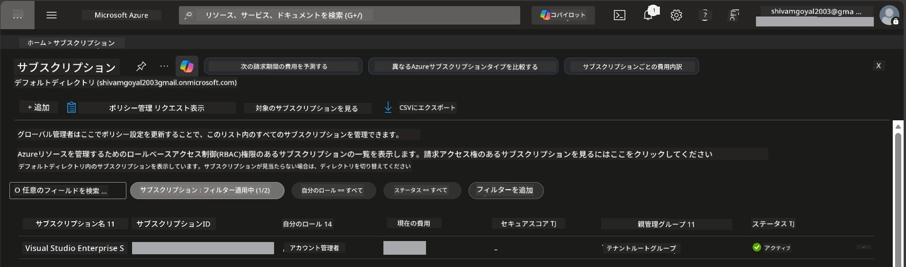

# Module 0 - 事前準備

ワークショップを開始する前に、以下のツール、アクセス権、および環境が整っていることを確認してください。下記のすべてのステップを順番に実行し、先に進むためにスキップしないでください。

---

## 1. Azure アカウントとサブスクリプション

### 1.1 Azure サブスクリプションの作成または確認

1. ブラウザを開き、[https://azure.microsoft.com/free/](https://azure.microsoft.com/free/) にアクセスします。
2. Azure アカウントを持っていない場合は、<strong>無料で始める</strong>をクリックし、登録手順に従います。Microsoft アカウント（または新規作成）と本人確認のためのクレジットカードが必要です。
3. すでにアカウントをお持ちの場合は、[https://portal.azure.com](https://portal.azure.com) にサインインしてください。
4. ポータルで、左側のナビゲーションの<strong>サブスクリプション</strong>ブレードをクリックします（または上部の検索バーで「Subscriptions」と検索）。
5. 少なくとも1つの<strong>有効な</strong>サブスクリプションが表示されていることを確認します。後で必要になるので、<strong>サブスクリプション ID</strong>を控えておきます。



### 1.2 必要な RBAC ロールの理解

[Hosted Agent](https://learn.microsoft.com/azure/foundry/agents/concepts/hosted-agents) のデプロイには、標準の Azure `Owner` と `Contributor` ロールには含まれていない <strong>データ操作</strong> のアクセス許可が必要です。以下の[ロールの組み合わせ](https://learn.microsoft.com/azure/foundry/concepts/rbac-foundry#built-in-roles)のいずれかが必要です。

| シナリオ | 必要なロール | 割り当て場所 |
|----------|--------------|--------------|
| 新しい Foundry プロジェクトの作成 | Foundry リソースに対する **Azure AI Owner** | Azure ポータルの Foundry リソース |
| 既存プロジェクトへのデプロイ（新規リソース） | サブスクリプションに対する **Azure AI Owner** + **Contributor** | サブスクリプション + Foundry リソース |
| 完全に構成済みプロジェクトへのデプロイ | アカウントに対する **Reader** + プロジェクトに対する **Azure AI User** | Azure ポータルのアカウント + プロジェクト |

> **重要:** Azure の `Owner` と `Contributor` ロールは <em>管理</em> 権限（ARM 操作）だけをカバーします。エージェントの作成とデプロイに必要な `agents/write` などの<em>データ操作</em>には、[**Azure AI User**](https://learn.microsoft.com/azure/foundry/concepts/rbac-foundry#built-in-roles)（またはそれ以上）が必要です。これらのロールは [Module 2](02-create-foundry-project.md) で割り当てます。

---

## 2. ローカルツールのインストール

以下のツールをそれぞれインストールしてください。インストール後、確認コマンドを実行して動作することを確認します。

### 2.1 Visual Studio Code

1. [https://code.visualstudio.com/](https://code.visualstudio.com/) にアクセスします。
2. ご使用の OS（Windows/macOS/Linux）に対応したインストーラーをダウンロードします。
3. デフォルト設定のままインストーラーを実行します。
4. VS Code を開き、起動することを確認します。

### 2.2 Python 3.10+

1. [https://www.python.org/downloads/](https://www.python.org/downloads/) にアクセスします。
2. Python 3.10 以降（推奨は 3.12 以上）をダウンロードします。
3. **Windows:** インストール時の最初の画面で<strong>「Add Python to PATH」</strong>にチェックを入れます。
4. ターミナルを開いて以下を確認します。

   ```powershell
   python --version
   ```

   期待される出力: `Python 3.10.x` 以上。

### 2.3 Azure CLI

1. [https://learn.microsoft.com/cli/azure/install-azure-cli](https://learn.microsoft.com/cli/azure/install-azure-cli) を開きます。
2. ご使用の OS に合わせたインストール手順に従ってください。
3. 以下でバージョンを確認します。

   ```powershell
   az --version
   ```

   期待値: `azure-cli 2.80.0` 以上。

4. サインインします。

   ```powershell
   az login
   ```

### 2.4 Azure Developer CLI (azd)

1. [https://learn.microsoft.com/azure/developer/azure-developer-cli/install-azd](https://learn.microsoft.com/azure/developer/azure-developer-cli/install-azd) にアクセスします。
2. お使いの OS 向けのインストール手順に従います。Windowsの場合:

   ```powershell
   winget install microsoft.azd
   ```

3. バージョンを確認します。

   ```powershell
   azd version
   ```

   期待値: `azd version 1.x.x` 以上。

4. サインインします。

   ```powershell
   azd auth login
   ```

### 2.5 Docker Desktop（任意）

Docker は、コンテナーイメージをローカルでビルドしてテストしたい場合にのみ必要です。Foundry 拡張機能は、デプロイ時にコンテナーのビルドを自動で処理します。

1. [https://docs.docker.com/get-docker/](https://docs.docker.com/get-docker/) を開きます。
2. ご使用の OS 向け Docker Desktop をダウンロードし、インストールします。
3. **Windows:** インストール時に WSL 2 バックエンドが選択されていることを確認してください。
4. Docker Desktop を起動し、システムトレイのアイコンが<strong>「Docker Desktop is running」</strong>と表示されるまで待ちます。
5. ターミナルを開き、以下を実行して確認します。

   ```powershell
   docker info
   ```

   エラーなく Docker のシステム情報が表示されます。もし `Cannot connect to the Docker daemon` と表示された場合は、Docker の起動が完了するまで数秒待ってください。

---

## 3. VS Code 拡張機能のインストール

以下の3つの拡張機能を、ワークショップ開始前にインストールしてください。

### 3.1 Microsoft Foundry for VS Code

1. VS Code を開きます。
2. `Ctrl+Shift+X` で拡張機能パネルを開きます。
3. 検索ボックスに **「Microsoft Foundry」** と入力します。
4. **Microsoft Foundry for Visual Studio Code**（発行者: Microsoft、ID: `TeamsDevApp.vscode-ai-foundry`）を見つけます。
5. <strong>インストール</strong> をクリックします。
6. インストール完了後、アクティビティバー（左サイドバー）に **Microsoft Foundry** のアイコンが表示されることを確認します。

### 3.2 Foundry Toolkit

1. 拡張機能パネルで `Ctrl+Shift+X` を押し、**「Foundry Toolkit」** を検索します。
2. **Foundry Toolkit**（発行者: Microsoft、ID: `ms-windows-ai-studio.windows-ai-studio`）を見つけます。
3. <strong>インストール</strong> をクリックします。
4. アクティビティバーに **Foundry Toolkit** のアイコンが表示されます。

### 3.3 Python

1. 拡張機能パネルで **「Python」** を検索します。
2. **Python**（発行者: Microsoft、ID: `ms-python.python`）を見つけます。
3. <strong>インストール</strong> をクリックします。

---

## 4. VS Code から Azure にサインイン

[Microsoft Agent Framework](https://learn.microsoft.com/agent-framework/overview/) は認証に [`DefaultAzureCredential`](https://learn.microsoft.com/azure/developer/python/sdk/authentication/credential-chains#defaultazurecredential-overview) を使用します。VS Code で Azure にサインインしている必要があります。

### 4.1 VS Code からサインイン

1. VS Code の左下の隅にある <strong>アカウント</strong> アイコン（人のシルエット）をクリックします。
2. **Microsoft Foundry を利用するためにサインイン**（または **Azure でサインイン**）をクリックします。
3. ブラウザが開きますので、サブスクリプションへのアクセス権がある Azure アカウントでサインインしてください。
4. VS Code に戻ると、左下にアカウント名が表示されます。

### 4.2 （任意）Azure CLI からサインイン

Azure CLI をインストールし、CLIベースの認証を利用する場合:

```powershell
az login
```

ブラウザが開くのでサインインします。サインイン後、正しいサブスクリプションを設定します。

```powershell
az account set --subscription "<your-subscription-id>"
```

確認:

```powershell
az account show --query "{name:name, id:id, state:state}" --output table
```

サブスクリプション名、ID、および状態が `Enabled` と表示されるはずです。

### 4.3 （代替）サービスプリンシパル認証

CI/CD や共有環境の場合は、以下の環境変数を設定してください。

```powershell
$env:AZURE_TENANT_ID = "<your-tenant-id>"
$env:AZURE_CLIENT_ID = "<your-client-id>"
$env:AZURE_CLIENT_SECRET = "<your-client-secret>"
```

---

## 5. プレビュー版の制限事項

先に進む前に、現在の制限事項を理解してください。

- [**Hosted Agents**](https://learn.microsoft.com/azure/foundry/agents/concepts/hosted-agents) は現在 <strong>パブリックプレビュー</strong> であり、本番環境での使用は推奨されていません。
- 対応リージョンは限定されています。リソース作成前に必ず[リージョンの利用可能性](https://learn.microsoft.com/azure/foundry/agents/concepts/hosted-agents#region-availability)を確認してください。対応外のリージョンを選択するとデプロイが失敗します。
- `azure-ai-agentserver-agentframework` パッケージはプリリリース版（`1.0.0b16`）であり、API が変更される可能性があります。
- スケール制限: ホスト型エージェントは 0〜5 レプリカ（スケール・トゥ・ゼロを含む）をサポートしています。

---

## 6. 事前チェックリスト

以下の項目をすべて実行してください。いずれかのステップで失敗した場合は、戻って修正してから続行してください。

- [ ] VS Code がエラーなく起動する
- [ ] Python 3.10+ が PATH にあり (`python --version` で `3.10.x` 以上が表示される)
- [ ] Azure CLI がインストールされている (`az --version` で `2.80.0` 以上が表示される)
- [ ] Azure Developer CLI がインストールされている (`azd version` でバージョン情報が表示される)
- [ ] Microsoft Foundry 拡張機能がインストールされている（アクティビティバーにアイコンが見える）
- [ ] Foundry Toolkit 拡張機能がインストールされている（アクティビティバーにアイコンが見える）
- [ ] Python 拡張機能がインストールされている
- [ ] VS Code で Azure にサインインしている（左下のアカウントアイコンを確認）
- [ ] `az account show` コマンドでサブスクリプションが返される
- [ ] （任意）Docker Desktop が起動している（`docker info` でエラーなくシステム情報が表示される）

### チェックポイント

VS Code のアクティビティバーで、**Foundry Toolkit** と **Microsoft Foundry** の両方のサイドバー アイコンがあることを確認します。各アイコンをクリックして、エラーなく読み込まれることを確認してください。

---

**次へ：** [01 - Install Foundry Toolkit & Foundry Extension →](01-install-foundry-toolkit.md)

---

<!-- CO-OP TRANSLATOR DISCLAIMER START -->
**免責事項**:  
本書類は AI 翻訳サービス [Co-op Translator](https://github.com/Azure/co-op-translator) を使用して翻訳されています。正確性を期しておりますが、自動翻訳には誤りや不正確な部分が含まれる可能性があることをご承知おきください。原文の言語での文書が正式な情報源とみなされます。重要な情報については、専門の人間による翻訳をお勧めします。本翻訳の利用により生じた誤解や誤訳について、当方は一切責任を負いません。
<!-- CO-OP TRANSLATOR DISCLAIMER END -->