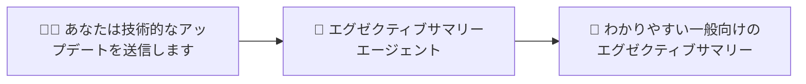

# モジュール 0 - はじめに

⏱️ 約10分

> [!WARNING]
> **プレビューと制限事項:** [Hosted Agents](https://learn.microsoft.com/azure/foundry/agents/concepts/hosted-agents) は現在 <strong>パブリックプレビュー</strong> です - 本番ワークロードには推奨されません。以下に注意してください:
> - <strong>対応リージョンが限定されています</strong> - リソース作成前に [リージョンの可用性](https://learn.microsoft.com/azure/foundry/agents/concepts/hosted-agents#region-availability) を確認してください。非対応リージョンを選ぶとデプロイが失敗します。
> - `azure-ai-agentserver-agentframework` パッケージはプレリリース版です - バージョン間でAPIが変わる可能性があります。
> - スケール制限: ホステッドエージェントは0～5レプリカをサポートしています（スケール・トゥ・ゼロ含む）。
> - このワークショップで示す機能の一部はサービスのGAに向けて変更される可能性があります。

## 作成するもの

このワークショップでは、複雑な技術的アップデートを平易な英語の経営層向けサマリーに書き換えるホステッドAIエージェント、**「経営層向けに説明する」** エージェントを構築します。

```mermaid
flowchart LR
    A["🧑‍💻 あなたは技術的なアップデートを送信します"] --> B["🤖 エグゼクティブサマリーエージェント"]
    B --> C["📝 わかりやすい一般向けのエグゼクティブサマリー"]
```

**このエージェントは以下を使用します:**
- **Microsoft Agent Framework** - エージェントのロジックと構造用
- **Foundry Toolkit for VS Code** - スキャフォールディング、ローカルテスト、デプロイ用
- **AIモデル**（例: `gpt-4.1-mini/gpt-5-mini`） - サマリー生成用

このラボの最後には、Agent Inspector でローカルテスト可能な動作するエージェントが完成し、必要に応じてクラウドにデプロイできます。

---

## ホステッドエージェントとは？

<strong>ホステッドエージェント</strong> とは、Microsoft Foundry上でマネージドサービスとして動作するAIエージェントです。インフラを自分で管理する代わりに、コードをコンテナに詰めてFoundryに渡すと、スケール、ホスティング、標準HTTPエンドポイント公開をFoundryが処理します。

| 概念 | 意味 |
|---------|--------------|
| <strong>エージェント</strong> | ユーザーメッセージを受け取り、AIモデルを呼び出し、構造化レスポンスを返すPythonコード |
| <strong>ホステッド</strong> | Foundryがコンテナを実行するため、VM・Kubernetes・インフラ管理不要 |
| <strong>レスポンスプロトコル</strong> | 標準HTTP API (`POST /responses`) で任意のクライアントが対話可能 |
| **Agent Inspector** | Foundry Toolkitに組み込まれたローカルテストUIで、デプロイ前にエージェントとチャット可能 |

このワークショップでは、ゼロからフルホステッドエージェントまで完成させるか、ローカルテストで止めるか選択できます。

---

## パスを選択

> ⚠️ **続行前にどちらかのパスを選んでください。** 選択によってインストールするツールや該当モジュールが決まります。後からPath B→Path Aに変更可能です（サブスクリプション取得時）。

<strong>🅰️ パスA - Azureクラウド（Azureサブスクリプションが必要）</strong>

| | 詳細 |
|---|---|
| <strong>対象者</strong> | 有効なAzureサブスクリプションを持ち、Foundryリソースを作成できる人 |
| <strong>モデル</strong> | Foundry経由のAzure OpenAI（例: `gpt-4.1-mini/gpt-5-mini`） |
| <strong>カバーされるモジュール</strong> | 全モジュール（00～07） |
| **クラウドにデプロイする？** | ✅ はい - 完全なエンドツーエンドのデプロイ |

<strong>🅱️ パスB - ローカル／無料枠（Azureサブスクリプション不要）</strong>

| | 詳細 |
|---|---|
| <strong>対象者</strong> | MVP、学生、Azureアクセス権がない人 |
| <strong>モデル</strong> | **Foundry Local**（無料、ローカルマシンで動作） |
| <strong>カバーされるモジュール</strong> | モジュール00～04（デプロイ＆クラウド検証はスキップ） |
| **クラウドにデプロイする？** | ❌ いいえ - Agent Inspector によるローカルテストのみ |

---

## 全パス共通：必要なツール

下記ツールをそれぞれインストールしてください。インストール後、チェックコマンドで動作確認を行います。

| # | ツール | バージョン | インストール | 動作確認（期待出力） |
|---|------|---------|---------|---------------------------|
| 1 | **Visual Studio Code** | 最新 | [code.visualstudio.com](https://code.visualstudio.com/) | エラーなく起動する |
| 2 | **Python** | 3.12以降 | [python.org/downloads](https://www.python.org/downloads/) | `python --version` $\rightarrow$ `Python 3.12.x` |
| 3 | **Foundry Toolkit for VS Code** | 最新 | 拡張機能ID: `ms-windows-ai-studio.windows-ai-studio` | Activity BarにFoundryアイコン表示 |
| 4 | **Python拡張機能 （VS Code）** | 最新 | 拡張機能ID: `ms-python.python` | 拡張機能パネルにインストール済み表示 |

> [!TIP]
> **インストールのプロ向けヒント:**
> - **Python PATH（Windows）:** Pythonインストーラーの最初の画面で必ず **「Add Python to PATH」** をチェックしてください。これをしないとターミナルで `python` が認識されません。
> - **複数Pythonバージョン:** Python 3.10 と 3.12 両方インストール済みの場合、仮想環境作成は `python3.12 -m venv .venv` として正しいバージョンを使います。
> - **Docker WSL 2（Windows）:** Docker Desktopセットアップ時に **WSL 2 backend** を選択してください。Hyper-V版Dockerは遅く、Foundryのコンテナビルドが問題になることがあります。
> - **Dockerが起動しない？** Docker Desktop起動後30～60秒待ってください。`docker info`実行時に「Cannot connect to the Docker daemon」が出る場合はまだ初期化中です。
> - **VS Code拡張機能が読み込まれない？** インストール後はウィンドウをリロードしてください：`Ctrl+Shift+P` → `Developer: Reload Window`

> **Windowsユーザー:** Pythonインストール時に **「Add Python to PATH」** を必ずチェックしてください。

**次へ:** [01 - セットアップ →](01-setup.md)

---

<!-- CO-OP TRANSLATOR DISCLAIMER START -->
**免責事項**：
本書類は AI 翻訳サービス [Co-op Translator](https://github.com/Azure/co-op-translator) を使用して翻訳されています。正確性を期していますが、自動翻訳には誤りや不正確な部分が含まれる可能性があることをご承知おきください。原文の原語版が正式な情報源とみなされるべきです。重要な情報については、専門の人間による翻訳を推奨します。本翻訳の利用により生じたいかなる誤解や解釈違いについても、当方は責任を負いかねます。
<!-- CO-OP TRANSLATOR DISCLAIMER END -->