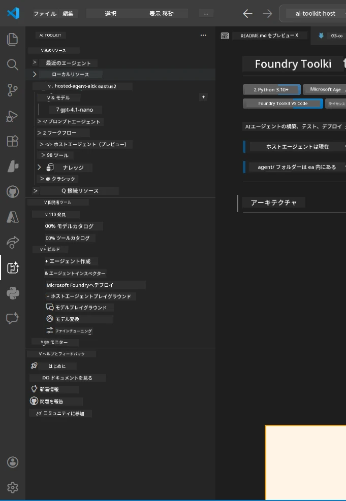
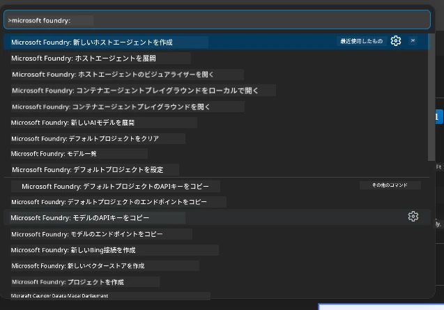

# モジュール 1 - Foundry Toolkit と Foundry Extension のインストール

このモジュールでは、このワークショップで重要な 2 つの VS Code 拡張機能のインストールと確認手順を説明します。[モジュール 0](00-prerequisites.md) ですでにインストール済みの場合は、正しく動作するか確認するためにこのモジュールを使用してください。

---

## ステップ 1: Microsoft Foundry Extension のインストール

**Microsoft Foundry for VS Code** 拡張機能は、Foundry プロジェクトの作成、モデルのデプロイ、ホストされたエージェントのスキャフォールディング、VS Code からの直接デプロイのための主要なツールです。

1. VS Code を開きます。
2. `Ctrl+Shift+X` を押して <strong>拡張機能</strong> パネルを開きます。
3. 上部の検索ボックスに「**Microsoft Foundry**」と入力します。
4. 「**Microsoft Foundry for Visual Studio Code**」というタイトルの結果を探します。
   - 発行元: **Microsoft**
   - 拡張機能 ID: `TeamsDevApp.vscode-ai-foundry`
5. <strong>インストール</strong> ボタンをクリックします。
6. インストールが完了するまで待ちます（小さな進行インジケーターが表示されます）。
7. インストール後、**Activity Bar**（VS Code 左側の縦のアイコンバー）に新しい **Microsoft Foundry** アイコン（ダイヤモンド/AI アイコンのような形）が表示されるはずです。
8. **Microsoft Foundry** アイコンをクリックしてサイドバーを開きます。以下のセクションが表示されているはずです:
   - **Resources**（または Projects）
   - **Agents**
   - **Models**

> **アイコンが表示されない場合:** VS Code を再読み込みしてください (`Ctrl+Shift+P` → `Developer: Reload Window`)。

---

## ステップ 2: Foundry Toolkit Extension のインストール

**Foundry Toolkit** 拡張機能は、[**Agent Inspector**](https://learn.microsoft.com/azure/foundry/agents/how-to/vs-code-agents-workflow-pro-code) というローカルでエージェントのテストとデバッグを行うための視覚的インターフェースを提供するほか、プレイグラウンド、モデル管理、評価ツールも提供します。

1. 拡張機能パネルで (`Ctrl+Shift+X`) 検索ボックスをクリアし、「**Foundry Toolkit**」と入力します。
2. 結果から **Foundry Toolkit** を探します。
   - 発行元: **Microsoft**
   - 拡張機能 ID: `ms-windows-ai-studio.windows-ai-studio`
3. <strong>インストール</strong> をクリックします。
4. インストール後、**Foundry Toolkit** アイコン（ロボット/スパークルのようなアイコン）が Activity Bar に表示されます。
5. **Foundry Toolkit** アイコンをクリックしてサイドバーを開きます。以下のオプションがある Foundry Toolkit ウェルカム画面が表示されるはずです:
   - **Models**
   - **Playground**
   - **Agents**

---

## ステップ 3: 両方の拡張機能が動作しているか確認する

### 3.1 Microsoft Foundry Extension の確認

1. Activity Bar の **Microsoft Foundry** アイコンをクリックします。
2. Azure にサインインしていれば（モジュール 0 から）、**Resources** にプロジェクト一覧が表示されます。
3. サインインを求められたら、**Sign in** をクリックして認証フローに従います。
4. エラーなしでサイドバーが表示されることを確認します。

### 3.2 Foundry Toolkit Extension の確認

1. Activity Bar の **Foundry Toolkit** アイコンをクリックします。
2. ウェルカムビューまたはメインパネルがエラーなしで読み込まれることを確認します。
3. まだ設定は不要です - [モジュール 5](05-test-locally.md) で Agent Inspector を使用します。

### 3.3 コマンドパレットでの確認

1. `Ctrl+Shift+P` を押してコマンドパレットを開きます。
2. 「Microsoft Foundry」と入力すると、以下のようなコマンドが表示されます:
   - `Microsoft Foundry: Create a New Hosted Agent`
   - `Microsoft Foundry: Deploy Hosted Agent`
   - `Microsoft Foundry: Open Model Catalog`
3. `Escape` を押してコマンドパレットを閉じます。
4. 再度コマンドパレットを開き、「Foundry Toolkit」と入力すると、以下のようなコマンドが表示されます:
   - `Foundry Toolkit: Open Agent Inspector`

> これらのコマンドが表示されない場合は、拡張機能が正しくインストールされていない可能性があります。アンインストールして再インストールしてください。

---

## これらの拡張機能がワークショップで何をするのか

| 拡張機能 | 役割 | 使用するモジュール |
|-----------|-------------|-------------------|
| **Microsoft Foundry for VS Code** | Foundry プロジェクトの作成、モデルのデプロイ、**[ホストされたエージェント](https://learn.microsoft.com/azure/foundry/agents/concepts/hosted-agents) のスキャフォールディング** （`agent.yaml`、`main.py`、`Dockerfile`、`requirements.txt` を自動生成）、[Foundry Agent Service](https://learn.microsoft.com/azure/foundry/agents/overview) へのデプロイ | モジュール 2、3、6、7 |
| **Foundry Toolkit** | エージェントのローカルテスト・デバッグ用 Agent Inspector、プレイグラウンド UI、モデル管理 | モジュール 5、7 |

> **Foundry Extension はこのワークショップで最も重要なツールです。** ライフサイクル全体を扱います：スキャフォールディング → 設定 → デプロイ → 検証。Foundry Toolkit は視覚的な Agent Inspector を提供することで補完します。

---

### チェックポイント

- [ ] Activity Bar に Microsoft Foundry アイコンが表示されている
- [ ] クリックするとエラーなくサイドバーが開く
- [ ] Activity Bar に Foundry Toolkit アイコンが表示されている
- [ ] クリックするとエラーなくサイドバーが開く
- [ ] `Ctrl+Shift+P` → 「Microsoft Foundry」と入力すると利用可能なコマンドが表示される
- [ ] `Ctrl+Shift+P` → 「Foundry Toolkit」と入力すると利用可能なコマンドが表示される

---

**前へ:** [00 - 前提条件](00-prerequisites.md) · **次へ:** [02 - Foundry プロジェクトの作成 →](02-create-foundry-project.md)

---

<!-- CO-OP TRANSLATOR DISCLAIMER START -->
**免責事項**：  
本書類はAI翻訳サービス [Co-op Translator](https://github.com/Azure/co-op-translator) を使用して翻訳されています。正確性を期しておりますが、自動翻訳には誤りや不正確な部分が含まれる場合があることをご了承ください。原文の母国語版を正式な情報源と見なしてください。重要な情報については、専門の人間による翻訳を推奨します。本翻訳の利用により生じた誤解や誤訳について、当方は一切の責任を負いません。
<!-- CO-OP TRANSLATOR DISCLAIMER END -->