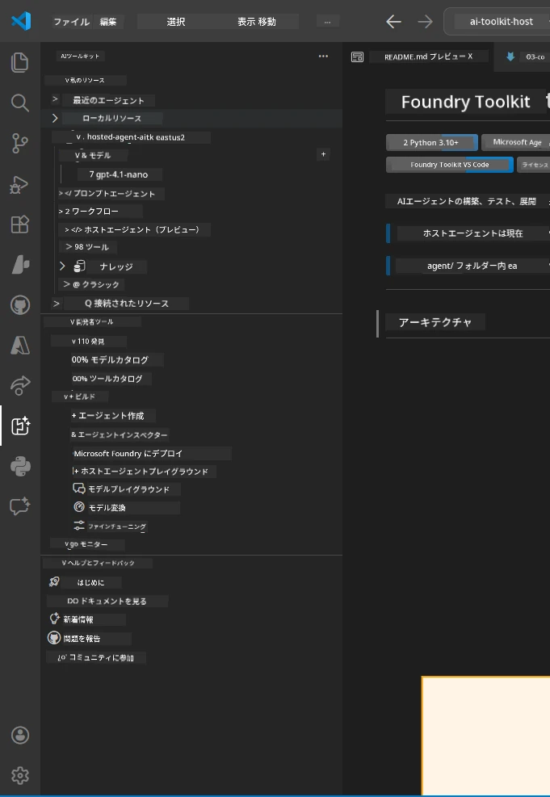
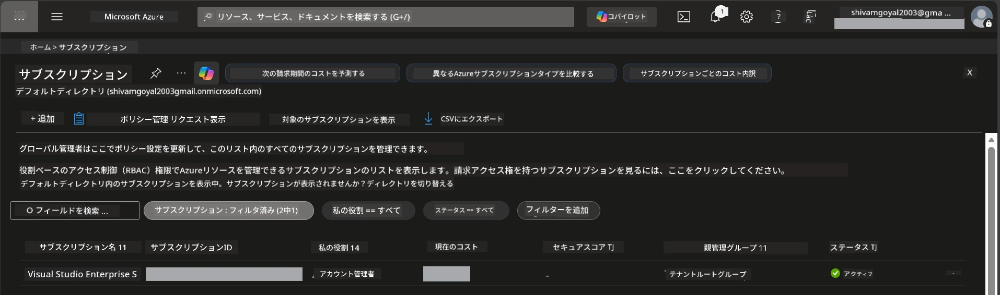
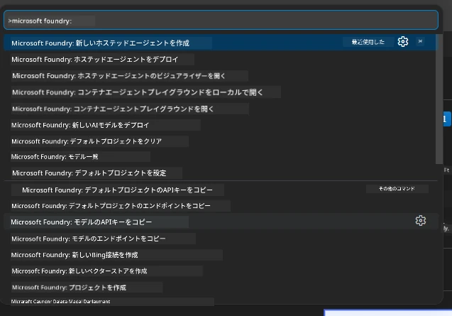
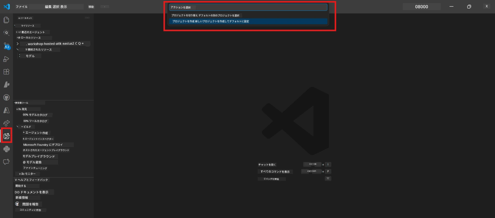
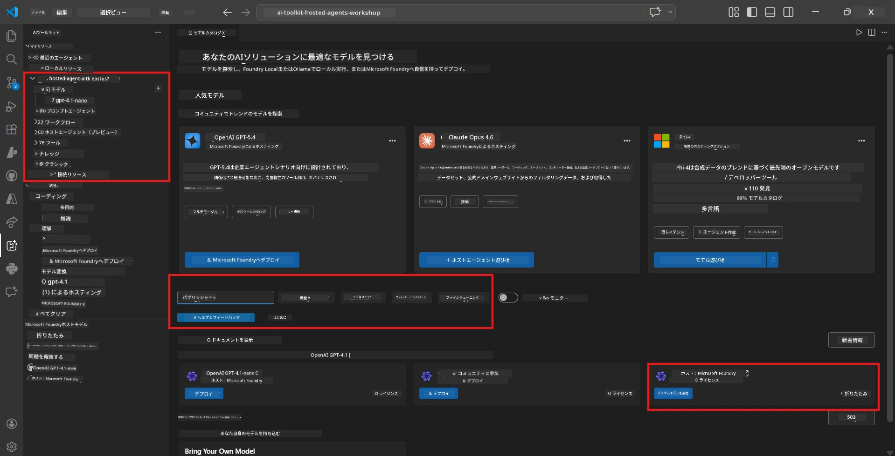
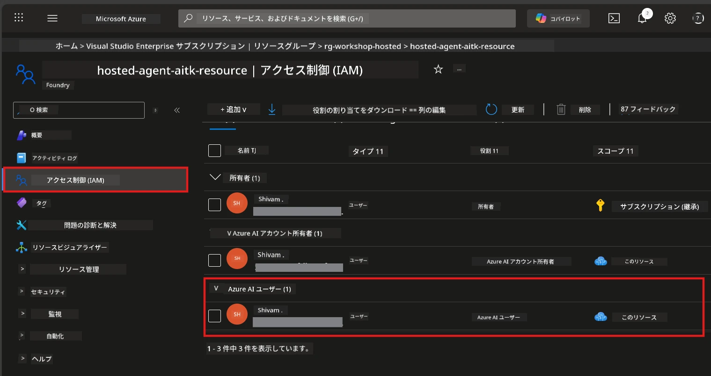

# 設定: エクステンション、プロジェクト & モデル

⏱️ 約15分

このモジュールでは、Foundry Toolkit エクステンションのインストールと確認、Foundry プロジェクトの作成（または接続）、そしてエージェントが使用するモデルのデプロイを行います。

## ステップ 1: Foundry Toolkit のインストール

**VS Code 用 Foundry Toolkit** はこのワークショップの主要なエクステンションです。プロジェクト作成、モデルデプロイ、エージェントのスキャフォールディング、ローカルテスト（Agent Inspector）、クラウドデプロイといった機能をすべて VS Code から提供します。

1. VS Code を開き、`Ctrl+Shift+X` を押して **Extensions** パネルを開きます。
2. **Foundry Toolkit** を検索します。
3. **Foundry Toolkit for VS Code** をインストールします（Publisher: Microsoft, ID: `ms-windows-ai-studio.windows-ai-studio`）。
4. インストール後、アクティビティバー（左のサイドバー）に **Foundry Toolkit** アイコンが表示されます。

> *補足: 古いバージョンのエクステンションではアクティビティバーに「AI TOOLKIT」と表示されることがありますが、機能は同じです。*



## ステップ 2: アクセス環境に応じたセットアップ

> **ケースを選択してください:** あなたのセットアップに合うセクションを展開してください。<strong>いずれか一つ</strong>のパスのみを完了すれば十分です。

<details>
<summary><strong>🅰️ パス A - Azure クラウド（Azure サブスクリプションが必要）</strong></summary>

### Azure CLI

1. [learn.microsoft.com/cli/azure/install-azure-cli](https://learn.microsoft.com/cli/azure/install-azure-cli) からインストール。
2. 確認: `az --version` （バージョン 2.80.0以上を期待）。
3. サインイン: `az login`

### 認証オプション

[Microsoft Agent Framework](https://learn.microsoft.com/agent-framework/overview/) は [`DefaultAzureCredential`](https://learn.microsoft.com/azure/developer/python/sdk/authentication/credential-chains#defaultazurecredential-overview) を使用し、複数の認証方法を順番に試行します。環境に合う方法を選んでください：

#### オプション 1: VS Code アカウント (ワークショップ推奨)
1. VS Code 左下の **Accounts** アイコン（人型）をクリック。
2. **Microsoft Foundry にサインイン**（または **Azure でサインイン**）を選択。
3. ブラウザーが開き、サブスクリプションにアクセス可能な Azure アカウントでサインインする。
4. VS Code に戻ると、左下にアカウント名が表示されるはずです。

#### オプション 2: Azure CLI
```bash
az login
az account set --subscription "<your-subscription-id>"
```

#### オプション 3: サービスプリンシパル (企業/CI)
セキュリティの厳しい環境や CI/CD パイプラインの場合、`.env` ファイルに以下の環境変数を設定します:
```env
AZURE_TENANT_ID=<your-tenant-id>
AZURE_CLIENT_ID=<your-client-id>
AZURE_CLIENT_SECRET=<your-client-secret>
```

> **`DefaultAzureCredential`の仕組み:** 最初に環境変数、次にマネージド ID、次に VS Code サインイン、最後に Azure CLI を試し、成功したものを使います。詳細は [credential chain docs](https://learn.microsoft.com/azure/developer/python/sdk/authentication/credential-chains#defaultazurecredential-overview) を参照してください。

### Azure Developer CLI (azd)

1. インストール: `winget install microsoft.azd` (Windows) または [インストール手順](https://learn.microsoft.com/azure/developer/azure-developer-cli/install-azd) を参照。
2. 確認: `azd version`
3. サインイン: `azd auth login`

### Docker Desktop（任意）

Docker はローカルでコンテナをビルドする場合のみ必要です。Foundry エクステンションはデプロイ時にビルドを自動で処理します。

1. [docs.docker.com/get-docker](https://docs.docker.com/get-docker/) からインストール。
2. 確認: `docker info`

### Azure サブスクリプション & RBAC

1. [portal.azure.com](https://portal.azure.com) にサインイン。
2. **Subscriptions** に移動し、少なくとも一つが **Active** であることを確認。
3. **Subscription ID** をメモ（モジュール 01 で使用します）。



#### RBAC シナリオ表

[Hosted Agent](https://learn.microsoft.com/azure/foundry/agents/concepts/hosted-agents) のデプロイには、標準の Azure `Owner` や `Contributor` ロールに含まれない <strong>データアクション</strong> の権限が必要です。以下の表で必要なロールを確認してください：

| シナリオ | 必須のロール | 割り当て場所 |
|----------|---------------|----------------------|
| 新しい Foundry プロジェクトの作成 | Foundry リソース上の **Azure AI Owner** | Azure ポータルの Foundry リソース |
| 既存プロジェクトへのデプロイ（新規リソース） | サブスクリプション上の **Azure AI Owner** + **Contributor** | サブスクリプション + Foundry リソース |
| 完全設定済みプロジェクトへのデプロイ | アカウント上の **Reader** + プロジェクト上の **Azure AI User** | Azure ポータルのアカウント + プロジェクト |
| ローカルテストのみ（デプロイなし） | プロジェクト上の **Azure AI User** | Azure ポータルのプロジェクト |

> **重要:** Azure の `Owner` および `Contributor` ロールは管理権限（ARM 操作）のみをカバーしています。 `agents/write` などのエージェント作成やデプロイに必要な <strong>データアクション</strong> には [**Azure AI User**](https://learn.microsoft.com/azure/foundry/concepts/rbac-foundry#built-in-roles)（またはそれ以上）が必要です。

## Foundry プロジェクトに接続または作成



1. `Ctrl+Shift+P` → **Foundry Toolkit: Create Project** を入力して選択。
2. ドロップダウンから<strong>Azure サブスクリプション</strong>を選択。
3. <strong>リソースグループ</strong>を選択または作成（例：`rg-hosted-agents-workshop`）。
4. ホストエージェント対応リージョンを選択：`East US`、`West US 2`、または `Sweden Central`。[リージョン対応状況](https://learn.microsoft.com/azure/foundry/agents/concepts/hosted-agents#region-availability)を参照。
5. プロジェクト名を入力（例：`workshop-agents`）。
6. プロビジョニング完了まで2～5分待つ。VS Code に進捗通知が表示されます。
7. 完了後、**Foundry Toolkit** のサイドバーの **MY RESOURCES** にプロジェクトが表示されます。



## モデルをデプロイし RBAC を割り当てる

ホストエージェントは応答を生成するために AI モデルが必要です。

#### モデル選択マトリックス
必要に応じて、異なるモデル階層から選べます：

| モデル | 用途 | コスト | 備考 |
|-------|-------|--------|-------|
| `gpt-4.1` | 高品質で細かい応答 | 高い | 最高の結果、最終テスト推奨 |
| `gpt-4.1-mini/gpt-5-mini` | 高速反復、低コスト | 低い | ワークショップ開発や迅速なテストに適する |
| `gpt-4.1-nano` | 軽量タスク向け | 最も低い | 最もコスト効率が高いが応答はシンプル |

1. `Ctrl+Shift+P` → **Foundry Toolkit: Open Model Catalog** を選択（またはサイドバーの DEVELOPER TOOLS → Model Catalog をクリック）。
2. カタログで **gpt-4.1** を検索。
3. **OpenAI GPT-4.1-mini**（またはより高品質の `gpt-5-mini`）を見つけて **Deploy** をクリック。



4. デプロイ設定で：
   - **デプロイ名:** デフォルトのままか任意の名前を入力。**この名前を覚えておいてください。**
   - **ターゲット:** **Deploy to Foundry Toolkit** を選び、プロジェクトを指定。
5. **Deploy** をクリックし、1～3分待つ。

> **推奨:** ワークショップには `gpt-4.1-mini/gpt-5-mini` を使うと速く安価で良い結果が出ます。

### 重要な値をメモ

デプロイ完了後、以下の2つの値を控えてください（モジュール03で使用します）：

| 値 | 場所 |
|-------|-----------------|
| <strong>プロジェクトエンドポイント</strong> | サイドバーでプロジェクトをクリック → 詳細ビューに URL 表示（例：`https://<account>.services.ai.azure.com/api/projects/<project>`） |
| <strong>モデルデプロイ名</strong> | プロジェクト展開 → **Models** → デプロイしたモデル名（例：`gpt-4.1-mini/gpt-5-mini`） |

### RBAC ロールの割り当て

> ⚠️ **最もよく忘れられるステップです。** 正しいロールがないとモジュール05のデプロイが失敗します。

#### 必要なロールは？
シナリオに応じて以下のロール組み合わせが必要です：

| シナリオ | 必須ロール | 割り当て場所 |
|----------|-------------|--------------------|
| 新しい Foundry プロジェクトの作成 | Foundry リソース上の **Azure AI Owner** | Azure ポータルの Foundry リソース |
| 既存プロジェクトへのデプロイ（新規リソース） | サブスクリプション上の **Azure AI Owner** + **Contributor** | サブスクリプション + Foundry リソース |
| 完全設定済みプロジェクトへのデプロイ | アカウント上の **Reader** + プロジェクト上の **Azure AI User** | Azure ポータルのアカウント + プロジェクト |

**重要:** Azure の `Owner` と `Contributor` は管理権限のみカバーしており、エージェント作成・デプロイに必要な `agents/write` のようなデータアクションは **Azure AI User**（以上）が必要です。

1. [portal.azure.com](https://portal.azure.com) を開く。
2. <strong>Foundry プロジェクト</strong>名を検索 → 「Foundry Toolkit project」タイプの結果をクリック（親アカウントではありません）。
3. 左のナビゲーションで **アクセス制御 (IAM)** をクリック。
4. **+ 追加** → <strong>ロールの割り当てを追加</strong> をクリック。
5. **ロール」タブ:** **Azure AI User** を検索し選択、<strong>次へ</strong> をクリック。
6. **メンバー」タブ:** <strong>ユーザー、グループ、またはサービス プリンシパル</strong>を選択 → **+ メンバーの選択** をクリック → 自分を検索し選択 → <strong>選択</strong> をクリック。
7. **レビュー + 割り当て** → 再度 **レビュー + 割り当て** をクリック。
8. 割り当てが反映されるまで **1～2分待つ**。

> **なぜこのロール？** Azure の `Owner` / `Contributor` は管理権限のみ付与。**Azure AI User** ロールはエージェントの作成・デプロイに必要な `agents/write` のデータアクションを付与します。[Foundry RBAC ドキュメント](https://learn.microsoft.com/azure/foundry/concepts/rbac-foundry#built-in-roles)を参照してください。



</details>

<details>
<summary><strong>🅱️ パス B - ローカル / 無料枠 (Azure サブスクリプション不要)</strong></summary>

### Foundry Local

Foundry Local はクラウドアカウント不要で、ローカルマシン上で AI モデルを実行できます。Foundry Toolkit 経由でモデルカタログからアクセス可能です：

1. Foundry Toolkit エクステンションを開きます。
2. Foundry Toolkit のナビゲーションから **Developer Tools** > **Model Catalog** を選択。
3. 新しいウィンドウのナビゲーションバーで **local** を選択。
4. 下にスクロールし **Phi 4 Mini** を見つけ、<strong>追加ボタン</strong>をクリック。モデルのダウンロードを示すポップアップが表示されます。
5. モデルのダウンロード完了後、次のステップに進めます。

</details>

### ✅ チェックポイント


- [ ] `Ctrl+Shift+P` → "Foundry Toolkit" でコマンドが表示される
- [ ] Foundry Toolkit エクステンションがインストールされ、サイドバーがエラーなしで読み込まれる
- [ ] VS Code が正常に起動し動作する
- [ ] `python --version` で 3.10+ が表示される
- [ ] VS Code のアクティビティバーに Foundry Toolkit アイコンが見える
- [ ] **パス A:** `az login` が成功し、サブスクリプションはアクティブ
- [ ] **パス B:** Foundry Local が動作している (`foundry local status`)
- [ ] **パス A:** サイドバーに Foundry プロジェクトが表示され、モデルがデプロイされ、Azure AI User ロールが割り当てられている
- [ ] **パス B:** Foundry Local がモデル付きで動作している
- [ ] <strong>エンドポイント</strong> と <strong>モデルデプロイ名</strong> をメモしている


**前へ:** [00 - 前提条件](00-prerequisites.md) · **次へ:** [02 - ホストエージェントを作成 →](02-create-hosted-agent.md)

---

<!-- CO-OP TRANSLATOR DISCLAIMER START -->
**免責事項**：
本書類は AI 翻訳サービス [Co-op Translator](https://github.com/Azure/co-op-translator) を使用して翻訳されています。正確性を期していますが、自動翻訳には誤りや不正確な部分が含まれる可能性があることをご承知おきください。原文の原語版が正式な情報源とみなされるべきです。重要な情報については、専門の人間による翻訳を推奨します。本翻訳の利用により生じたいかなる誤解や解釈違いについても、当方は責任を負いかねます。
<!-- CO-OP TRANSLATOR DISCLAIMER END -->