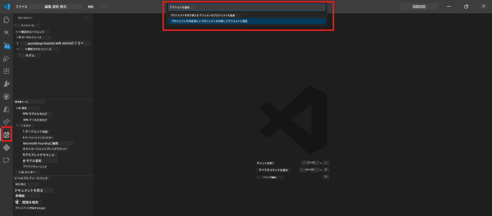
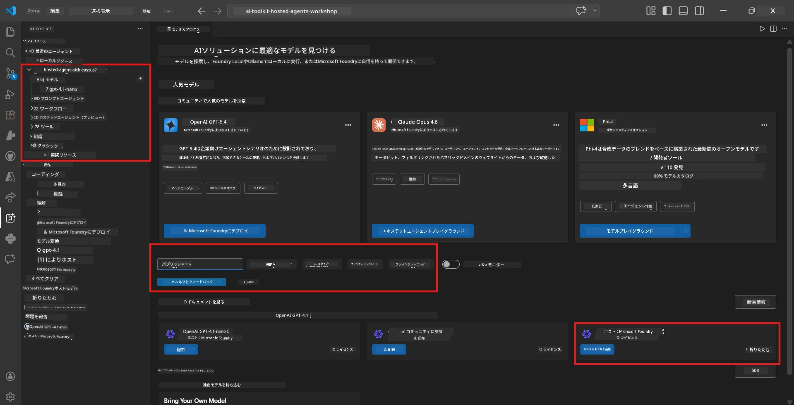
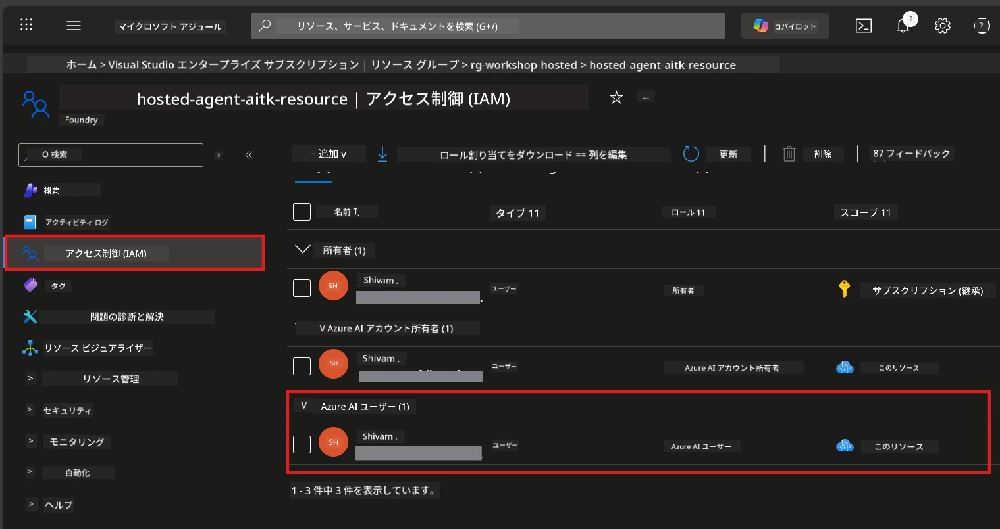

# モジュール 2 - Foundry プロジェクトの作成とモデルのデプロイ

このモジュールでは、Microsoft Foundry プロジェクトを作成（または選択）し、エージェントが使用するモデルをデプロイします。すべてのステップは明確に記述されていますので、順に従ってください。

> すでにモデルがデプロイされた Foundry プロジェクトをお持ちの場合は、[モジュール 3](03-create-hosted-agent.md) にスキップしてください。

---

## ステップ 1: VS Code から Foundry プロジェクトを作成する

Microsoft Foundry 拡張機能を使用して、VS Code を離れずにプロジェクトを作成します。

1. `Ctrl+Shift+P` を押して <strong>コマンドパレット</strong> を開きます。
2. 「**Microsoft Foundry: Create Project**」と入力して選択します。
3. ドロップダウンが表示されるので、リストから **Azure サブスクリプション** を選択します。
4. <strong>リソースグループ</strong> の選択または作成を求められます:
   - 新規作成する場合：名前を入力（例: `rg-hosted-agents-workshop`）して Enter を押します。
   - 既存のものを使う場合：ドロップダウンから選択します。
5. <strong>リージョン</strong> を選択します。**重要:** ホストエージェントをサポートするリージョンを選んでください。[リージョンの利用可能性](https://learn.microsoft.com/azure/foundry/agents/concepts/hosted-agents#region-availability) を確認しましょう。一般的な選択肢は `East US`、`West US 2`、または `Sweden Central` です。
6. Foundry プロジェクトの <strong>名前</strong> を入力します（例: `workshop-agents`）。
7. Enter を押して、プロビジョニングが完了するまで待ちます。

> **プロビジョニングには2～5分かかります。** VS Code の右下に進捗通知が表示されます。プロビジョニング中は VS Code を閉じないでください。

8. 完了すると **Microsoft Foundry** サイドバーの **Resources** に新しいプロジェクトが表示されます。
9. プロジェクト名をクリックして展開し、**Models + endpoints** や **Agents** といったセクションが表示されていることを確認します。



### 代替方法: Foundry ポータルで作成する

ブラウザを使いたい場合は以下の通りです：

1. [https://ai.azure.com](https://ai.azure.com) を開いてサインインします。
2. ホームページで **Create project** をクリックします。
3. プロジェクト名を入力し、サブスクリプション、リソースグループ、リージョンを選択します。
4. **Create** をクリックし、プロビジョニングが完了するまで待ちます。
5. 作成後、VS Code に戻り、Foundry サイドバーを更新（リフレッシュアイコンをクリック）するとプロジェクトが表示されます。

---

## ステップ 2: モデルをデプロイする

あなたの [ホストされたエージェント](https://learn.microsoft.com/azure/foundry/agents/concepts/hosted-agents) には Azure OpenAI モデルが必要であり、それを使って応答を生成します。これから [モデルをデプロイします](https://learn.microsoft.com/azure/ai-foundry/openai/how-to/create-resource#deploy-a-model)。

1. `Ctrl+Shift+P` を押して <strong>コマンドパレット</strong> を開きます。
2. 「**Microsoft Foundry: Open [Model Catalog](https://learn.microsoft.com/azure/ai-foundry/openai/concepts/models)**」と入力して選択します。
3. VS Code に Model Catalog ビューが表示されます。ブラウズするか検索バーで **gpt-4.1** を探します。
4. **gpt-4.1** のモデルカードをクリックします（コストを抑えたい場合は `gpt-4.1-mini` を選択）。
5. **Deploy** をクリックします。



6. デプロイ構成で以下を設定します：
   - **Deployment name**：デフォルトのまま（例：`gpt-4.1`）でもよいですし、任意の名前を入力しても構いません。**この名前は、モジュール 4 で必要になるので忘れないでください。**
   - **Target**：**Deploy to Microsoft Foundry** を選択し、先ほど作成したプロジェクトを選択します。
7. **Deploy** をクリックし、デプロイが完了するのを待ちます（1〜3分）。

### モデルの選択

| モデル           | 適している用途               | コスト  | 備考                                       |
|----------------|--------------------------|-------|------------------------------------------|
| `gpt-4.1`      | 高品質でニュアンスのある応答      | 高め    | 最良の結果、最終テストに推奨                          |
| `gpt-4.1-mini` | 迅速な反復作業、低コスト          | 低め    | ワークショップの開発や迅速なテストに最適                 |
| `gpt-4.1-nano` | 軽量タスク                      | 最低    | コスト最小、ただし応答はシンプル                         |

> <strong>このワークショップの推奨</strong>：開発とテストには `gpt-4.1-mini` を使いましょう。速くて安く、演習で十分な結果が得られます。

### モデルデプロイの検証

1. **Microsoft Foundry** サイドバーで、プロジェクトを展開します。
2. **Models + endpoints**（または類似セクション）を確認します。
3. デプロイ済みのモデル（例：`gpt-4.1-mini`）が **Succeeded** または **Active** の状態で表示されているはずです。
4. モデルデプロイをクリックして詳細を表示します。
5. 以下の二つの値を<strong>メモしておいてください</strong> — モジュール 4 で使います：

   | 設定             | 場所                                           | 例                              |
   |----------------|----------------------------------------------|--------------------------------|
   | **Project endpoint**       | Foundry サイドバーのプロジェクト名をクリックし、詳細画面でエンドポイント URL を確認     | `https://<account>.services.ai.azure.com/api/projects/<project>` |
   | **Model deployment name**  | デプロイ済みモデルの横に表示されている名前                        | `gpt-4.1-mini`                  |

---

## ステップ 3: 必要な RBAC ロールを割り当てる

ここが<strong>最も見落とされやすいステップ</strong>です。正しいロールが割り当てられていないと、モジュール 6 のデプロイで権限エラーが発生します。

### 3.1 自分自身に Azure AI User ロールを割り当てる

1. ブラウザで [https://portal.azure.com](https://portal.azure.com) にアクセスします。
2. 上部の検索バーに **Foundry プロジェクト名** を入力して結果から選択します。
   - **重要:** 親アカウントやハブリソースではなく、<strong>プロジェクト</strong> リソース（タイプ: "Microsoft Foundry project"）に移動してください。
3. プロジェクトの左メニューから **アクセス制御 (IAM)** をクリックします。
4. 上部の **+ 追加** ボタンを押し → <strong>ロールの割り当ての追加</strong> を選択します。
5. <strong>ロール</strong> タブで [**Azure AI User**](https://learn.microsoft.com/azure/foundry/concepts/rbac-foundry#built-in-roles) を探して選択し、<strong>次へ</strong> をクリックします。
6. <strong>メンバー</strong> タブで：
   - **ユーザー、グループ、またはサービスプリンシパル** を選択。
   - **+ メンバーの選択** をクリック。
   - 自分の名前またはメールアドレスを検索し選択、<strong>選択</strong> をクリック。
7. <strong>確認と割り当て</strong> → 再度 <strong>確認と割り当て</strong> をクリックして確定します。



### 3.2 （オプション）Azure AI Developer ロールを割り当てる

プロジェクト内で追加のリソースを作成したり、プログラムからデプロイを管理したい場合：

1. 上記と同じ手順を繰り返しますが、ステップ5では **Azure AI Developer** を選択します。
2. 割り当ては **Foundry リソース（アカウント）レベル** で行い、プロジェクトレベルのみに限定しないようにしてください。

### 3.3 ロール割り当ての確認

1. プロジェクトの **アクセス制御 (IAM)** ページで <strong>ロールの割り当て</strong> タブをクリックします。
2. 自分の名前を検索します。
3. プロジェクト範囲で少なくとも **Azure AI User** が割り当てられていることを確認します。

> **なぜ重要か:** [`Azure AI User`](https://learn.microsoft.com/azure/foundry/concepts/rbac-foundry#built-in-roles) ロールは `Microsoft.CognitiveServices/accounts/AIServices/agents/write` のデータ操作を許可します。これがないとデプロイ時に次のエラーが発生します：
>
> ```
> Error: lacks the required data action 
> Microsoft.CognitiveServices/accounts/AIServices/agents/write 
> to perform POST /api/projects/{projectName}/assistants operation.
> ```
>
> 詳細は [モジュール 8 - トラブルシューティング](08-troubleshooting.md) を参照してください。

---

### チェックポイント

- [ ] Foundry プロジェクトが存在し、VS Code の Microsoft Foundry サイドバーに表示されている
- [ ] モデルが少なくとも1つ（例：`gpt-4.1-mini`）デプロイされ、状態が **Succeeded** である
- [ ] <strong>プロジェクトエンドポイント</strong> URL と <strong>モデルデプロイ名</strong> をメモしている
- [ ] **Azure AI User** ロールがプロジェクトレベルで割り当てられている（Azure Portal → IAM → ロールの割り当てで確認）
- [ ] プロジェクトはホストエージェントに対応した [サポートされているリージョン](https://learn.microsoft.com/azure/foundry/agents/concepts/hosted-agents#region-availability) にある

---

**前へ:** [01 - Foundry ツールキットのインストール](01-install-foundry-toolkit.md) · **次へ:** [03 - ホストエージェントを作成 →](03-create-hosted-agent.md)

---

<!-- CO-OP TRANSLATOR DISCLAIMER START -->
**免責事項**:  
本書類はAI翻訳サービス [Co-op Translator](https://github.com/Azure/co-op-translator) を使用して翻訳されています。正確性を期しておりますが、自動翻訳には誤りや不正確な部分が含まれる可能性があることをご了承ください。原文の母国語版が正式な情報源とみなされます。重要な情報については、専門の人間による翻訳を推奨します。本翻訳の利用により生じた誤解や解釈違いについて、一切の責任を負いかねます。
<!-- CO-OP TRANSLATOR DISCLAIMER END -->