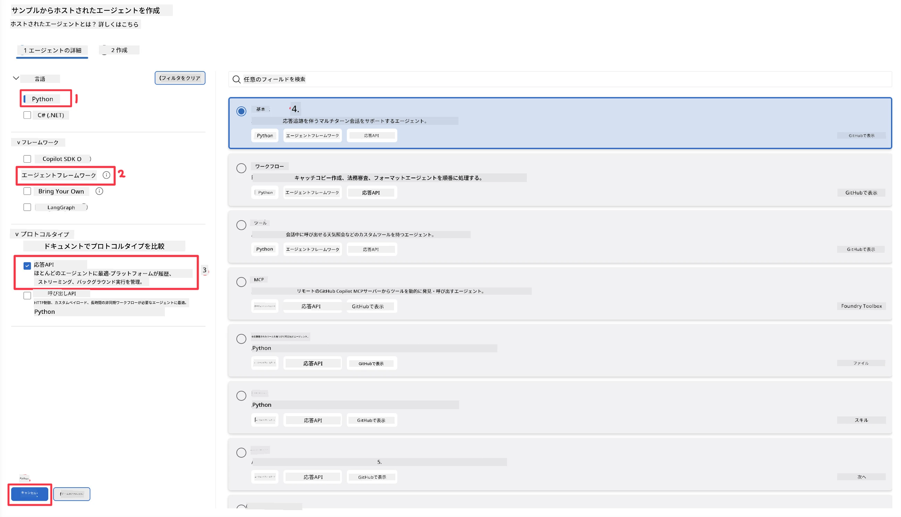
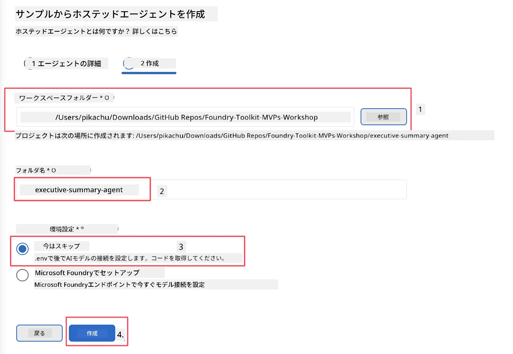

# モジュール 2 - 新しいホストエージェントを作成する

⏱️ 約5分

このモジュールでは、Foundry Toolkit を使用して<strong>ホストエージェントプロジェクトのスキャフォールドを作成</strong>します。スキャフォールドは完全なプロジェクト構成（`agent.yaml`、`main.py`、`Dockerfile`、`requirements.txt`、および VS Code のデバッグ構成）を生成するため、エージェントの動作カスタマイズに集中できます。

> **重要なポイント:** このラボの `agent/` フォルダーは Foundry Toolkit が生成する例です。これらのファイルを最初から書く必要はありません。

### スキャフォールドウィザードの流れ


---

## ステップ1: Create Hosted Agent ウィザードを開く

1. `Ctrl+Shift+P` を押して<strong>コマンドパレット</strong>を開きます。
2. 「**Foundry Toolkit: Create new Hosted Agent**」と入力して選択します。

> **代替案: Foundry ポータルから作成**
> ブラウザを使いたい場合は、[https://ai.azure.com](https://ai.azure.com) でプロジェクトを作成できます。プロジェクトがプロビジョニングされたら、VS Code に戻り、**Foundry Toolkit** サイドバーから接続してください。

> **代替案:** Foundry Toolkit サイドバーの **Hosted Agents (Preview)** 横の **+** アイコンをクリックします。

## ステップ2: 設定を選択する



1. 左のナビゲーション／オプションセクションで次のものを選択します:

| メニュー | 選択 | 備考 |
|--------|-----------|-------|
| **Language** | Python | C# もサポート |
| **Framework** | Agent Framework | Agent Framework SDK を使ったシンプルな開始点 |
| **API type** | Response API | `POST /responses` - プラットフォーム管理の履歴付き会話型 |
| **Template** | Basic | Agent Framework SDK を使ったシンプルな開始点 |

2. 選択したら **Next** をクリックします



3. 次のウィンドウで次のものを選択します:

| メニュー | 選択 | 備考 |
|--------|-----------|-------|
| **Workspace folder** | 対象フォルダーを選択 | 例: `/workspace/Foundry_Toolkit_for_VSCode_Lab/` またはこのリポジトリのサブフォルダー |
| **Agent name** | 名前を入力 | 例: `executive-summary-agent` |
| **Environment Setup** | 今はスキップ |  |

**create** をクリックしてエージェントを作成します。ホストエージェント名の新しいフォルダーが作成されます。

## ステップ3: 生成されたプロジェクトを確認する

スキャフォールドが完了したら、エクスプローラー（`Ctrl+Shift+E`）で以下のファイルを確認します:

```
📂 my-agent/
├── .env                ← Environment variables (placeholders)
├── .vscode/
│   ├── launch.json     ← Debug config (F5 → run + Agent Inspector)
│   └── tasks.json      ← VS Code task definitions
├── agent.yaml          ← Agent definition (kind: hosted)
├── Dockerfile          ← Container config for deployment
├── main.py             ← Agent entry point (your main code)
└── requirements.txt    ← Python dependencies
```

### 主要ファイルの説明

| ファイル | 目的 |
|------|---------|
| `agent.yaml` | エージェントを `kind: hosted` として宣言し、環境変数をマッピングし、`/responses` プロトコルを定義 |
| `main.py` | `FoundryChatClient` を作成し → 指示付きの `Agent` でラップし → ポート8088で `ResponsesHostServer` を通じて提供 |
| `Dockerfile` | `python:3.12-slim` を使用、依存関係をインストールし、ポート8088を公開し、`main.py` を実行 |
| `requirements.txt` | `agent-framework-foundry`、`agent-framework-foundry-hosting`、`mcp`、`debugpy` |

> **重要:** スキャフォールドされたエージェントフォルダー（`agent/` フォルダー自体）を VS Code で直接開いてください。そうすることで `.vscode/launch.json` と `tasks.json` が正しく動作し、F5 デバッグが可能になります。

---

### ✅ チェックポイント

- [ ] 期待されるすべてのファイルが作成されたスキャフォールドプロジェクト
- [ ] `agent.yaml` に `kind: hosted` と `protocol: responses` が表示されている
- [ ] `main.py` に `Agent`、`FoundryChatClient`、`ResponsesHostServer` がインポートされている
- [ ] エージェントフォルダーがワークスペースルートとして VS Code で開かれている

---

**前へ:** [01 - Setup](01-setup.md) · **次へ:** [03 - Configure & Code →](03-configure-and-code.md)

---

<!-- CO-OP TRANSLATOR DISCLAIMER START -->
**免責事項**：
本書類は AI 翻訳サービス [Co-op Translator](https://github.com/Azure/co-op-translator) を使用して翻訳されています。正確性を期していますが、自動翻訳には誤りや不正確な部分が含まれる可能性があることをご承知おきください。原文の原語版が正式な情報源とみなされるべきです。重要な情報については、専門の人間による翻訳を推奨します。本翻訳の利用により生じたいかなる誤解や解釈違いについても、当方は責任を負いかねます。
<!-- CO-OP TRANSLATOR DISCLAIMER END -->