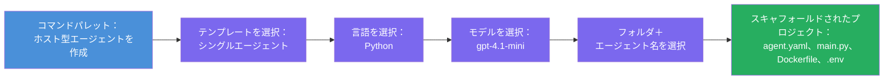

# Module 3 - 新しいホスト型エージェントの作成（Foundry拡張機能による自動スキャフォールド）

このモジュールでは、Microsoft Foundry拡張機能を使用して<strong>新しい[ホスト型エージェント](https://learn.microsoft.com/azure/foundry/agents/concepts/hosted-agents)プロジェクトをスキャフォールド</strong>します。拡張機能は、`agent.yaml`、`main.py`、`Dockerfile`、`requirements.txt`、`.env`ファイル、VS Codeのデバッグ構成など、プロジェクトの構造全体を生成します。スキャフォールドの後、これらのファイルをエージェントの指示、ツール、構成でカスタマイズします。

> **重要なポイント:** このラボの `agent/` フォルダーは、Foundry拡張機能がこのスキャフォールドコマンドを実行したときに生成する例です。これらのファイルは最初から自分で書くのではなく、拡張機能が作成し、その後修正します。

### スキャフォールドウィザードの流れ


---

## ステップ1: Create Hosted Agentウィザードを開く

1. `Ctrl+Shift+P`を押して<strong>コマンドパレット</strong>を開きます。
2. 「**Microsoft Foundry: Create a New Hosted Agent**」と入力して選択します。
3. ホスト型エージェント作成ウィザードが開きます。

> **別の方法:** Microsoft Foundryのサイドバーからもアクセスできます → <strong>Agents</strong>の横にある<strong>+</strong>アイコンをクリック、または右クリックして<strong>Create New Hosted Agent</strong>を選択。

---

## ステップ2: テンプレートを選択

ウィザードがテンプレート選択を求めます。次のような選択肢が表示されます：

| テンプレート | 説明 | 使用タイミング |
|----------|-------------|-------------|
| **Single Agent** | 独自のモデル、指示、オプションのツールを持つ単一エージェント | このワークショップ（ラボ01） |
| **Multi-Agent Workflow** | 複数エージェントが順に連携するワークフロー | ラボ02 |

1. <strong>Single Agent</strong>を選択します。
2. <strong>次へ</strong>をクリックします（または自動で進みます）。

---

## ステップ3: プログラミング言語を選択

1. <strong>Python</strong>を選択します（このワークショップ推奨）。
2. <strong>次へ</strong>をクリックします。

> <strong>C#もサポート</strong>されています。もし.NETを好む場合は、スキャフォールドの構造は似ています（`main.py`の代わりに`Program.cs`を使用）。

---

## ステップ4: モデルを選択

1. ウィザードにFoundryプロジェクトに配備したモデル（モジュール2で作成）が表示されます。
2. デプロイしたモデル（例：**gpt-4.1-mini**）を選択します。
3. <strong>次へ</strong>をクリックします。

> モデルが表示されない場合は、[モジュール2](02-create-foundry-project.md)に戻ってモデルをデプロイしてください。

---

## ステップ5: フォルダーの場所とエージェント名を選択

1. ファイルダイアログが開き、プロジェクトを作成する<strong>ターゲットフォルダー</strong>を選択します。このワークショップの場合：
   - 新規の場合：任意のフォルダを選択（例：`C:\Projects\my-agent`）
   - ワークショップリポジトリ内で作業する場合：`workshop/lab01-single-agent/agent/` 以下に新しいサブフォルダーを作成
2. ホスト型エージェントの<strong>名前</strong>を入力（例：`executive-summary-agent` または `my-first-agent`）。
3. <strong>作成</strong>をクリック（またはEnterキー）。

---

## ステップ6: スキャフォールディングの完了を待つ

1. VS Codeが<strong>新しいウィンドウ</strong>でスキャフォールディング済のプロジェクトを開きます。
2. 数秒待ってプロジェクトが完全に読み込まれるのを待ちます。
3. エクスプローラー（`Ctrl+Shift+E`）に次のファイルが表示されます：

```
📂 my-first-agent/
├── .env                ← Environment variables (auto-generated with placeholders)
├── .vscode/
│   └── launch.json     ← Debug configuration (F5 to run + Agent Inspector)
├── agent.yaml          ← Agent definition (kind: hosted)
├── Dockerfile          ← Container configuration for deployment
├── main.py             ← Agent entry point (your main code file)
└── requirements.txt    ← Python dependencies
```

> **これはこのラボの `agent/` フォルダーと同じ構造です。** Foundry拡張機能が自動生成したファイルなので、手動で作成する必要はありません。

> **ワークショップ注記:** このワークショップリポジトリの `.vscode/` フォルダーは<strong>ワークスペースのルート</strong>にあり（各プロジェクト内ではありません）、共通の `launch.json` と `tasks.json` が含まれています。2つのデバッグ構成 - **"Lab01 - Single Agent"** と **"Lab02 - Multi-Agent"** - はそれぞれ対応するラボの `cwd` を指しています。F5を押す際は、作業中のラボに対応した構成をドロップダウンから選んでください。

---

## ステップ7: 生成された各ファイルの理解

ウィザードが作成した各ファイルを確認しましょう。これらの理解はモジュール4（カスタマイズ）に重要です。

### 7.1 `agent.yaml` - エージェント定義

`agent.yaml` を開くと次のような内容です：

```yaml
# yaml-language-server: $schema=https://raw.githubusercontent.com/microsoft/AgentSchema/refs/heads/main/schemas/v1.0/ContainerAgent.yaml

kind: hosted
name: my-first-agent
description: >
  A hosted agent deployed to Microsoft Foundry Agent Service.
metadata:
  authors:
    - Microsoft
  tags:
    - Azure AI AgentServer
    - Microsoft Agent Framework
    - Hosted Agent
protocols:
  - protocol: responses
    version: v1
environment_variables:
  - name: AZURE_AI_PROJECT_ENDPOINT
    value: ${PROJECT_ENDPOINT}
  - name: AZURE_AI_MODEL_DEPLOYMENT_NAME
    value: ${MODEL_DEPLOYMENT_NAME}
dockerfile_path: Dockerfile
resources:
  cpu: '0.25'
  memory: 0.5Gi
```

**主な項目：**

| 項目 | 目的 |
|-------|---------|
| `kind: hosted` | ホスト型エージェント（コンテナベース、[Foundry Agent Service](https://learn.microsoft.com/azure/foundry/agents/overview) にデプロイされることを宣言） |
| `protocols: responses v1` | エージェントがOpenAI互換の `/responses` HTTPエンドポイントを提供 |
| `environment_variables` | `.env` の値をコンテナの環境変数にマッピング（デプロイ時） |
| `dockerfile_path` | コンテナイメージ構築に使うDockerfileのパス |
| `resources` | コンテナのCPU・メモリ割当（0.25 CPU、0.5Gi メモリ） |

### 7.2 `main.py` - エージェントのエントリーポイント

`main.py` を開きます。ここがエージェントロジックのメインPythonファイルです。スキャフォールドには以下が含まれます：

```python
from agent_framework.azure import AzureAIAgentClient
from azure.ai.agentserver.agentframework import from_agent_framework
from azure.identity.aio import DefaultAzureCredential
```

**主なインポート：**

| インポート | 目的 |
|--------|--------|
| `AzureAIAgentClient` | Foundryプロジェクトに接続し、`.as_agent()`でエージェントを作成 |
| [`DefaultAzureCredential`](https://learn.microsoft.com/azure/developer/python/sdk/authentication/credential-chains#defaultazurecredential-overview) | 認証を処理（Azure CLI、VS Codeサインイン、マネージドID、サービスプリンシパル対応） |
| `from_agent_framework` | エージェントをHTTPサーバーとしてラップし、`/responses`エンドポイントを公開 |

メインの流れは：
1. クレデンシャルを作成 → クライアントを作成 → `.as_agent()`でエージェント取得（非同期コンテキストマネージャー） → サーバーとしてラップ → 実行

### 7.3 `Dockerfile` - コンテナイメージ

```dockerfile
FROM python:3.14-slim

WORKDIR /app

COPY ./ .

RUN pip install --upgrade pip && \
    if [ -f requirements.txt ]; then \
        pip install -r requirements.txt; \
    else \
        echo "No requirements.txt found" >&2; exit 1; \
    fi

EXPOSE 8088

CMD ["python", "main.py"]
```

**主なポイント：**
- ベースイメージは `python:3.14-slim`。
- プロジェクトファイル全てを `/app` にコピー。
- `pip`をアップグレードし、`requirements.txt` から依存関係をインストール。ファイルがないとエラーになる。
- **ポート8088を公開** - ホスト型エージェントに必要なポートで変更禁止。
- `python main.py` でエージェントを起動。

### 7.4 `requirements.txt` - 依存関係

```
agent-framework-azure-ai==1.0.0rc3
agent-framework-core==1.0.0rc3
azure-ai-agentserver-agentframework==1.0.0b16
azure-ai-agentserver-core==1.0.0b16
debugpy
agent-dev-cli
```

| パッケージ | 目的 |
|---------|---------|
| `agent-framework-azure-ai` | Microsoft Agent FrameworkのAzure AI統合 |
| `agent-framework-core` | エージェント構築のコアランタイム（`python-dotenv`を含む） |
| `azure-ai-agentserver-agentframework` | Foundry Agent Service向けホスト型エージェントサーバーランタイム |
| `azure-ai-agentserver-core` | コアのエージェントサーバー抽象化 |
| `debugpy` | Pythonデバッグサポート（VS CodeでのF5デバッグに使用） |
| `agent-dev-cli` | ローカルでのエージェントテスト開発CLI（デバッグ/実行構成で使用） |

---

## エージェントプロトコルの理解

ホスト型エージェントは<strong>OpenAI Responses API</strong> プロトコルで通信します。ローカルでもクラウドでも、エージェントは単一のHTTPエンドポイントを公開します：

```
POST http://localhost:8088/responses
Content-Type: application/json

{
  "input": "Your prompt here",
  "stream": false
}
```

Foundry Agent Serviceはこのエンドポイントを呼び出してユーザープロンプトを送り、エージェントの応答を受け取ります。これはOpenAI APIと同じプロトコルなので、OpenAI Responses形式に対応した任意のクライアントから互換的に利用できます。

---

### チェックポイント

- [ ] スキャフォールドウィザードが正常に完了し、<strong>新しいVS Codeウィンドウ</strong>が開いた
- [ ] `agent.yaml`、`main.py`、`Dockerfile`、`requirements.txt`、`.env`の5つのファイルがすべて見える
- [ ] `.vscode/launch.json`ファイルが存在する（F5デバッグを可能にする - このワークショップではワークスペースルートにあり、ラボごとの設定がされている）
- [ ] 各ファイルを確認し、目的を理解している
- [ ] ポート `8088` が必須であり、`/responses` エンドポイントがプロトコルであることを理解している

---

**前へ:** [02 - Foundryプロジェクトの作成](02-create-foundry-project.md) · **次へ:** [04 - 設定とコーディング →](04-configure-and-code.md)

---

<!-- CO-OP TRANSLATOR DISCLAIMER START -->
**免責事項**:  
本書類は AI 翻訳サービス [Co-op Translator](https://github.com/Azure/co-op-translator) を使用して翻訳されています。正確性を期しておりますが、自動翻訳には誤りや不正確な箇所が含まれる可能性があることをご了承ください。原文の母国語の文書が権威ある情報源とみなされます。重要な情報については、専門の人による翻訳を推奨します。本翻訳の使用により生じたいかなる誤解や誤訳についても責任を負いかねます。
<!-- CO-OP TRANSLATOR DISCLAIMER END -->