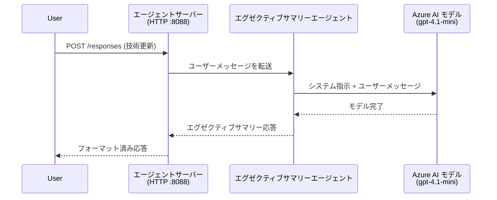
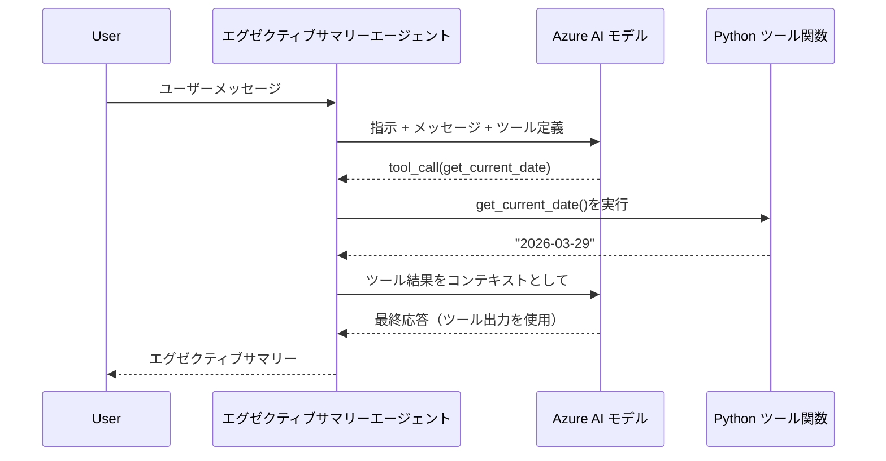

# モジュール4 - インストラクションの設定、環境構築、および依存関係のインストール

このモジュールでは、モジュール3で自動生成されたエージェントファイルをカスタマイズします。ここでジェネリックなスキャフォールドを<strong>あなたの</strong>エージェントに変換します。具体的にはインストラクションを書き、環境変数を設定し、オプションでツールを追加し、依存関係をインストールします。

> **リマインダー:** Foundry拡張機能がプロジェクトファイルを自動生成しました。次にそれらを修正します。カスタマイズされたエージェントの完全な動作例は [`agent/`](../../../../../workshop/lab01-single-agent/agent) フォルダーを参照してください。

---

## コンポーネントの連携

### リクエストのライフサイクル（単一エージェント）


> **ツール使用時:** エージェントにツールが登録されている場合、モデルは直接の完了ではなくツールコールを返すことがあります。フレームワークはそのツールをローカルで実行し、結果をモデルに返し、モデルは最終応答を生成します。


---

## ステップ1: 環境変数の設定

スキャフォールドがプレースホルダー値入りの `.env` ファイルを作成しました。モジュール2から実際の値を入力する必要があります。

1. スキャフォールドされたプロジェクトのルートにある **`.env`** ファイルを開きます。
2. プレースホルダーを実際の Foundry プロジェクトの詳細に置き換えます：

   ```env
   PROJECT_ENDPOINT=https://<your-account>.services.ai.azure.com/api/projects/<your-project>
   MODEL_DEPLOYMENT_NAME=gpt-4.1-mini
   ```

3. ファイルを保存します。

### これらの値はどこで見つけるか

| 値 | 見つけ方 |
|-----|----------|
| <strong>プロジェクトのエンドポイント</strong> | VS Codeの **Microsoft Foundry** サイドバーを開き → プロジェクトをクリック → 詳細ビューにエンドポイントURLが表示されます。例：`https://<account-name>.services.ai.azure.com/api/projects/<project-name>` |
| <strong>モデル展開名</strong> | Foundryサイドバーでプロジェクトを展開し → **Models + endpoints** を見る → 展開されたモデルの横に名前が表示されます（例：`gpt-4.1-mini`） |

> **セキュリティ:** `.env` ファイルは決してバージョン管理にコミットしないでください。デフォルトで `.gitignore` に含まれています。もし含まれていなければ、追加してください:
> ```
> .env
> ```

### 環境変数の流れ

マッピングチェーンは次の通りです：`.env` → `main.py`（`os.getenv`で読み込み）→ `agent.yaml`（デプロイ時にコンテナ環境変数としてマップされる）。

`main.py` では以下のようにこれらの値を読み込みます：

```python
PROJECT_ENDPOINT = os.getenv("AZURE_AI_PROJECT_ENDPOINT") or os.getenv("PROJECT_ENDPOINT")
MODEL_DEPLOYMENT_NAME = os.getenv("AZURE_AI_MODEL_DEPLOYMENT_NAME", os.getenv("MODEL_DEPLOYMENT_NAME", "gpt-4.1-mini"))
```

`AZURE_AI_PROJECT_ENDPOINT` と `PROJECT_ENDPOINT` の両方を受け付けます（`agent.yaml` は `AZURE_AI_*` プレフィックスを使用）。

---

## ステップ2: エージェントの指示を書く

これは最も重要なカスタマイズステップです。指示はエージェントの個性、動作、出力形式、および安全制約を定義します。

1. プロジェクトの `main.py` を開きます。
2. 指示文の文字列を探します（スキャフォールドにはデフォルトの一般的なものが含まれています）。
3. 詳細かつ構造化された指示に置き換えます。

### 良い指示に含まれるもの

| コンポーネント | 目的 | 例 |
|----------|-------|----|
| <strong>役割</strong> | エージェントの性質と役割 | 「あなたは経営層向けのサマリーエージェントです」 |
| <strong>対象読者</strong> | 応答の対象者 | 「技術的背景が限定的なシニアリーダー」 |
| <strong>入力定義</strong> | 取り扱うプロンプトの種類 | 「技術的インシデントレポート、運用アップデート」 |
| <strong>出力形式</strong> | 応答の正確な構造 | 「経営概要：- 何が起きたか：... - 事業影響：... - 次のステップ：...» |
| <strong>ルール</strong> | 制約や拒否条件 | 「提供された情報以外を追加しない」 |
| <strong>安全性</strong> | 誤用と幻覚の防止 | 「入力が不明瞭なら明確化を求める」 |
| <strong>例</strong> | インプット/アウトプットのペアで行動を誘導 | 2～3例の異なる入力を含む |

### 例：経営概要エージェントの指示

ワークショップの [`agent/main.py`](../../../../../workshop/lab01-single-agent/agent/main.py) の指示は以下です：

```python
AGENT_INSTRUCTIONS = """You are an "Explain Like I'm an Executive" agent.

Purpose:
Your job is to translate complex technical or operational information into
clear, concise, and outcome-focused summaries that can be easily understood
by non-technical executives.

Audience:
Senior leaders with limited technical background who care about impact,
risk, and what happens next.

What you must do:
- Rephrase the input so it is understandable to a non-technical audience
- Prioritize clarity, brevity, and outcomes over technical accuracy
- Remove technical jargon, logs, metrics, stack traces, and deep root-cause details
- Translate technical causes into simple cause-and-effect statements
- Explicitly call out business impact
- Always include a clear next step or action
- Maintain a neutral, factual, and calm executive tone
- Do NOT add new facts or speculate beyond the input

Standard Output Structure (always use this wording):

Executive Summary:
- What happened: <plain-language description>
- Business impact: <clear, non-technical impact>
- Next step: <clear action or mitigation>

Rules:
- Keep responses under 100 words
- Do NOT add facts beyond the input
- If input is unclear, ask for clarification
"""
```

4. 既存の指示文字列を `main.py` 内でカスタム指示に置き換えます。
5. ファイルを保存します。

---

## ステップ3: （オプション）カスタムツールの追加

ホストされるエージェントは [ツール](https://learn.microsoft.com/azure/foundry/agents/concepts/tool-catalog) として<strong>ローカルのPython関数</strong>を実行できます。これはコードベースのホストエージェントがプロンプトのみのエージェントに勝る重要な利点です。エージェントは任意のサーバーサイドロジックを実行できます。

### 3.1 ツール関数を定義する

`main.py` にツール関数を追加します：

```python
from agent_framework import tool

@tool
def get_current_date() -> str:
    """Returns the current date in YYYY-MM-DD format."""
    from datetime import date
    return str(date.today())
```

`@tool` デコレータは標準のPython関数をエージェントのツールに変えます。ドキュメンテーション文字列がモデルに見えるツールの説明になります。

### 3.2 エージェントにツールを登録する

`.as_agent()` コンテキストマネージャーを使うとき、`tools` パラメーターにツールを渡します：

```python
async with AzureAIAgentClient(
    project_endpoint=PROJECT_ENDPOINT,
    model_deployment_name=MODEL_DEPLOYMENT_NAME,
    credential=credential,
).as_agent(
    name="my-agent",
    instructions=AGENT_INSTRUCTIONS,
    tools=[get_current_date],
) as agent:
    server = from_agent_framework(agent)
    await server.run_async()
```

### 3.3 ツール呼び出しの動作

1. ユーザーがプロンプトを送信します。
2. モデルがツールが必要かどうかを判断します（プロンプト、指示、ツール説明に基づく）。
3. ツールが必要なら、フレームワークがPython関数をローカル（コンテナ内）で呼び出します。
4. ツールの戻り値がコンテキストとしてモデルに返されます。
5. モデルが最終応答を生成します。

> <strong>ツールはサーバー側で実行されます</strong> - ユーザーのブラウザやモデルではなく、コンテナ内で動作します。これによりデータベース、API、ファイルシステムや任意のPythonライブラリにアクセス可能です。

---

## ステップ4: 仮想環境を作成してアクティベートする

依存関係をインストールする前に、分離されたPython環境を作成します。

### 4.1 仮想環境を作成する

VS Codeでターミナルを開き（`` Ctrl+` ``）、次のコマンドを実行します：

```powershell
python -m venv .venv
```

これによりプロジェクトディレクトリに `.venv` フォルダーが作成されます。

### 4.2 仮想環境をアクティベートする

**PowerShell（Windows）：**

```powershell
.\.venv\Scripts\Activate.ps1
```

**コマンドプロンプト（Windows）：**

```cmd
.venv\Scripts\activate.bat
```

**macOS/Linux（Bash）：**

```bash
source .venv/bin/activate
```

ターミナルのプロンプトの先頭に `(.venv)` が表示されれば、仮想環境がアクティベートされていることを示します。

### 4.3 依存関係をインストールする

仮想環境を有効にした状態で、必要なパッケージをインストールします：

```powershell
pip install -r requirements.txt
```

インストールされるパッケージ：

| パッケージ | 目的 |
|---------|---------|
| `agent-framework-azure-ai==1.0.0rc3` | [Microsoft Agent Framework](https://learn.microsoft.com/agent-framework/overview/) 向け Azure AI 統合 |
| `agent-framework-core==1.0.0rc3` | エージェント構築のコアランタイム（`python-dotenv`含む） |
| `azure-ai-agentserver-agentframework==1.0.0b16` | [Foundry Agent Service](https://learn.microsoft.com/azure/foundry/agents/overview) 用ホストエージェントサーバーランタイム |
| `azure-ai-agentserver-core==1.0.0b16` | コアエージェントサーバーの抽象化 |
| `debugpy` | Pythonデバッグ用（VS CodeのF5デバッグを有効にする） |
| `agent-dev-cli` | ローカル開発用CLI（エージェントのテスト用） |

### 4.4 インストール確認

```powershell
pip list | Select-String "agent-framework|agentserver"
```

期待される出力：
```
agent-framework-azure-ai   1.0.0rc3
agent-framework-core       1.0.0rc3
azure-ai-agentserver-agentframework 1.0.0b16
azure-ai-agentserver-core  1.0.0b16
```

---

## ステップ5: 認証を確認する

エージェントは [`DefaultAzureCredential`](https://learn.microsoft.com/azure/developer/python/sdk/authentication/credential-chains#defaultazurecredential-overview) を使っており、以下の順で複数の認証方法を試します：

1. <strong>環境変数</strong> - `AZURE_CLIENT_ID`、`AZURE_TENANT_ID`、`AZURE_CLIENT_SECRET`（サービスプリンシパル）
2. **Azure CLI** - `az login` セッションを取得
3. **VS Code** - VS Codeにサインインしたアカウントを使用
4. **マネージドID** - Azure上で実行時（デプロイ時に使用）

### 5.1 ローカル開発向けの確認

以下のいずれかが機能するはずです：

**オプションA: Azure CLI（推奨）**

```powershell
az account show --query "{name:name, id:id}" --output table
```

期待: サブスクリプション名とIDが表示される。

**オプションB: VS Codeサインイン**

1. VS Codeの左下にある <strong>アカウント</strong> アイコンを確認。
2. アカウント名が表示されていれば認証済み。
3. 表示されていなければ、アイコンをクリックし → **Microsoft Foundry を使用するサインイン** を選択。

**オプションC: サービスプリンシパル（CI/CD向け）**

```powershell
$env:AZURE_TENANT_ID = "<your-tenant-id>"
$env:AZURE_CLIENT_ID = "<your-client-id>"
$env:AZURE_CLIENT_SECRET = "<your-client-secret>"
```

### 5.2 よくある認証問題

複数のAzureアカウントにサインインしている場合、正しいサブスクリプションが選択されているか確認してください：

```powershell
az account set --subscription "<your-subscription-id>"
```

---

### チェックポイント

- [ ] `.env` ファイルに有効な `PROJECT_ENDPOINT` と `MODEL_DEPLOYMENT_NAME` が設定されている（プレースホルダーでない）
- [ ] `main.py` にてエージェントの指示がカスタマイズされている（役割、対象、出力形式、ルール、安全制約を定義）
- [ ] （任意）カスタムツールが定義され登録されている
- [ ] 仮想環境が作成され有効化されている（ターミナルプロンプトに `(.venv)` が表示されている）
- [ ] `pip install -r requirements.txt` がエラーなく完了している
- [ ] `pip list | Select-String "azure-ai-agentserver"` でパッケージのインストールが確認できる
- [ ] 認証が有効になっている - `az account show` がサブスクリプションを返すか、VS Codeにサインイン済みである

---

**前へ:** [03 - ホストエージェントの作成](03-create-hosted-agent.md) · **次へ:** [05 - ローカルでのテスト →](05-test-locally.md)

---

<!-- CO-OP TRANSLATOR DISCLAIMER START -->
**免責事項**:  
本書類はAI翻訳サービス [Co-op Translator](https://github.com/Azure/co-op-translator) を使用して翻訳されています。正確性を期しておりますが、自動翻訳には誤りや不正確な部分が含まれる可能性があることをご理解ください。原文のネイティブ言語版を正式な情報源とみなしてください。重要な情報については、専門の人間による翻訳を推奨します。本翻訳の使用により生じる誤解や誤訳について、当方は一切の責任を負いません。
<!-- CO-OP TRANSLATOR DISCLAIMER END -->