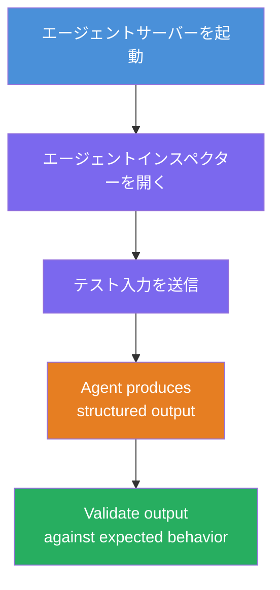
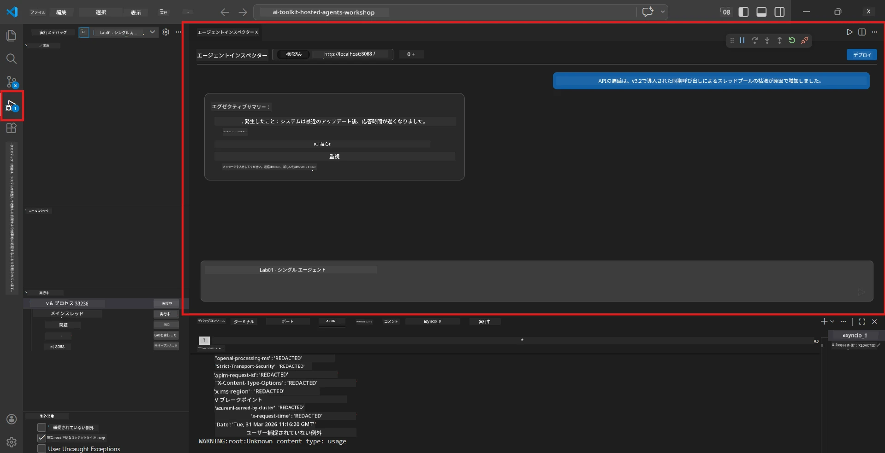
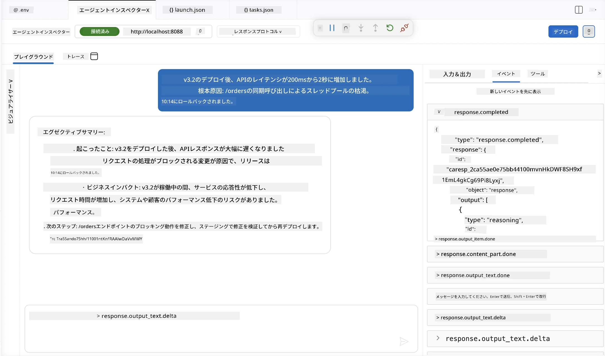

# モジュール 4 - ローカルでのテスト

⏱️ 約10分

このモジュールでは、エージェントをローカルで実行し、<strong>ハッピーパス機能テスト</strong>を使って正しく動作するか検証します。Agent Inspector（ビジュアルUI）または直接HTTPコールを使って、エージェントが構造化された正確な応答を生成することを確認します。

### ローカルテストの流れ



---

## オプション 1: F5キーを押す - Agent Inspectorでデバッグ（推奨）

### デバッガーの起動

1. VS Codeで<strong>executive-summary-agent/</strong>フォルダーを直接開く（`ファイル → フォルダーを開く`）。
2. <strong>実行とデバッグ</strong>パネルを開く（`Ctrl + Shift + D`）。
3. ドロップダウンから<strong>Debug Local Agent Server</strong>を選択。
4. <strong>F5</strong>キーを押す（または ▶ デバッグ開始をクリック）。

> ⚠️ **重要: Pythonインタープリターの選択**
> 「ModuleNotFoundError」が出るかデバッガーが起動しない場合は、VS Codeに仮想環境を使うよう指示する必要があります：
  > 1. `Ctrl+Shift+P`を押し、**Python: Select Interpreter** と入力。
  > 2. プロジェクトの `.venv` フォルダーにあるインタープリターを選択（例えばWindowsでは `.\.venv\Scripts\python.exe`）。
  > 3. デバッグセッションを再起動。
> エラーが続く場合は、`tasks.json` ファイルを手動で次のように更新してください：
  > 1. `.vscode/tasks.json` ファイルを開く
  > 2. `Run Agent/Workflow HTTP Server` とラベル付けされたコマンドを探す
  > 3. コマンドの値を `"value": "${workspaceFolder}/.venv/bin/python",` に更新

### 動作内容

1. HTTPサーバーが `http://localhost:8088/responses` で起動します。
2. **Agent Inspector** パネルが自動で開き、テスト用のビジュアルチャットインターフェースが表示されます。
3. `main.py` にブレークポイントが設定されます。

ターミナルを確認してください：
```
Starting executive summary hosted agent
Executive agent server running on http://localhost:8088
```

> **Agent Inspectorが開かない場合：** `Ctrl+Shift+P` → **Foundry Toolkit: Open Agent Inspector** を押してください。



> *スクリーンショットは以前の拡張機能バージョンの 'AI TOOLKIT' ブランドが表示されている場合があります。*

---

## オプション 2: ターミナルからテスト（代替）

片方のターミナルでエージェントを起動し、別のターミナルからリクエストを送信します：

```bash
# ターミナル1：エージェントを開始する
cd executive-summary-agent/
source .venv/bin/activate
python main.py
```

```bash
# ターミナル2：テスト送信（curl）
curl -sS -X POST http://localhost:8088/responses \
  -H "Content-Type: application/json" \
  -d '{"input": "The API latency increased due to thread pool exhaustion caused by sync calls in v3.2.", "stream": false}'
```

---

## シナリオテスト：ハッピーパス機能検証

以下の<strong>3つすべて</strong>のシナリオを実行してください。これらはエージェントが現実的な入力に対して正しく構造化された出力を生成するかを検証します。



### シナリオ 1: ITインシデント - APIレイテンシの急増

**入力：**
```
The API latency increased from 200ms to 2s after deploying v3.2.
Root cause: thread pool starvation from synchronous calls in /orders.
Rolled back at 10:14.
```

**期待される動作：**
- ✅ 「Executive Summary」の構成（何が起きたか／ビジネス影響／次のステップ）に従う
- ✅ 技術用語を使わない（「スレッドプール」「/orders」「v3.2」などなし）
- ✅ ビジネス影響を明確に示す（例：ユーザーが遅延を経験した）
- ✅ 次のステップを含む（例：修正を展開、監視の実施）

---

### シナリオ 2: データパイプライン - ETLの失敗

**入力：**
```
The nightly ETL job failed because the upstream schema changed. APAC dashboards show missing data.
```

**期待される動作：**
- ✅ データリフレッシュ失敗を平易な言葉で要約
- ✅ APACダッシュボードへの影響に言及
- ✅ 修復の次のステップを含む
- ✅ 「ETL」や「スキーマ」などの技術用語は使用しない

---

### シナリオ 3: セキュリティ - 資格情報の露出

**入力：**
```
Static analysis flagged a hardcoded secret in the repository.
The secret may have been exposed in commit history.
```

**期待される動作：**
- ✅ 資格情報／セキュリティ問題を経営者向けの言葉で説明
- ✅ 潜在的リスク（不正アクセス）を指摘
- ✅ 修復措置（資格情報のローテーション、監査）を明示
- ✅ 「静的解析」「コミット履歴」「ハードコーディング」などの用語は含まない

---

## 検証基準

各シナリオについて、チェックしてください：

| # | 基準 | 合格条件 |
|---|----------|---------------|
| 1 | <strong>構成</strong> | 応答が「Executive Summary」形式で3つの箇条書きを含む |
| 2 | <strong>平易な言葉</strong> | 経営者が理解できない技術用語を使わない |
| 3 | <strong>正確性</strong> | 要約が入力内容を反映し、捏造がない |
| 4 | <strong>簡潔さ</strong> | 応答が100語以内 |
| 5 | <strong>次のステップ</strong> | 明確な措置や緩和案が示されている |

---

## デバッグのヒント

| 問題点 | 対処法 |
|-------|-----|
| エージェントが起動しない | `.env`の値をチェック、venvが有効か確認、`pip install -r requirements.txt`を実行 |
| 応答が空白または一般的 | `main.py`の指示を見直し、出力形式が指定されているか確認 |
| 応答に専門用語が含まれる | 指示の「技術用語を除く」ルールを強化 |
| Agent Inspector が開かない | `Ctrl+Shift+P` → **Foundry Toolkit: Open Agent Inspector** を実行 |
| ターミナルにモデルエラーが表示される | `AZURE_AI_MODEL_DEPLOYMENT_NAME`が正確（大文字小文字も含む）か確認 |

---

### ✅ チェックポイント

- [ ] エージェントがローカルでエラーなく起動する
- [ ] Agent Inspectorが開きチャットインターフェースが表示される（F5使用時）
- [ ] **シナリオ 1**（ITインシデント） - 構造化されたExecutive Summary、専門用語なし
- [ ] **シナリオ 2**（データパイプライン） - 関連する要約とビジネス影響
- [ ] **シナリオ 3**（セキュリティ警告） - 適切なリスク情報の伝達
- [ ] すべての応答が定義された出力構造に従っている

> <strong>応答を保存してください</strong>（コピーやスクリーンショットで）- これらはモジュール06のクラウド結果と比較します。

---

**前へ:** [03 - Configure & Code](03-configure-and-code.md) · **次へ:** [05 - Deploy to Foundry →](05-deploy-to-foundry.md)

---

<!-- CO-OP TRANSLATOR DISCLAIMER START -->
**免責事項**：
本書類は AI 翻訳サービス [Co-op Translator](https://github.com/Azure/co-op-translator) を使用して翻訳されています。正確性を期していますが、自動翻訳には誤りや不正確な部分が含まれる可能性があることをご承知おきください。原文の原語版が正式な情報源とみなされるべきです。重要な情報については、専門の人間による翻訳を推奨します。本翻訳の利用により生じたいかなる誤解や解釈違いについても、当方は責任を負いかねます。
<!-- CO-OP TRANSLATOR DISCLAIMER END -->