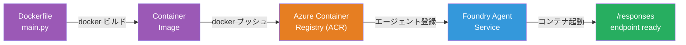
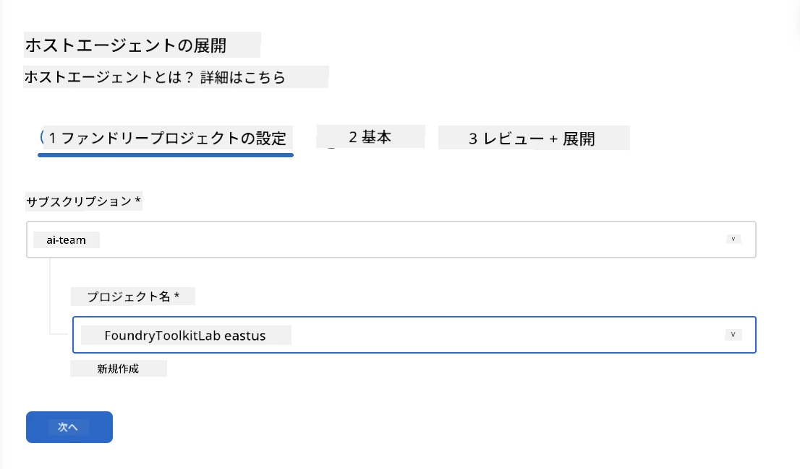
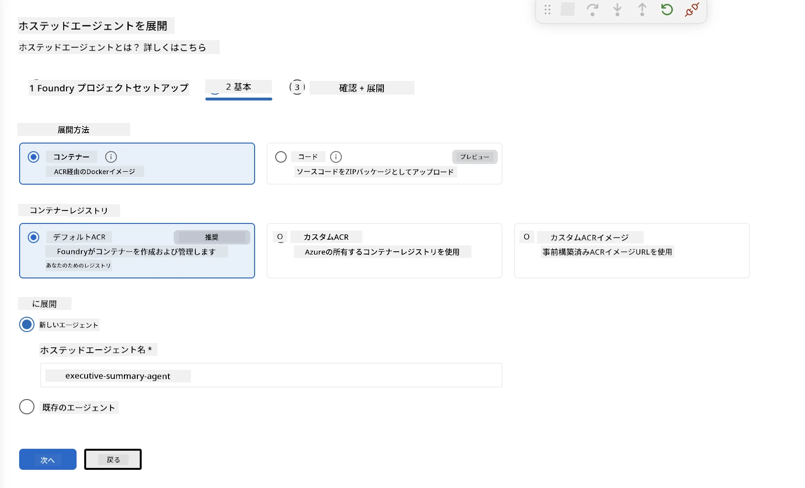
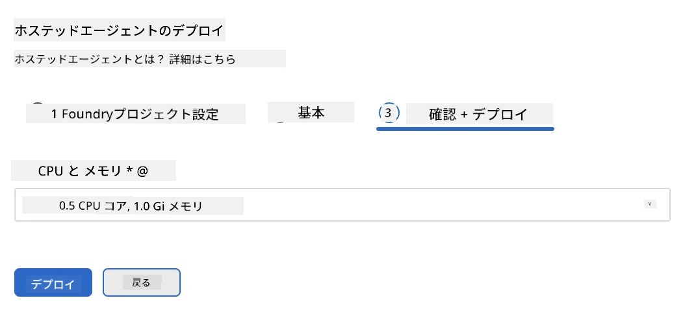
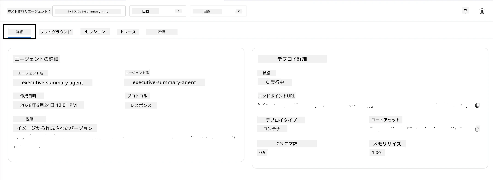

# モジュール 5 - Foundry エージェント サービスへのデプロイ

⏱️ 約10分

> ⚠️ **パスBのユーザー向け:** このモジュールはFoundryのサブスクリプションが必要です。Foundry Localを使用している場合は、[モジュール07 - まとめ](07-summary.md)にスキップしてください。ローカル開発ワークフローを正常に完了しました！

このモジュールでは、ローカルでテスト済みのエージェントをMicrosoft Foundryの<strong>ホスト型エージェント</strong>としてデプロイします。デプロイはコンテナー イメージをビルドし、それをAzure Container Registryにプッシュし、Foundryの管理インフラストラクチャでエージェントを起動します。

### デプロイ パイプライン

---

## 前提条件の確認

デプロイ前に次を確認してください：

- [ ] エージェントは[モジュール04](04-test-locally.md)の3つのローカルシナリオすべてを通過している
- [ ] プロジェクトレベルで<strong>Azure AI ユーザー</strong>ロールを付与されている（[モジュール01、RBACの割り当て](01-setup.md#deploy-a-model--assign-rbac)）
- [ ] VS CodeでAzureにサインインしている（アカウントアイコンに自分の名前が表示されている）

---

## ステップ 1: デプロイ開始

### オプションA: Agent Inspector からデプロイ（推奨）

Agent Inspectorが開いている場合（テストから）:
1. 右上の<strong>Deploy</strong>ボタン（クラウドアイコン ↑）をクリックします。

### オプションB: コマンドパレットからデプロイ

1. `Ctrl+Shift+P`を押して → **Foundry Toolkit: Deploy Hosted Agent** を選択します。

---

## ステップ 2: デプロイ設定

ウィザードで以下を入力します：

| 項目 | 選択肢 |
|--------|-----------|
| <strong>サブスクリプション</strong> | ご自身のAzureサブスクリプション |
| <strong>ターゲットプロジェクト</strong> | ご自身のFoundryプロジェクト（例：`workshop-agents`） |

<strong>次へ</strong>をクリックしてエージェントを設定します。

| 項目 | 選択肢 |
|--------|-----------|
| <strong>デプロイ方法</strong> | コンテナー |
| **コンテナー レジストリ** | **デフォルトのACR**（Microsoft Foundryが作成・管理） |
| <strong>デプロイ先</strong> | 新規エージェント（名前、`executive-summary-agent`） |

<strong>次へ</strong>をクリックしてエージェントの確認とデプロイに進みます。

| 項目 | 選択肢 |
|--------|-----------|
| **CPUとメモリ** | **0.25 CPUコア、0.5 Giメモリ**（ワークショップに十分） |

---

## ステップ 3: デプロイと監視

1. <strong>Deploy</strong>をクリックします。
2. <strong>Output</strong>パネルを監視します（ドロップダウンから<strong>Microsoft Foundry</strong>を選択）。
3. デプロイは以下の段階を経て進みます：
   - **Dockerビルド** - Dockerfileからコンテナーをビルド
   - **Dockerプッシュ** - イメージをACRにプッシュ（初回デプロイは1～3分）
   - <strong>エージェント登録</strong> - Foundryにホスト型エージェントを作成
   - <strong>コンテナースタート</strong> - システム管理IDで起動

4. 完了すると通知が表示されます：
   > **my-agent のデプロイが成功しました。** `ログを見る` `エージェントを実行`

5. <strong>エージェントを実行</strong>をクリックしてAgent Playgroundを開きます。

### デプロイ状況の状態

| 状態 | 意味 |
|--------|---------|
| <strong>実行中</strong> | コンテナー準備完了、エージェントが応答中 |
| <strong>保留中</strong> | コンテナー起動中 - 30～60秒待機 |
| <strong>失敗</strong> | ログを確認（トラブルシューティング参照） |

---

## よくあるデプロイエラー

| エラー | 原因 | 解決策 |
|-------|-----------|-----|
| `agents/write` 権限が拒否されました | プロジェクトレベルで<strong>Azure AI ユーザー</strong>ロールが不足 | [モジュール01、RBACの割り当て](01-setup.md#deploy-a-model--assign-rbac) |
| Dockerが起動していません | Docker Desktopが起動していない | Docker Desktopを起動 → `docker info`で確認 |
| ACR認可エラー | 管理対象IDがイメージをプルできない | [モジュール08 - トラブルシューティング](08-troubleshooting.md)を参照 |

---

### ✅ チェックポイント

- [ ] エラーなくデプロイ完了
- [ ] Foundryサイドバーの<strong>Hosted Agents (Preview)</strong>にエージェントが表示されている
- [ ] コンテナーの状態が<strong>実行中</strong>を示している
- [ ] Agent Playgroundタブが開き、エージェントの詳細とエンドポイントURLが表示されている

---

**前へ:** [04 - ローカルテスト](04-test-locally.md) · **次へ:** [06 - Playgroundで検証 →](06-verify-in-playground.md)

---

<!-- CO-OP TRANSLATOR DISCLAIMER START -->
**免責事項**：
本書類は AI 翻訳サービス [Co-op Translator](https://github.com/Azure/co-op-translator) を使用して翻訳されています。正確性を期していますが、自動翻訳には誤りや不正確な部分が含まれる可能性があることをご承知おきください。原文の原語版が正式な情報源とみなされるべきです。重要な情報については、専門の人間による翻訳を推奨します。本翻訳の利用により生じたいかなる誤解や解釈違いについても、当方は責任を負いかねます。
<!-- CO-OP TRANSLATOR DISCLAIMER END -->