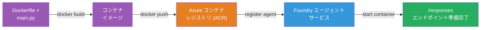
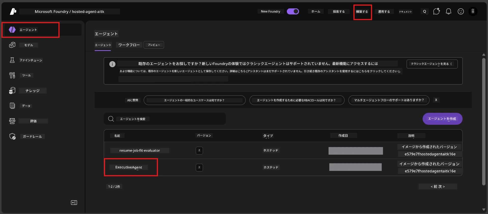

# Module 6 - Foundry Agent Serviceへのデプロイ

このモジュールでは、ローカルでテストしたエージェントをMicrosoft Foundryの[**Hosted Agent**](https://learn.microsoft.com/azure/foundry/agents/concepts/hosted-agents)としてデプロイします。デプロイプロセスは、プロジェクトからDockerコンテナイメージをビルドし、それを[Azure Container Registry (ACR)](https://learn.microsoft.com/azure/container-registry/container-registry-intro)にプッシュし、[Foundry Agent Service](https://learn.microsoft.com/azure/foundry/agents/overview)にホストエージェントのバージョンを作成します。

### デプロイパイプライン


---

## 前提条件の確認

デプロイ前に以下の項目をすべて確認してください。これを省略するとデプロイ失敗の最も一般的な原因となります。

1. **エージェントがローカルのスモークテストをパスしていること：**
   - [Module 5](05-test-locally.md)の4つのテストをすべて完了し、エージェントが正しく応答していること。

2. **[Azure AI User](https://learn.microsoft.com/azure/foundry/concepts/rbac-foundry#built-in-roles)の役割を持っていること：**
   - これは[Module 2, Step 3](02-create-foundry-project.md)で割り当てられました。わからない場合は今すぐ確認してください：
   - Azureポータル → あなたのFoundry <strong>プロジェクト</strong>リソース → **アクセス制御 (IAM)** → <strong>役割の割り当て</strong> タブ → 名前で検索→ <strong>Azure AI User</strong>が一覧にあるか確認。

3. **VS CodeでAzureにサインインしていること：**
   - VS Codeの左下にあるアカウントアイコンを確認してください。アカウント名が表示されているはずです。

4. **（オプション）Docker Desktopが起動していること：**
   - DockerはFoundry拡張機能がローカルビルドを促した場合のみ必要です。ほとんどの場合、拡張機能がデプロイ中にコンテナビルドを自動で処理します。
   - Dockerがインストールされているなら、起動しているか確認：`docker info`

---

## ステップ1：デプロイを開始する

デプロイする方法は2つあります。どちらも結果は同じです。

### オプションA：Agent Inspectorからデプロイ（推奨）

デバッガー（F5）でエージェントを実行し、Agent Inspectorが開いている場合：

1. Agent Inspectorパネルの<strong>右上隅</strong>を見る。
2. <strong>Deploy</strong>ボタン（上矢印↑付きのクラウドアイコン）をクリック。
3. デプロイウィザードが開きます。

### オプションB：コマンドパレットからデプロイ

1. `Ctrl+Shift+P`を押して<strong>コマンドパレット</strong>を開く。
2. 「Microsoft Foundry: Deploy Hosted Agent」と入力して選択。
3. デプロイウィザードが開きます。

---

## ステップ2：デプロイを設定する

デプロイウィザードが設定を案内します。各プロンプトに入力してください：

### 2.1 ターゲットプロジェクトを選択

1. Foundryのプロジェクトのドロップダウンが表示されます。
2. Module 2で作成したプロジェクトを選択（例：`workshop-agents`）。

### 2.2 コンテナエージェントファイルを選択

1. エージェントのエントリポイントを選択するよう求められます。
2. **`main.py`**（Python）を選択。これはウィザードがエージェントプロジェクトを特定するためのファイルです。

### 2.3 リソースの設定

| 設定 | 推奨値 | 備考 |
|---------|------------------|-------|
| **CPU** | `0.25` | ワークショップ向けデフォルト。商用負荷なら増量してください。 |
| <strong>メモリ</strong> | `0.5Gi` | ワークショップ向けデフォルト |

これらは`agent.yaml`の値と一致します。デフォルトをそのまま使用可能です。

---

## ステップ3：確認してデプロイ

1. ウィザードにデプロイの概要が表示されます：
   - ターゲットプロジェクト名
   - エージェント名 (`agent.yaml`より)
   - コンテナファイルとリソース
2. 概要を確認し、**Confirm and Deploy**（または<strong>Deploy</strong>）をクリック。
3. VS Codeで進行状況を確認します。

### デプロイ中の動作（ステップごとに）

デプロイは複数のステップから成ります。VS Codeの<strong>Output</strong>パネル（ドロップダウンから「Microsoft Foundry」を選択）を閲覧してください：

1. **Dockerビルド** - VS Codeが`Dockerfile`からDockerコンテナイメージをビルドします。Dockerのレイヤーメッセージが表示されます：
   ```
   Step 1/6 : FROM python:<version>-slim
   Step 2/6 : WORKDIR /app
   ...
   Successfully built abc123def456
   ```

2. **Dockerプッシュ** - 画像があなたのFoundryプロジェクトに紐づく<strong>Azure Container Registry (ACR)</strong> にプッシュされます。初回デプロイでは（ベースイメージが100MB超のため）1-3分かかることがあります。

3. <strong>エージェント登録</strong> - Foundry Agent Serviceが新しいホストエージェントを作成（既存なら新バージョンを作成）します。`agent.yaml`からメタデータを取得。

4. <strong>コンテナ起動</strong> - Foundryの管理インフラでコンテナが起動します。プラットフォームが[システム管理ID](https://learn.microsoft.com/azure/foundry/agents/concepts/agent-identity)を割り当て、`/responses`エンドポイントを公開。

> <strong>初回のデプロイは遅いです</strong>（Dockerは全レイヤーをプッシュする必要があります）。以降はDockerが変更なしレイヤーをキャッシュするため高速になります。

---

## ステップ4：デプロイ状態を確認する

デプロイコマンド完了後：

1. アクティビティバーのFoundryアイコンをクリックして<strong>Microsoft Foundry</strong>サイドバーを開く。
2. プロジェクト配下の<strong>Hosted Agents (Preview)</strong>セクションを展開。
3. エージェント名（例：`ExecutiveAgent`や`agent.yaml`の名前）が表示されるはず。
4. <strong>エージェント名をクリック</strong>して展開。
5. 1つ以上の<strong>バージョン</strong>（例：`v1`）が表示される。
6. バージョンをクリックして<strong>Container Details</strong>を見る。
7. <strong>Status</strong>フィールドを確認：

   | ステータス | 意味 |
   |--------|---------|
   | **Started** または **Running** | コンテナが起動中でエージェントが稼働準備OK |
   | **Pending** | コンテナ起動中（30-60秒待機） |
   | **Failed** | コンテナ起動失敗（ログを確認 - 以下トラブルシューティング参照） |



> **2分以上「Pending」のままの場合：** ベースイメージのプル中の可能性があります。もう少し待機してください。変わらなければコンテナログを確認してください。

---

## よくあるデプロイエラーと対処法

### エラー1: Permission denied - `agents/write`

```
Error: lacks the required data action 
Microsoft.CognitiveServices/accounts/AIServices/agents/write 
to perform POST /api/projects/{projectName}/assistants operation.
```

**根本原因：** プロジェクトレベルで`Azure AI User`ロールを持っていません。

**修正手順：**

1. [https://portal.azure.com](https://portal.azure.com)を開く。
2. 検索バーにFoundryの<strong>プロジェクト</strong>名を入力しクリック。
   - **重要：** 親のアカウント/ハブリソースではなく、<strong>プロジェクト</strong>リソース（タイプ：Microsoft Foundry project）を選ぶこと。
3. 左ナビで<strong>アクセス制御 (IAM)</strong>をクリック。
4. **+追加** → <strong>役割の割り当ての追加</strong>をクリック。
5. <strong>ロール</strong>タブで[**Azure AI User**](https://learn.microsoft.com/azure/foundry/concepts/rbac-foundry#built-in-roles)を検索し選択、<strong>次へ</strong>。
6. <strong>メンバー</strong>タブで<strong>ユーザー、グループ、またはサービスプリンシパル</strong>を選択。
7. <strong>+ メンバーの選択</strong>をクリックし、名前/メールで自分を検索し選択、<strong>選択</strong>をクリック。
8. **レビュー + 割り当て** → 再度<strong>レビュー + 割り当て</strong>。
9. 1〜2分待ってロール割り当てが反映されるのを待つ。
10. ステップ1からデプロイを再試行。

> このロールは<strong>プロジェクト</strong>スコープである必要があり、アカウントスコープだけでは不十分です。これが最も多いデプロイ失敗の原因です。

### エラー2: Dockerが起動していない

```
Error: Docker build failed / Cannot connect to Docker daemon
```

**修正：**
1. Docker Desktopを起動（スタートメニューやシステムトレイから）。
2. 「Docker Desktop is running」と表示されるまで30〜60秒待機。
3. ターミナルで`docker info`を実行して確認。
4. **Windowsの場合：** Docker Desktop設定 → <strong>一般</strong> → <strong>WSL 2ベースのエンジンを使用する</strong>が有効になっているか確認。
5. デプロイを再試行。

### エラー3: ACR認証エラー - `AcrPullUnauthorized`

```
Error: AcrPullUnauthorized
```

**根本原因：** Foundryプロジェクトの管理IDにコンテナレジストリのプルアクセス権がない。

**修正：**
1. Azureポータルで<strong>[コンテナ レジストリ](https://learn.microsoft.com/azure/container-registry/container-registry-intro)</strong>に移動（Foundryプロジェクトと同じリソースグループ内）。
2. **アクセス制御 (IAM)** → <strong>追加</strong> → <strong>役割の割り当ての追加</strong>。
3. <strong>[AcrPull](https://learn.microsoft.com/azure/container-registry/container-registry-roles)</strong>ロールを選択。
4. メンバー欄で<strong>管理ID</strong>を選択し、Foundryプロジェクトの管理IDを検索・選択。
5. **レビュー + 割り当て**。

> 通常はFoundry拡張機能が自動設定します。このエラーが出る場合は自動設定が失敗した可能性があります。

### エラー4: コンテナプラットフォーム不一致（Apple Silicon）

Apple Silicon Mac（M1/M2/M3）からデプロイする場合、コンテナは`linux/amd64`向けにビルドする必要があります：

```bash
docker build --platform linux/amd64 -t myagent:v1 .
```

> Foundry拡張機能がほとんどのユーザーのために自動で対応します。

---

### チェックポイント

- [ ] VS Codeでデプロイコマンドがエラーなく完了
- [ ] Foundryサイドバーの<strong>Hosted Agents (Preview)</strong>にエージェントが表示されている
- [ ] エージェントをクリックし、バージョンを選択し、<strong>Container Details</strong>を確認
- [ ] コンテナステータスが<strong>Started</strong>または<strong>Running</strong>を示している
- [ ] （もしエラーが出たら）原因を特定し修正後に再度デプロイ成功

---

**前へ:** [05 - ローカルでテスト](05-test-locally.md) · **次へ:** [07 - Playgroundで検証 →](07-verify-in-playground.md)

---

<!-- CO-OP TRANSLATOR DISCLAIMER START -->
**免責事項**:  
本書類は AI 翻訳サービス [Co-op Translator](https://github.com/Azure/co-op-translator) を使用して翻訳されています。正確さを期しておりますが、自動翻訳には誤りや不正確な箇所が含まれる可能性があることをご承知おきください。原文（原言語版）が正式な情報源として優先されます。重要な情報については、専門の人間による翻訳を推奨いたします。本翻訳の使用により生じた誤解や誤訳について、当方は責任を負いかねます。
<!-- CO-OP TRANSLATOR DISCLAIMER END -->