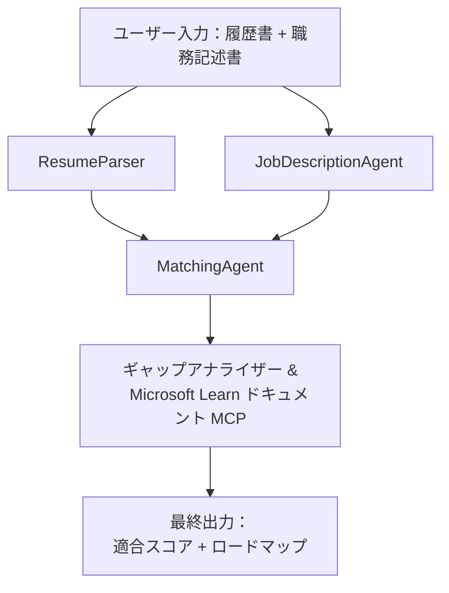

# PersonalCareerCopilot - 履歴書 → 職務適合性評価

履歴書が職務記述書にどれだけ合致しているかを評価し、そのギャップを埋めるためのパーソナライズされた学習ロードマップを生成するマルチエージェントワークフロー。

---

## エージェント

| エージェント | 役割 | ツール |
|-------|------|-------|
| **ResumeParser** | 履歴書テキストから構造化されたスキル、経験、資格を抽出 | - |
| **JobDescriptionAgent** | 職務記述書から必要/推奨されるスキル、経験、資格を抽出 | - |
| **MatchingAgent** | プロファイルと要件を比較 → 適合スコア（0-100）＋一致/欠落スキル | - |
| **GapAnalyzer** | Microsoft Learn リソースを使ったパーソナライズ学習ロードマップを作成 | `search_microsoft_learn_for_plan` (MCP) |

## ワークフロー


---

## クイックスタート

### 1. 環境セットアップ

```powershell
cd workshop\lab02-multi-agent\PersonalCareerCopilot
python -m venv .venv
.\.venv\Scripts\Activate.ps1          # Windows PowerShell
# source .venv/bin/activate            # macOS / Linux
pip install -r requirements.txt
```

### 2. 資格情報の設定

サンプルのenvファイルをコピーし、Foundryプロジェクトの情報を入力してください：

```powershell
cp .env.example .env
```

`.env` を編集:

```env
PROJECT_ENDPOINT=https://<your-account>.services.ai.azure.com/api/projects/<your-project>
MODEL_DEPLOYMENT_NAME=gpt-4.1-mini
```

| 値 | 入手場所 |
|-------|-----------------|
| `PROJECT_ENDPOINT` | VS Code の Microsoft Foundryサイドバー → プロジェクトを右クリック → **Copy Project Endpoint** |
| `MODEL_DEPLOYMENT_NAME` | Foundryサイドバー → プロジェクトを展開 → **Models + endpoints** → デプロイメント名 |

### 3. ローカルで実行

```powershell
python -m debugpy --listen 127.0.0.1:5679 -m agentdev run main.py --verbose --port 8088
```

もしくは VS Code タスクを利用：`Ctrl+Shift+P` → **Tasks: Run Task** → **Run Lab02 HTTP Server**。

### 4. Agent Inspector でテスト

Agent Inspector を開く：`Ctrl+Shift+P` → **Foundry Toolkit: Open Agent Inspector**。

このテストプロンプトをペースト：

```
Resume:
Jane Doe
Senior Software Engineer with 5 years of experience in Python, Django, and AWS.
Built microservices handling 10K+ requests/second. Led a team of 4 developers.
Certifications: AWS Solutions Architect Associate.
Education: B.S. Computer Science, State University.

Job Description:
Senior Cloud Engineer at Contoso Ltd.
Required: Python, Azure, Kubernetes, Terraform, CI/CD pipelines.
Preferred: Go, monitoring (Prometheus/Grafana), cost optimization.
Experience: 5+ years in cloud infrastructure.
Certifications: Azure Solutions Architect Expert preferred.
```

**期待結果:** 適合スコア（0-100）、一致/欠落スキル、および Microsoft Learn URL を含むパーソナライズ学習ロードマップ。

### 5. Foundry にデプロイ

`Ctrl+Shift+P` → **Microsoft Foundry: Deploy Hosted Agent** → プロジェクトを選択 → 確認。

---

## プロジェクト構成

```
PersonalCareerCopilot/
├── .env.example        ← Template for environment variables
├── .env                ← Your credentials (git-ignored)
├── agent.yaml          ← Hosted agent definition (name, resources, env vars)
├── Dockerfile          ← Container image for Foundry deployment
├── main.py             ← 4-agent workflow (instructions, MCP tool, WorkflowBuilder)
└── requirements.txt    ← Python dependencies
```

## 主要ファイル

### `agent.yaml`

Foundry Agent Service 用ホステッドエージェントを定義：
- `kind: hosted` - マネージドコンテナとして実行
- `protocols: [responses v1]` - `/responses` HTTPエンドポイントを公開
- `environment_variables` - デプロイ時に `PROJECT_ENDPOINT` と `MODEL_DEPLOYMENT_NAME` が注入される

### `main.py`

内容：
- <strong>エージェント指示書</strong> - 4つの `*_INSTRUCTIONS` 定数、各エージェント用
- **MCPツール** - `search_microsoft_learn_for_plan()` は Streamable HTTP 経由で `https://learn.microsoft.com/api/mcp` を呼び出す
- <strong>エージェント生成</strong> - `create_agents()` コンテキストマネージャーで `AzureAIAgentClient.as_agent()` を使う
- <strong>ワークフローグラフ</strong> - `create_workflow()` で `WorkflowBuilder` を使い、ファンアウト/ファンイン/逐次処理をエージェントにつなげる
- <strong>サーバ起動</strong> - `from_agent_framework(agent).run_async()` をポート8088で実行

### `requirements.txt`

| パッケージ | バージョン | 用途 |
|---------|---------|---------|
| `agent-framework-azure-ai` | `1.0.0rc3` | Microsoft Agent Framework の Azure AI 統合 |
| `agent-framework-core` | `1.0.0rc3` | コアランタイム（WorkflowBuilder含む） |
| `azure-ai-agentserver-agentframework` | `1.0.0b16` | ホステッドエージェントサーバランタイム |
| `azure-ai-agentserver-core` | `1.0.0b16` | コアエージェントサーバ抽象化 |
| `debugpy` | 最新版 | Pythonデバッグ（VS CodeでF5） |
| `agent-dev-cli` | `--pre` | ローカル開発CLI＋Agent Inspectorバックエンド |

---

## トラブルシューティング

| 問題 | 対処法 |
|-------|-----|
| `RuntimeError: Missing required environment variable(s)` | `.env` を作成し、`PROJECT_ENDPOINT` と `MODEL_DEPLOYMENT_NAME` を設定する |
| `ModuleNotFoundError: No module named 'agent_framework'` | venv をアクティベートして `pip install -r requirements.txt` を実行 |
| 出力に Microsoft Learn URL が表示されない | `https://learn.microsoft.com/api/mcp` へのインターネット接続を確認 |
| ギャップカードが1つだけ（途中で切れる） | `GAP_ANALYZER_INSTRUCTIONS` に `CRITICAL:` ブロックが含まれているか確認 |
| ポート8088が使用中 | 他のサーバを停止: `netstat -ano \| findstr :8088` |

詳細なトラブルシューティングは [Module 8 - Troubleshooting](../docs/08-troubleshooting.md) を参照してください。

---

**全手順:** [Lab 02 Docs](../docs/README.md) · **戻る:** [Lab 02 README](../README.md) · [Workshop ホーム](../../../README.md)

---

<!-- CO-OP TRANSLATOR DISCLAIMER START -->
**免責事項**:  
本書類はAI翻訳サービス [Co-op Translator](https://github.com/Azure/co-op-translator) を使用して翻訳されています。正確さには努めておりますが、自動翻訳には誤りや不正確な箇所が含まれる可能性があることをご理解ください。原本文書は、原語版が正本と見なされるべきです。重要な情報については、専門の人間による翻訳を推奨します。この翻訳の利用に起因するいかなる誤解や誤訳についても、一切の責任を負いかねます。
<!-- CO-OP TRANSLATOR DISCLAIMER END -->