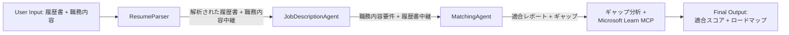

# PersonalCareerCopilot - 履歴書 → 仕事適合度評価ツール

履歴書が求人情報にどの程度適合しているかを評価し、不足部分を埋めるためのパーソナライズされた学習ロードマップを生成する、ワークフロー優先のマルチエージェントアプリです。

---

## エージェント

| エージェント | 役割 | ツール |
|-------|------|-------|
| **ResumeParser** | 履歴書テキストからスキル、経験、資格を構造化して抽出 | - |
| **JobDescriptionAgent** | 求人情報から必要/推奨スキル、経験、資格を抽出 | - |
| **MatchingAgent** | プロフィールと要件を比較 → 適合スコア (0-100) + マッチ/不足スキル | - |
| **GapAnalyzer** | Microsoft Learnリソースでパーソナル学習ロードマップを作成 | `search_microsoft_learn_for_plan` (MCP) |

## ワークフロー


```mermaid
flowchart LR
    UserInput["User Input: 履歴書 + 職務内容"] --> ResumeParser
    ResumeParser -- "解析された履歴書 + 職務内容中継" --> JobDescriptionAgent
    JobDescriptionAgent -- "職務内容要件 + 履歴書中継" --> MatchingAgent
    MatchingAgent -- "適合レポート + ギャップ" --> GapAnalyzerMCP["ギャップ分析 +\nMicrosoft Learn MCP"]
    GapAnalyzerMCP --> FinalOutput["Final Output:\n適合スコア + ロードマップ"]
```

---

## クイックスタート

### 1. 環境設定

このフォルダーはワークフロー基盤の Lab 02 スキャフォールドの参照実装です。`main.py` は既存のプロンプトブロックに加え `WorkflowBuilder` を使い、4つのエージェントを連結しています。

```powershell
cd workshop\lab02-multi-agent\PersonalCareerCopilot
python -m venv .venv
.\.venv\Scripts\Activate.ps1          # Windows PowerShell
# source .venv/bin/activate            # macOS / Linux
pip install -r requirements.txt
```

### 2. 認証情報の設定

このフォルダに `.env` ファイルを作成します：

```powershell
copy .env .env.bak 2>$null; echo $null > .env
```

`.env` を編集してください：

```env
FOUNDRY_PROJECT_ENDPOINT=https://<your-account>.services.ai.azure.com/api/projects/<your-project>
AZURE_AI_MODEL_DEPLOYMENT_NAME=gpt-4.1-mini
```

| 値 | 入手場所 |
|-------|------------------|
| `FOUNDRY_PROJECT_ENDPOINT` | Foundry Toolkit サイドバー → プロジェクトを右クリック → **Copy Project Endpoint** |
| `AZURE_AI_MODEL_DEPLOYMENT_NAME` | Foundry サイドバー → プロジェクト展開 → **Models + endpoints** → デプロイ名 |

### 3. ローカル実行

```powershell
python -m debugpy --listen 127.0.0.1:5679 main.py --port 8088
```

または VS Code タスクを使用：`Ctrl+Shift+P` → **Tasks: Run Task** → **Run Agent HTTP Server**。

F5 デバッグの場合は **Debug Local Agent HTTP Server** を使用してください。

### 4. Agent Inspector でテスト

Agent Inspector を開く：`Ctrl+Shift+P` → **Foundry Toolkit: Open Agent Inspector**。

下記のテストプロンプトを貼り付けてください：

```
Resume:
Jane Doe
Senior Software Engineer with 5 years of experience in Python, Django, and AWS.
Built microservices handling 10K+ requests/second. Led a team of 4 developers.
Certifications: AWS Solutions Architect Associate.
Education: B.S. Computer Science, State University.

Job Description:
Senior Cloud Engineer at Contoso Ltd.
Required: Python, Azure, Kubernetes, Terraform, CI/CD pipelines.
Preferred: Go, monitoring (Prometheus/Grafana), cost optimization.
Experience: 5+ years in cloud infrastructure.
Certifications: Azure Solutions Architect Expert preferred.
```

**期待される結果：** 適合スコア (0-100)、マッチ・不足スキル、Microsoft Learn の URL を含むパーソナライズ学習ロードマップが返されます。

### 5. Foundry へデプロイ

`Ctrl+Shift+P` → **Foundry Toolkit: Deploy Hosted Agent** → プロジェクトを選択 → 確認。

---

## プロジェクト構造

```
PersonalCareerCopilot/
├── .env                ← Your credentials (git-ignored)
├── agent.yaml          ← Hosted agent definition (name, resources, env vars)
├── Dockerfile          ← Container image for Foundry deployment
├── main.py             ← 4-agent workflow (instructions, MCP tool, WorkflowBuilder)
└── requirements.txt    ← Python dependencies
```

## 重要なファイル

### `agent.yaml`

Foundry Agent Service 用ホステッドエージェントを定義：
- `kind: hosted` - マネージドコンテナとして実行
- `protocols` - `responses` プロトコル、`version: 1.0.0` で `/responses` HTTP エンドポイントを公開
- `environment_variables` - `AZURE_AI_MODEL_DEPLOYMENT_NAME` を宣言し、`FOUNDRY_PROJECT_ENDPOINT` はデプロイ時に自動注入

### `main.py`

含むもの：
- <strong>エージェント指示</strong> - エージェント毎の4つの `*_INSTRUCTIONS` 定数
- **MCP ツール** - `search_microsoft_learn_for_plan()` は Streamable HTTP 経由で `https://learn.microsoft.com/api/mcp` を呼び出す
- <strong>エージェント作成</strong> - 1つの `FoundryChatClient` を共有する4つの `Agent()` + `AgentExecutor()` インスタンス
- <strong>ワークフローグラフ</strong> - `WorkflowBuilder` がエージェントを順番に連結：ResumeParser → JD Agent → MatchingAgent → GapAnalyzer
- <strong>サーバ起動</strong> - `ResponsesHostServer` がポート8088で起動

### `requirements.txt`

| パッケージ | 用途 |
|---------|----------|
| `agent-framework-foundry` | コアランタイム：`Agent`, `AgentExecutor`, `WorkflowBuilder`, `@tool`, `FoundryChatClient` |
| `agent-framework-foundry-hosting` | `ResponsesHostServer` + Foundry ホスティング統合 |
| `mcp<2,>=1.24.0` | GapAnalyzer 用 MCP クライアント (`streamable_http_client`) |
| `debugpy` | Python デバッグ用（VS Code F5） |

---

## トラブルシューティング

| 問題 | 対処法 |
|-------|-----|
| `KeyError: 'FOUNDRY_PROJECT_ENDPOINT'` または `KeyError: 'AZURE_AI_MODEL_DEPLOYMENT_NAME'` | 両方を設定した `.env` ファイルを作成 |
| `ModuleNotFoundError: No module named 'agent_framework'` | venv を有効化して `pip install -r requirements.txt` 実行 |
| 出力に Microsoft Learn の URL がない | `https://learn.microsoft.com/api/mcp` へのインターネット接続を確認 |
| ギャップカードが1枚だけ (途中切れ) | `GAP_ANALYZER_INSTRUCTIONS` に `CRITICAL:` ブロックが含まれているか確認 |
| ポート8088が使用中 | 他のサーバを停止：`netstat -ano \| findstr :8088` |

詳細なトラブルシューティングは [Module 8 - Troubleshooting](../docs/08-troubleshooting.md) を参照してください。

---

**完全な手順:** [Lab 02 Docs](../docs/README.md) · **戻る:** [Lab 02 README](../README.md) · [Workshop ホーム](../../../README.md)

---

<!-- CO-OP TRANSLATOR DISCLAIMER START -->
**免責事項**：
本書類は AI 翻訳サービス [Co-op Translator](https://github.com/Azure/co-op-translator) を使用して翻訳されています。正確性を期していますが、自動翻訳には誤りや不正確な部分が含まれる可能性があることをご承知おきください。原文の原語版が正式な情報源とみなされるべきです。重要な情報については、専門の人間による翻訳を推奨します。本翻訳の利用により生じたいかなる誤解や解釈違いについても、当方は責任を負いかねます。
<!-- CO-OP TRANSLATOR DISCLAIMER END -->