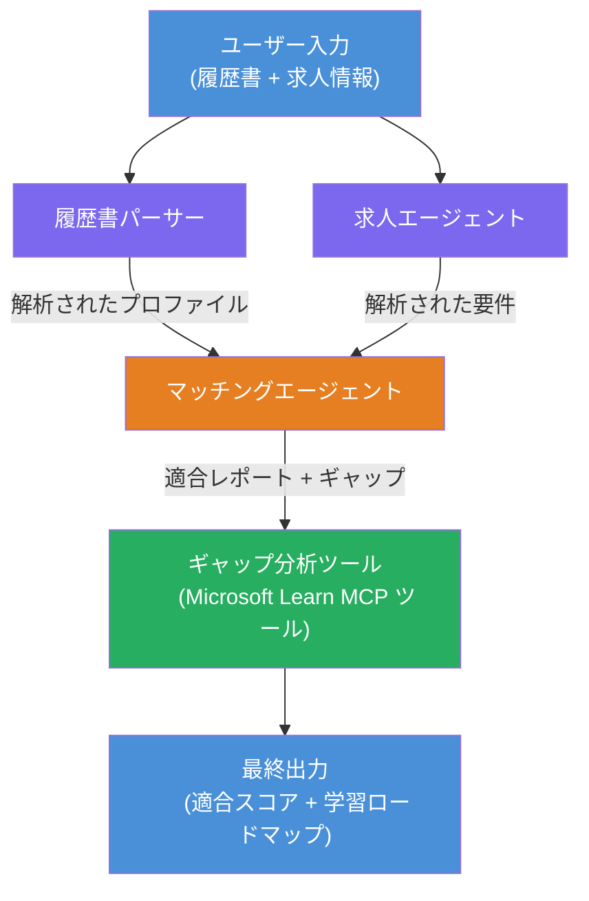

# Lab 02 - マルチエージェントワークフロー：履歴書 → ジョブフィット評価

---

## 作成するもの

**履歴書 → ジョブフィット評価** - 4つの専門化エージェントが協力して、候補者の履歴書が求人内容にどれだけ適合しているか評価し、そのギャップを埋めるためのパーソナライズされた学習ロードマップを作成するマルチエージェントワークフロー。

### エージェント

| エージェント | 役割 |
|-------------|------|
| **Resume Parser** | 履歴書テキストから構造化されたスキル、経験、資格を抽出 |
| **Job Description Agent** | 求人記述（JD）から必要/推奨されるスキル、経験、資格を抽出 |
| **Matching Agent** | プロファイルと要件を比較 → フィットスコア(0-100)＋マッチ／欠落スキルを算出 |
| **Gap Analyzer** | リソース、スケジュール、クイックウィンプロジェクトを含むパーソナライズ学習ロードマップを作成 |

### デモの流れ

<strong>履歴書＋求人記述</strong>をアップロード → <strong>フィットスコア＋欠落スキル</strong>を取得 → <strong>パーソナライズされた学習ロードマップ</strong>を受け取る。

### ワークフローアーキテクチャ

> 紫＝並列エージェント｜オレンジ＝集約ポイント｜緑＝ツールを持つ最終エージェント。[Module 1 - Understand the Architecture](docs/01-understand-multi-agent.md) および [Module 4 - Orchestration Patterns](docs/04-orchestration-patterns.md) で詳細な図とデータフローを参照してください。

### カバーするトピック

- **WorkflowBuilder** を使ったマルチエージェントワークフローの作成
- エージェントの役割定義とオーケストレーションフロー（並列＋逐次）
- エージェント間の通信パターン
- Agent Inspectorによるローカルテスト
- Foundry Agent Serviceへのマルチエージェントワークフローの展開

---

## 必要条件

まず Lab 01 を完了してください：

- [Lab 01 - Single Agent](../lab01-single-agent/README.md)

---

## はじめに

セットアップ手順の全体、コード解説、テストコマンドは以下を参照してください：

- [Lab 2 Docs - Prerequisites](docs/00-prerequisites.md)
- [Lab 2 Docs - Full Learning Path](docs/README.md)
- [PersonalCareerCopilot run guide](PersonalCareerCopilot/README.md)

## オーケストレーションパターン（エージェンティックな代替案）

Lab 2 にはデフォルトの **並列 → 集約 → プランナー** フローが含まれており、ドキュメントではより強力なエージェンティック動作を示す代替パターンも解説しています：

- **ファンアウト／ファンイン＋重み付けコンセンサス**
- **レビューア／批評家による最終ロードマップ前のパス**
- <strong>条件付きルーター</strong>（フィットスコアと欠落スキルに基づく経路選択）

[docs/04-orchestration-patterns.md](docs/04-orchestration-patterns.md) を参照してください。

---

**前へ:** [Lab 01 - Single Agent](../lab01-single-agent/README.md) · **戻る:** [ワークショップホーム](../../README.md)

---

<!-- CO-OP TRANSLATOR DISCLAIMER START -->
**免責事項**:  
本書類は AI 翻訳サービス [Co-op Translator](https://github.com/Azure/co-op-translator) を使用して翻訳されています。正確性を期していますが、自動翻訳には誤りや不正確な部分が含まれる可能性があることをご理解ください。原文の母国語の文書が権威ある情報源と見なされます。重要な情報については、専門の人間による翻訳を推奨します。本翻訳の使用に起因する誤解や解釈の相違については、一切の責任を負いかねます。
<!-- CO-OP TRANSLATOR DISCLAIMER END -->