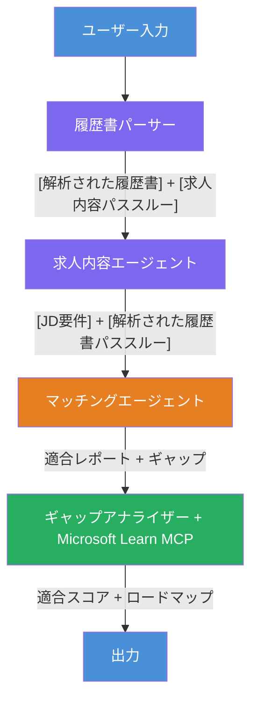

# ラボ 02 - マルチエージェントワークフロー: 履歴書 → ジョブ適合度評価者

## 概要

このハンズオンラボでは、VS Code の Foundry Toolkit を使用して <strong>ワークフローファーストのマルチエージェントアプリ</strong> を構築し、それを Microsoft Foundry Agent Service にデプロイします。

**構築するもの:** 履歴書と職務記述書を解析し、適合度をスコア付けして、Microsoft Learn リソースを使ったパーソナライズされた学習ロードマップを生成する履歴書 → ジョブ適合度評価者。

---

## アーキテクチャ

```mermaid
flowchart TD
    A["ユーザー入力"] --> B["履歴書パーサー"]
    B -->|"[解析された履歴書] + [求人内容パススルー]"| C["求人内容エージェント"]
    C -->|"[JD要件] + [解析された履歴書パススルー]"| D["マッチングエージェント"]
    D -->|適合レポート + ギャップ| E["ギャップアナライザー + Microsoft Learn MCP"]
    E -->|適合スコア + ロードマップ| F["出力"]

    style A fill:#4A90D9,color:#fff
    style B fill:#7B68EE,color:#fff
    style C fill:#7B68EE,color:#fff
    style D fill:#E67E22,color:#fff
    style E fill:#27AE60,color:#fff
    style F fill:#4A90D9,color:#fff
```

**動作の仕組み:**
1. ユーザーが履歴書と職務記述書を貼り付けます。
2. **ResumeParser** が履歴書を解析し、職務記述書をそのまま `[JOB DESCRIPTION PASS-THROUGH]` セクションにコピーします。
3. **JD Agent** がパススルーから構造化された要件を抽出し、`[PARSED RESUME]` を `[PARSED RESUME PASS-THROUGH]` として転送します。
4. **MatchingAgent** が `[PARSED RESUME PASS-THROUGH]` と `[JD REQUIREMENTS]` を比較し、適合スコアを生成します。
5. **GapAnalyzer** がギャップを実用的なロードマップに変換し、MCP 経由で Microsoft Learn のリンクを取得します。

---

## 前提条件

まずラボ 01 を完了してください:

- [Lab 01 - Single Agent](../lab01-single-agent/README.md)

---

## パート 1: モジュールを順番に読む

フル学習パスは以下を参照してください:

- [Lab 2 Docs - Prerequisites](docs/00-prerequisites.md)
- [Lab 2 Docs - Full Learning Path](docs/README.md)
- [PersonalCareerCopilot run guide](PersonalCareerCopilot/README.md)

---

## パート 2: ワークフローの構築とテスト

1. Foundry Toolkit のウィザードを使ってワークフローベースのプロジェクトをスキャフォールドします。
2. `PersonalCareerCopilot/main.py` からプロンプトブロックとワークフローグラフをワークスペースにコピーします。
3. エージェントインスペクターでローカル実行し、4つのエージェントと MCP ツールがすべて動作することを確認します。
4. ローカルテストが合格したらホストされたエージェントを Foundry にデプロイします。

---

## オーケストレーションパターン

ラボ 02 にはデフォルトの **ファンアウト → ファンイン → シーケンシャル** フローが含まれており、ドキュメントには実験用の代替オーケストレーションパターンも説明されています。

- **加重コンセンサス付き ファンアウト/ファンイン**
- **最終ロードマップ前のレビュアー/批評フェーズ**
- 適合スコアと不足スキルに基づく <strong>条件付きルーター</strong>

詳しくは [docs/04-orchestration-patterns.md](docs/04-orchestration-patterns.md) を参照してください。

---

**前へ:** [Lab 01 - Single Agent](../lab01-single-agent/README.md) · **戻る:** [Workshop Home](../../README.md)

---

<!-- CO-OP TRANSLATOR DISCLAIMER START -->
**免責事項**：
本書類は AI 翻訳サービス [Co-op Translator](https://github.com/Azure/co-op-translator) を使用して翻訳されています。正確性を期していますが、自動翻訳には誤りや不正確な部分が含まれる可能性があることをご承知おきください。原文の原語版が正式な情報源とみなされるべきです。重要な情報については、専門の人間による翻訳を推奨します。本翻訳の利用により生じたいかなる誤解や解釈違いについても、当方は責任を負いかねます。
<!-- CO-OP TRANSLATOR DISCLAIMER END -->