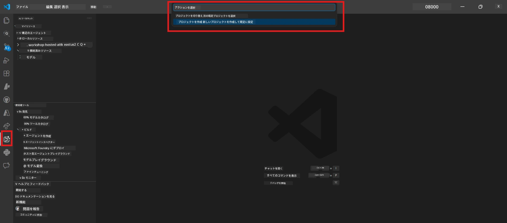

# モジュール 0 - 事前準備

Lab 02 を開始する前に、以下を完了していることを確認してください。このラボは Lab 01 の内容に直接基づいているため、スキップしないでください。

---

## 1. Lab 01 の完了

Lab 02 は、以下を完了していることを前提としています：

- [x] [Lab 01 - シングルエージェント](../../lab01-single-agent/README.md) の8つのモジュールすべてを完了している
- [x] Foundry Agent Service にシングルエージェントを正常にデプロイした
- [x] ローカルの Agent Inspector と Foundry Playground の両方でエージェントが動作することを確認した

Lab 01 を完了していない場合は、今すぐ戻って完了してください：[Lab 01 ドキュメント](../../lab01-single-agent/docs/00-prerequisites.md)

---

## 2. 既存セットアップの確認

Lab 01 のすべてのツールがまだインストールされて動作しているはずです。以下の簡単なチェックを行ってください：

### 2.1 Azure CLI

```powershell
az account show --query "{name:name, id:id}" --output table
```

期待結果：サブスクリプション名とIDが表示されること。失敗した場合は、[`az login`](https://learn.microsoft.com/cli/azure/authenticate-azure-cli-interactively) を実行してください。

### 2.2 VS Code 拡張機能

1. `Ctrl+Shift+P` を押す → **"Microsoft Foundry"** と入力 → コマンド（例：`Microsoft Foundry: Create a New Hosted Agent`）が表示されることを確認。
2. `Ctrl+Shift+P` を押す → **"Foundry Toolkit"** と入力 → コマンド（例：`Foundry Toolkit: Open Agent Inspector`）が表示されることを確認。

### 2.3 Foundry プロジェクトとモデル

1. VS Code のアクティビティバーにある **Microsoft Foundry** アイコンをクリック。
2. プロジェクト名がリストにあることを確認（例：`workshop-agents`）。
3. プロジェクトを展開し、デプロイ済みモデル（例：`gpt-4.1-mini`）がありステータスが **Succeeded** であることを確認。

> **モデルのデプロイが期限切れの場合：** 一部の無料ティアのデプロイは自動で期限切れになります。[モデルカタログ](https://learn.microsoft.com/azure/foundry/foundry-models/concepts/models-sold-directly-by-azure) から再デプロイしてください（`Ctrl+Shift+P` → **Microsoft Foundry: Open Model Catalog**）。



### 2.4 RBAC ロール

Foundry プロジェクトで **Azure AI User** の役割があることを確認：

1. [Azure Portal](https://portal.azure.com) → Foundry の <strong>プロジェクト</strong> リソース → **アクセス制御 (IAM)** → **[ロールの割り当て](https://learn.microsoft.com/azure/foundry/concepts/rbac-foundry)** タブ。
2. 自分の名前を検索 → **[Azure AI User](https://aka.ms/foundry-ext-project-role)** がリストされていることを確認。

---

## 3. マルチエージェントの概念理解（Lab 02 新規）

Lab 02 では Lab 01 で扱われなかった概念を導入します。続行する前に以下を読み通してください：

### 3.1 マルチエージェントワークフローとは？

一つのエージェントが全てを処理するのではなく、<strong>マルチエージェントワークフロー</strong> は複数の専門化されたエージェントに作業を分散します。各エージェントは：

- 独自の <strong>指示</strong>（システムプロンプト）
- 独自の <strong>役割</strong>（担当する内容）
- 任意の <strong>ツール</strong>（呼び出せる関数）

エージェント同士は、データフローを定義する <strong>オーケストレーショングラフ</strong> を通じて通信します。

### 3.2 WorkflowBuilder

`agent_framework` の [`WorkflowBuilder`](https://learn.microsoft.com/agent-framework/workflows/agents-in-workflows) クラスは、エージェント同士を連結するためのSDKコンポーネントです：

```python
from agent_framework import WorkflowBuilder

workflow = (
    WorkflowBuilder(
        name="MyWorkflow",
        start_executor=agent_a,
        output_executors=[agent_d],
    )
    .add_edge(agent_a, agent_b)
    .add_edge(agent_a, agent_c)
    .add_edge(agent_b, agent_d)
    .add_edge(agent_c, agent_d)
    .build()
)
```

- **`start_executor`** - ユーザー入力を最初に受け取るエージェント
- **`output_executors`** - 出力が最終応答となるエージェント（複数可）
- **`add_edge(source, target)`** - `target` が `source` の出力を受け取ることを定義

### 3.3 MCP（モデルコンテキストプロトコル）ツール

Lab 02 では、Microsoft Learn API を呼び出して学習リソースを取得する **MCP ツール** を使用します。[MCP (Model Context Protocol)](https://modelcontextprotocol.io/introduction) は AI モデルと外部データソースやツールを接続するための標準化されたプロトコルです。

| 用語 | 定義 |
|------|------|
| **MCP サーバー** | [MCP プロトコル](https://learn.microsoft.com/azure/foundry/agents/how-to/tools/model-context-protocol) を介してツールやリソースを提供するサービス |
| **MCP クライアント** | MCP サーバーに接続してツールを呼び出すエージェントのコード |
| **[ストリーム可能HTTP](https://learn.microsoft.com/agent-framework/agents/tools/hosted-mcp-tools)** | MCPサーバーとの通信に使われる転送方式 |

### 3.4 Lab 02 と Lab 01 の違い

| 項目 | Lab 01 (シングルエージェント) | Lab 02 (マルチエージェント) |
|------|-------------------------------|----------------------------|
| エージェント数 | 1 | 4（専門化された役割） |
| オーケストレーション | なし | WorkflowBuilder（並列＋逐次） |
| ツール | 任意の `@tool` 関数 | MCP ツール（外部API呼び出し） |
| 複雑さ | 単純なプロンプト → 応答 | 履歴書＋職務経歴書 → 適合スコア → ロードマップ |
| コンテキストフロー | 直接 | エージェント間の引き継ぎ |

---

## 4. Lab 02 のワークショップリポジトリ構成

Lab 02 のファイルがどこにあるかを確認してください：

```
workshop/
└── lab02-multi-agent/
    ├── README.md                       ← Lab overview
    ├── docs/                           ← You are here
    │   ├── README.md                   ← Learning path index
    │   ├── 00-prerequisites.md         ← This file
    │   ├── 01-understand-multi-agent.md
    │   ├── ...
    │   └── 08-troubleshooting.md
    └── PersonalCareerCopilot/          ← The agent project
        ├── agent.yaml                  ← Agent definition
        ├── main.py                     ← 4-agent workflow code
        ├── Dockerfile                  ← Container configuration
        └── requirements.txt            ← Python dependencies
```

---

### チェックポイント

- [ ] Lab 01 を完全に完了している（8 モジュールすべて、エージェントのデプロイと検証済み）
- [ ] `az account show` がサブスクリプションを返す
- [ ] Microsoft Foundry と Foundry Toolkit 拡張がインストールされ動作している
- [ ] Foundry プロジェクトにデプロイ済みモデルがある（例：`gpt-4.1-mini`）
- [ ] プロジェクトで **Azure AI User** ロールを所有している
- [ ] 上記のマルチエージェント概念のセクションを読み、WorkflowBuilder、MCP、エージェントオーケストレーションを理解している

---

**次へ:** [01 - マルチエージェントアーキテクチャの理解 →](01-understand-multi-agent.md)

---

<!-- CO-OP TRANSLATOR DISCLAIMER START -->
**免責事項**：  
本書類は AI 翻訳サービス [Co-op Translator](https://github.com/Azure/co-op-translator) を使用して翻訳されています。正確性を期していますが、自動翻訳には誤りや不正確な部分が含まれる可能性があることをご理解ください。原文は母国語の文書を正式な情報源としてご参照ください。重要な情報については、専門の人間による翻訳を推奨します。本翻訳の使用により生じたいかなる誤解や誤訳に対しても責任を負いかねます。
<!-- CO-OP TRANSLATOR DISCLAIMER END -->