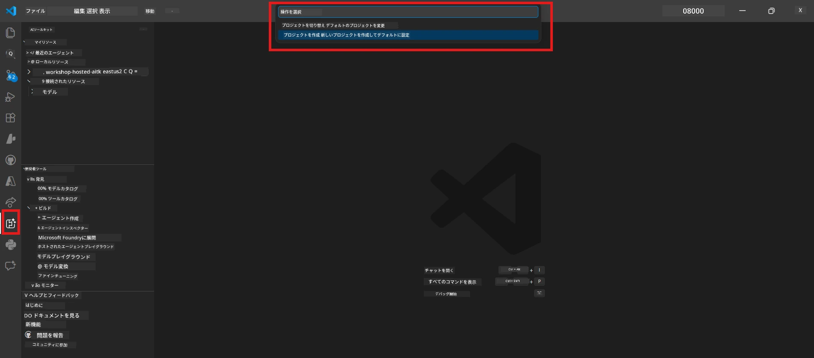

# モジュール 0 - はじめに

⏱️ 約10分

> [!WARNING]
> **プレビューと制限事項:** [Hosted Agents](https://learn.microsoft.com/azure/foundry/agents/concepts/hosted-agents) は現在 **パブリック プレビュー** 状態であり、本番環境での使用は推奨されません。このワークショップで紹介される一部の機能は、サービスのGAに向けて変更される可能性があります。

## 作成するもの

このラボでは、ラボ01での単独エージェントスキルを拡張して、<strong>マルチエージェントワークフロー</strong>—履歴書 → ジョブ適合評価器—を作成します。

履歴書<strong>と</strong>求人票**を貼り付けると、4つの専門エージェントが順に処理し、次の結果を返します：
- 適合スコア（0～100、スコア詳細付き）
- スキルと認定証のギャップリスト
- 各ギャップに対応した実際のMicrosoft Learnリンク付きの個別学習ロードマップ

**このワークフローが使用するもの：**
- **Microsoft Agent Framework** - 順次パイプライン調整のための `WorkflowBuilder`
- **Foundry Toolkit for VS Code** - スキャフォールド、ローカルテスト、デプロイ
- **AIモデル**（例：`gpt-4.1-mini`）- 4エージェントで共通使用
- **Microsoft Learn MCPサーバー** - 各スキルギャップに対応する実際の学習リソースリンクを提供

---

## パスを選ぶ

> ⚠️ **ラボ01で使用した同じパスを継続してください。**

<details open>
<summary><strong>🅰️ パスA - Azureクラウド（Azureサブスクリプションが必要）</strong></summary>

| | 詳細 |
|---|---|
| <strong>対象者</strong> | Azureサブスクリプションを使ってラボ01を完了した方 |
| <strong>モデル</strong> | Foundry経由のAzure OpenAI（例：`gpt-4.1-mini`） |
| <strong>対象モジュール</strong> | 全モジュール（00〜09） |
| **クラウドにデプロイする？** | ✅ はい - 完全なエンドツーエンドのデプロイ |

</details>

<details open>
<summary><strong>🅱️ パスB - Foundry Local（Azureサブスクリプション不要）</strong></summary>

| | 詳細 |
|---|---|
| <strong>対象者</strong> | Foundry Localを使ってラボ01を完了した方 |
| <strong>モデル</strong> | Foundry Local（無料、あなたのマシンで実行） |
| <strong>対象モジュール</strong> | モジュール00〜05（06〜07はスキップ - デプロイとクラウド検証） |
| **クラウドにデプロイする？** | ❌ いいえ - Agent Inspectorでのローカルテストのみ |

</details>

---

## ラボ01の確認

ラボ02はラボ01に直接基づいています。ここを始める前にラボ01を完了してください。

ラボ01がまだの場合はこちらから始めてください：[Lab 01 - Introduction](../../lab01-single-agent/docs/00-prerequisites.md)

<details open>
<summary><strong>🅰️ パスA - Azureクラウド</strong></summary>

```powershell
az account show --query "{name:name, id:id}" --output table
```

失敗した場合は、`az login` を実行してください。その後、VS Codeで確認します：

1. `Ctrl+Shift+P` → **Foundry Toolkit** を入力 → コマンドが表示されることを確認。
2. **Foundry Toolkit** アイコンをクリック → プロジェクトとデプロイ済みモデルが **Succeeded** と表示される。



> **RBAC:** ラボ01で **Foundry User** を割り当てました。再割り当てが必要な場合は、[Lab 01, Module 1](../../lab01-single-agent/docs/01-setup.md#deploy-a-model--assign-rbac)を参照してください。以前の役割名は **Azure AI User** で同じ権限です。

</details>

<details open>
<summary><strong>🅱️ パスB - Foundry Local</strong></summary>

```powershell
Invoke-WebRequest -Uri "http://localhost:5273/v1/health" -UseBasicParsing | Select-Object StatusCode
```

期待結果は `StatusCode: 200` です。そうでなければ、Foundry ToolkitのサイドバーからFoundry Localを再起動してください。

> すべての推論はあなたのマシン上で行われます。唯一の発信コールはMCPツールが `https://learn.microsoft.com/api/mcp` へのものです。

</details>

---

## ラボ02の新機能

| | ラボ01 | ラボ02 |
|--|--------|--------|
| エージェント数 | 1 | 4（WorkflowBuilderで連結） |
| スキャフォールドテンプレート | 基本 - Agent Framework | ワークフロー - Agent Framework |
| 新パッケージ | - | `mcp` |
| オーケストレーション | 単一会話型エージェント | 順次パイプライン（WorkflowBuilder） |
| 新ツール | - | `search_microsoft_learn_for_plan` (MCP) |

---

**次へ:** [01 - アーキテクチャの理解 →](01-understand-multi-agent.md)

---

<!-- CO-OP TRANSLATOR DISCLAIMER START -->
**免責事項**：
本書類は AI 翻訳サービス [Co-op Translator](https://github.com/Azure/co-op-translator) を使用して翻訳されています。正確性を期していますが、自動翻訳には誤りや不正確な部分が含まれる可能性があることをご承知おきください。原文の原語版が正式な情報源とみなされるべきです。重要な情報については、専門の人間による翻訳を推奨します。本翻訳の利用により生じたいかなる誤解や解釈違いについても、当方は責任を負いかねます。
<!-- CO-OP TRANSLATOR DISCLAIMER END -->