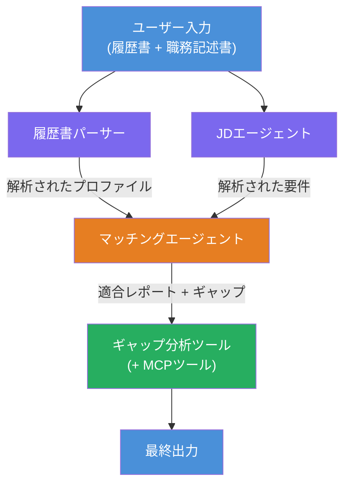
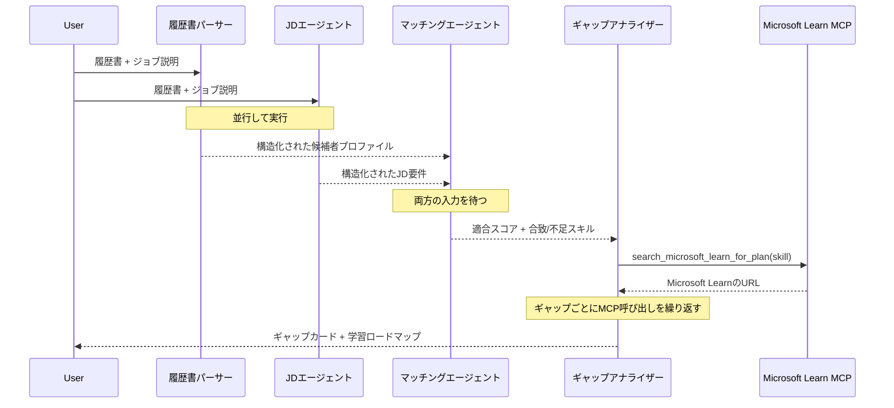
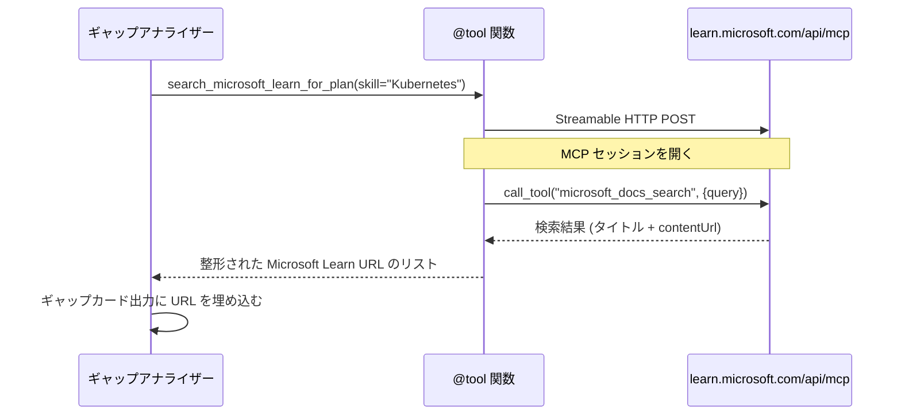

# モジュール 1 - マルチエージェントアーキテクチャの理解

このモジュールでは、コードを書く前にResume → Job Fit Evaluatorのアーキテクチャを学びます。オーケストレーショングラフ、エージェントの役割、およびデータフローを理解することは、[マルチエージェントワークフロー](https://learn.microsoft.com/azure/architecture/ai-ml/idea/multiple-agent-workflow-automation)のデバッグおよび拡張において重要です。

---

## この問題が解決する課題

履歴書と求人情報のマッチングには複数の異なるスキルが関わります：

1. <strong>パース</strong> - 非構造化テキスト（履歴書）から構造化データを抽出する
2. <strong>分析</strong> - 求人情報から要件を抽出する
3. <strong>比較</strong> - 両者の整合性をスコアリングする
4. <strong>プランニング</strong> - ギャップを埋めるための学習ロードマップを構築する

一つのエージェントがこれら四つのタスクを一回のプロンプトで行うと、次のような問題が発生しがちです：
- 抽出の不完全さ（スコアを出すために慌ててパースを終わらせてしまう）
- 浅いスコアリング（エビデンスに基づいた内訳がない）
- 一般的すぎるロードマップ（特定のギャップに合わせていない）

そこで、<strong>４つの専門化されたエージェント</strong>に分割し、それぞれ専用の指示でタスクに集中させることで、各段階でより高品質な出力を実現します。

---

## ４つのエージェント

各エージェントは、`AzureAIAgentClient.as_agent()`を使って作成されたフルの[Microsoft Foundry](https://learn.microsoft.com/azure/foundry/agents/concepts/hosted-agents)エージェントです。同じモデルデプロイメントを共有しますが、指示内容や（オプションで）ツールは異なります。

| # | エージェント名 | 役割 | 入力 | 出力 |
|---|-----------|------|-------|--------|
| 1 | **ResumeParser** | 履歴書テキストから構造化プロファイルを抽出 | ユーザーからの生の履歴書テキスト | 候補者プロファイル、技術スキル、ソフトスキル、資格、ドメイン経験、実績 |
| 2 | **JobDescriptionAgent** | 求人情報 (JD) から構造化要件を抽出 | ユーザーからの生のJDテキスト（ResumeParser経由で転送） | 役割概要、必須スキル、推奨スキル、経験、資格、学歴、責任範囲 |
| 3 | **MatchingAgent** | エビデンスに基づく適合度スコアを算出 | ResumeParser と JobDescriptionAgent からの出力 | 適合スコア（0-100、内訳付き）、マッチしたスキル、欠けているスキル、ギャップ |
| 4 | **GapAnalyzer** | 個別化された学習ロードマップを構築 | MatchingAgentの出力 | ギャップカード（スキルごと）、学習順序、タイムライン、Microsoft Learnからのリソース |

---

## オーケストレーショングラフ

ワークフローは、<strong>並列ファンアウト</strong>の後に<strong>順次集約</strong>を行います：


> **凡例:** 紫 = 並列エージェント、オレンジ = 集約ポイント、緑 = ツール付き最終エージェント

### データの流れ


1. <strong>ユーザーが送信</strong>したメッセージには履歴書と求人情報が含まれています。
2. **ResumeParser** がユーザーの入力全体を受け取り、構造化された候補者プロファイルを抽出します。
3. **JobDescriptionAgent** は並列でユーザー入力を受け取り、構造化された要件を抽出します。
4. **MatchingAgent** は ResumeParser と JobDescriptionAgent の両方の出力を受け取ります（フレームワークは両方完了を待ってからMatchingAgentを実行します）。
5. **GapAnalyzer** は MatchingAgent の出力を受け取り、<strong>Microsoft Learn MCPツール</strong>を呼び出して各ギャップごとの実際の学習リソースを取得します。
6. <strong>最終出力</strong>は GapAnalyzer の応答で、適合スコア、ギャップカード、完全な学習ロードマップが含まれています。

### なぜ並列ファンアウトが重要か

ResumeParser と JobDescriptionAgent は相互に依存しないため<strong>並列</strong>で動作します。これにより：
- 合計待機時間が短縮される（両者が同時に実行され、順次実行されるより高速）
- 自然な分割になる（履歴書の解析と求人情報の解析は独立したタスク）
- 一般的なマルチエージェントパターンを示す：**ファンアウト → 集約 → 実行**

---

## コードにおける WorkflowBuilder

上記のグラフが `main.py` の [`WorkflowBuilder`](https://learn.microsoft.com/agent-framework/workflows/agents-in-workflows) API呼び出しにどのように対応しているかを示します：

```python
from agent_framework import WorkflowBuilder

workflow = (
    WorkflowBuilder(
        name="ResumeJobFitEvaluator",
        start_executor=resume_parser,       # ユーザー入力を最初に受け取るエージェント
        output_executors=[gap_analyzer],     # 出力が返される最終エージェント
    )
    .add_edge(resume_parser, jd_agent)      # ResumeParser → JobDescriptionAgent
    .add_edge(resume_parser, matching_agent) # ResumeParser → MatchingAgent
    .add_edge(jd_agent, matching_agent)      # JobDescriptionAgent → MatchingAgent
    .add_edge(matching_agent, gap_analyzer)  # MatchingAgent → GapAnalyzer
    .build()
)
```

**エッジの意味：**

| エッジ | 意味 |
|------|--------------|
| `resume_parser → jd_agent` | JD Agent は ResumeParser の出力を受け取る |
| `resume_parser → matching_agent` | MatchingAgent は ResumeParser の出力を受け取る |
| `jd_agent → matching_agent` | MatchingAgent は JD Agent の出力も受け取る（両方の完了を待つ） |
| `matching_agent → gap_analyzer` | GapAnalyzer は MatchingAgent の出力を受け取る |

`matching_agent` は **2つの入力エッジ**（`resume_parser` と `jd_agent`）を持つため、フレームワークは両方の完了を待ってから MatchingAgent を実行します。

---

## MCPツール

GapAnalyzer エージェントは `search_microsoft_learn_for_plan` という一つのツールを持ちます。これはMicrosoft Learn APIを呼び出して厳選された学習リソースを取得する<strong>[MCPツール](https://learn.microsoft.com/agent-framework/agents/tools/hosted-mcp-tools)</strong>です。

### 動作の流れ

```python
@tool
async def search_microsoft_learn_for_plan(
    skill: str, role: str = "", max_results: int = 5
) -> str:
    """Search Microsoft Learn MCP and return curated official links."""
    # Streamable HTTP経由でhttps://learn.microsoft.com/api/mcpに接続します
    # MCPサーバーで 'microsoft_docs_search' ツールを呼び出します
    # 整形されたMicrosoft LearnのURLリストを返します
```

### MCP 呼び出しフロー


1. GapAnalyzer は特定スキル（例：「Kubernetes」）の学習リソースが必要と判定します。
2. フレームワークは `search_microsoft_learn_for_plan(skill="Kubernetes")` を呼び出します。
3. 関数は [Streamable HTTP](https://learn.microsoft.com/agent-framework/agents/tools/hosted-mcp-tools) 接続を `https://learn.microsoft.com/api/mcp` へ開きます。
4. [MCPサーバー](https://learn.microsoft.com/azure/foundry/agents/how-to/tools/model-context-protocol)上の `microsoft_docs_search` ツールを呼び出します。
5. MCPサーバーは検索結果（タイトル＋URL）を返します。
6. 関数は結果を整形し文字列として返します。
7. GapAnalyzer はギャップカードの出力に戻されたURLを使用します。

### 予想されるMCPログ

ツール実行時には以下のようなログが表示されます：

```
GET https://learn.microsoft.com/api/mcp → 405 (Method Not Allowed)
POST https://learn.microsoft.com/api/mcp → 200
DELETE https://learn.microsoft.com/api/mcp → 405 (Method Not Allowed)
```

**これらは正常です。** MCPクライアントは初期化時にGETおよびDELETEでプローブを行い、405を返すのは期待される挙動です。実際のツール呼び出しはPOSTを使用し200を返します。POST呼び出しが失敗した場合のみ注意してください。

---

## エージェント作成パターン

各エージェントは**[`AzureAIAgentClient.as_agent()`](https://learn.microsoft.com/python/api/overview/azure/ai-agents-readme) の非同期コンテキストマネージャー**を使って作成されます。これは Foundry SDK のエージェント作成と自動クリーンアップのパターンです：

```python
async with (
    get_credential() as credential,
    AzureAIAgentClient(
        project_endpoint=PROJECT_ENDPOINT,
        model_deployment_name=MODEL_DEPLOYMENT_NAME,
        credential=credential,
    ).as_agent(
        name="ResumeParser",
        instructions=RESUME_PARSER_INSTRUCTIONS,
    ) as resume_parser,
    # ... 各エージェントごとに繰り返す ...
):
    # ここには全ての4つのエージェントが存在します
    workflow = create_workflow(resume_parser, jd_agent, matching_agent, gap_analyzer)
```

**重要ポイント：**
- 各エージェントは自身の `AzureAIAgentClient` インスタンスを持ちます（SDKはエージェント名をクライアントに紐づける必要があります）
- すべてのエージェントは同じ `credential`、`PROJECT_ENDPOINT`、`MODEL_DEPLOYMENT_NAME` を共有します
- `async with` ブロックはサーバー終了時にすべてのエージェントをクリーンアップします
- GapAnalyzer にはさらに `tools=[search_microsoft_learn_for_plan]` が渡されます

---

## サーバースタートアップ

エージェントを作成しワークフローを構築したあと、サーバーが起動します：

```python
from azure.ai.agentserver.agentframework import from_agent_framework

agent = create_workflow(resume_parser, jd_agent, matching_agent, gap_analyzer)
await from_agent_framework(agent).run_async()
```

`from_agent_framework()` はワークフローをHTTPサーバーにラップし、ポート8088で `/responses` エンドポイントを公開します。これはラボ01と同じパターンですが、"エージェント"は今や全体の[ワークフローグラフ](https://learn.microsoft.com/agent-framework/workflows/as-agents)です。

---

### チェックポイント

- [ ] 4エージェントアーキテクチャと各エージェントの役割を理解している
- [ ] データフロー（ユーザー → ResumeParser →（並列） JD Agent + MatchingAgent → GapAnalyzer → 出力）をたどれる
- [ ] MatchingAgentがResumeParserとJD Agentの両方の完了を待つ理由（2本の入力エッジ）を理解している
- [ ] MCPツールの仕組み、呼び出し方法、GET 405ログが正常であることを理解している
- [ ] `AzureAIAgentClient.as_agent()` パターンと各エージェントごとにクライアントインスタンスがある理由を理解している
- [ ] `WorkflowBuilder`のコードを読んで視覚的なグラフに対応できる

---

**前へ:** [00 - 事前準備](00-prerequisites.md) · **次へ:** [02 - マルチエージェントプロジェクトのスキャフォールド →](02-scaffold-multi-agent.md)

---

<!-- CO-OP TRANSLATOR DISCLAIMER START -->
**免責事項**:  
本書類は AI 翻訳サービス [Co-op Translator](https://github.com/Azure/co-op-translator) を使用して翻訳されています。正確性に努めておりますが、自動翻訳には誤りや不正確な部分が含まれる可能性があることをご承知おきください。原文のネイティブ言語によるオリジナル文書が公式の情報源とみなされます。重要な情報については、専門の人間による翻訳を推奨します。本翻訳の利用による誤解や誤った解釈については責任を負いかねます。
<!-- CO-OP TRANSLATOR DISCLAIMER END -->