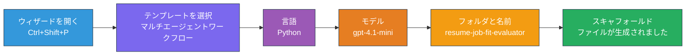
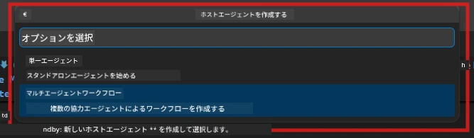

# Module 2 - マルチエージェントプロジェクトのスキャフォールド

このモジュールでは、[Microsoft Foundry extension](https://marketplace.visualstudio.com/items?itemName=TeamsDevApp.vscode-ai-foundry) を使用して<strong>マルチエージェントワークフロープロジェクトをスキャフォールド</strong>します。拡張機能は、`agent.yaml`、`main.py`、`Dockerfile`、`requirements.txt`、`.env`、およびデバッグ構成を含むプロジェクト全体の構造を生成します。これらのファイルは、モジュール3および4でカスタマイズします。

> **注意:** このラボの `PersonalCareerCopilot/` フォルダーは、カスタマイズされたマルチエージェントプロジェクトの完全で動作する例です。新たにプロジェクトをスキャフォールドする（学習には推奨）か、既存のコードを直接調べることができます。

---

## ステップ 1: Create Hosted Agent ウィザードを開く


1. `Ctrl+Shift+P` を押して <strong>コマンドパレット</strong> を開きます。
2. 「**Microsoft Foundry: Create a New Hosted Agent**」と入力して選択します。
3. ホストエージェント作成ウィザードが開きます。

> **代替方法:** アクティビティバーの **Microsoft Foundry** アイコンをクリック → **Agents** 横の **+** アイコンをクリック → **Create New Hosted Agent**。

---

## ステップ 2: マルチエージェントワークフローテンプレートを選択

ウィザードがテンプレートの選択を求めます：

| テンプレート | 説明 | 使用タイミング |
|--------------|-------|---------------|
| Single Agent | 1つのエージェントに指示と任意のツールを設定 | ラボ01 |
| **Multi-Agent Workflow** | 複数のエージェントがWorkflowBuilderで連携 | **このラボ（ラボ02）** |

1. **Multi-Agent Workflow** を選択します。
2. <strong>次へ</strong> をクリックします。



---

## ステップ 3: プログラミング言語を選択

1. **Python** を選択します。
2. <strong>次へ</strong> をクリックします。

---

## ステップ 4: モデルを選択

1. ウィザードが Foundry プロジェクトに展開されているモデルを表示します。
2. ラボ01で使ったのと同じモデルを選択します（例：**gpt-4.1-mini**）。
3. <strong>次へ</strong> をクリックします。

> **ヒント:** [`gpt-4.1-mini`](https://learn.microsoft.com/azure/foundry/foundry-models/concepts/models-sold-directly-by-azure#gpt-41-series) は開発に推奨されます。高速で安価かつマルチエージェントワークフローに適しています。最終本番展開には高品質出力のため `gpt-4.1` に切り替えてください。

---

## ステップ 5: フォルダーの場所とエージェント名を選択

1. ファイルダイアログが開きます。対象フォルダーを選択します：
   - ワークショップリポジトリを使っている場合：`workshop/lab02-multi-agent/` に移動し新しいサブフォルダーを作成
   - 新規スタートの場合：任意のフォルダーを選択
2. ホストエージェントの<strong>名前</strong>を入力します（例：`resume-job-fit-evaluator`）。
3. <strong>作成</strong> をクリックします。

---

## ステップ 6: スキャフォールディングの完了を待つ

1. VS Code が新しいウィンドウを開くか、現在のウィンドウが更新されてスキャフォールドされたプロジェクトが表示されます。
2. 次のファイル構成が表示されるはずです：

```
resume-job-fit-evaluator/
├── .env                ← Environment variables (placeholders)
├── .vscode/
│   └── launch.json     ← Debug configuration
├── agent.yaml          ← Agent definition (kind: hosted)
├── Dockerfile          ← Container configuration
├── main.py             ← Multi-agent workflow code (scaffold)
└── requirements.txt    ← Python dependencies
```

> **ワークショップメモ:** ワークショップリポジトリでは `.vscode/` フォルダーが<strong>ワークスペースのルート</strong>にあり、共有の `launch.json` と `tasks.json` が含まれています。ラボ01とラボ02のデバッグ構成が両方含まれています。F5を押すとドロップダウンで **"Lab02 - Multi-Agent"** を選択します。

---

## ステップ 7: スキャフォールドされたファイルの理解（マルチエージェント特有）

マルチエージェントのスキャフォールドは、シングルエージェントのものと次の重要な点で異なります：

### 7.1 `agent.yaml` - エージェント定義

```yaml
kind: hosted
name: resume-job-fit-evaluator
description: >
  A multi-agent workflow that evaluates resume-to-job fit.
metadata:
  authors:
    - Microsoft
  tags:
    - Multi-Agent Workflow
    - Resume Evaluator
protocols:
  - protocol: responses
    version: v1
environment_variables:
  - name: PROJECT_ENDPOINT
    value: ${PROJECT_ENDPOINT}
  - name: MODEL_DEPLOYMENT_NAME
    value: ${MODEL_DEPLOYMENT_NAME}
```

**ラボ01との主な違い:** `environment_variables` セクションには MCP エンドポイントや他のツール設定用の追加変数が含まれる場合があります。`name` と `description` はマルチエージェント用に合わせてあります。

### 7.2 `main.py` - マルチエージェントワークフローコード

スキャフォールドには以下が含まれます：
- <strong>複数のエージェント指示文字列</strong>（エージェント毎に1つの定数）
- **複数の [`AzureAIAgentClient.as_agent()`](https://learn.microsoft.com/python/api/overview/azure/ai-agents-readme) コンテキストマネージャー**（エージェント毎に1つ）
- **[`WorkflowBuilder`](https://learn.microsoft.com/agent-framework/workflows/agents-in-workflows)** でエージェントを連携
- **`from_agent_framework()`** でワークフローをHTTPエンドポイントとして提供

```python
from agent_framework import WorkflowBuilder, tool
from agent_framework.azure import AzureAIAgentClient
from azure.ai.agentserver.agentframework import from_agent_framework
```

ラボ01に比べ、追加インポートの [`WorkflowBuilder`](https://learn.microsoft.com/agent-framework/workflows/agents-in-workflows) が新規です。

### 7.3 `requirements.txt` - 追加の依存関係

マルチエージェントプロジェクトはラボ01と同じベースパッケージに加え、MCP関連のパッケージが含まれます：

```
agent-framework-azure-ai==1.0.0rc3
agent-framework-core==1.0.0rc3
azure-ai-agentserver-agentframework==1.0.0b16
azure-ai-agentserver-core==1.0.0b16
debugpy
agent-dev-cli --pre
```

> **重要なバージョン注意:** `agent-dev-cli` パッケージは最新のプレビューバージョンをインストールするために `requirements.txt` で `--pre` フラグが必要です。これは `agent-framework-core==1.0.0rc3` とエージェントインスペクターの互換性のために必須です。詳細は [Module 8 - トラブルシューティング](08-troubleshooting.md) を参照してください。

| パッケージ | バージョン | 用途 |
|------------|------------|------|
| [`agent-framework-azure-ai`](https://learn.microsoft.com/agent-framework/overview/) | `1.0.0rc3` | [Microsoft Agent Framework](https://github.com/microsoft/agent-framework) の Azure AI 統合 |
| [`agent-framework-core`](https://learn.microsoft.com/agent-framework/overview/) | `1.0.0rc3` | コアランタイム（WorkflowBuilderを含む） |
| `azure-ai-agentserver-agentframework` | `1.0.0b16` | ホストエージェントサーバーランタイム |
| `azure-ai-agentserver-core` | `1.0.0b16` | コアエージェントサーバー抽象 |
| `debugpy` | 最新 | Python デバッグ（VS CodeのF5） |
| `agent-dev-cli` | `--pre` | ローカル開発CLIとAgent Inspectorバックエンド |

### 7.4 `Dockerfile` - ラボ01と同じ

Dockerfileはラボ01と同一で、ファイルをコピーし、`requirements.txt` から依存関係をインストールし、ポート8088を開放し、`python main.py` を実行します。

```dockerfile
FROM python:3.14-slim
WORKDIR /app
COPY ./ .
RUN pip install --upgrade pip && \
    if [ -f requirements.txt ]; then \
        pip install -r requirements.txt; \
    else \
      echo "No requirements.txt found" >&2; exit 1; \
    fi
EXPOSE 8088
CMD ["python", "main.py"]
```

---

### チェックポイント

- [ ] スキャフォールディングウィザードが完了し、新しいプロジェクト構造が表示されている
- [ ] すべてのファイルが確認できる：`agent.yaml`、`main.py`、`Dockerfile`、`requirements.txt`、`.env`
- [ ] `main.py` に `WorkflowBuilder` のインポートが含まれている（マルチエージェントテンプレートが選ばれたことを確認）
- [ ] `requirements.txt` に `agent-framework-core` と `agent-framework-azure-ai` の両方が含まれている
- [ ] マルチエージェントスキャフォールドがシングルエージェントスキャフォールドとどのように異なるか理解している（複数エージェント、WorkflowBuilder、MCPツール）

---

**前へ:** [01 - マルチエージェントアーキテクチャの理解](01-understand-multi-agent.md) · **次へ:** [03 - エージェントと環境の構成 →](03-configure-agents.md)

---

<!-- CO-OP TRANSLATOR DISCLAIMER START -->
**免責事項**:  
本書類は AI 翻訳サービス [Co-op Translator](https://github.com/Azure/co-op-translator) を使用して翻訳されています。正確性を期していますが、自動翻訳には誤りや不正確な箇所が含まれる可能性があることをご承知おきください。原文はその言語において権威ある資料と見なされるべきです。重要な情報については、専門の人間による翻訳を推奨します。本翻訳の使用によって生じるいかなる誤解や誤訳についても、当方は責任を負いません。
<!-- CO-OP TRANSLATOR DISCLAIMER END -->