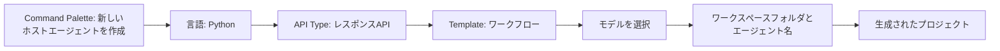
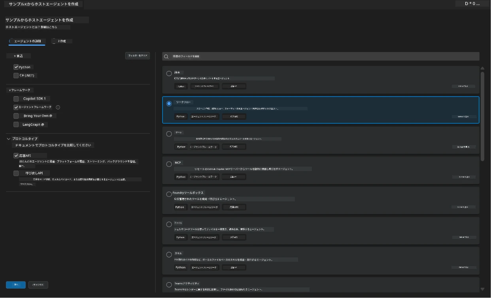
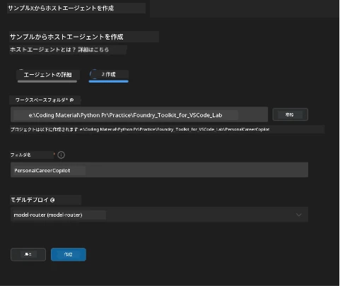

# モジュール 2 - マルチエージェントプロジェクトのスキャフォールド作成

⏱️ 約5分

このモジュールでは、[Foundry Toolkit for VS Code](https://aka.ms/foundrytk) を使用して <strong>マルチエージェントプロジェクトをスキャフォールド作成</strong> します。ウィザードは `agent.yaml`、`main.py`、`Dockerfile`、`requirements.txt`、`.env`、および VS Code デバッグ構成を生成するため、モジュール 3 の4エージェントワークフローの配線に集中できます。

> **重要な概念:** スキャフォールドは1つのエージェントの動作するスタブです。モジュール 3 でプレースホルダーのロジックを `WorkflowBuilder` グラフに置き換えます。ボイラープレートを最初から書く必要はありません。

> **参考実装:** [`PersonalCareerCopilot/`](../../../../../workshop/lab02-multi-agent/PersonalCareerCopilot) は完全な動作例です。進めながらご自身の作業と比較してください。

### スキャフォールドウィザードの流れ


```mermaid
flowchart LR
    A[Command Palette: 新しいホストエージェントを作成] --> B[言語: Python]
    B --> C[API Type: レスポンスAPI]
    C --> D[Template: ワークフロー]
    D --> E[モデルを選択]
    E --> F[ワークスペースフォルダとエージェント名]
    F --> G[生成されたプロジェクト]
```

---

## ステップ 1: Create Hosted Agent ウィザードを開く

1. `Ctrl+Shift+P` を押して <strong>コマンドパレット</strong> を開く
2. 次を入力：**Foundry Toolkit: Create a New Hosted Agent** を選択
3. ウィザードが **Agent Details** タブを開きます

> **代替:** アクティビティバーの **Foundry Toolkit** アイコンをクリック → **Hosted Agents** の横の **+** アイコンをクリック → **Create New Hosted Agent** を選択

---

## ステップ 2: 設定の選択



1. 左側ナビゲーション/オプション欄で以下を選択：

| メニュー | 選択 | 備考 |
|--------|-----------|-------|
| **Language** | Python | C# (.NET) も対応 |
| **Framework** | Agent Framework | `Agent`、`AgentExecutor`、`WorkflowBuilder` を提供 |
| **API type** | Response API | `POST /responses` - プラットフォーム管理の履歴、ストリーミング対応 |
| **Template** | **Workflows** | 複数エージェントにリクエストを順に処理 |

2. 選択後、**Next** をクリック



3. 次の画面で以下を選択：

| メニュー | 選択 | 備考 |
|--------|-----------|-------|
| **Workspace folder** | ターゲットフォルダを参照して指定 | 例：このリポジトリの `workshop/lab02-multi-agent/` |
| **Agent name** | `PersonalCareerCopilot` | プロジェクトディレクトリ名になります |
| **Model Deployment** | 展開済みモデルを選択 | 例：Lab 01 の `gpt-4.1-mini` |

4. **Create** をクリックしてプロジェクトをスキャフォールド作成。VS Code がファイルを生成しフォルダを開きます。

> **ヒント:** [`gpt-4.1-mini`](https://learn.microsoft.com/azure/foundry/foundry-models/concepts/models-sold-directly-by-azure#gpt-41-series) はマルチエージェント開発において速度と品質のバランスが良好です。

---

## ステップ 3: 生成されたプロジェクトの確認

スキャフォールド作成完了後、エクスプローラー（`Ctrl+Shift+E`）で以下のファイルが存在することを確認してください：

```
📂 <your-agent-name>/
├── .azdignore          ← Files excluded from Azure Developer CLI deployments
├── .dockerignore       ← Files excluded from Docker builds
├── .env                ← Environment variables (placeholders - fill in Module 3)
├── .vscode/
│   ├── launch.json     ← Debug config (F5 → run + Agent Inspector)
│   └── tasks.json      ← VS Code task definitions
├── agent.yaml          ← Agent definition (kind: hosted, protocol: responses)
├── Dockerfile          ← Container config for deployment
├── main.py             ← Stub agent entry point (replace with WorkflowBuilder in Module 3)
└── requirements.txt    ← Python dependencies
```

> **重要:** `.vscode/launch.json` と `tasks.json` が適切にF5デバッグへ適用されるよう、スキャフォールドフォルダは VS Code で直接開いてください。

### 重要ファイルの説明

| ファイル | 目的 |
|------|---------|
| `agent.yaml` | `kind: hosted` を宣言し、環境変数をマッピングし、`/responses` プロトコルを定義 |
| `main.py` | スタブ：1つの `FoundryChatClient` → `Agent` → `ResponsesHostServer`。モジュール 3 で4エージェント＋`WorkflowBuilder`と置き換えます |
| `Dockerfile` | `python:3.12-slim` を使用し `requirements.txt` インストール、ポート8088公開、`python main.py`を実行 |
| `requirements.txt` | `agent-framework-foundry`、`agent-framework-foundry-hosting`、`mcp<2,>=1.24.0`、`debugpy` |

> **参考:** 完全な生成内容は [`PersonalCareerCopilot/agent.yaml`](../../../../../workshop/lab02-multi-agent/PersonalCareerCopilot/agent.yaml) と [`PersonalCareerCopilot/requirements.txt`](../../../../../workshop/lab02-multi-agent/PersonalCareerCopilot/requirements.txt) を参照してください。

---

### ✅ チェックポイント

- [ ] スキャフォールドウィザード完了 - 新規プロジェクトフォルダがエクスプローラーに表示されている
- [ ] 期待される全ファイルが存在する：`agent.yaml`、`main.py`、`Dockerfile`、`requirements.txt`、`.env`
- [ ] `agent.yaml` は `kind: hosted` と `protocol: responses` を示している
- [ ] `main.py` は `Agent`、`FoundryChatClient`、`ResponsesHostServer` をインポートしている
- [ ] スキャフォールドフォルダが VS Code ワークスペースルートとして開かれている
- [ ] `main.py` はスタブであることを理解している - `WorkflowBuilder` はモジュール 3 で追加される

---

**前へ:** [01 - マルチエージェントアーキテクチャの理解](01-understand-multi-agent.md) · **次へ:** [03 - エージェント＆環境の構成 →](03-configure-agents.md)

---

<!-- CO-OP TRANSLATOR DISCLAIMER START -->
**免責事項**：
本書類は AI 翻訳サービス [Co-op Translator](https://github.com/Azure/co-op-translator) を使用して翻訳されています。正確性を期していますが、自動翻訳には誤りや不正確な部分が含まれる可能性があることをご承知おきください。原文の原語版が正式な情報源とみなされるべきです。重要な情報については、専門の人間による翻訳を推奨します。本翻訳の利用により生じたいかなる誤解や解釈違いについても、当方は責任を負いかねます。
<!-- CO-OP TRANSLATOR DISCLAIMER END -->