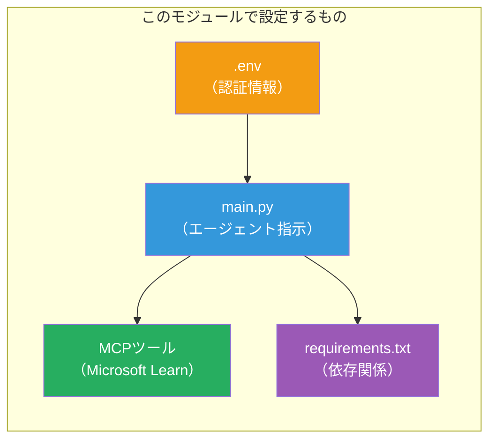

# Module 3 - エージェント、MCPツール＆環境の設定

このモジュールでは、スキャフォールドされたマルチエージェントプロジェクトをカスタマイズします。4つのエージェントすべての指示を書き、Microsoft Learn用のMCPツールを設定し、環境変数を構成し、依存関係をインストールします。


> **参照:** 完全な動作コードは [`PersonalCareerCopilot/main.py`](../../../../../workshop/lab02-multi-agent/PersonalCareerCopilot/main.py) にあります。独自に構築する際の参考にしてください。

---

## ステップ 1: 環境変数の設定

1. プロジェクトのルートにある **`.env`** ファイルを開きます。
2. Foundryプロジェクトの詳細を入力します：

   ```env
   PROJECT_ENDPOINT=https://<your-account>.services.ai.azure.com/api/projects/<your-project>
   MODEL_DEPLOYMENT_NAME=gpt-4.1-mini
   ```

3. ファイルを保存します。

### これらの値の見つけ方

| 値 | 見つけ方 |
|-------|---------------|
| <strong>プロジェクトエンドポイント</strong> | Microsoft Foundry サイドバー → プロジェクトをクリック → 詳細ビューのエンドポイントURL |
| <strong>モデル展開名</strong> | Foundryサイドバー → プロジェクトを展開 → **Models + endpoints** → 展開されたモデル名の隣 |

> **セキュリティ:** `.env` をバージョン管理にコミットしないでください。まだ含まれていない場合は `.gitignore` に追加してください。

### 環境変数のマッピング

マルチエージェントの `main.py` は、標準のものとワークショップ固有の環境変数名の両方を読み取ります：

```python
PROJECT_ENDPOINT = os.getenv("AZURE_AI_PROJECT_ENDPOINT") or os.getenv("PROJECT_ENDPOINT")
MODEL_DEPLOYMENT_NAME = os.getenv(
    "AZURE_AI_MODEL_DEPLOYMENT_NAME",
    os.getenv("MODEL_DEPLOYMENT_NAME", "gpt-4.1-mini"),
)
MICROSOFT_LEARN_MCP_ENDPOINT = os.getenv(
    "MICROSOFT_LEARN_MCP_ENDPOINT", "https://learn.microsoft.com/api/mcp"
)
```

MCPエンドポイントは妥当なデフォルトがあるため、上書きしたい場合を除き `.env` に設定する必要はありません。

---

## ステップ 2: エージェントの指示を書く

これは最も重要なステップです。各エージェントには、その役割、出力フォーマット、ルールを定義する注意深く作成された指示が必要です。`main.py` を開き、指示定数を作成（または修正）します。

### 2.1 履歴書解析エージェント

```python
RESUME_PARSER_INSTRUCTIONS = """\
You are the Resume Parser.
Extract resume text into a compact, structured profile for downstream matching.

Output exactly these sections:
1) Candidate Profile
2) Technical Skills (grouped categories)
3) Soft Skills
4) Certifications & Awards
5) Domain Experience
6) Notable Achievements

Rules:
- Use only explicit or strongly implied evidence.
- Do not invent skills, titles, or experience.
- Keep concise bullets; no long paragraphs.
- If input is not a resume, return a short warning and request resume text.
"""
```

**なぜこのセクション？** MatchingAgentはスコアリングのために構造化データが必要です。セクションを一貫させることで、エージェント間の引き継ぎが信頼できるものになります。

### 2.2 求人説明エージェント

```python
JOB_DESCRIPTION_INSTRUCTIONS = """\
You are the Job Description Analyst.
Extract a structured requirement profile from a JD.

Output exactly these sections:
1) Role Overview
2) Required Skills
3) Preferred Skills
4) Experience Required
5) Certifications Required
6) Education
7) Domain / Industry
8) Key Responsibilities

Rules:
- Keep required vs preferred clearly separated.
- Only use what the JD states; do not invent hidden requirements.
- Flag vague requirements briefly.
- If input is not a JD, return a short warning and request JD text.
"""
```

**必須 vs 推奨を分ける理由は？** MatchingAgentはそれぞれに異なる重みを使います（必須スキル=40ポイント、推奨スキル=10ポイント）。

### 2.3 マッチングエージェント

```python
MATCHING_AGENT_INSTRUCTIONS = """\
You are the Matching Agent.
Compare parsed resume output vs JD output and produce an evidence-based fit report.

Scoring (100 total):
- Required Skills 40
- Experience 25
- Certifications 15
- Preferred Skills 10
- Domain Alignment 10

Output exactly these sections:
1) Fit Score (with breakdown math)
2) Matched Skills
3) Missing Skills
4) Partially Matched
5) Experience Alignment
6) Certification Gaps
7) Overall Assessment

Rules:
- Be objective and evidence-only.
- Keep partial vs missing separate.
- Keep Missing Skills precise; it feeds roadmap planning.
"""
```

**なぜ明示的なスコアリング？** 再現性のあるスコアリングにより、実行結果の比較やデバッグが可能です。100点満点スケールはエンドユーザーにとって分かりやすいです。

### 2.4 ギャップ分析エージェント

```python
GAP_ANALYZER_INSTRUCTIONS = """\
You are the Gap Analyzer and Roadmap Planner.
Create a practical upskilling plan from the matching report.

Microsoft Learn MCP usage (required):
- For EVERY High and Medium priority gap, call tool `search_microsoft_learn_for_plan`.
- Use returned Learn links in Suggested Resources.
- Prefer Microsoft Learn for free resources.

CRITICAL: You MUST produce a SEPARATE detailed gap card for EVERY skill listed in
the Missing Skills and Certification Gaps sections of the matching report. Do NOT
skip or combine gaps. Do NOT summarize multiple gaps into one card.

Output format:
1) Personalized Learning Roadmap for [Role Title]
2) One DETAILED card per gap (produce ALL cards, not just the first):
   - Skill
   - Priority (High/Medium/Low)
   - Current Level
   - Target Level
   - Suggested Resources (include Learn URL from tool results)
   - Estimated Time
   - Quick Win Project
3) Recommended Learning Order (numbered list)
4) Timeline Summary (week-by-week)
5) Motivational Note

Rules:
- Produce every gap card before writing the summary sections.
- Keep it specific, realistic, and actionable.
- Tailor to candidate's existing stack.
- If fit >= 80, focus on polish/interview readiness.
- If fit < 40, be honest and provide a staged path.
"""
```

**なぜ「CRITICAL」強調？** ギャップカードをすべて作成する明示的な指示がないと、モデルは1～2枚だけ生成し、残りを要約しがちです。「CRITICAL」ブロックはこうした省略を防ぎます。

---

## ステップ 3: MCPツールを定義する

GapAnalyzerは [Microsoft Learn MCPサーバー](https://learn.microsoft.com/azure/foundry/agents/how-to/tools/model-context-protocol) を呼び出すツールを使います。これを `main.py` に追加します：

```python
import json
from agent_framework import tool
from mcp.client.session import ClientSession
from mcp.client.streamable_http import streamable_http_client

@tool
async def search_microsoft_learn_for_plan(
    skill: str, role: str = "", max_results: int = 5
) -> str:
    """Search Microsoft Learn MCP and return curated official links for roadmap planning."""
    query = " ".join(part for part in [skill, role, "learning path module"] if part).strip()
    query = query or "job skills learning path"

    try:
        async with streamable_http_client(MICROSOFT_LEARN_MCP_ENDPOINT) as (
            read_stream, write_stream, _,
        ):
            async with ClientSession(read_stream, write_stream) as session:
                await session.initialize()
                result = await session.call_tool(
                    "microsoft_docs_search", {"query": query}
                )

        if not result.content:
            return (
                "No results returned from Microsoft Learn MCP. "
                "Fallback: https://learn.microsoft.com/training/support/catalog-api"
            )

        payload_text = getattr(result.content[0], "text", "")
        data = json.loads(payload_text) if payload_text else {}
        items = data.get("results", [])[:max(1, min(max_results, 10))]

        if not items:
            return f"No direct Microsoft Learn results found for '{skill}'."

        lines = [f"Microsoft Learn resources for '{skill}':"]
        for i, item in enumerate(items, start=1):
            title = item.get("title") or item.get("url") or "Microsoft Learn Resource"
            url = item.get("url") or item.get("link") or ""
            lines.append(f"{i}. {title} - {url}".rstrip(" -"))
        return "\n".join(lines)
    except Exception as ex:
        return (
            f"Microsoft Learn MCP lookup unavailable. Reason: {ex}. "
            "Fallbacks: https://learn.microsoft.com/api/mcp"
        )
```

### ツールの仕組み

| ステップ | 内容 |
|------|-------------|
| 1 | GapAnalyzerがスキル（例："Kubernetes"）のリソースが必要と判断 |
| 2 | フレームワークが `search_microsoft_learn_for_plan(skill="Kubernetes")` を呼び出す |
| 3 | 関数が [Streamable HTTP](https://learn.microsoft.com/agent-framework/agents/tools/hosted-mcp-tools) 接続を `https://learn.microsoft.com/api/mcp` に開く |
| 4 | [MCPサーバー](https://learn.microsoft.com/azure/foundry/agents/how-to/tools/model-context-protocol) の `microsoft_docs_search` を呼び出す |
| 5 | MCPサーバーが検索結果（タイトル＋URL）を返す |
| 6 | 関数が結果を番号付きリストにフォーマット |
| 7 | GapAnalyzerがURLをギャップカードに組み込む |

### MCPの依存関係

MCPクライアントライブラリは [`agent-framework-core`](https://learn.microsoft.com/agent-framework/overview/) 経由で間接的に含まれているため、`requirements.txt` に個別追加は不要です。インポートエラーが出た場合は次を確認してください：

```powershell
pip list | Select-String "mcp"
```

期待される状態：`mcp` パッケージがバージョン1.x以降でインストールされていること。

---

## ステップ 4: エージェントとワークフローを接続する

### 4.1 コンテキストマネージャーを使ってエージェントを作成

```python
from contextlib import asynccontextmanager

@asynccontextmanager
async def create_agents():
    async with (
        get_credential() as credential,
        AzureAIAgentClient(
            project_endpoint=PROJECT_ENDPOINT,
            model_deployment_name=MODEL_DEPLOYMENT_NAME,
            credential=credential,
        ).as_agent(
            name="ResumeParser",
            instructions=RESUME_PARSER_INSTRUCTIONS,
        ) as resume_parser,
        AzureAIAgentClient(
            project_endpoint=PROJECT_ENDPOINT,
            model_deployment_name=MODEL_DEPLOYMENT_NAME,
            credential=credential,
        ).as_agent(
            name="JobDescriptionAgent",
            instructions=JOB_DESCRIPTION_INSTRUCTIONS,
        ) as jd_agent,
        AzureAIAgentClient(
            project_endpoint=PROJECT_ENDPOINT,
            model_deployment_name=MODEL_DEPLOYMENT_NAME,
            credential=credential,
        ).as_agent(
            name="MatchingAgent",
            instructions=MATCHING_AGENT_INSTRUCTIONS,
        ) as matching_agent,
        AzureAIAgentClient(
            project_endpoint=PROJECT_ENDPOINT,
            model_deployment_name=MODEL_DEPLOYMENT_NAME,
            credential=credential,
        ).as_agent(
            name="GapAnalyzer",
            instructions=GAP_ANALYZER_INSTRUCTIONS,
            tools=[search_microsoft_learn_for_plan],
        ) as gap_analyzer,
    ):
        yield resume_parser, jd_agent, matching_agent, gap_analyzer
```

**重要なポイント:**
- 各エージェントにはそれぞれ<strong>独自の</strong> `AzureAIAgentClient` インスタンスがある
- GapAnalyzerのみが `tools=[search_microsoft_learn_for_plan]` を持つ
- `get_credential()` はAzure上では [`ManagedIdentityCredential`](https://learn.microsoft.com/python/api/overview/azure/identity-readme#managed-identity-support)、ローカルでは [`DefaultAzureCredential`](https://learn.microsoft.com/azure/developer/python/sdk/authentication/credential-chains#defaultazurecredential-overview) を返す

### 4.2 ワークフローグラフを構築

```python
def create_workflow(resume_parser, jd_agent, matching_agent, gap_analyzer):
    workflow = (
        WorkflowBuilder(
            name="ResumeJobFitEvaluator",
            start_executor=resume_parser,
            output_executors=[gap_analyzer],
        )
        .add_edge(resume_parser, jd_agent)
        .add_edge(resume_parser, matching_agent)
        .add_edge(jd_agent, matching_agent)
        .add_edge(matching_agent, gap_analyzer)
        .build()
    )
    return workflow.as_agent()
```

> `.as_agent()` パターンの理解には [Workflows as Agents](https://learn.microsoft.com/agent-framework/workflows/as-agents) を参照してください。

### 4.3 サーバーを起動

```python
async def main() -> None:
    validate_configuration()
    async with create_agents() as (resume_parser, jd_agent, matching_agent, gap_analyzer):
        agent = create_workflow(resume_parser, jd_agent, matching_agent, gap_analyzer)
        from azure.ai.agentserver.agentframework import from_agent_framework
        await from_agent_framework(agent).run_async()

if __name__ == "__main__":
    asyncio.run(main())
```

---

## ステップ 5: 仮想環境の作成と有効化

### 5.1 環境を作成

```powershell
cd workshop\lab02-multi-agent\PersonalCareerCopilot
python -m venv .venv
```

### 5.2 有効化

**PowerShell (Windows):**
```powershell
.\.venv\Scripts\Activate.ps1
```

**macOS/Linux:**
```bash
source .venv/bin/activate
```

### 5.3 依存関係をインストール

```powershell
pip install -r requirements.txt
```

> **注意:** `requirements.txt` の `agent-dev-cli --pre` ラインは最新のプレビュー版をインストールします。これは `agent-framework-core==1.0.0rc3` との互換性に必要です。

### 5.4 インストールを確認

```powershell
pip list | Select-String "agent-framework|agentserver|agent-dev"
```

期待される出力：
```
agent-dev-cli                  0.0.1b260316
agent-framework-azure-ai       1.0.0rc3
agent-framework-core            1.0.0rc3
azure-ai-agentserver-agentframework 1.0.0b16
azure-ai-agentserver-core      1.0.0b16
```

> **`agent-dev-cli` が古いバージョンの場合**（例：`0.0.1b260119`）、Agent Inspectorは403や404エラーで失敗します。アップグレードしてください：`pip install agent-dev-cli --pre --upgrade`

---

## ステップ 6: 認証を確認

Lab 01と同様に認証チェックを実行します：

```powershell
az account show --query "{name:name, id:id}" --output table
```

失敗した場合は [`az login`](https://learn.microsoft.com/cli/azure/authenticate-azure-cli-interactively) を実行してください。

マルチエージェントワークフローでは、4つのエージェントは同じ認証情報を共有します。1つで認証が成功すればすべてで成功します。

---

### チェックポイント

- [ ] `.env` に有効な `PROJECT_ENDPOINT` と `MODEL_DEPLOYMENT_NAME` の値がある
- [ ] 4つのエージェント指示定数すべてが `main.py` に定義されている（ResumeParser、JD Agent、MatchingAgent、GapAnalyzer）
- [ ] `search_microsoft_learn_for_plan` MCPツールが定義され、GapAnalyzerに登録されている
- [ ] `create_agents()` で4つのエージェントすべてが個別の `AzureAIAgentClient` インスタンスで作成されている
- [ ] `create_workflow()` が `WorkflowBuilder` で正しいグラフを構築している
- [ ] 仮想環境が作成・有効化されている（`(.venv)` 表示がある）
- [ ] `pip install -r requirements.txt` がエラーなく完了している
- [ ] `pip list` に期待されるパッケージが正しいバージョン（rc3 / b16）で表示されている
- [ ] `az account show` がサブスクリプションを返している

---

**前:** [02 - スキャフォールドされたマルチエージェントプロジェクト](02-scaffold-multi-agent.md) · **次:** [04 - オーケストレーションパターン →](04-orchestration-patterns.md)

---

<!-- CO-OP TRANSLATOR DISCLAIMER START -->
**免責事項**：  
本書類は AI 翻訳サービス [Co-op Translator](https://github.com/Azure/co-op-translator) を使用して翻訳されました。正確性を目指していますが、自動翻訳には誤りや不正確な箇所が含まれる可能性があります。原文のネイティブ言語の文書が権威ある情報源とみなされるべきです。重要な情報については、専門の人間による翻訳を推奨します。本翻訳の使用に起因するいかなる誤解や誤訳についても責任を負いかねます。
<!-- CO-OP TRANSLATOR DISCLAIMER END -->