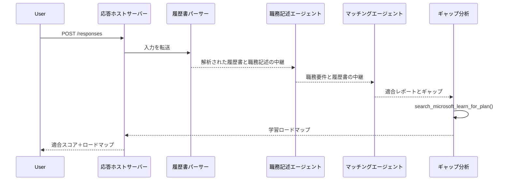

# モジュール 3 - 命令、環境設定、および依存関係のインストール

⏱️ 約15分

このモジュールでは、スキャフォールドされたスタブを<strong>あなたの</strong>マルチエージェントワークフローに変換します。環境変数の設定、エージェント命令の作成、MCPツールの追加、ワークフローグラフの配線、および依存関係のインストールを行います。

> **参考:** 完全な動作コードは[`PersonalCareerCopilot/main.py`](../../../../../workshop/lab02-multi-agent/PersonalCareerCopilot/main.py)にあります。自分のワークフローグラフとプロンプトブロックを構築する際の参考にしてください。

---

## 4つのエージェントの連携方法


```mermaid
sequenceDiagram
    participant User
    participant Server as 応答ホストサーバー
    participant RP as 履歴書パーサー
    participant JD as 職務記述エージェント
    participant MA as マッチングエージェント
    participant GA as ギャップ分析

    User->>Server: POST /responses
    Server->>RP: 入力を転送
    RP-->>JD: 解析された履歴書と職務記述の中継
    JD-->>MA: 職務要件と履歴書の中継
    MA-->>GA: 適合レポートとギャップ
    GA->>GA: search_microsoft_learn_for_plan()
    GA-->>Server: 学習ロードマップ
    Server-->>User: 適合スコア＋ロードマップ
```

---

## ステップ 1: 環境変数を設定する

1. プロジェクトルートの**`.env`**ファイルを開きます（スキャフォールドウィザードによって作成済み）。
2. プレースホルダーをLab 01の実際の値に置き換えます。

<details open>
<summary><strong>🅰️ パスA - Foundryサブスクリプション</strong></summary>

```env
FOUNDRY_PROJECT_ENDPOINT=https://<your-account>.services.ai.azure.com/api/projects/<your-project>
AZURE_AI_MODEL_DEPLOYMENT_NAME=gpt-4.1-mini
```

> **値の確認場所:** [Lab 01, モジュール 1](../../lab01-single-agent/docs/01-setup.md#deploy-a-model--assign-rbac)を参照してください。

</details>

<details open>
<summary><strong>🅱️ パスB - Foundryローカル</strong></summary>

```env
FOUNDRY_PROJECT_ENDPOINT=http://localhost:5273/v1
AZURE_AI_MODEL_DEPLOYMENT_NAME=phi-4-mini
```

> すべての推論はあなたのマシン上で実行され、データはデバイス外に出ません。`foundry model list`を実行して正確なモデルエイリアスを確認してください。唯一の外向き要求は`https://learn.microsoft.com/api/mcp`へのMCPツール呼び出しです。

> **値の確認場所:** [Lab 01, モジュール 1 - ローカルパス](../../lab01-single-agent/docs/01-setup.md#step-2-set-up-based-on-your-access)を参照してください。

</details>

> **セキュリティ:** `.env`をバージョン管理にコミットしないでください。`.gitignore`にすでに含まれているはずです。

---

## ステップ 2: エージェント命令を書き込む

命令は各エージェントの役割、出力形式、およびルールを定義します。`main.py`を開き、4つの命令定数を定義（または置き換え）します。完全な文字列は[`PersonalCareerCopilot/main.py`](../../../../../workshop/lab02-multi-agent/PersonalCareerCopilot/main.py)にあります。

### 2.1 `RESUME_PARSER_INSTRUCTIONS`
履歴書を構造化された候補者プロフィールに解析し、ジョブ記述を逐語的に`[JOB DESCRIPTION PASS-THROUGH]`にコピーします。これらのラベル付きセクションが両方とも出力に現れる必要があります。

> **なぜパススルーなのか？** `context_mode="last_agent"`では、ResumeParserだけが元のユーザーメッセージを見るエージェントです。JDを次にコピーしなければ、後続のエージェントはそれを見ません。

### 2.2 `JOB_DESCRIPTION_INSTRUCTIONS`
ResumeParserの出力から`[PARSED RESUME]`と`[JOB DESCRIPTION PASS-THROUGH]`を読み込み、`[JD REQUIREMENTS]`（構造化された要件）と`[PARSED RESUME PASS-THROUGH]`（MatchingAgent用の逐語的な履歴書コピー）を出力します。

### 2.3 `MATCHING_AGENT_INSTRUCTIONS`
`[JD REQUIREMENTS]`と`[PARSED RESUME PASS-THROUGH]`を読み込み、スコア付きの適合レポート（0～100）を、内訳の計算、マッチしたスキル、欠落スキル、経験の整合性とともに生成します。

### 2.4 `GAP_ANALYZER_INSTRUCTIONS`
適合レポートを読み込み、<strong>すべての</strong>欠落スキルについて`search_microsoft_learn_for_plan`を呼び出してMicrosoft Learnのリソースを取得します。スキルごとに詳細なギャップカードを1枚ずつ作成し、週ごとの学習ロードマップを生成します。

---

## ステップ 3: MCPツールを追加する

GapAnalyzerは[Microsoft Learn MCPサーバー](https://learn.microsoft.com/azure/foundry/agents/how-to/tools/model-context-protocol)を呼び出して、各スキルギャップのための実際の学習リソースを取得します。完全な`search_microsoft_learn_for_plan`関数は[`PersonalCareerCopilot/main.py`](../../../../../workshop/lab02-multi-agent/PersonalCareerCopilot/main.py)にあります。

エージェント作成時にGapAnalyzerにツールを登録します：

```python
gap_analyzer = Agent(
    client=client,
    instructions=GAP_ANALYZER_INSTRUCTIONS,
    name="GapAnalyzer",
    tools=[search_microsoft_learn_for_plan],
)
```

> 完全な`WorkflowBuilder`グラフ（`FoundryChatClient`、`AgentExecutor`、すべての`add_edge()`呼び出しを含む）は[`PersonalCareerCopilot/main.py`](../../../../../workshop/lab02-multi-agent/PersonalCareerCopilot/main.py)を参照してください。

---

## ステップ 4: 仮想環境を作成して依存関係をインストールする

> ⚠️ **このステップは必ず実行してください。** 依存関係がインストールされていないと、F5デバッグは失敗します。

### 4.1 仮想環境を作成する

```powershell
python -m venv .venv
```

### 4.2 仮想環境を有効化する

| OS | コマンド |
|----|---------|
| **Windows (PowerShell)** | `.\.venv\Scripts\Activate.ps1` |
| **Windows (CMD)** | `.venv\Scripts\activate.bat` |
| **macOS / Linux** | `source .venv/bin/activate` |

ターミナルプロンプトに`(.venv)`が表示されるはずです。

### 4.3 依存関係をインストールする

```powershell
pip install -r requirements.txt
```

### 4.4 インストールを確認する

```powershell
pip list | Select-String "agent-framework|mcp|debugpy"
```

期待される結果：`agent-framework-foundry`、`agent-framework-foundry-hosting`、`mcp`、および`debugpy`がリストに表示されること。

---

## ステップ 5: 認証を確認する

<details open>
<summary><strong>🅰️ パスA - Azure認証情報</strong></summary>

```powershell
az account show --query "{name:name, id:id}" --output table
```

もし失敗したら、[`az login`](https://learn.microsoft.com/cli/azure/authenticate-azure-cli-interactively)を実行してください。

4つのエージェントは1つの`FoundryChatClient`と1つの`DefaultAzureCredential`を共有します。1つの認証が成功すれば、すべて成功と見なします。

</details>

<details open>
<summary><strong>🅱️ パスB - Foundryローカル</strong></summary>

ローカルテストでは認証は不要です。

</details>

---

### ✅ チェックポイント

> Module 04に進むのは、**(1)** プロンプトに`(.venv)`が表示されており、**(2)** `pip install -r requirements.txt`が正常に完了していることが条件です。

- [ ] `.env`に有効なエンドポイントとモデルの展開名が設定されていること（プレースホルダーではない）
- [ ] `main.py`に4つのエージェント命令定数がすべて定義されていること（ResumeParser、JD Agent、MatchingAgent、GapAnalyzer）
- [ ] `search_microsoft_learn_for_plan` MCPツールがGapAnalyzerに定義・登録されていること
- [ ] `FoundryChatClient` + 4つの`Agent` + 4つの`AgentExecutor`オブジェクトが`main()`内で作成されていること
- [ ] `WorkflowBuilder`が正しい順序のグラフを3回の`add_edge()`呼び出しで構築していること
- [ ] 仮想環境が作成・有効化されていること（プロンプトに`(.venv)`が見える）
- [ ] `pip install -r requirements.txt`がエラーなく完了していること
- [ ] **パスA:** `az account show`が成功することまたはVS Codeのアカウントアイコンにサインイン済みアカウントが表示されること

---

**前:** [02 - マルチエージェントプロジェクトのスキャフォルド](02-scaffold-multi-agent.md) · **次:** [04 - オーケストレーションパターン →](04-orchestration-patterns.md)

---

<!-- CO-OP TRANSLATOR DISCLAIMER START -->
**免責事項**：
本書類は AI 翻訳サービス [Co-op Translator](https://github.com/Azure/co-op-translator) を使用して翻訳されています。正確性を期していますが、自動翻訳には誤りや不正確な部分が含まれる可能性があることをご承知おきください。原文の原語版が正式な情報源とみなされるべきです。重要な情報については、専門の人間による翻訳を推奨します。本翻訳の利用により生じたいかなる誤解や解釈違いについても、当方は責任を負いかねます。
<!-- CO-OP TRANSLATOR DISCLAIMER END -->