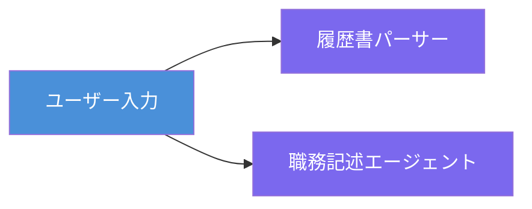
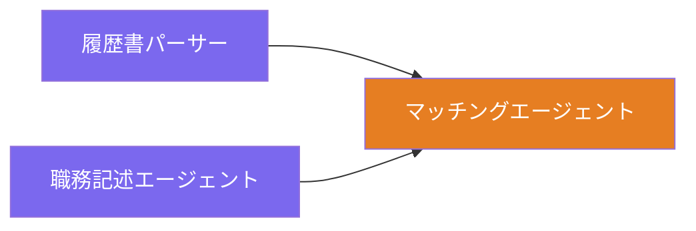
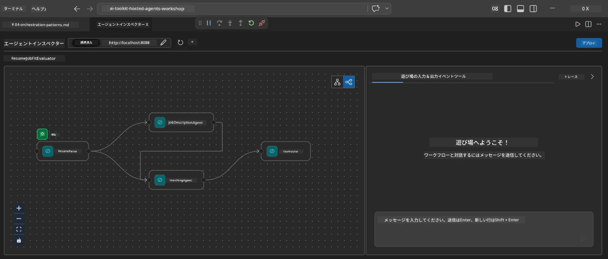
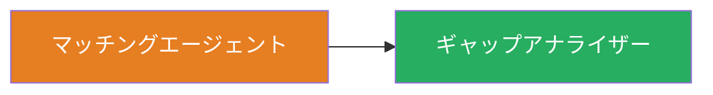
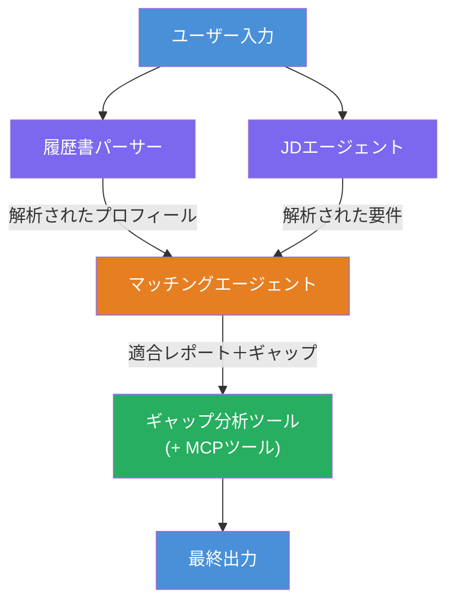
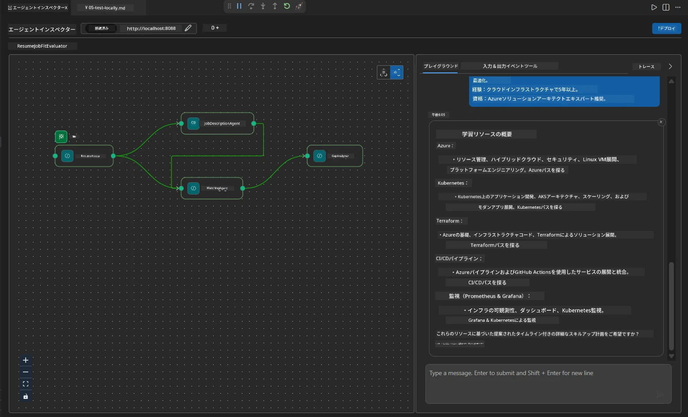

# Module 4 - オーケストレーションパターン

このモジュールでは、Resume Job Fit Evaluatorで使用されているオーケストレーションパターンを探り、ワークフローグラフの読み取り、修正、拡張方法を学びます。これらのパターンを理解することは、データフローの問題をデバッグし、自分自身の[multi-agent workflows](https://learn.microsoft.com/agent-framework/workflows/)を構築する上で不可欠です。

---

## パターン1：ファンアウト（並列分割）

ワークフローの最初のパターンは<strong>ファンアウト</strong>です。単一の入力が複数のエージェントに同時に送信されます。


コード上では、`resume_parser`が`start_executor`であるために起こります。つまり、ユーザーメッセージを最初に受け取ります。そして、`jd_agent`と`matching_agent`の両方が`resume_parser`からのエッジを持っているため、フレームワークは`resume_parser`の出力を両エージェントにルーティングします。

```python
.add_edge(resume_parser, jd_agent)         # ResumeParserの出力 → JD Agent
.add_edge(resume_parser, matching_agent)   # ResumeParserの出力 → MatchingAgent
```
  
**なぜこれが機能するのか:** ResumeParserとJD Agentは同じ入力の異なる側面を処理します。これらを並列に実行することで、順次実行するよりも合計レイテンシを削減できます。

### ファンアウトを使用する場合

| 使用例 | 例 |
|----------|---------|
| 独立したサブタスク | 履歴書の解析とJDの解析 |
| 冗長性/投票 | 二つのエージェントが同じデータを解析し、三つ目が最適な回答を選ぶ |
| 複数フォーマットの出力 | 一つのエージェントがテキストを生成し、別のエージェントが構造化されたJSONを生成 |

---

## パターン2：ファンイン（集約）

二つ目のパターンは<strong>ファンイン</strong>です。複数のエージェント出力が収集され、単一の下流エージェントに送られます。


コード上では：

```python
.add_edge(resume_parser, matching_agent)   # ResumeParserの出力 → MatchingAgent
.add_edge(jd_agent, matching_agent)        # JD Agentの出力 → MatchingAgent
```
  
**重要な動作:** エージェントに<strong>二つ以上の入力エッジがある場合</strong>、フレームワークは<strong>全ての上流エージェントが完了するまで</strong>下流エージェントの実行を待ちます。MatchingAgentは、ResumeParserとJD Agentの両方が終了するまで開始しません。

### MatchingAgentが受け取るもの

フレームワークは上流のすべてのエージェントの出力を連結します。MatchingAgentの入力は次のようになります：

```
[ResumeParser output]
---
Candidate Profile:
  Name: Jane Doe
  Technical Skills: Python, Azure, Kubernetes, ...
  ...

[JobDescriptionAgent output]
---
Role Overview: Senior Cloud Engineer
Required Skills: Python, Azure, Terraform, ...
...
```
  
> **Note:** 正確な連結フォーマットはフレームワークのバージョンに依存します。エージェントの指示は構造化されたものと非構造化の両方の上流出力に対応できるように書くべきです。



---

## パターン3：逐次チェーン

三つ目のパターンは<strong>逐次的な連鎖</strong>です。あるエージェントの出力が直接次のエージェントに送られます。


コード上では：

```python
.add_edge(matching_agent, gap_analyzer)    # MatchingAgent 出力 → GapAnalyzer
```
  
これは最も単純なパターンです。GapAnalyzerはMatchingAgentの適合度スコア、マッチした技能／不足技能、ギャップを受け取ります。それから各ギャップごとに[Microsoft Learnリソースを取得するMCPツール](https://learn.microsoft.com/azure/foundry/agents/how-to/tools/model-context-protocol)を呼び出します。

---

## 完全なグラフ

三つのパターンを組み合わせると、完全なワークフローが作成されます：


### 実行タイムライン

```mermaid
gantt
    title エージェント実行タイムライン
    dateFormat X
    axisFormat %s

    section 並列
    Resume Parser       :rp, 0, 3
    JD Agent            :jd, 0, 2

    section 逐次
    Matching Agent      :ma, 3, 5
    Gap Analyzer        :ga, 5, 9
```  


> 合計の壁時計時間はおおよそ `max(ResumeParser, JD Agent) + MatchingAgent + GapAnalyzer` です。GapAnalyzerが最も時間がかかることが多いのは、複数のMCPツール呼び出し（ギャップごとに１回）を行うためです。

---

## WorkflowBuilderコードの読み方

以下は`main.py`中の完全な`create_workflow()`関数と注釈です：

```python
def create_workflow(resume_parser, jd_agent, matching_agent, gap_analyzer):
    workflow = (
        WorkflowBuilder(
            name="ResumeJobFitEvaluator",

            # ユーザー入力を最初に受け取るエージェント
            start_executor=resume_parser,

            # 出力が最終応答となるエージェント
            output_executors=[gap_analyzer],
        )
        # 扇状展開：ResumeParserの出力がJDエージェントとMatchingAgentの両方に送られる
        .add_edge(resume_parser, jd_agent)
        .add_edge(resume_parser, matching_agent)

        # 扇状収束：MatchingAgentはResumeParserとJDエージェントの両方を待つ
        .add_edge(jd_agent, matching_agent)

        # 逐次処理：MatchingAgentの出力がGapAnalyzerに渡される
        .add_edge(matching_agent, gap_analyzer)

        .build()
    )
    return workflow.as_agent()
```
  
### エッジ一覧表

| # | エッジ | パターン | 効果 |
|---|------|---------|--------|
| 1 | `resume_parser → jd_agent` | ファンアウト | JD AgentはResumeParserの出力（と元のユーザー入力）を受け取る |
| 2 | `resume_parser → matching_agent` | ファンアウト | MatchingAgentはResumeParserの出力を受け取る |
| 3 | `jd_agent → matching_agent` | ファンイン | MatchingAgentはJD Agentの出力も受け取る（両方の完了を待つ） |
| 4 | `matching_agent → gap_analyzer` | 逐次 | GapAnalyzerは適合レポートとギャップリストを受け取る |

---

## グラフの修正

### 新しいエージェントの追加

5番目のエージェント（例：ギャップ分析に基づいて面接質問を生成する<strong>InterviewPrepAgent</strong>）を追加する場合：

```python
# 1. 命令を定義する
INTERVIEW_PREP_INSTRUCTIONS = """\
You are the Interview Prep Agent.
Given a gap analysis and fit report, generate 10 targeted interview questions
the candidate should prepare for.
"""

# 2. エージェントを作成する（async with ブロック内）
AzureAIAgentClient(
    project_endpoint=PROJECT_ENDPOINT,
    model_deployment_name=MODEL_DEPLOYMENT_NAME,
    credential=credential,
).as_agent(
    name="InterviewPrepAgent",
    instructions=INTERVIEW_PREP_INSTRUCTIONS,
) as interview_prep,

# 3. create_workflow() 内でエッジを追加する
.add_edge(matching_agent, interview_prep)   # フィットレポートを受け取る
.add_edge(gap_analyzer, interview_prep)     # ギャップカードも受け取る

# 4. output_executors を更新する
output_executors=[interview_prep],  # これで最終的なエージェントです
```
  
### 実行順序の変更

JD AgentをResumeParserの<strong>後</strong>に実行させたい場合（並列実行ではなく逐次実行）：

```python
# 削除：「.add_edge(resume_parser, jd_agent)」←既に存在するため、そのままにしてください
# jd_agentがユーザー入力を直接受け取らないことで、暗黙の並列処理を削除します
# start_executorは最初にresume_parserに送信し、jd_agentは
# エッジを介してresume_parserの出力のみを取得します。これにより、処理は順次になります。
```
  
> **重要:** `start_executor`は生のユーザー入力を受け取る唯一のエージェントです。その他のエージェントは上流エッジからの出力を受け取ります。もしエージェントに生のユーザー入力も受け取らせたい場合は、`start_executor`からのエッジが必要です。

---

## よくあるグラフの間違い

| 間違い | 症状 | 修正 |
|---------|---------|-----|
| `output_executors`へのエッジがない | エージェントは実行されるが出力が空 | `start_executor`から`output_executors`内のすべてのエージェントにパスがあることを確認 |
| 循環依存 | 無限ループまたはタイムアウト | どのエージェントも上流のエージェントにフィードバックしていないか確認 |
| `output_executors`のエージェントに入力エッジがない | 出力が空 | 少なくとも1つの`add_edge(source, that_agent)`を追加 |
| ファンインなしで複数の`output_executors` | 出力に１つのエージェントの応答のみ | 集約する単一の出力エージェントを使うか、複数の出力を許容 |
| `start_executor`が欠落 | ビルド時に`ValueError` | `WorkflowBuilder()`で必ず`start_executor`を指定 |

---

## グラフのデバッグ

### Agent Inspectorの使用

1. エージェントをローカルで起動（F5またはターミナル - 詳しくは[Module 5](05-test-locally.md)）。
2. Agent Inspectorを開く（`Ctrl+Shift+P` → **Foundry Toolkit: Open Agent Inspector**）。
3. テストメッセージを送信。
4. Inspectorの応答パネルで<strong>ストリーミング出力</strong>を探す - 各エージェントの貢献が順に表示されます。



### ロギングの使用

データフローを追跡するために`main.py`にロギングを追加：

```python
import logging
logger = logging.getLogger("resume-job-fit")

# create_workflow()の中で、ビルドの後：
logger.info("Workflow graph built with edges: RP→JD, RP→MA, JD→MA, MA→GA")
```
  
サーバーログはエージェントの実行順序とMCPツール呼び出しを示します：

```
INFO:resume-job-fit:Starting Resume -> Job Fit Evaluator HTTP server...
INFO:resume-job-fit:Server running on http://localhost:8088
INFO:agent_framework:Executing agent: ResumeParser
INFO:agent_framework:Executing agent: JobDescriptionAgent
INFO:agent_framework:Waiting for upstream agents: ResumeParser, JobDescriptionAgent
INFO:agent_framework:Executing agent: MatchingAgent
INFO:agent_framework:Executing agent: GapAnalyzer
INFO:agent_framework:Tool call: search_microsoft_learn_for_plan(skill="Kubernetes")
POST https://learn.microsoft.com/api/mcp → 200
INFO:agent_framework:Tool call: search_microsoft_learn_for_plan(skill="Terraform")
POST https://learn.microsoft.com/api/mcp → 200
```
  
---

### チェックポイント

- [ ] ワークフロー内の3つのオーケストレーションパターン：ファンアウト、ファンイン、逐次チェーンを特定できる
- [ ] 複数の入力エッジを持つエージェントは、全ての上流エージェントが完了するまで待つことを理解できる
- [ ] `WorkflowBuilder`コードを読み、各`add_edge()`の呼び出しを視覚的なグラフに対応づけられる
- [ ] 実行タイムラインを理解している：並列エージェントが最初に実行され、その後集約、最後に逐次処理が行われる
- [ ] 新しいエージェントをグラフに追加する方法を知っている（指示の定義、エージェント作成、エッジ追加、出力の更新）
- [ ] よくあるグラフの誤りとその症状を認識できる

---

**前へ：** [03 - Configure Agents & Environment](03-configure-agents.md) · **次へ：** [05 - Test Locally →](05-test-locally.md)

---

<!-- CO-OP TRANSLATOR DISCLAIMER START -->
**免責事項**:  
本書類は AI 翻訳サービス [Co-op Translator](https://github.com/Azure/co-op-translator) を使用して翻訳されています。正確性を期していますが、自動翻訳には誤りや不正確な箇所が含まれる可能性があります。原文はその言語で作成されたものを正本とみなしてください。重要な情報については、専門の人間による翻訳をご利用いただくことを推奨します。本翻訳の使用によって生じたいかなる誤解や誤訳についても責任を負いかねます。
<!-- CO-OP TRANSLATOR DISCLAIMER END -->